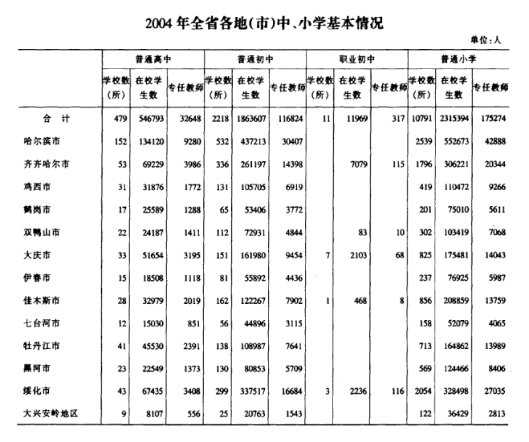

## 一等奖比例

1. 哈齐牡佳大，占了92%
1. 绥化占了剩下的45%，也就是总的3.5%
1. 绥棱占了绥化的5%，也就是总的0.175%
1. 如果有120到150个获奖者，每年绥棱有0.21到0.26个
1. 也就是说，绥棱每四年到五年有一个一等奖的期望
1. 绥棱五中，成立的十四年内，可能有一到两个一等奖
1. 绥化同届中，每17000人有一个，每60所中学一个
1. 绥化同届中，每两个县一个，每360个班级一个
1. 现在已知绥棱没有
1. 庆安、肇东、青冈、望奎大概率没有，可能只有北林区初中有
1. 这就让期望值进一步降低到绥化市只有两名甚至一名（九中，崇文）
1. 崇文中学，2004年-2008年间数学和物理一共有5个一等奖，已知2005年有一个，14个二等奖，所以2004年可能期望值只有0.4个
1. 绥化一中历史上，从2002到2025年，只有2015年和2018年，两次省一等奖
1. 2004年，全国初中数学竞密黑龙江省赛区共有20名学生获得满分，哈市有15名学生获得满分，均是来成文化学校的学生（他们是：陆直、张骤啸、张岩、王梓、于雪蒇、王鹤玮、迟科萌、孙宏宇、裴龙、李子龙、孙慧辰、白哲、李博、聂照云）。
1. 肇东2005年，全市中考前100名考生中，七中占41名，600分以上的考生全市城乡191人 ，七中独占71人。获中考升入重点高中总数第一名的桂冠。

## 2005年一等奖，清华

1. 崇文中学李思钊，哈三中，清华
1. 孙可，师大附，清华
1. 王旭，师大附，清华
1. 闫家奇，哈三中，清华
1. 史鹏程，国家三等奖，肇东七中，肇东一中，清华大学，2008年高考绥化状元
1. 刘勇，全省23名一等奖，肇东七中，肇东一中，全绥化市第五，672，哈工大，
1. 梁立昕，肇东七中中考第一，没有数学获奖，大庆实验，清华
1. 2003年，绥化九中四年二班康佳昊同学以中考491分的成绩名列全市第一(2003.7.6)
1. 于雪崴，2004年满分，06年报送清华

## 各城市的比例

<figure>
  
  <figcaption>2004年 黑龙江教育年鉴</figcaption>
</figure>

| 城市    |   获奖人数 | 获奖比例 |学生数量 | 学生比例 |
|:------|-------:|-------:|-------:|-------:|
| 哈尔滨市  |     74 | 67.9% |110000| 23.5% |
| 大庆市   |     12 | 11% | 40000| 8.5% |
| 佳木斯市  |      6 | 5.5% | 30000| 6.4% | 
| 绥化市   |      5 | 4.6% | 85000| 18.2% |
| 齐齐哈尔市 |      5 | 4.6% | 65000 | 14% |
| 牡丹江市  |      3 | 2.7% | 27000 | | 5.8% |
| 七台河市  |      2 | 1.1% | 11000 | 2.35% |
| 黑河市   |      1 | 0.7% | 20000 | 4.3% |
| 鹤岗市   |      1 | 0.7% | 13000 | 2.8% |
| 其他      |     0 | 0%   | 65000 | 14% |

