## 绥化一中，2004年8月到2007年6月

<figure>
  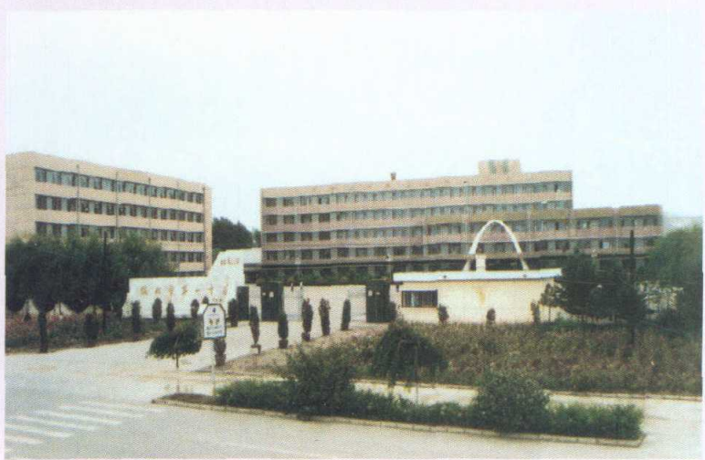
  <figcaption>1999年 - 绥化一中正大门（2006年拆除）</figcaption>
</figure>

<figure>
  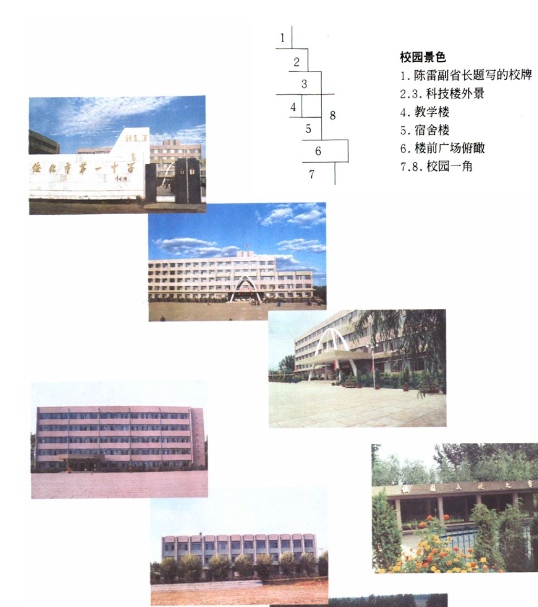
  <figcaption>1999年 - 绥化一中原有校区</figcaption>
</figure>

<figure>
  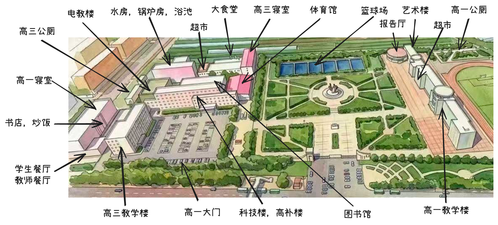
  <figcaption>2004年到2007年 - 绥化一中平面图</figcaption>
</figure>

<figure>
  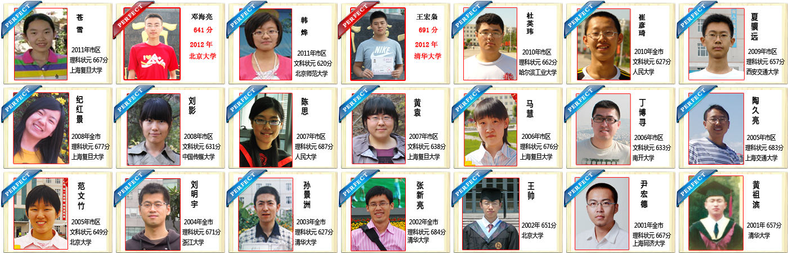
  <figcaption>2001年到2012年 - 绥化一中历届高考第一名</figcaption>
</figure>

<figure>
  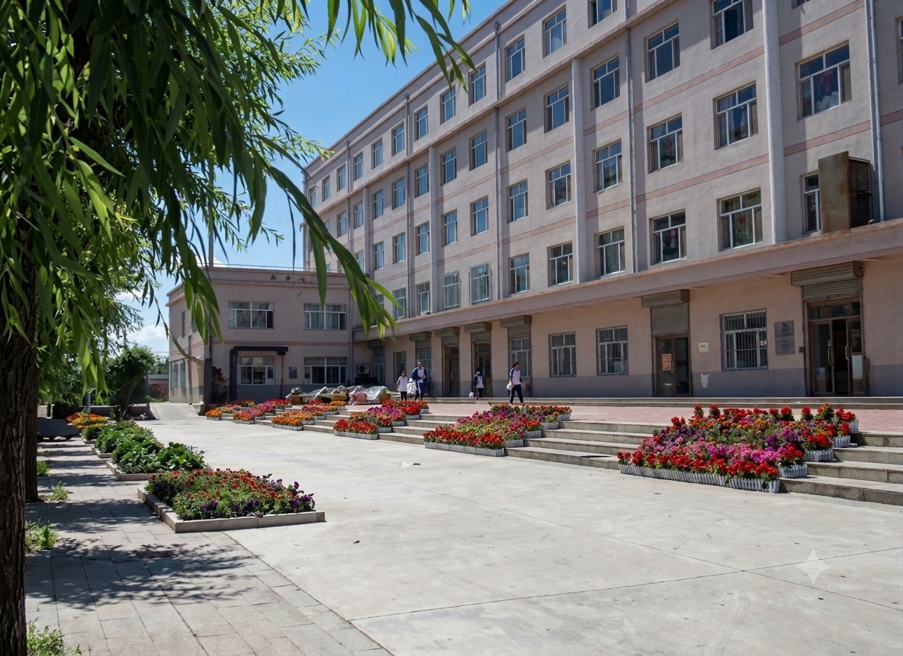
  <figcaption>2012年 - 绥化一中高一寝室（AI高清化）</figcaption>
</figure>

<figure>
  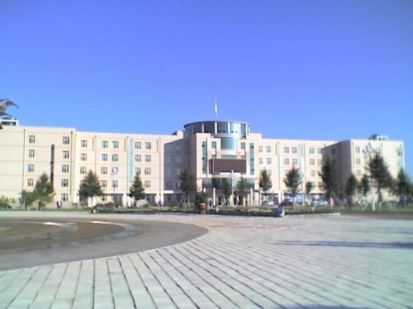
  <figcaption>2006年09月 - 绥化一中主楼</figcaption>
</figure>

<figure>
  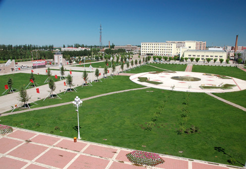
  <figcaption>2005年 - 绥化一中从主楼看去</figcaption>
</figure>

<figure>
  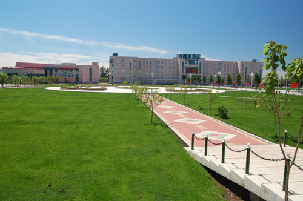
  <figcaption>2005年 - 绥化一中从寝室的角度（高三寝室）</figcaption>
</figure>

<figure>
  
  <figcaption>2006年09月 - 绥化一中艺术馆</figcaption>
</figure>

<figure>
  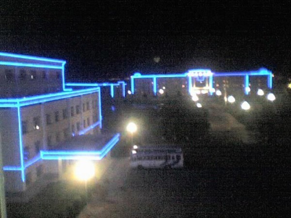
  <figcaption>2006年 - 绥化一中夜景</figcaption>
</figure>

<figure>
  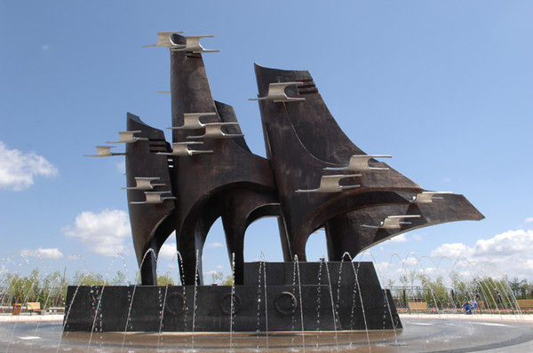
  <figcaption>2006年 - 绥化一中雕塑</figcaption>
</figure>

<figure>
  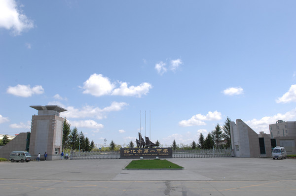
  <figcaption>2006年 - 绥化一中新大门</figcaption>
</figure>