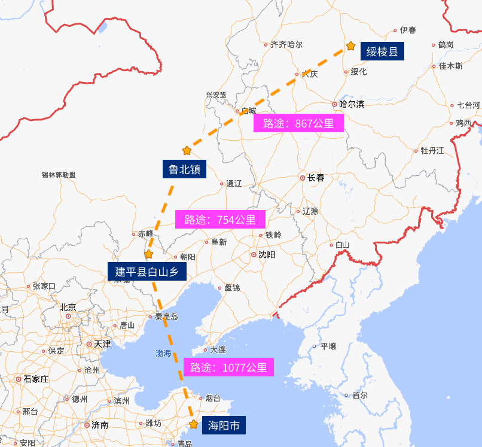
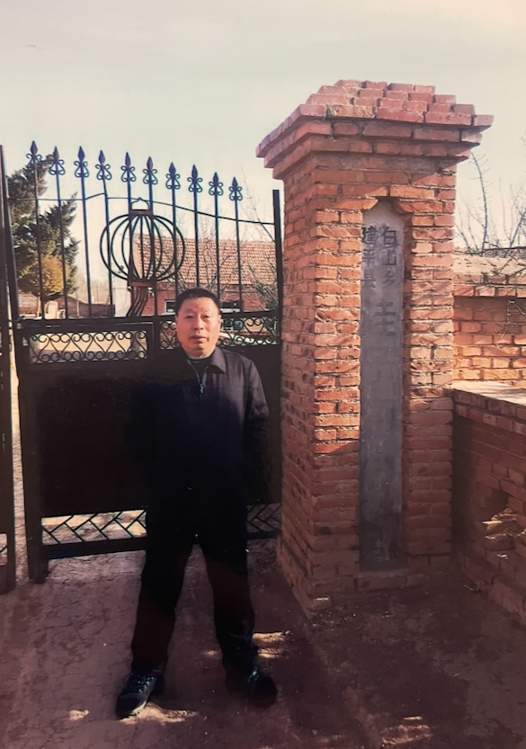

  ← 没有更前了
  <a class="archive-year-link" href="/1989">1989 →</a>

## 1988年前

<figure>
  
  <figcaption>1876年到1976年，一百年间的林氏家族迁徙史</figcaption>
</figure>

大约1876年，我曾祖父的祖父，因为闹饥荒，从⼭东省登州府海阳县迁至辽宁省建平县白山乡西三家。

<figure>
  
  <figcaption>2018年清明，父亲在其母校建平县白山乡洼子沟小学</figcaption>
</figure>

1974年1月，我的曾祖父林有堂在75周岁时去世，同年，我的祖父林国荣，时年40周岁，迫于生计，从辽宁省建平县白山乡洼子沟村迁至内蒙古自治区扎鲁特旗鲁北镇。

1976年，中秋节后几日，我祖父又举家迁至黑龙江省绥棱县克音河乡津河七队（新立屯）。

## 1988-11-20 爸妈结婚

<figure>
  
  <figcaption>1990年08月 - 我父母在哈尔滨的合影，二人去买织布机。</figcaption>
</figure>

爸妈结婚那天（在津河）下了小雪，当天是有拍照的，但是相片没有洗出来。婚后249天，我就出生了。

结婚后去的董志良（40几岁就去世了）家租的房子，过了年，就回到我出生的草房居住，那个草房的价格是2000块，借钱买的。

草房里，有一个青蓝色的家具，是我爷爷的弟弟自己做的家具，家具中间有一个洞，放进去了一个 飞跃牌黑白电视机（9寸）

  ← 没有更前了
  <a class="archive-year-link" href="/1989">1989 →</a>

