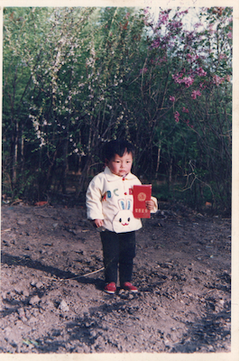
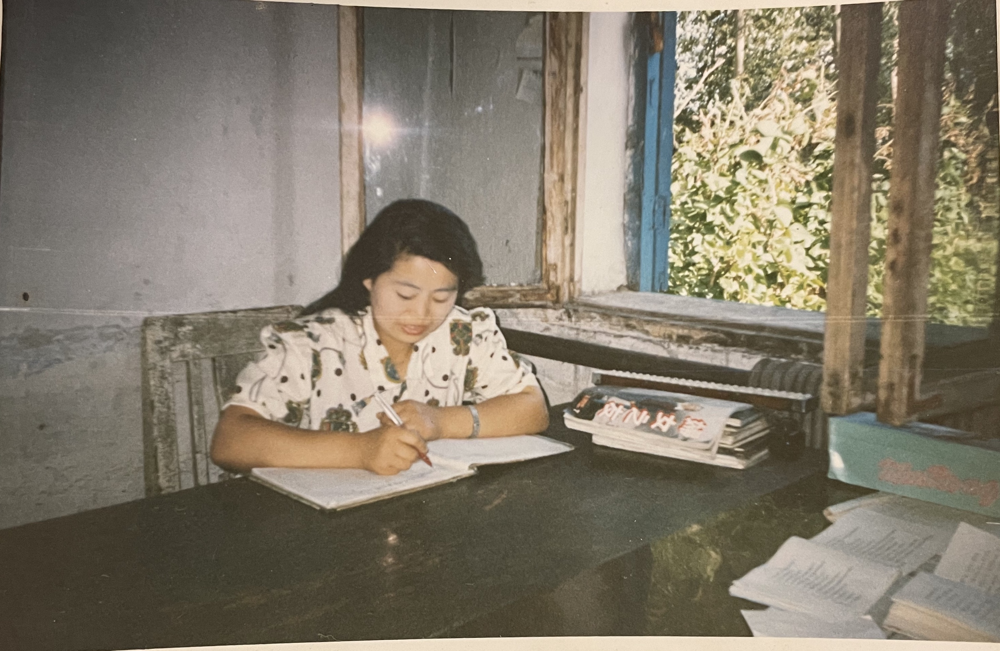
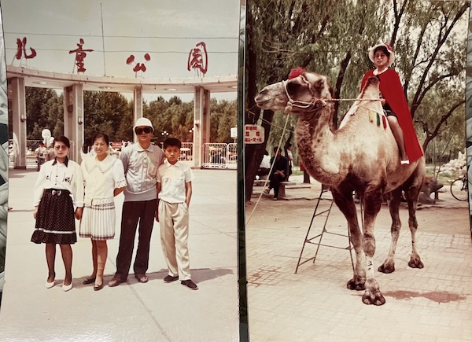
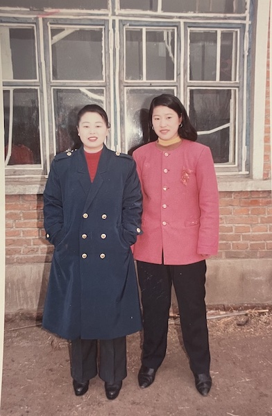

  <a class="archive-year-link" href="/1991">← 1991</a>
  <a class="archive-year-link" href="/1993">1993 →</a>

## 1992-02-29，从草房搬到砖房

第一次去砖房，是三姨夫赶毛驴车把我送回家的，现在的砖房仍有人居住，是当时的邻居张家。这一年有[奥运会](https://www.bilibili.com/video/BV1pk4y1k7XK/)，和老爸一起看电视，对爸爸讲越位的概念比较深刻。

两岁时，通过积木和电视报学字，可以看广播电视报上的字，并告诉我爸当天的节目，会下象棋。

## 1992-05-19，克音卫生院

大堂舅拍摄的，荣誉证书也是大舅的。

老妈在自己的办公室内留影，桌面上是[1992年第7期《妇女之友》杂志](https://book.kongfz.com/12498/733399229/)。

二姨一家在1992年初移居大庆，但是二姨家表哥（1977年出生）半年后才去，1992年暑期，老妈送表哥去大庆，并在大庆留影。

## 整年都在大舅家

爸妈上班，我被送到大堂舅家。

老妈在大堂舅家门前，当日是大堂舅家表哥结婚

  <a class="archive-year-link" href="/1991">← 1991</a>
  <a class="archive-year-link" href="/1993">1993 →</a>

