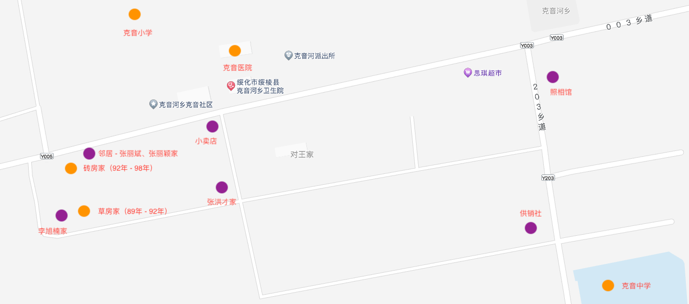
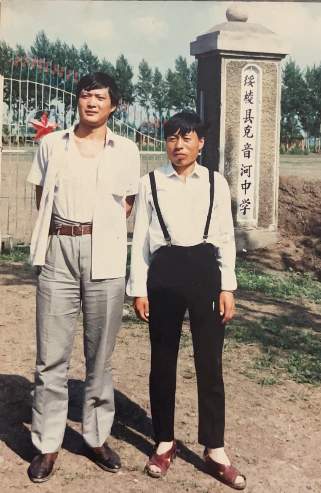

  <a class="archive-year-link" href="/1992">← 1992</a>
  <a class="archive-year-link" href="/1994">1994 →</a>

<figure>
  
  <figcaption>克音河乡克音村4组的重要地点</figcaption>
</figure>

## 1993年上半年

我经常去我父亲的中学（我父亲95年就不做老师了），我坐在最后一排听课，他的学生（初中生）有《脑筋急转弯》，我可以十几分钟看完所有100多个题目，然后随便考我，我都能在很久内记住（几个月）。而且这个时候，我就学会了加法和乘法，并能自发地生成乘法口诀。

<figure>
  
  <figcaption>1993年 - 老爸在克音中学的运动会上</figcaption>
</figure>

<figure>
  
  <figcaption>1993年 - 邢叔叔和老爸在克音中学门前</figcaption>
</figure>

## 1993年下半年，在津河奶奶家

1993年秋季学期，在津河（步行约40分钟）被奶奶（1932年2月23日-2009年1月1日）照顾了半年。

这期间有两件印象特别深刻的事情，一是老叔 （1973年）买了一个新的拖拉机，我兴奋的没有吃饭去玩，二是村里有一个老人去世了，我问奶奶“你什么时候去世”，后来爸爸知道了，给我训了一顿。

奶奶不识字，经常给我讲一些迷信的东西，例如，指着彩虹会让手指坏掉，针如果扎进了身体就会流入心脏而死，绦虫可以让人致死，但是可以通过用好吃的引诱它出来治疗，等等。

那时候，我爸爸给我买了很多小玩具，比如，上劲的青蛙和小车。老叔在自己的房间里唱[《九百九十九朵玫瑰》](https://www.bilibili.com/video/BV1XU4y1F7Dp/)，这时候电视播出《京城四少》，家人经常让我唱主题曲[《潇洒走一回》](https://www.bilibili.com/video/BV15x411v72d/)。

  <a class="archive-year-link" href="/1992">← 1992</a>
  <a class="archive-year-link" href="/1994">1994 →</a>

