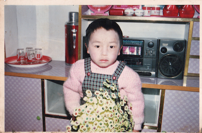
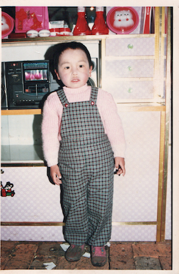
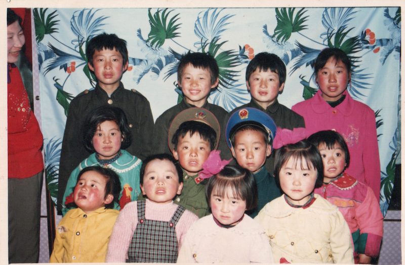

  <a class="archive-year-link" href="/1993">← 1993</a>
  <a class="archive-year-link" href="/1995">1995 →</a>

## 1994年上半年，苗老师幼儿园

因为老叔要结婚，奶奶的房子要给老叔结婚用，1994年春季学期就没再去津河，便开始在苗老师的幼儿班被托管。这期间，看了动画片[《战神金刚》](https://www.bilibili.com/video/BV1fW411876m/)，是第一部有印象的动画片，“我来组成头部”，以及[《蓝皮鼠和大脸猫》](https://www.bilibili.com/video/BV1Kx411M7ei/)，还有电视剧《新白娘子传奇》[《青青河边草》](https://www.bilibili.com/video/BV1sE41127AD/)。

## 1994-04-10 老叔婚礼

当天，和堂兄弟姐妹打闹，鞋踩进了泥滩，被妈妈训斥。

## 下半年，克音小学幼儿园

老师，同样是村子里的苗老师

## 自行车被当废品卖

大约应该是这年，我姥爷在我家里住，我特别喜欢一个废旧的自行车，我自己拆了又安装上，是我最喜欢的玩具，但是有一天收废品的来，我姥爷把这个自行车卖了，我和姥爷生气了好几天，我不记得是我姥爷自作主张，还是我父母之前也嘱咐过，但我就是记住了自行车被卖了的事情

  <a class="archive-year-link" href="/1993">← 1993</a>
  <a class="archive-year-link" href="/1995">1995 →</a>

