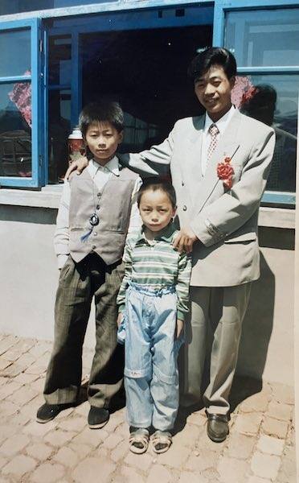
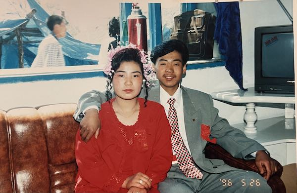
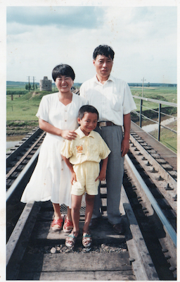
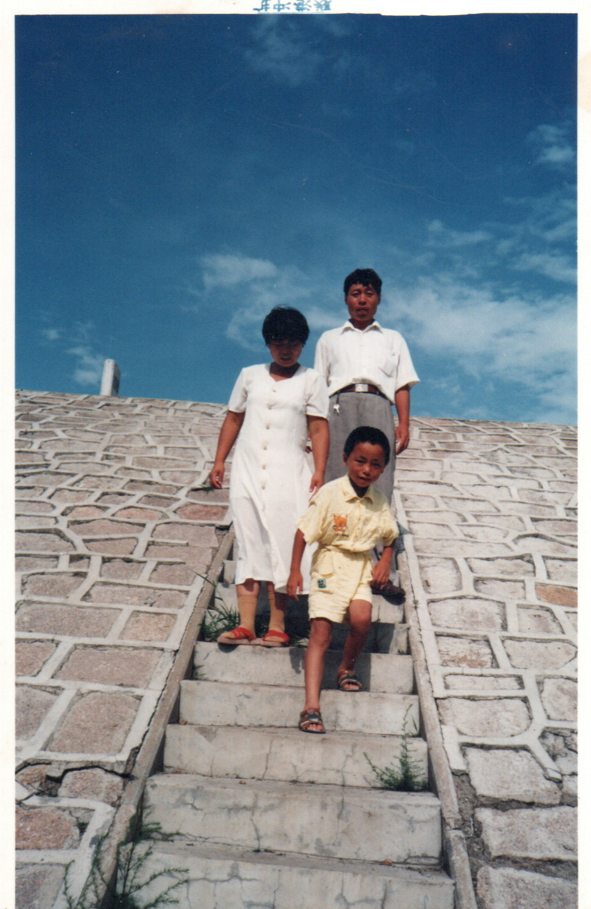
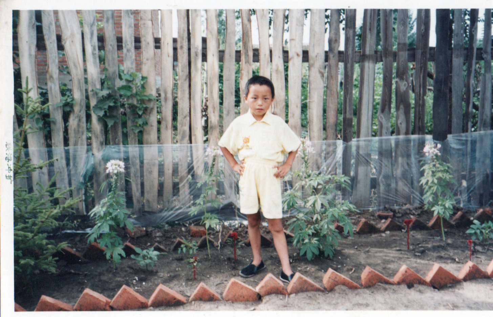
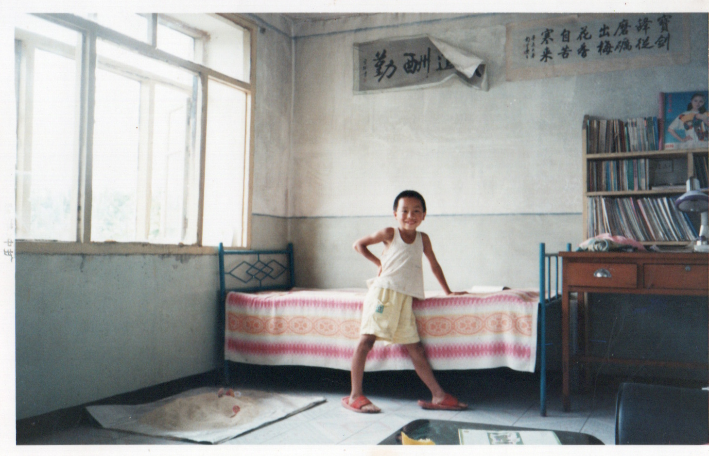
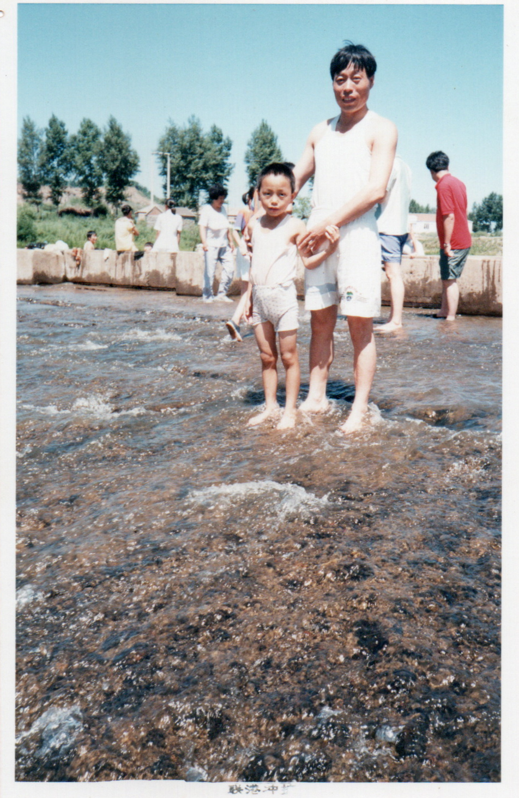
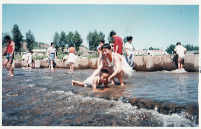

  <a class="archive-year-link" href="/1995">← 1995</a>
  <a class="archive-year-link" href="/1997">1997 →</a>

## 1996-05-26 民哥结婚

<figure>
  
  <figcaption>大姨家大哥（1976年出生）结婚，左侧是三姨家表哥</figcaption>
</figure>

<figure>
  
  <figcaption>大哥和大嫂，背景里是大姨家二哥</figcaption>
</figure>

## 1996-08-09 农历生日

<figure>
  
  <figcaption>和老爸老妈合影，背景里有炮楼，现已销毁</figcaption>
</figure>

生日当天是和新班主任老师一家去的，爸爸送给我一本[《现代汉语词典》](https://book.kongfz.com/372534/1661760128/)作为生日礼物。身后的是克音河大桥，以及日本占领期间建造的炮楼（现已经被拆除），小时候经常走火车大桥，爬炮楼，去大桥就和[《Stand by Me》](https://www.imdb.com/title/tt0092005/)里探险的感觉很相似。

<figure>
  
  <figcaption>大桥的台阶，以前和堂兄们去放牛，经常坐在这个台阶上</figcaption>
</figure>

<figure>
  
  <figcaption>当天出门前留影，家门口的小花坛，后面是砖房家</figcaption>
</figure>

<figure>
  
  <figcaption>在砖房家内部的留影</figcaption>
</figure>

那年的记忆有《大草原上的小老鼠》《四驱兄弟》《白眉大侠》《黑猫警长》《宰相刘罗锅》《娃哈哈 AD 钙奶》《小虎队旋风卡》《摇太阳》《精武门》。娃哈哈之前是一个玻璃瓶装的，那年变成了塑料瓶，我妈管之前叫做一代，这个叫做二代。

## 1996年暑假，阁山水库

## 一年级下，二年级上

那时候，基本不写作业，每学期刚开始，自己提前看教材学好了所有学科（包括数学、自然、语文等所有学科），并自行把课后题都做完了，便不再学习写作业。虽然爱玩不学习，且比同学都小一岁，但是连续三年稳定的全乡第一（14个小学，共约六七百人），基本都是接近满分的成绩，毫无压力。

冬天的时候，去陈同学家里玩，把书包弄丢，被狗咬走了，后来只拿回来一本《现代汉语词典》的残缺本。

  <a class="archive-year-link" href="/1995">← 1995</a>
  <a class="archive-year-link" href="/1997">1997 →</a>

