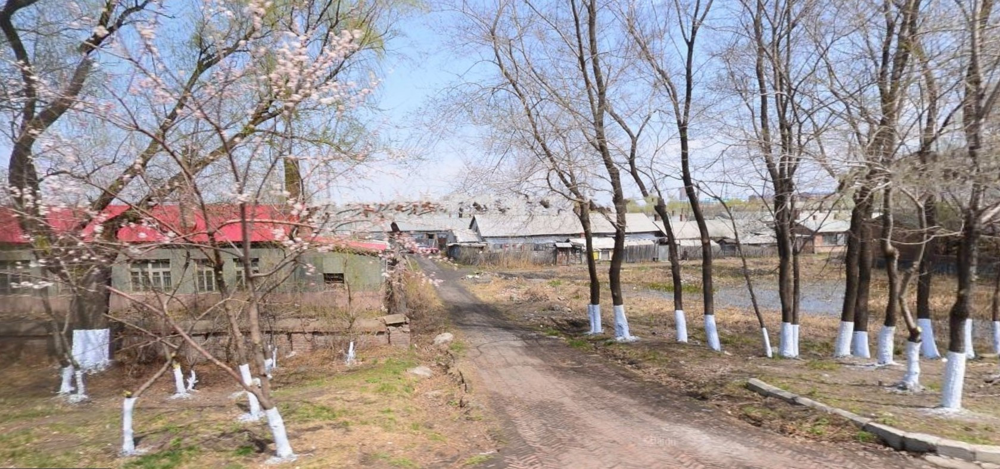

  <a class="archive-year-link" href="/1997">← 1997</a>
  <a class="archive-year-link" href="/1999">1999 →</a>

## 上半年记忆

1998年1月8日，《水浒传》首播，现在还记得趴在小窗上看水浒的情景，同年还有《时间飞船》《玩具之家》《小糊涂神》。1998年，还是印象深刻的世界杯，第一次喝可乐，收集《小虎队球星卡》。

## 1998年6月20日 搬家去绥棱

当天，绥棱县 [卖彩票](https://youtu.be/2zJtqBvvE4o?t=129)，老爷家的老叔抽到电饭锅，那天是雨天，路上的蛤蟆车是用塑料布做的防雨。

我还记得，我的班主任老师，给了我一个笔记本，在从克音去绥棱的路上，给我讲了11的乘法快速算法

## 下半年，绥棱一小

<figure>
  
  <figcaption>暑假在绥棱县标附近的房子居住，现已推平</figcaption>
</figure>

在三年级的最后一个月，开始了在绥棱一小的学习，印象最深刻的，是可以去微机室，那时候微机课要穿鞋套才行。暑假的时候，我在绥棱一小学习了两周的素描课，我母亲要带我去，有一天上学，和我一起去学课的阿姨，骑自行车被轿车撞了，当时我母亲和我正在并排骑自行车。

  <a class="archive-year-link" href="/1997">← 1997</a>
  <a class="archive-year-link" href="/1999">1999 →</a>

