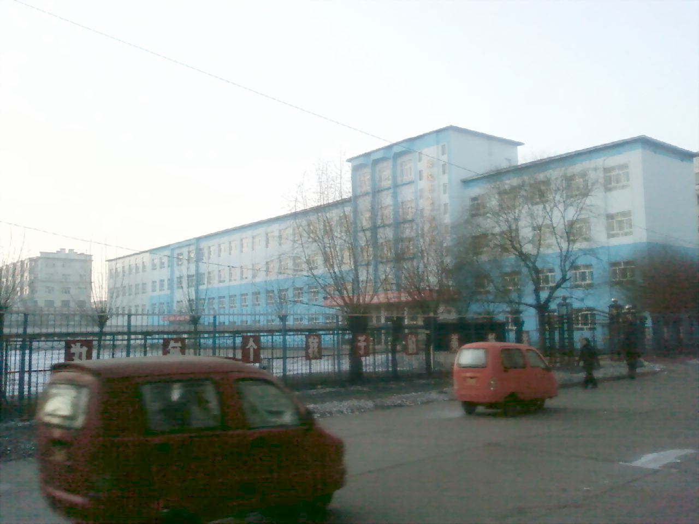
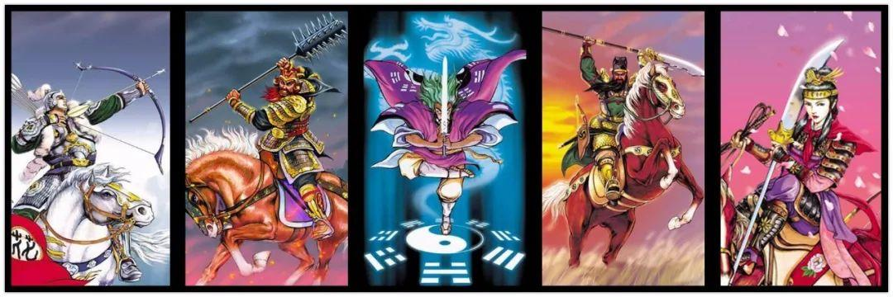
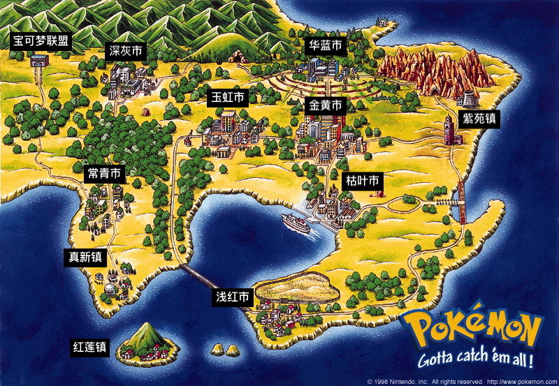

  <a class="archive-year-link" href="/1998">← 1998</a>
  <a class="archive-year-link" href="/2000">2000 →</a>

## 绥棱一小

<figure>
  
  <figcaption>2008年1月，拍摄的绥棱一小</figcaption>
</figure>

那年县里运动会，我也参加，是要作为一员，组成澳门白莲旗的形状，我正好是旗的角落。而县里运动会是我最兴奋的几天，可以有很多零钱买好吃的，还有各种奇怪的小摊铺，有那种骗钱的弹球，有抽卡的算命，有套圈。

我还记得，有一次阅读比赛，是在一小学的主楼门口，我本来没有报名，但是很奇怪的就被随机抽到了，要去台上临时阅读，我还拿了第一或者是接近第一的高分。

<figure>
  
  <figcaption>1999年，水浒卡，图片来自网络</figcaption>
</figure>

那一年特别着迷于[集水浒卡](https://archive.is/Snqvk)，甚至会花钱买，五毛钱买一张，而且那时候还没有出全108将，所以我只能等到初中才集齐。好像上了初二，我还会成箱的去买干脆面，晚上的时候泡着吃，不仅仅是小学生，我上高中的林英东大哥，也在收集水浒卡，那时候每一箱要么全部是天罡，要么全部地煞，而且似乎一箱的卡牌就那么几类。后来又出了封神卡和三国卡，就没有那么痴迷的去收集了。

<figure>
  
  <figcaption>1999年，宝可梦初代游戏地图（中文地点是我自己P上去的）</figcaption>
</figure>

那一年特别喜欢看宠物小精灵，记得有个泡泡糖品牌弄了宠物小精灵的收集，那年，在绥棱一小附近，也就是市场街的门口处，买过一张上面这个海报，挂在了自己的墙上。还有另外一张海报，是一个宝可梦的大集合，售价是每张一元。那个摊位还卖游戏攻略，就是告诉玩家combo键位的那种攻略，也是每本一元。

五年级的时候，搬到了前楼，是最靠东的一个教室，大家总是传有灵异事件，所以总是到晚上很害怕。

那个时候特别怕有拐卖儿童的，一旦看到行为诡异的大人，我就撒腿就跑，我有一个小学同学就说他真的被拍花的拐走了，后来他清醒过来，迅速的跑掉了。

  <a class="archive-year-link" href="/1998">← 1998</a>
  <a class="archive-year-link" href="/2000">2000 →</a>

