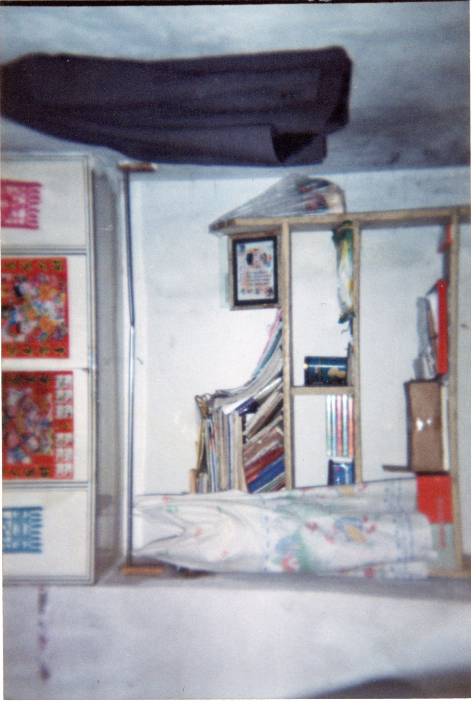

  <a class="archive-year-link" href="/1999">← 1999</a>
  <a class="archive-year-link" href="/2001">2001 →</a>

## 2000年2月29日，一氧化碳中毒

<figure>
  
  <figcaption>2003年9月，中毒的小屋</figcaption>
</figure>

那是五年级下半年开学的前一天，来我家住宿的学生都在这天到了，我父亲那天去乡下吃饭，喝了很多的酒，大约十点到家，那时候我都睡着了，回来之后，我父亲硬要烧炕，那个小房间，大约也就六平米的大小，因为父亲醉酒，我母亲和我也都是睡梦中刚醒来，以至于没有让木头通风良好，大约半夜一点多，我强烈要去要去大便，而且要去外面，我父亲带我去了外面，但是因为太冷，还是在厨房的塑料袋里解决的。（那时候家里没有马桶，也没有蹲位，大便都是要去五分钟外的学校去解决）。

早晨五点多，我父亲有意识，给人打电话，但是没有说太清楚，住宿的学生们发现没人做饭很诡异，就敲门，发现我们三个都没了知觉，便打了120，并让邻居来帮忙，我被叫醒的时候，是有意识的，但是说不出话，我被裹着被子抬出来，被子里都是一氧化碳中毒而导致的排泄物，我记得前院的爷爷说，白瞎这个孩子了，他可能认为我活不下来了。我父亲中毒的情况比较轻，我记得他在哭泣，那年他35周岁而已。

我在医院住了一个月，吸了一个月的氧气，可能那次的中毒对我的脑神经造成了一定的损伤，没有这个事情的发生，我的流体智力可能要更好一些吧。

## 2000年7月16日，小学毕业照

小学最要好的朋友有姜成和张龙。

在克音河乡的时候，我基本都是稳定的全乡第一，但是四年级和五年级在绥棱一小，我大约是学年14、5名左右，小升初的考试，是我在绥棱一小，考的最好的一次，我考了全校第四名。

## 初一上

  <a class="archive-year-link" href="/1999">← 1999</a>
  <a class="archive-year-link" href="/2001">2001 →</a>

