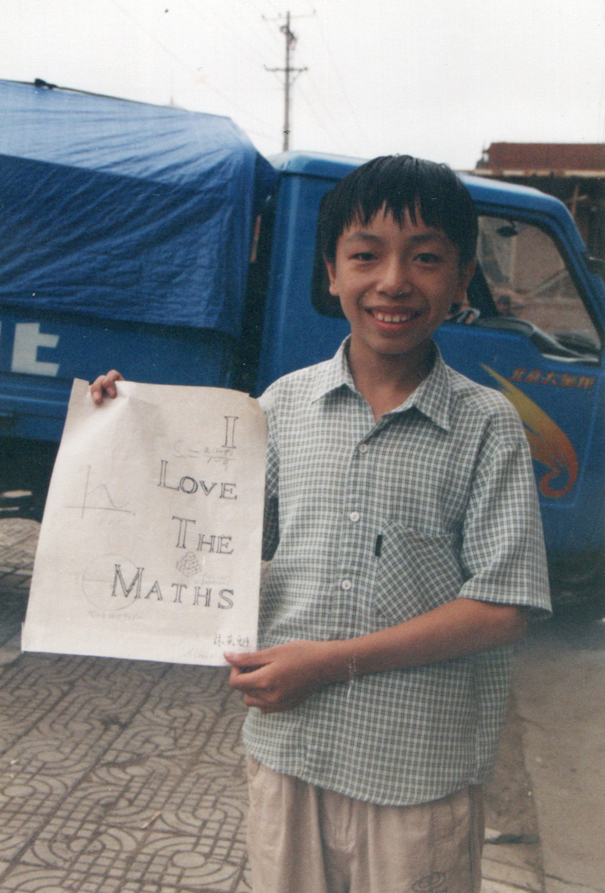

  <a class="archive-year-link" href="/2002">← 2002</a>
  <a class="archive-year-link" href="/2004">2004 →</a>

## 2003年7月24日，农历生日

老妈，我，奶奶，林英德（镜头外）

这张图是我自己在卧室画的，当时初三，但因为家里有读高中的学生住宿，自学了数列和三角函数，上面的英文字母也是我自己画的，对古典诗词、数学、设计的热爱从那时就开始了。

  <a class="archive-year-link" href="/2002">← 2002</a>
  <a class="archive-year-link" href="/2004">2004 →</a>

