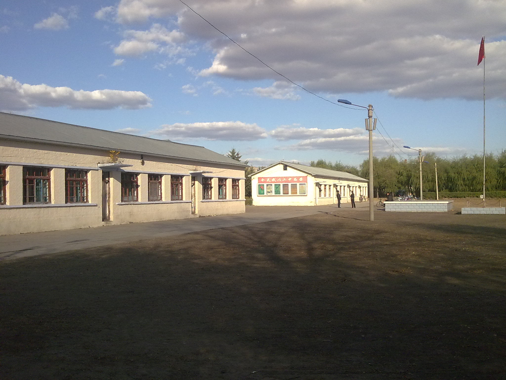

  <a class="archive-year-link" href="/2003">← 2003</a>
  <a class="archive-year-link" href="/2005">2005 →</a>

## 被隐瞒的竞赛成绩

<figure>
  
  <figcaption>2004年4月 - 被隐瞒了20年的证书</figcaption>
</figure>

初四下半年，突然变得特别马虎，以至于平时数学考试只能在及格边缘，我中考数学也只考了110/120分。

初四参加了全国初中数学竞赛，大约一年多都没怎么写过数学作业，马虎的毛病也没改过来，在没有任何竞赛辅导的情况下（我只有在初二的时候看了一些竞赛书，后来就不怎么看了，基本属于裸考），获得了一等奖，数学竞赛只有一次考试，不像物理有复试，

 [当时的一等奖](https://web.archive.org/web/20060205195149/http://lxfas.com/list.htm) 80%左右都是哈尔滨大庆的学生，且绝大多数是受过深入培训的。绥化市经济落后，教育水平有限，虽然绥化市初四一届有8万5千名学生，占全省的 18%，但只能拿到3.5%的四到五个竞赛一等奖，而绥棱只占绥化初中生总数的5%，得到一等奖的期望值可能要七八年有一个（每届大约4000人）。
 
 特别地，[绥棱六中](https://web.archive.org/web/20111114035236/http://lz.suilengea.com/essc/2011117152316.asp) 在成立初期的2005年到2007年，为了打出名声，采取了很多措施，使得绥棱县那三年奇迹般的（按泊松分布计算，概率约0.0035%）有了很多学科竞赛一等奖，所以我猜测，绥棱五中（1990年成立）在2004年之前应该是极不容易拿到一等奖的。

 <figure>
  
  <figcaption>1986年9月 - 左一是我父亲，右一是于校长</figcaption>
</figure>
 
 这或许就招致当时的于校长（我父亲的大学室友）的嫉妒，或者是和我父亲的矛盾，于校长没有告诉我这个结果，同时也隐瞒了我本应参加的物理竞赛复试，当时我以为自己数学竞赛连三等奖都没有，物理更是颗粒无收。2023年，于校长把这个证书给了我父亲，我也就迟到了20年知道了这个结果。2021年6月，于校长参加了我的婚礼。

<figure>
  
  <figcaption>2004年4月 - 仅凭初赛得到的三等奖</figcaption>
</figure>

同样是，在没有任何额外辅导和额外准备的情况下，我仅仅参加了初赛，没有人通知我去参加复赛，我以为我自己考得特别不好，李飞鸿和他母亲还跑来说问我是否有物理竞赛书，借他们看看，当时此事，对我的信心打击很大。

同样是，20年后，于校长把这个证书给了我父亲，我才知道自己的初赛考的很好，只是被隐瞒了，没通知我，如果能参加复赛，或许能得到更好的结果。

对于上述两件事，我父亲当时也是很疑惑和察觉的，李飞鸿的妈妈也提醒过我爸，我父亲还找过绥化的人想问一下，都不了了之了。

注：上面有几处信息是我的合情推断，并没有足够的数据来完美佐证。

2004年上半年，我爸给我订阅了英文原版的《科学美国人》，看了很多《第一推动》的物理书籍。我印象极为深刻的是这篇文章：[The Curious History of the First Pocket Calculator](https://www.scientificamerican.com/article/the-curious-history-of-th/), [PDF](https://computarium.lcd.lu/library/PDF/STOLL_Curta_History.pdf)

<figure>
  
  <figcaption>2004年5月16日，和林英东在绥棱家中</figcaption>
</figure>

<figure>
  
  <figcaption>2004年6月24日，初中毕业照</figcaption>
</figure>

## 老弟 - 马杭一

<figure>
  
  <figcaption>2002年暑期，和马杭一在绥棱家中</figcaption>
</figure>

关系最好的少年时期的朋友，初三的时候去上海崇明岛，所以没有一起毕业照，我和马杭一一起看《龙珠》，一起画漫画，一起在英语课上表演小品，我们都喜欢吃书角，2005年，高二暑期，马杭一从上海回来，我和他一起去了绥棱一中，找了我初中的同桌刘丽盈，还在王柳的班级上了一节课。

<figure>
  
  
  <figcaption>2003年暑期，马杭一赠给我的他的童年照片</figcaption>
</figure>

## 大哥 - 范琪光

下图是2002年在我家拍的，手拿的书是我最喜欢的《唐诗鉴赏》，还有一本在地摊买的二手[《诗词入门》](https://book.douban.com/subject/1090172/)，同样爱不释手。

## 二哥 - 刘海龙

## 大姐 - 郭洋子

<figure>
  
  <figcaption>2011年8月，和郭洋子姐姐在绥棱县</figcaption>
</figure>

初四刚开学转学去了六中，也因此我给姐姐写了[《卜算子》](../poems/busuanzi/) 和 [《除夕夜》](../poems/chuxi/)，这是我对古典诗歌艺术有很强的兴趣和创作欲望的来源。

郭洋子是马杭一的远房表姐，中考时姐姐也是在二中考试，后来姐姐去了工大附中，高中时，我还给姐姐写过信，大学郭洋子考入哈师大日语系，并在2010年4月，去札幌的 北海道教育大学 留学一年，去日本前，我和姐姐在工大那时刚开业的 [曼谷小巷](https://surl.amap.com/gYRh3N8T17K) 吃饭，姐姐后来与五排右八的初中同学结婚。2012年5月，暑期从美国回来，和两位姐姐（郭洋子和王柳）在绥棱的大力士冷饮店吃东西，那是我最后一次和姐姐见面。姐姐现居沈阳。

## 二姐 - 王柳

## 中考考点

中考的考场，绥棱二中前楼平房最东侧的房间，靠窗倒数第三排，我高考的时候也是靠窗的倒数第三排

考物理的时候，我觉得后面没意思，就说要出去上厕所，当时是绥棱二中的校长陪我去的旱厕。

## 2004年8月10日，农历生日

## 2004年8月31日，绥化一中

<figure>
  
  <figcaption>2006年09月 - 绥化一中主楼</figcaption>
</figure>

<figure>
  
  <figcaption>2005年 - 绥化一中从主楼看去</figcaption>
</figure>

<figure>
  
  <figcaption>2005年 - 绥化一中从寝室的角度（高三寝室）</figcaption>
</figure>

刚到绥化一中的时候，在303房间住，这个寝室只有我和张星两个人住，我对寝室最大的印象就是一股肥皂味，而且那时候我特别喜欢去二楼的自习室去看书，有一天晚上借的同学的文曲星，把《英雄坛说》通关了，玩到了凌晨四点。一楼有一家书店，在那里买了霍金的《时间简史》，还有一家炒饭店，可能是叫做阿芳炒饭。那时候，还经常去北方书局，因为当时的英国王子查理斯大婚，我记得看了一本有关戴安娜王妃的书。

## 流行文化

1. 《千与千寻》
1. 《冰河世纪》

  <a class="archive-year-link" href="/2003">← 2003</a>
  <a class="archive-year-link" href="/2005">2005 →</a>

