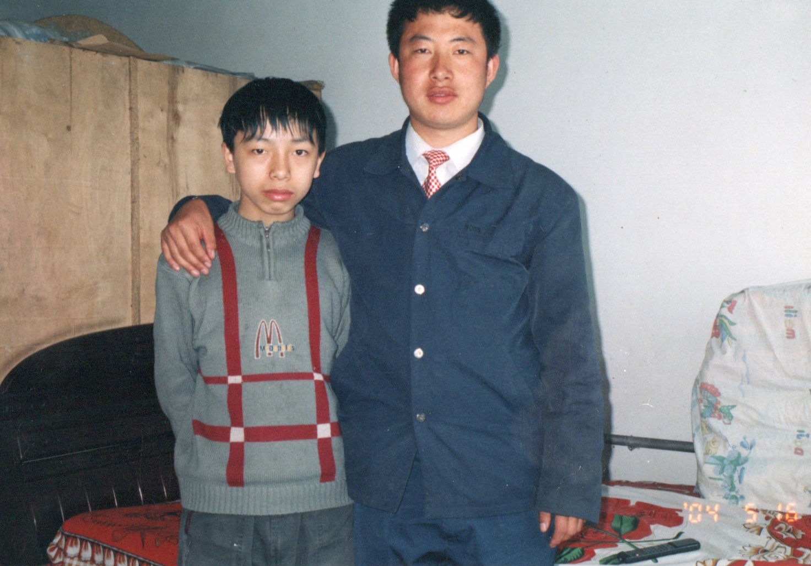
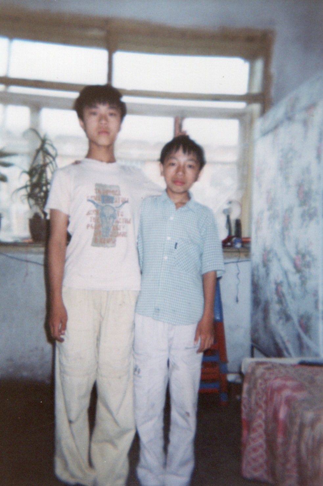
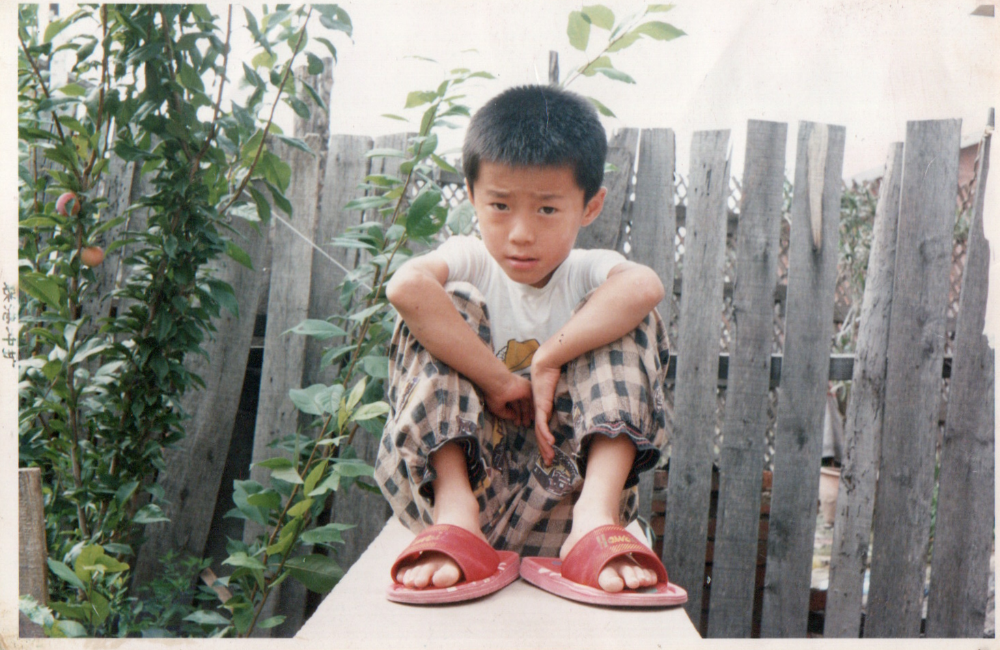
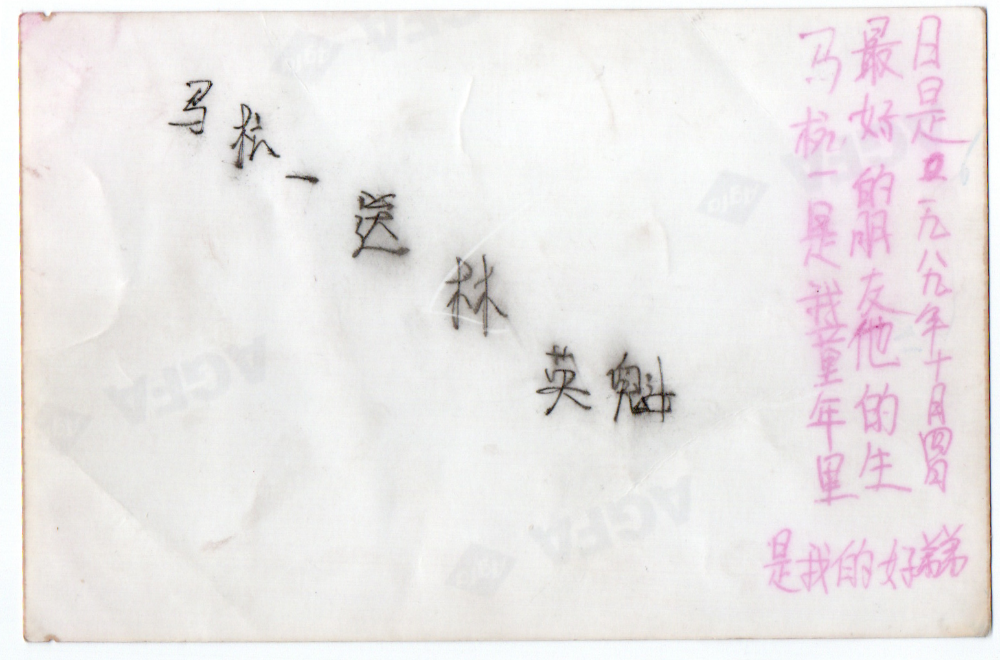
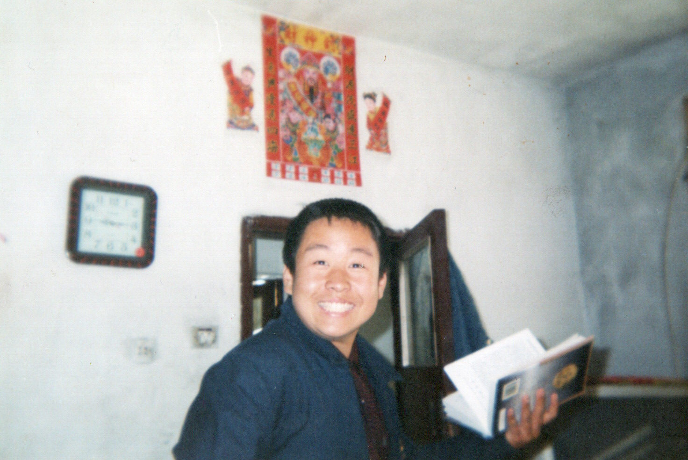
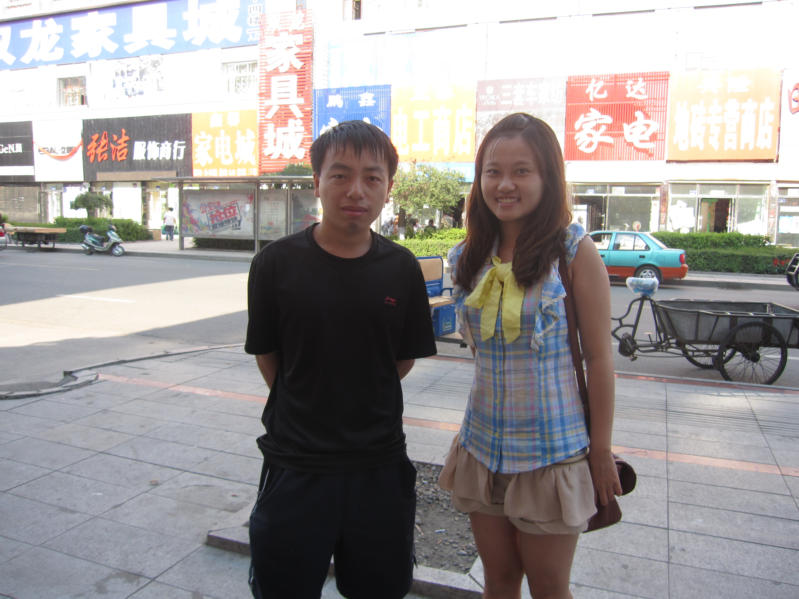
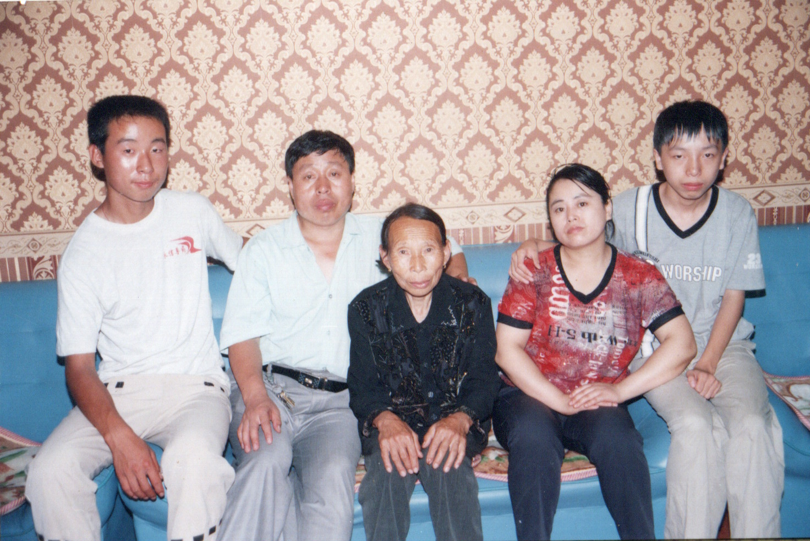

  <a class="archive-year-link" href="/2003">← 2003</a>
  <a class="archive-year-link" href="/2005">2005 →</a>

## 2004年5月16日，中考前

## 2004年6月24日，初中毕业照

五排右一，林英魁

当日缺席，老弟 - 马杭一，关系最好的童年朋友，初三的时候去上海崇明岛，所以没有一起毕业照，下图是2002年在绥棱家中的合影。

下图是，马杭一赠给我的他的童年照片。

四排左六，大哥 - 范琪光，下图是2002年在我家拍的，手拿的书是我最喜欢的《唐诗鉴赏》，还有一本在地摊买的二手[《诗词入门》](https://book.douban.com/subject/1090172/)，同样爱不释手。

四排右四，二哥 - 刘海龙

当日缺席，大姐 - 郭洋子，初四刚开学转学去了六中，也因此我给郭洋子写了[《卜算子》](../poems/busuanzi/) 和 [《除夕夜》](../poems/chuxi/)，这是我对古典诗歌艺术有很强的兴趣和创作欲望的来源。

郭洋子是马杭一的远房表姐，后来与五排右八的初中同学结婚，下图是2011年在绥棱的合影。

三排左六，二姐 - 王柳

## 2004年8月10日，农历生日

林英德，老爸，奶奶，老妈，我

  <a class="archive-year-link" href="/2003">← 2003</a>
  <a class="archive-year-link" href="/2005">2005 →</a>

