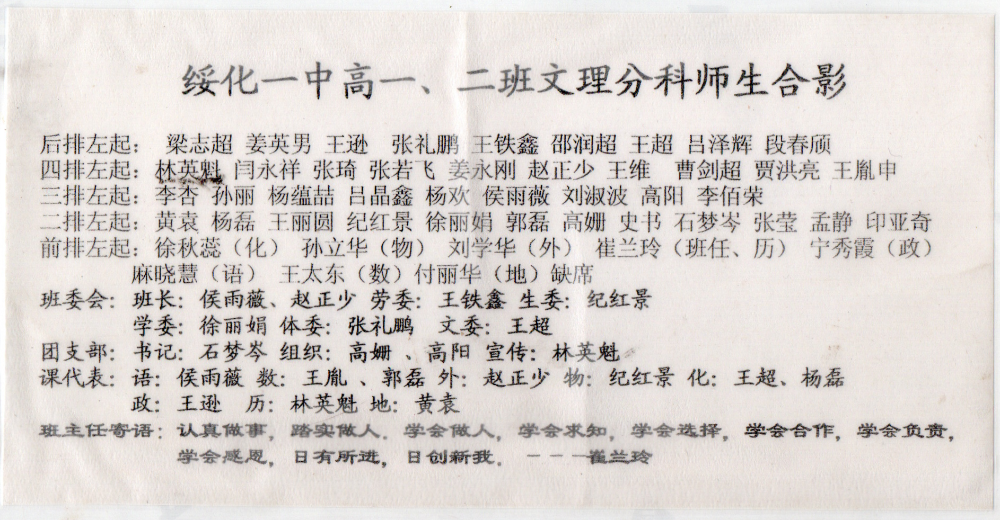
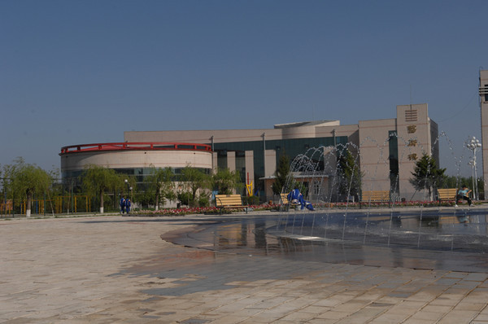
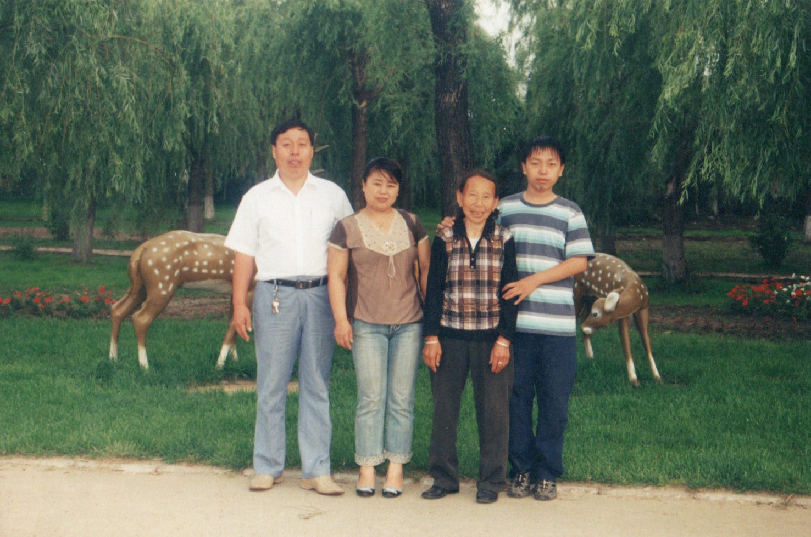
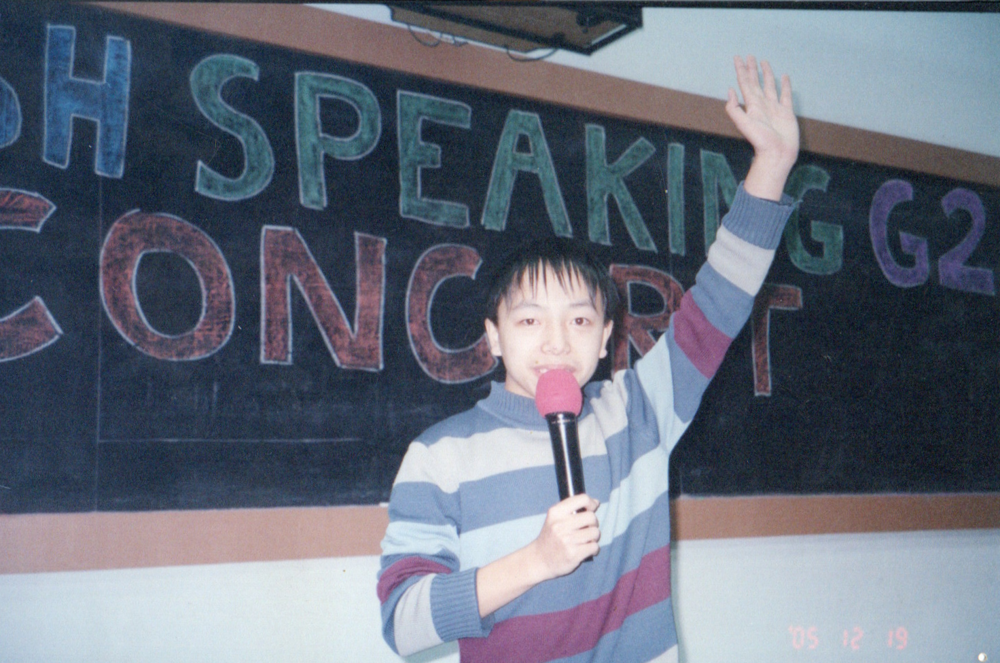
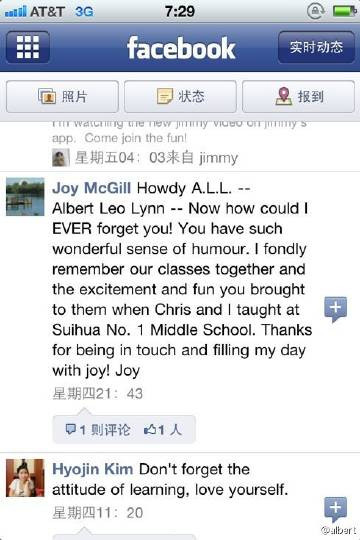

  <a class="archive-year-link" href="/2004">← 2004</a>
  <a class="archive-year-link" href="/2006">2006 →</a>

## 2005年7月8日，高中分班合影

<!--  -->

<figure>
  
  <figcaption>2006年09月 - 绥化一中艺术馆 （上图背景）</figcaption>
</figure>

绥化一中在2004年生源很好，因为大家无法去哈尔滨或者大庆的名高中去读书。招生的时候，在图书馆举办了一次选拔考试，选了30个学生，后来分文理的时候，在上面的艺术馆里举办了一次分班考试，只有两个我们二班的同学去了一班，剩下的都去了三班。

## 2005年7月30日，农历生日

下一年的2006年，因为7月20日是农历生日，因为高三暑期上课，在学校过的生日。

## 2005年12月19日，圣诞演讲

<figure>
  
  <figcaption>2005年12月19日 - 圣诞演讲</figcaption>
</figure>

在绥化一中，我们全校有两个英语外教，一个是来自美国的 Christ，一个是来自加拿大 Alberta 的 Joy McGill，而这个圣诞演出，是两位外教组织的，印象深刻的是来自一班的王同学演唱的英文歌曲，我当时是在用英文讲笑话，可以认为是脱口秀。

两位外教，经常带我们一起学习英文歌曲，比如，《Let it Be》《Hey Jude》《Summer in the Sun》《Yellow Submarine》等。那时候特别火的英文歌，是《Take Me To Your Heart》，也就是吻别的翻唱。

<figure>
  
  <figcaption>2011年08月27日 - Joy 在 Facebook 上给我的留言</figcaption>
</figure>

  <a class="archive-year-link" href="/2004">← 2004</a>
  <a class="archive-year-link" href="/2006">2006 →</a>

