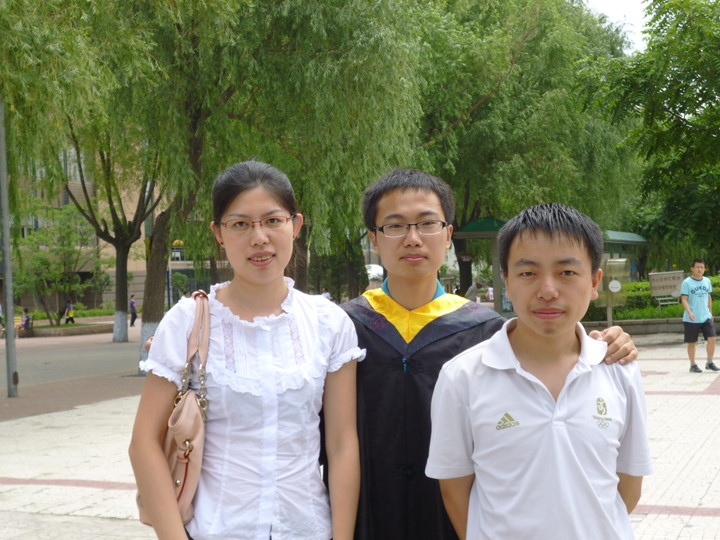

  <a class="archive-year-link" href="/2004">← 2004</a>
  <a class="archive-year-link" href="/2006">2006 →</a>

## 2005年7月8日，高中分班合影

<!--  -->

2011年7月，大学本科毕业期间，与侯雨薇和王胤燊在工大校园的合影。

2021年6月，在我的婚礼上的老友重聚

## 2005年7月30日，农历生日

下一年的2006年，因为7月20日是农历生日，因为高三暑期上课，在学校过的生日。

## 2005年12月19日，圣诞演讲

  <a class="archive-year-link" href="/2004">← 2004</a>
  <a class="archive-year-link" href="/2006">2006 →</a>

