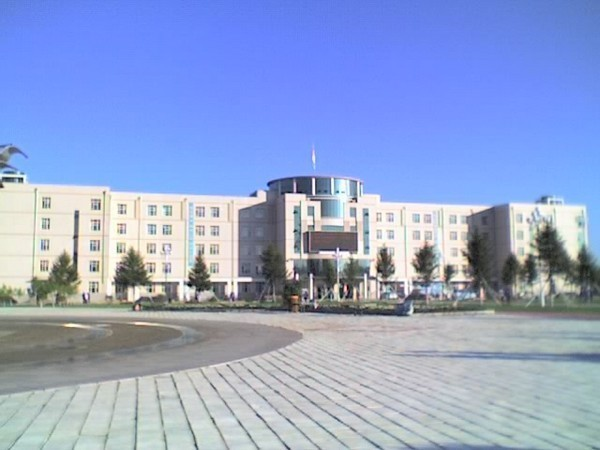
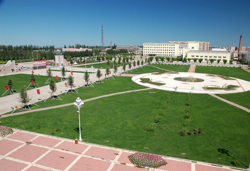
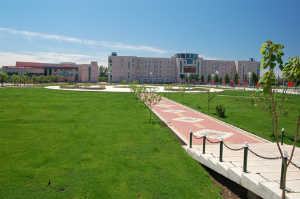

  <a class="archive-year-link" href="/2004">← 2004</a>
  <a class="archive-year-link" href="/2006">2006 →</a>

## 2005年7月8日，高中分班合影

<!--  -->

<figure>
  
  <figcaption>2006年09月 - 绥化一中艺术馆 （上图背景）</figcaption>
</figure>

<figure>
  
  <figcaption>2006年09月 - 绥化一中主楼</figcaption>
</figure>

<figure>
  
  <figcaption>2005年 - 绥化一中从主楼看去</figcaption>
</figure>

<figure>
  
  <figcaption>2005年 - 绥化一中从寝室的角度（高三寝室）</figcaption>
</figure>

## 2005年7月30日，农历生日

下一年的2006年，因为7月20日是农历生日，因为高三暑期上课，在学校过的生日。

## 2005年12月19日，圣诞演讲

<figure>
  
  <figcaption>2005年12月19日 - 圣诞演讲</figcaption>
</figure>

在绥化一中，我们全校有两个英语外教，一个是来自美国的 Christ，一个是来自加拿大 Alberta 的 Joy McGill，而这个圣诞演出，是两位外教组织的，印象深刻的是来自一班的王同学演唱的英文歌曲，我当时是在用英文讲笑话，可以认为是脱口秀。

<figure>
  
  <figcaption>2011年08月27日 - Joy 在 Facebook 上给我的留言</figcaption>
</figure>

  <a class="archive-year-link" href="/2004">← 2004</a>
  <a class="archive-year-link" href="/2006">2006 →</a>

