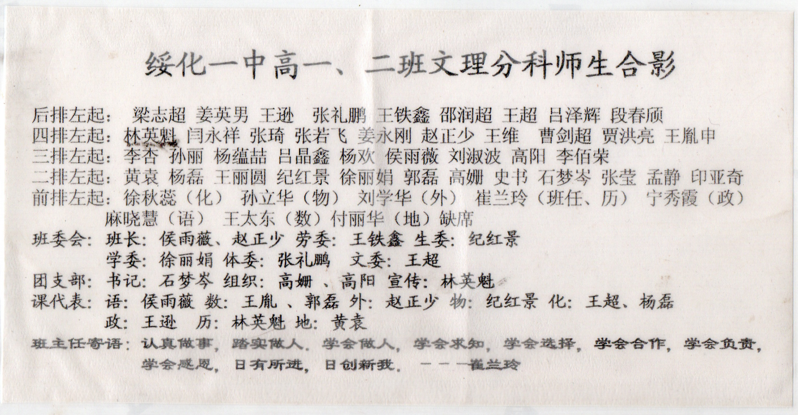
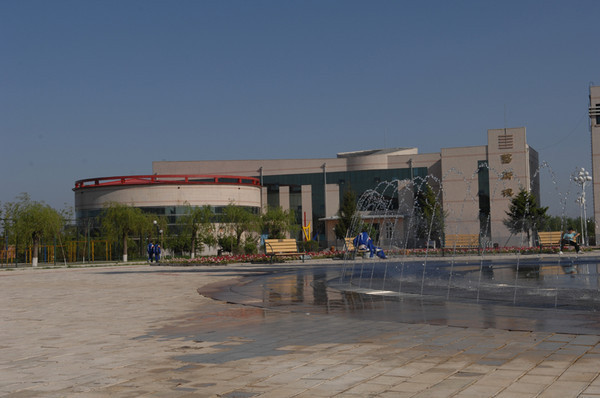
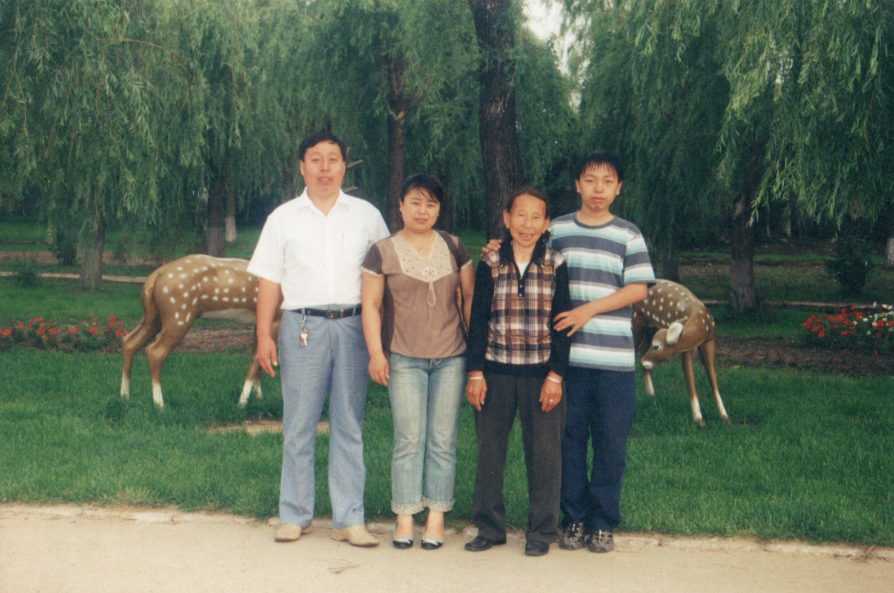
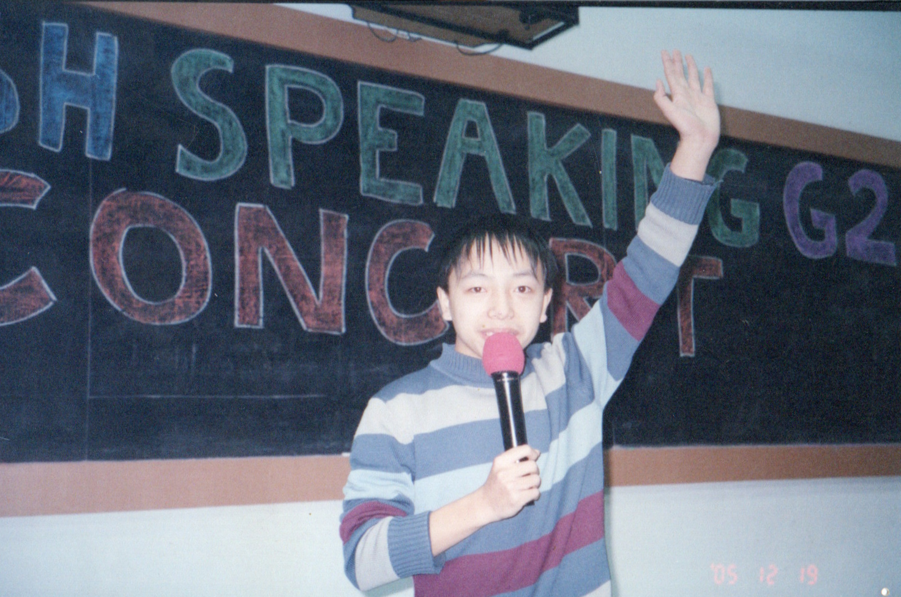
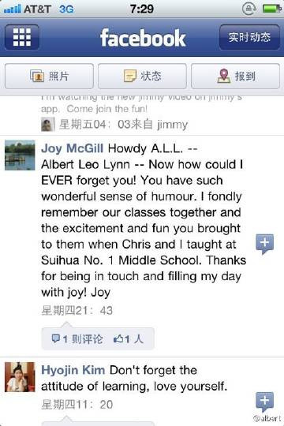

  <a class="archive-year-link" href="/2004">← 2004</a>
  <a class="archive-year-link" href="/2006">2006 →</a>

## 2005年7月8日，高中分班合影

<!--  -->

<figure>
  
  <figcaption>2006年09月 - 绥化一中艺术馆 （上图背景）</figcaption>
</figure>

绥化一中在2004年生源很好，因为大家无法去哈尔滨或者大庆的名高中去读书。招生的时候，在图书馆举办了一次选拔考试，选了30个学生，后来分文理的时候，在上面的艺术馆里举办了一次分班考试，只有两个我们二班的同学（徐丽娟和纪红景）去了一班，剩下的都去了三班。

## 2005年7月30日，农历生日

下一年，因为2006年7月20日生日那天高三暑期上课，便在学校过的生日。

## 2005年12月19日，圣诞演讲

<figure>
  
  <figcaption>2005年12月19日 - 圣诞演讲</figcaption>
</figure>

在绥化一中，我们全校有两个英语外教，一个是来自美国的 Christ，一个是来自加拿大 Alberta 的 Joy McGill，而这个圣诞演出，是两位外教组织的，印象深刻的是来自一班的王同学演唱的英文歌曲，我当时是在用英文讲笑话，可以认为是脱口秀。

两位外教，经常带我们一起学习英文歌曲，比如，《Let it Be》《Hey Jude》《Summer in the Sun》《Yellow Submarine》等。那时候特别火的英文歌，是《Take Me To Your Heart》，也就是吻别的翻唱。

<figure>
  
  <figcaption>2011年08月27日 - Joy 在 Facebook 上给我的留言</figcaption>
</figure>

## 高中轶事

1. 于鹏：我记得最开始就是王泰东一道题讲了20分钟，底下鸦雀无声，微姐憋不住笑了，王泰东让微姐上来讲，微姐讲了一个特别简单的办法。然后后面遇到难题，王泰东都先问问微姐和刘翔有没有啥好的思路。他上课讲的太墨迹，学的好的不想听，学不明白的也不想听。咱班当时英语和一般差不多；化学比一班好；物理和数学我记得差的比较多；（语文诗词默写）我高考的时候，默认放弃这道题；结果一看，这是我名字这句啊，我会呀，一种捡到分的感觉；高一的时候，特别宽敞；后面都是空的，可以打羽毛球。
1. 刘雪威：我还记得当时好像有几个人有个特别爱好，就是把王太东挂讲台上（不知道为啥这个印象老深刻了）我甚至还记得是啥题，我记得我那个方法就不到30秒，他好像也不太爱理我，但那次实在憋不住了，因为他都讲了20分钟了，他上课不太管不听课的，不听就不听，他也无所谓，那个时候大家数学课好像都是不听的，物理数学也还好吧，我记得英语有差距；（物理老师）但感觉她讲课还可以，挺一针见血的，不会啰嗦，那个时候，好像大家都是想听的时候就听，然后不想听的时候就睡觉或干自己的，后来毕业之后后回想，真的，老胡真的是超好的；因为看小说，罚我站；我记得是8*8+3，但我只能记得两个坐前面的了，王刚和迪哥，还有一个吗，
1. 我：晚自习有时候他（数学老师）来答疑，大家都不太愿意问他；但如果串座到右下角，你就感觉一节课化学老师都在看着你，老胡是 Mr Keating. 高一在老杨家喝酒那个晚上，老胡也去了来着，然后我们毕业后第一次过年聚会，老胡也去了
1. 张赫琼：数学课太墨迹了，一节课就能讲两道题，英语课跟念经差不多[捂脸]，数学老师能给我把会的讲到不会[捂脸]，没人听，听了还不如不听，听完了更糊涂，物理我也听不进去，她说话声比蚊子还小，她一上课我就困，我听不进去她上课，高二开始我的物理课几乎全都睡觉了[捂脸]，我坐到最后一排根本听不见她讲的啥，我后来都条件反射了，她一进教室我就开始困，我英语课睡的觉都没有物理课多；我还记得跟大梁子比看谁背琵琶行背的快[捂脸]
1. 铁心：[皱眉]语文老师挺好的…我记得语文老师高三后期说，谁晚上回家复习语文就是傻子，又不能提分；还挺感动的；我交的表是选的文科…后来被我妈追到学校给要回来了…[苦涩]理科真的不适合…[裂开]…
1. 郭蕾：我就记得赵正少英语课睡觉，老胡不让吵醒他，（物理老师）比蚊子还小[捂脸] 总比老杨因为折千纸鹤把我叫出去了强[捂脸]；那时候还能用电子词典看小说，王铁鑫教我的打开的新大陆
1. 杨蕴喆：语文老师最爱脱鞋，数学老师叫王大车，化学老师一提问就开始盘算哪道题到自己，然后他总半道就变卦，她自己讲一个，还得重新盘算；一次刘雪薇和陈圆丽起头嗑瓜子，我跟王昊刚吃俩粒，就被老杨从后门露出的脑袋抓着了，吓我一跳，那时候刚到三班不久，以前在二班小崔从来不会出现在后门玻璃上[奸笑] 自从魏大波子从山东回来，咱们就晚自习加跑操，净整那没用的
1. 李开：我还记得有一天睡觉起来，看王太东写了一黑板HLHLHHLL，当时笑出声了
1. 杨智广：我记得前桌孙新宇电子词典玩俄罗斯方块贼厉害
1. 侯雨薇：我们那个教师太小了，感觉就是下一锅饺子都要扑出来的感觉，挤得那个桌子都前后直晃荡，面积不大，人还很多

## 流行文化

那年，因为室友张星买了蔡依林的新专辑磁带，特别喜欢《野蛮游戏》，现在听到这首歌，就能回到那时候的感觉，也就是周末在寝室的感觉，我那时候有一个步步高的随身听，记得是花400块买的。2001年的时候，家里的住宿生，在墙上贴了一个蔡依林的海报，还喜欢蔡依林的《看我七十二变》。

那时候，还在寝室看《柯南》的漫画。

  <a class="archive-year-link" href="/2004">← 2004</a>
  <a class="archive-year-link" href="/2006">2006 →</a>

