

  <a class="archive-year-link" href="/2005">← 2005</a>
  <a class="archive-year-link" href="/2007">2007 →</a>

## 2006年9月30日，一中校庆

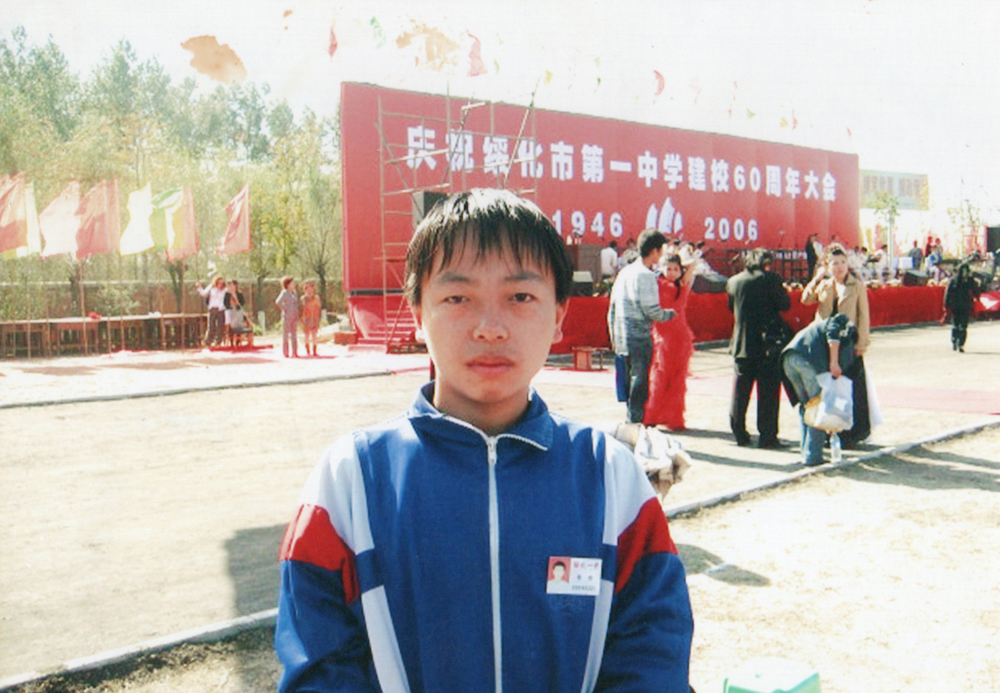

<!-- 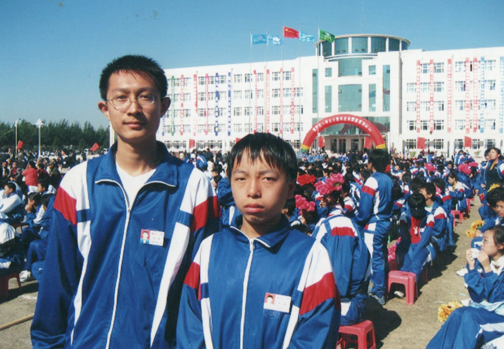 -->

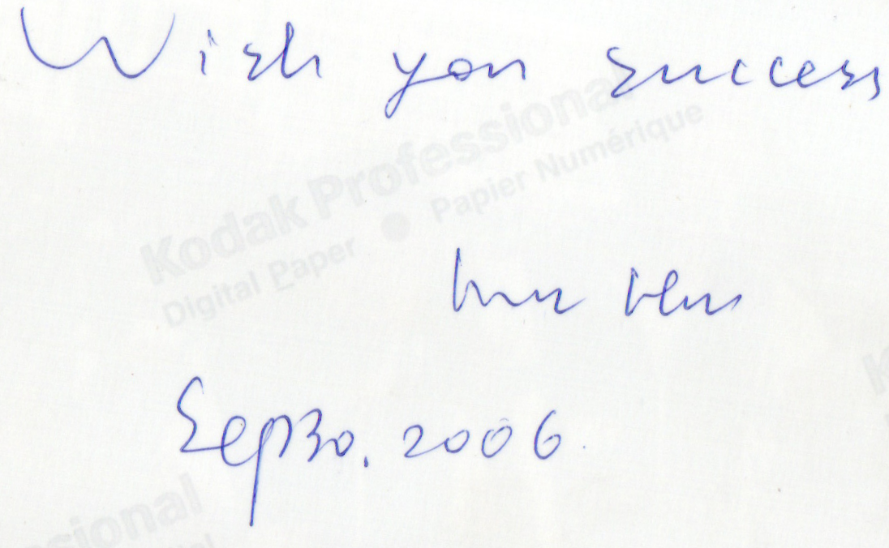

<figure>
  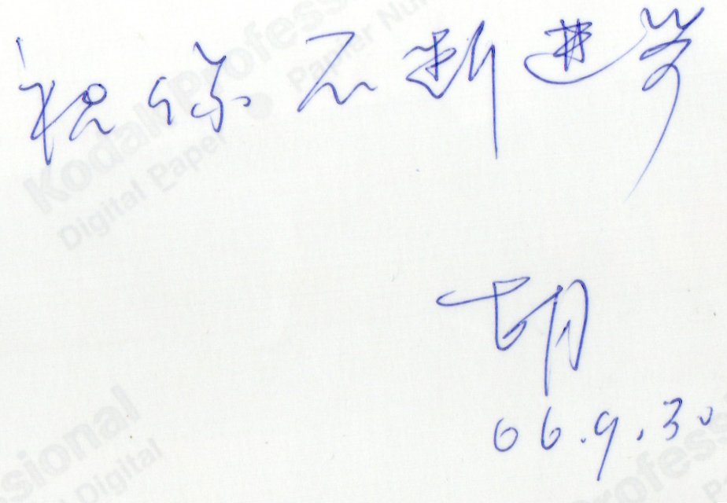
  <figcaption>胡老师在照片背面写的留言</figcaption>
</figure>

为了庆祝60周年校庆，绥化一中做了很多大的修缮。

<figure>
  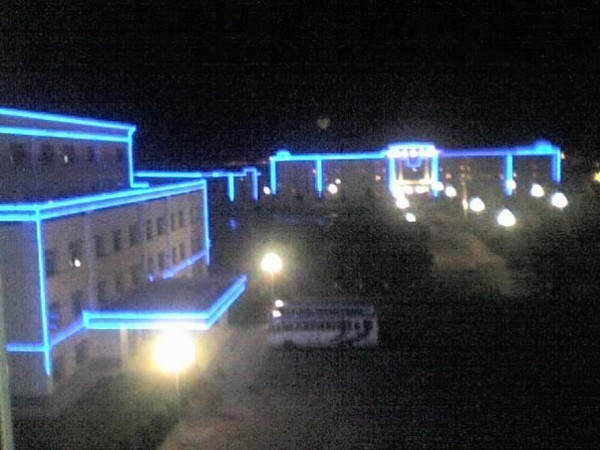
  <figcaption>2006年 - 绥化一中夜景</figcaption>
</figure>

<figure>
  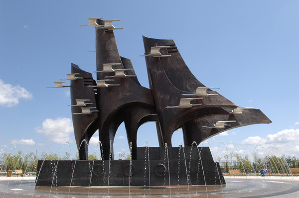
  <figcaption>2006年 - 绥化一中雕塑</figcaption>
</figure>

<figure>
  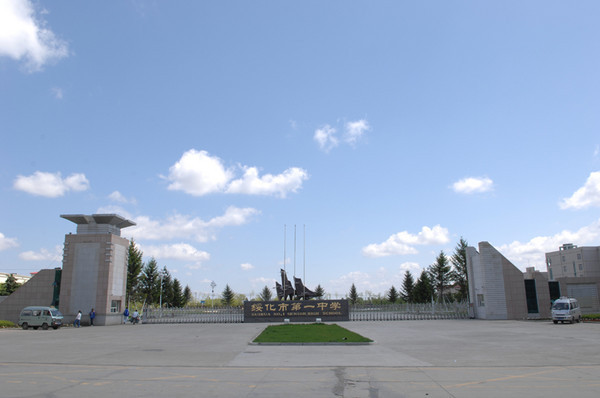
  <figcaption>2006年 - 绥化一中新大门</figcaption>
</figure>

<figure>
  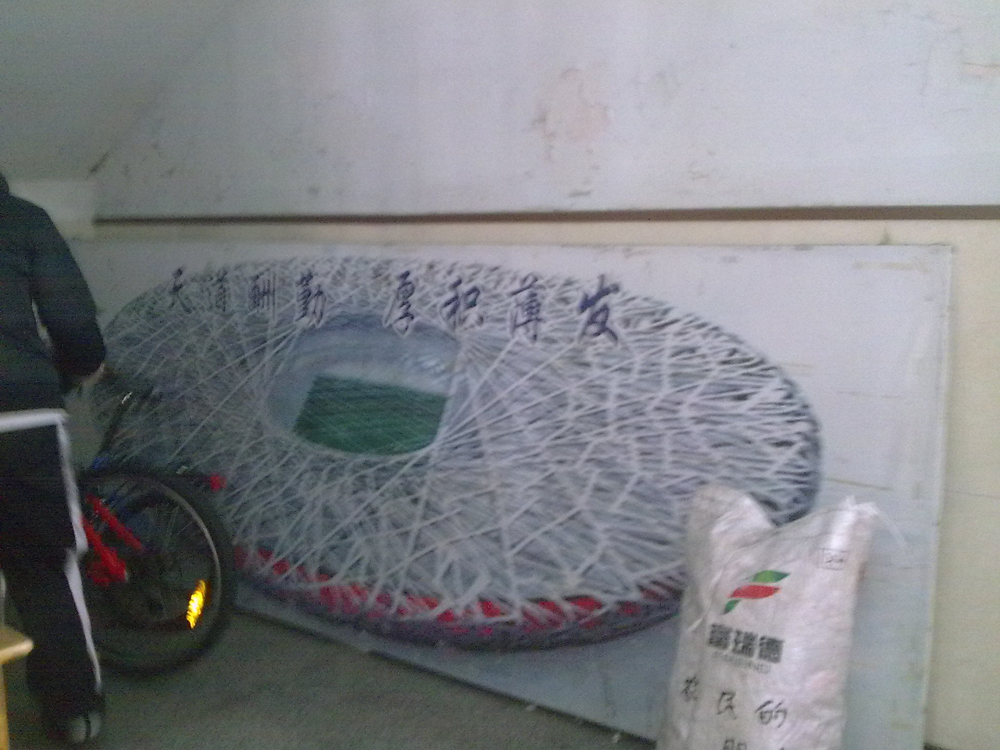
  <figcaption>2010年02月03日 - 当时给班级设计的一个背景板</figcaption>
</figure>

<figure>
  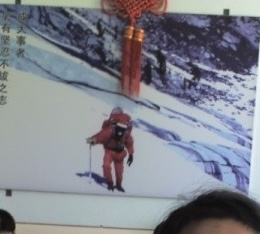
  <figcaption>2006年 - 当时给班级设计的另一个背景板</figcaption>
</figure>

“古之立大事者，不惟有超世之才，亦必有坚忍不拔之志。” 苏轼这个句子，我在高中2006年就很喜欢，[2014年也自勉](https://weibo.com/1573935383/ACrmx6tLZ)，作为网站背景图，2021年婚礼上，我又提到了它。

## 2006年12月31日，元旦唱歌

<figure>
  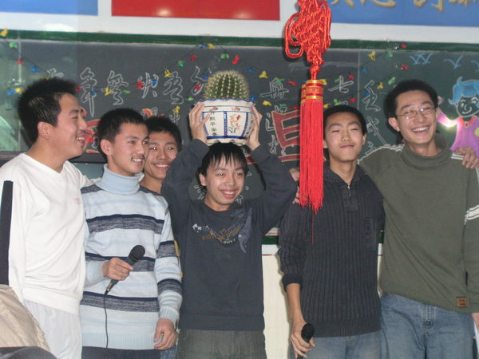
  <figcaption>绥化一中，高二和高三时的寝室室友</figcaption>
</figure>

<figure>
  
  <figcaption>绥化一中，高二和高三时的对面寝室</figcaption>
</figure>

黑板上写的“欢庆元旦”和赤壁赋，是我用粉笔写的

<figure>
  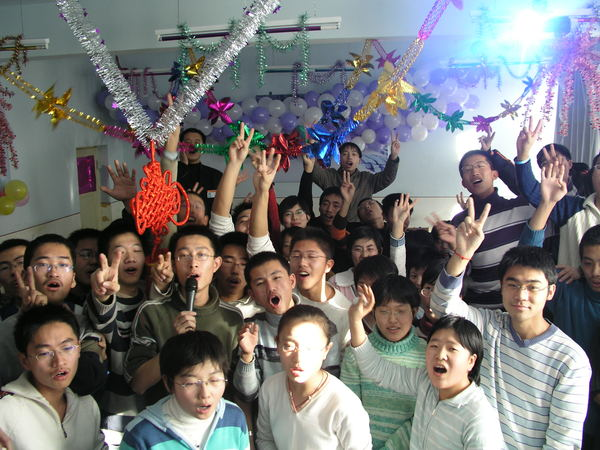
  <figcaption>2006年12月31日 - 全班大合唱《明天会更好》</figcaption>
</figure>

<figure>
  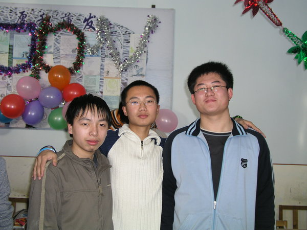
  <figcaption>2006年12月31日 - 与哈工大的三位高中同学合影</figcaption>
</figure>

  <a class="archive-year-link" href="/2005">← 2005</a>
  <a class="archive-year-link" href="/2007">2007 →</a>

