

  <a class="archive-year-link" href="/2006">← 2006</a>
  <a class="archive-year-link" href="/2008">2008 →</a>

## 2007年6月4日，高中毕业照

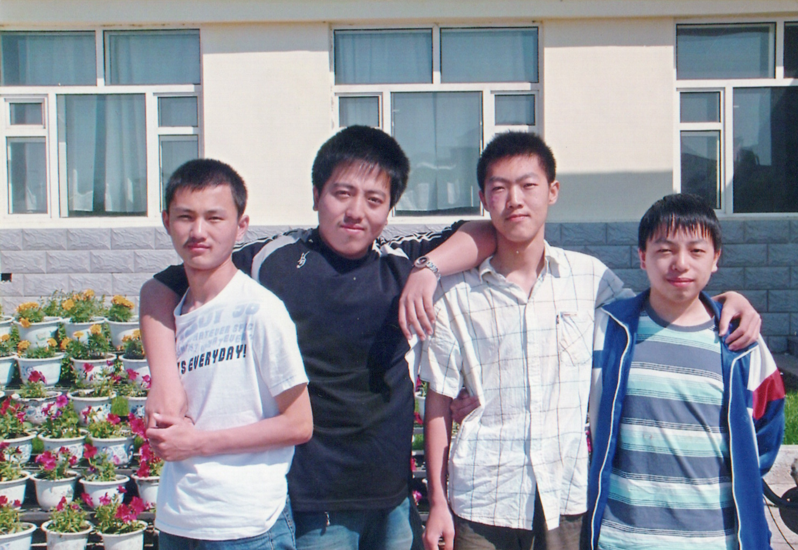

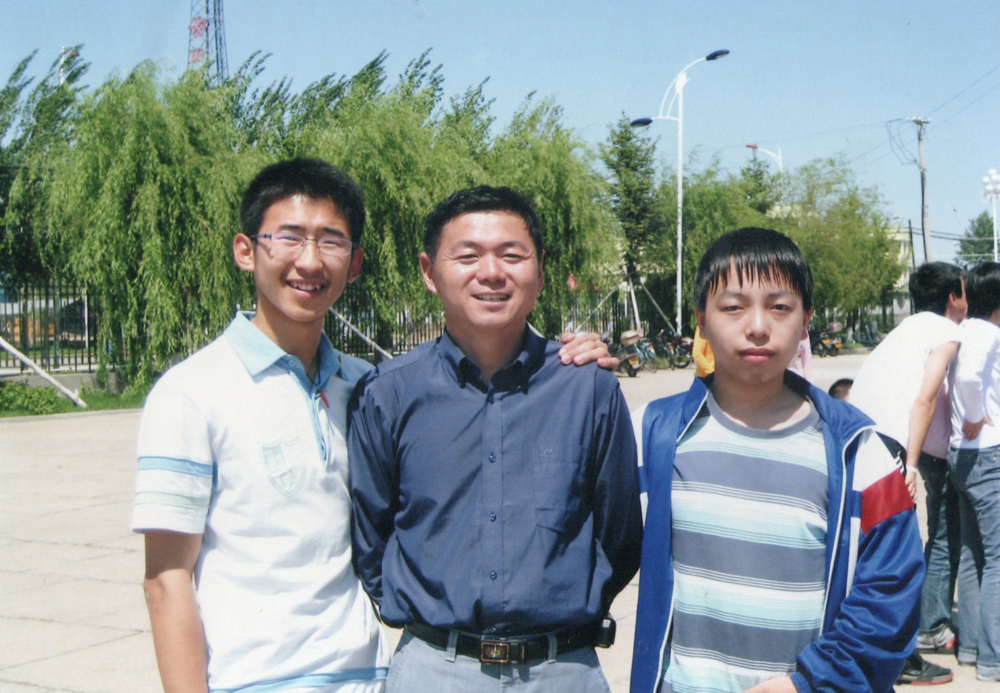

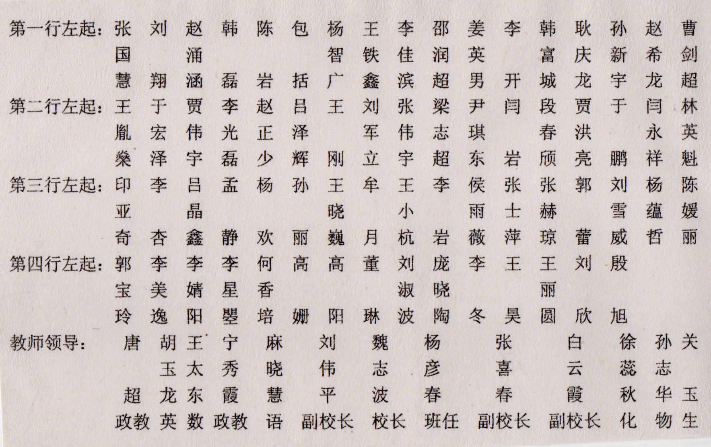

[高中同学考入大学录取情况](https://tieba.baidu.com/p/233415114?fr=frs)

## 2007年8月7日，农历生日

往年，都是和奶奶一起过生日，但是07年的时候，我和奶奶去了辽宁老家，但奶奶没有一同回来，我和老爸单独去了大连旅游。我和老爸赶在生日前回到家里，当日拿到大学的录取通知书，中午去的[克音](../18)，所以当日没有像往常一样聚餐拍照。

## 2007年8月，大一上

<figure>
  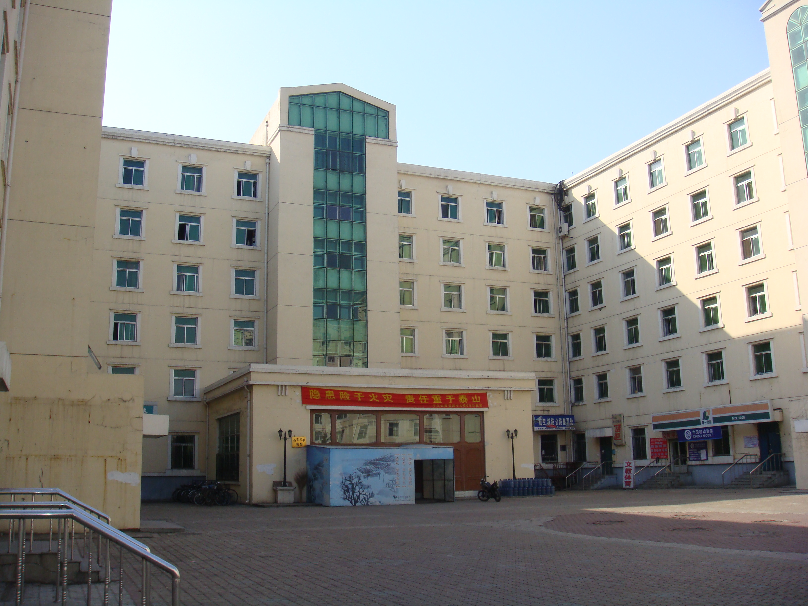
  <figcaption>2007年 - 哈工大二校区五公寓</figcaption>
</figure>

<figure>
  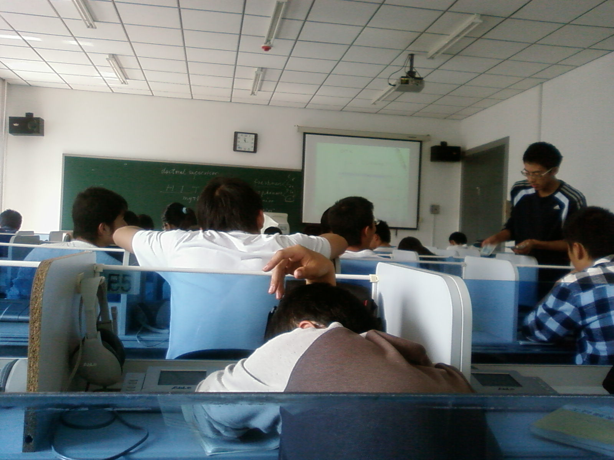
  <figcaption>2007年9月18日 - 英语多媒体课</figcaption>
</figure>

<figure>
  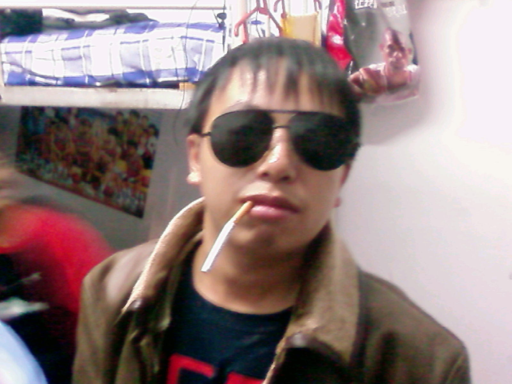
  <figcaption>2007年9月29日 - 哈工大二校区五公寓216寝室</figcaption>
</figure>

<figure>
  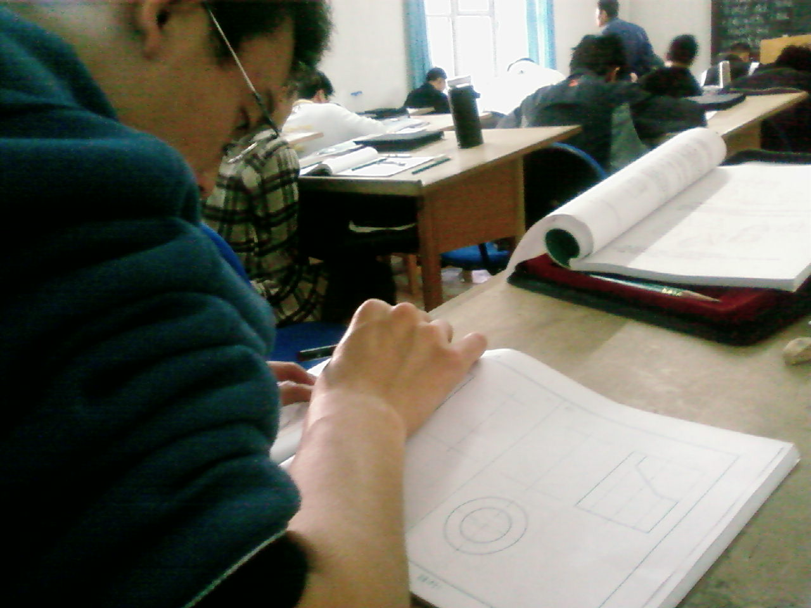
  <figcaption>2007年10月7日 - 工程图学课</figcaption>
</figure>

<figure>
  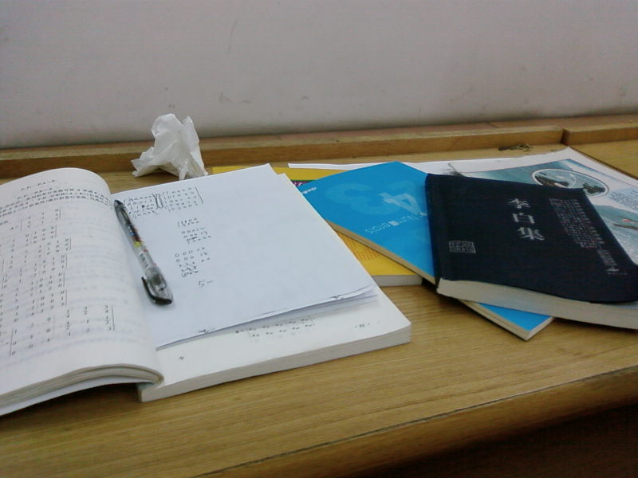
  <figcaption>2007年10月14日 - 晚自习时间学习</figcaption>
</figure>

<figure>
  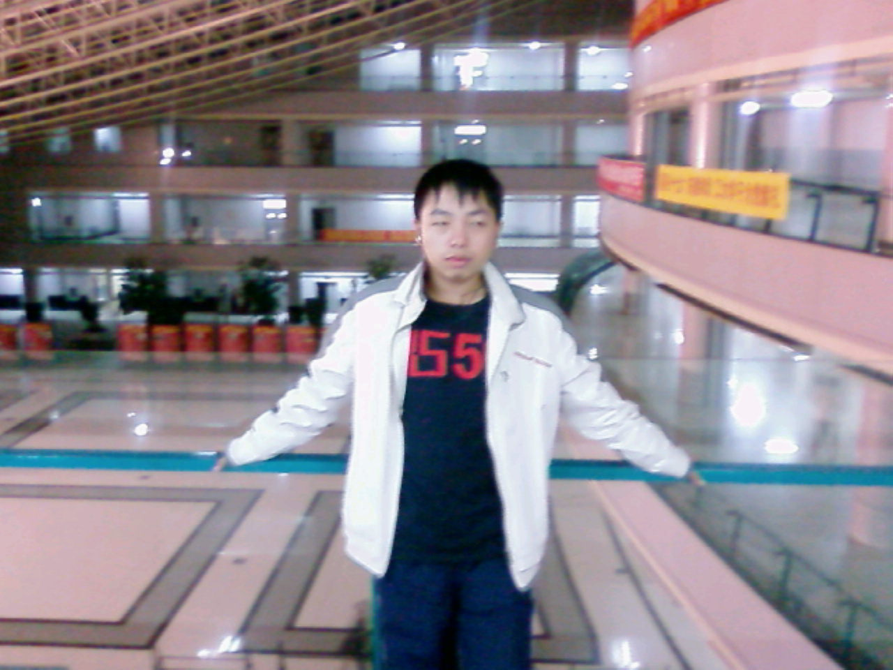
  <figcaption>2007年10月17日 - 阳光大厅</figcaption>
</figure>

是我第一个[校内](../xiaonei)头像

<figure>
  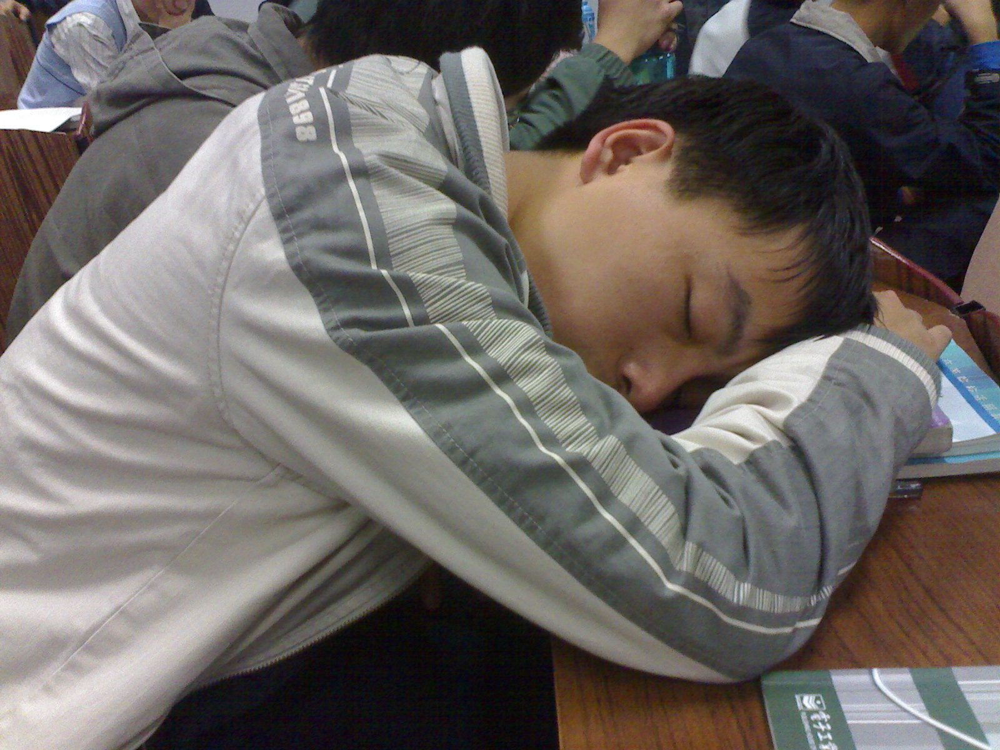
  <figcaption>2007年10月18日 - 上课睡觉</figcaption>
</figure>

<figure>
  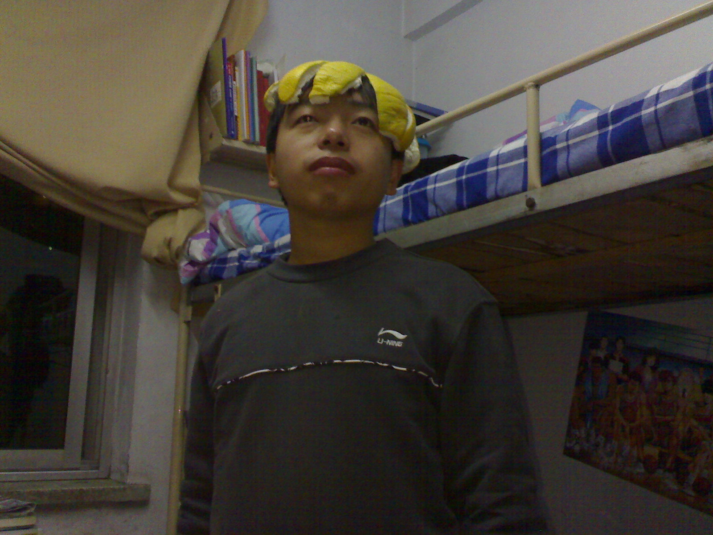
  <figcaption>2007年11月10日</figcaption>
</figure>

<figure>
  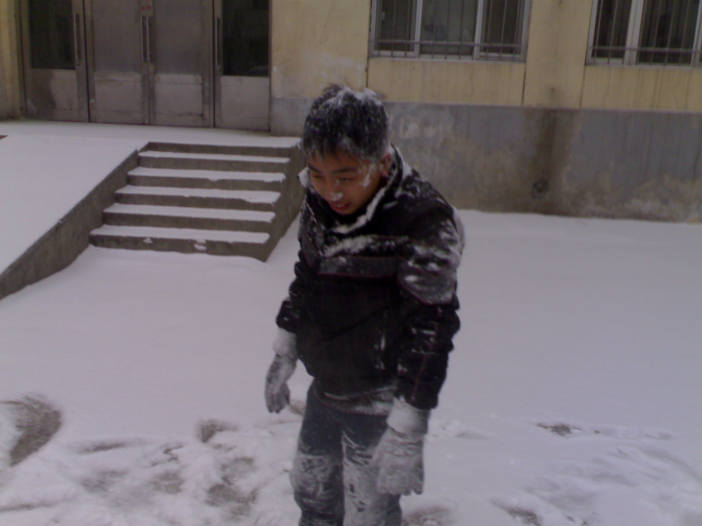
  <figcaption>2007年11月19日 - 第一场雪 & 打雪仗</figcaption>
</figure>

  <a class="archive-year-link" href="/2006">← 2006</a>
  <a class="archive-year-link" href="/2008">2008 →</a>

