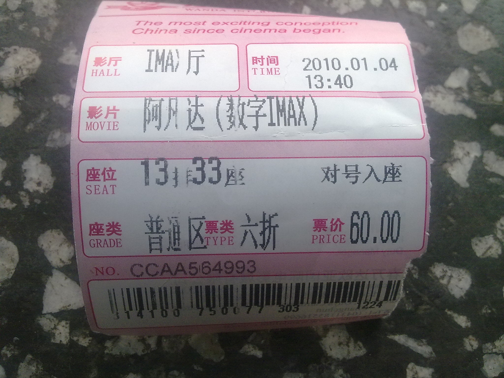
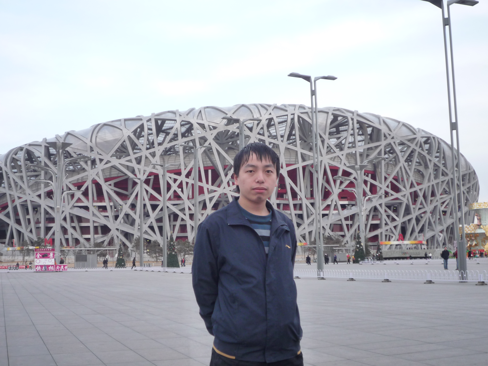
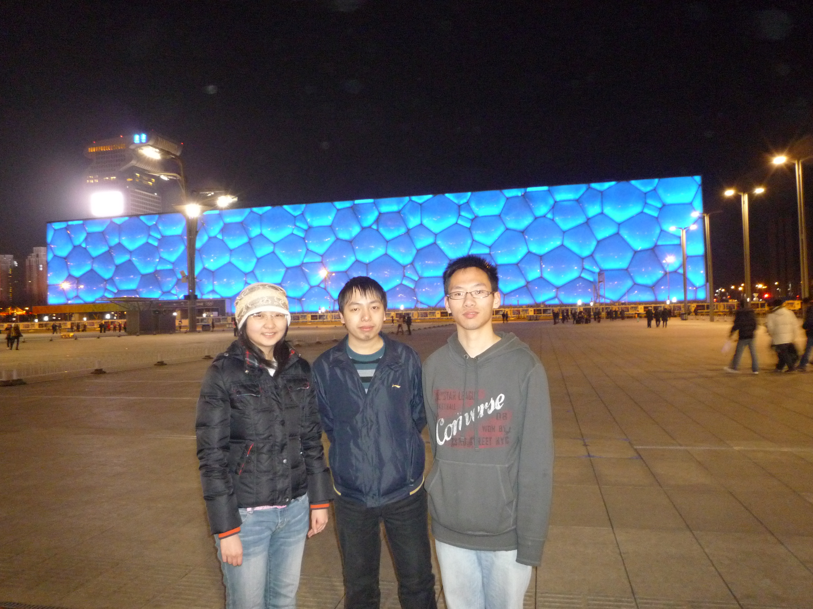

  <a class="archive-year-link" href="/2009">← 2009</a>
  <a class="archive-year-link" href="/2011">2011 →</a>

<figure>
  
  <figcaption>2010年1月4日 - 《阿凡达》</figcaption>
</figure>

那天早晨一夜没睡着，6点的火车去长春，和马兵、曹磊一起去看的《阿凡达》（首映日）

<figure>
  
  <figcaption>2010年3月2日 - 北京鸟巢</figcaption>
</figure>

和郭蕾和马兵，去北京房山新东方学习 GRE，正月初二出发，学习了两周，三月初回的学校

<figure>
  
  <figcaption>2010年3月2日 - 和郭蕾、马兵在水立方前的合影</figcaption>
</figure>

<!-- 因为这次一起去北京学习，对郭蕾产生了强烈的爱慕之心，也是我第一次有这样的单恋，[4月28日表白被拒后](https://weibo.com/1278777010/m1w0m)，让我异常痛苦，写下了几首诗歌，包括 [《双心灵》](../poems/heart) -->

<figure>
  
  <figcaption>2010年3月3日 - 在北京故宫</figcaption>
</figure>

  <a class="archive-year-link" href="/2009">← 2009</a>
  <a class="archive-year-link" href="/2011">2011 →</a>

