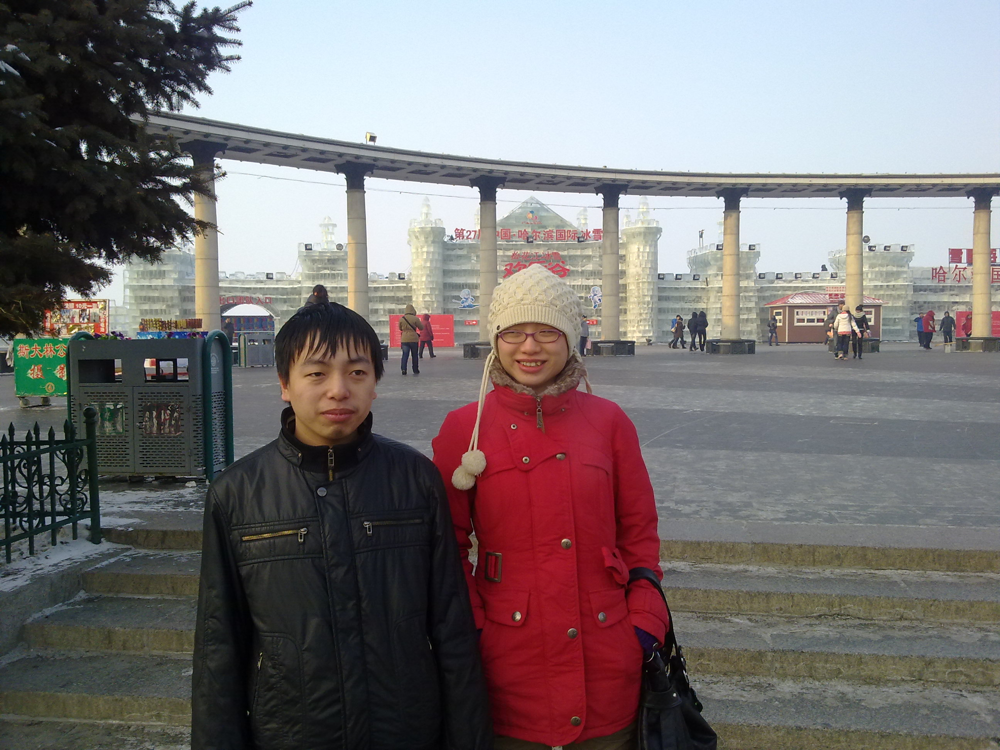
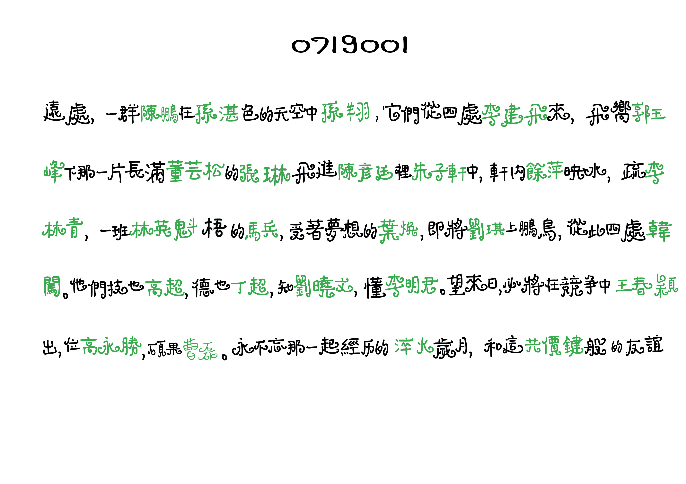
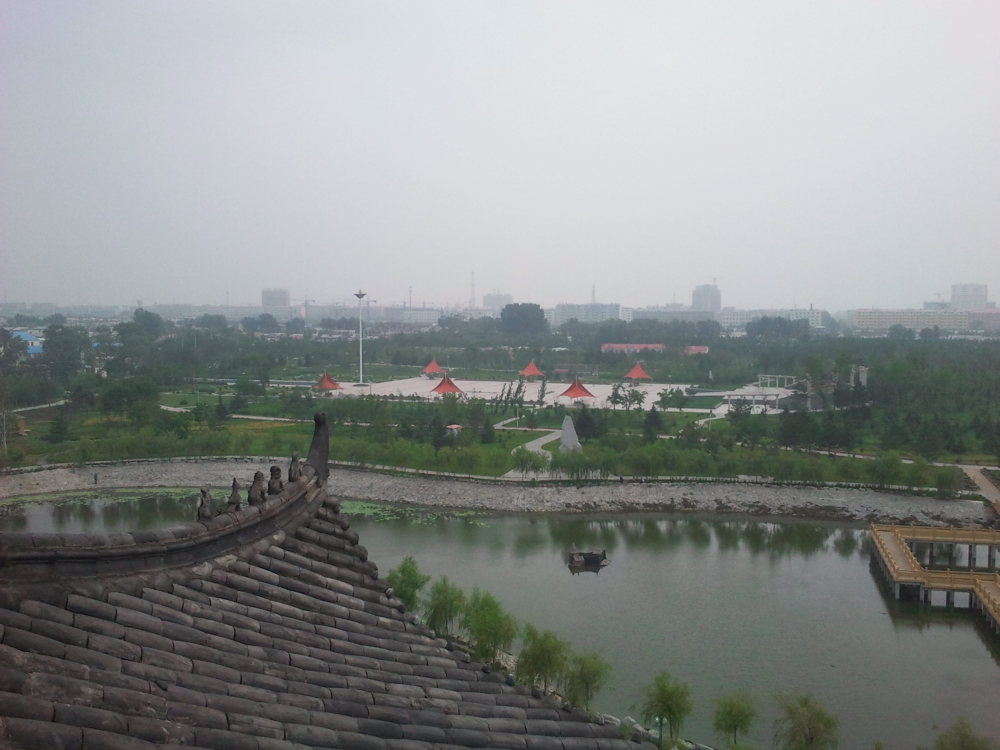
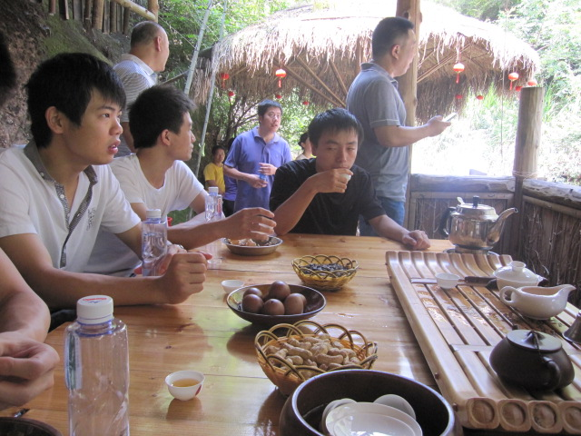

  <a class="archive-year-link" href="/2010">← 2010</a>
  2012 →

<figure>
  
  <figcaption>2011年2月19日 - 和 张赫琼 在防洪纪念塔</figcaption>
</figure>

那天，和张赫琼，王胤燊一起在电影院看的《让子弹飞》，虽然我前几天看过一遍了

<figure>
  
  <figcaption>2011年3月7日 - 烤鸭宴</figcaption>
</figure>

薛蛮子[在微博征文竞赛](https://weibo.com/1278777010/9jAbkv)，选十个网友去北京，在大董请吃烤鸭宴，我投稿的[《中秋望月》](../poems/zhongqiu)

<figure>
  
  <figcaption>2011年7月1日 - 设计的班服背面</figcaption>
</figure>

<figure>
  
  <figcaption>2011年7月12日 - 在望奎</figcaption>
</figure>

<figure>
  
  <figcaption>2011年8月22日 - 第二次去武夷山</figcaption>
</figure>

  <a class="archive-year-link" href="/2010">← 2010</a>
  2012 →

