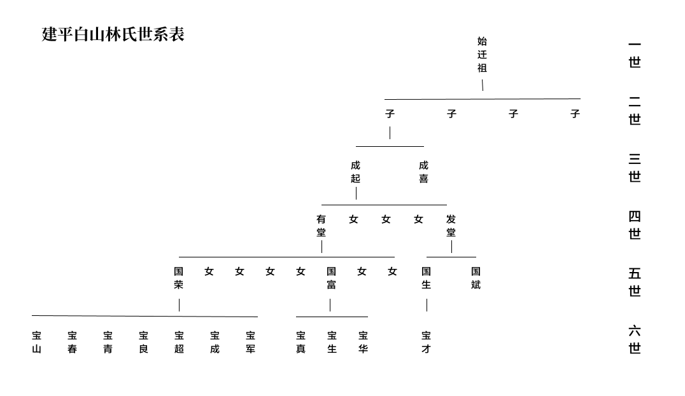
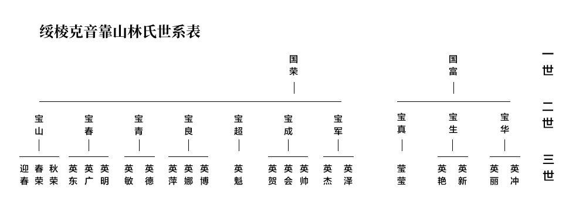
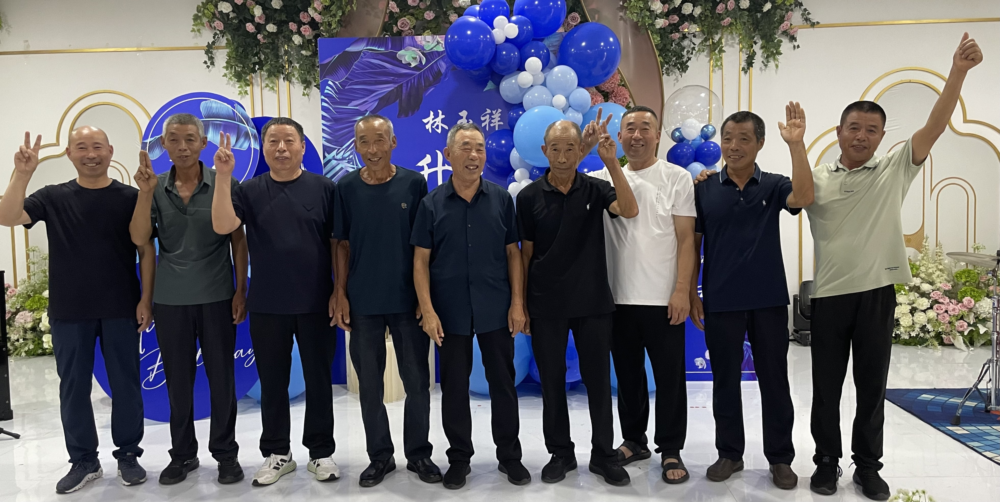

## 建平白山林氏

### 始迁祖

**名字不详** ⼭东省登州府海阳县人，约1876年，逃荒至辽宁省建平县白山乡西三家，始迁祖另一个兄弟也同来关东，后来又返回山东。

### 二世

**成起** （约1874年-约1918年）始迁祖长子，妻子李氏，有子二人，女三人。约1918年因嗜赌成性被逐出家门，逝世于内蒙古自治区赤峰市阿鲁科尔沁旗。成起祖父共有孙辈九人，成起排行老七，成起名字不详，在2018年立的墓碑上写的林成起，是成起之孙 国富 临时起的名字，或许起字的发音是对的，但字不对。

**成喜** 始迁祖长女

### 三世

**有堂** （1898年4月 - 1974年1⽉31日）成起长子，生日为农历三月二十某日，妻子张氏，有子二人，女六人。约1918年，成起将有堂的三个妹妹（约十几岁）以置换几袋大米的条件，将其送至他人家中作童养媳，有堂立志要勤勉置家，劳苦一生的开始，生于清朝末年（约15岁时清朝灭亡），壮年处于民国时期，50岁左右中华人民共和国成立，一生跨过第一次世界大战（16岁到20岁），大萧条（30岁出头），第二次世界大战（34岁到47岁期间，生活在被日本占领时期），以及建国初期的几次运动。

**发堂** 成起次子，妻子李氏，李氏擅长赌博。

发堂长子国生，妻王秀兰，国生长子宝才，1966年生，宝才长子森，1990年农历三月廿九生，森长子墨涵

发堂次子国斌，居住在西三家，家谱持有者

## 绥棱克音靠山林氏

### 一世

**国荣**（1934年 - 1986年）有堂长子，1974年40岁时，迫于生计，从[辽宁省建平县白山乡洼子沟村](https://www.amap.com/regeo?lng=119.465461&lat=41.699193&name=%E6%9C%9D%E9%98%B3%E5%B8%82%E5%BB%BA%E5%B9%B3%E5%8E%BF&adcode=211300)迁至内蒙古自治区扎鲁特旗鲁北镇，1976年中秋节后几日，迁至[黑龙江省绥棱县克音河乡津河七队（新立屯）](https://www.amap.com/regeo?lng=127.156244&lat=47.332062&name=%E7%BB%A5%E5%8C%96%E5%B8%82%E7%BB%A5%E6%A3%B1%E5%8E%BF&adcode=231200)。

妻子王玉英（1932年2月23日 - 2009年1月1日），农历正月十八出生于地主之家，家庭富裕，王玉英大舅家在1944年被土匪抢劫，父亲王金、母亲、兄长王玉生因此事生疾而相继去世。国荣成长于日占时期（十岁之前），建国左右1950年（约17岁）结婚，壮年处于建国初期至文化大革命时期，三年大饥荒时约25岁，国荣50出头就因为肺部疾病，经济拮据没有去医治而去世，终生为生计颠簸奋斗，王玉英晚年时期处于改革开放时期，贫苦的一生在晚年得到了一些物质上的享受。王玉英因肺癌去世。

**国富** （1943年3月13日 - 2025年6月29日）有堂次子，农历二月初八出生，1975年迁至[绥棱县靠山乡胜利屯（孙甲振）](https://www.amap.com/regeo?lng=127.080078&lat=47.234937&name=%E7%BB%A5%E5%8C%96%E5%B8%82%E7%BB%A5%E6%A3%B1%E5%8E%BF&adcode=231200)

妻子宗桂芝（1947年正月二十七出生 - 2024年去世）二人1963年结婚

国字辈还有姐妹六人，长女和四女同来绥棱县，居靠山胜利屯。

### 二世（10人）

2025年7月27日，英东 子 玉祥的升学宴上的合影

宝军，宝真，宝超，宝良，宝春，宝青，宝生，宝成，宝华，均出生于辽宁省建平县白山乡

**宝山**（1951年1月18日 - 2026年6月18日）国荣长子，农历腊月十一出生，未随家族迁至绥棱，留居白山乡洼子沟村

**宝春**（1953年出生）国荣次子，农历七月十九出生

**宝青**（1957年出生）国荣三子，农历腊月廿四出生，妻 黄淑芬

**宝良**（1960年出生）国荣四子

**宝超**（1964年出生）国荣五子，妻 张洪芳，1965年出生，1988年11月20日结婚

**宝成**（1968年出生）国荣六子

**宝军**（1973年出生）国荣七子，妻 卢文波，1994年4月10日结婚，1995年婚房失火

**宝真**（1967年出生）国富长子

**宝生**（1970年出生）国富次子，妻 李春华 1970年出生

**宝华**（1972年出生）国富三子，妻 李淑芬，1972年出生

### 三世 （22人）

1994年4月10日，宝军婚礼上的合影

后排：英东，英广，英明，英梅

中排：英萍，莹莹，英德，英艳

前排：英娜，英魁，英贺，英会

原本，这辈人应用 春字，例如，我本应该叫做 林魁春，但是因为我二大爷叫做 林宝春，以至于我二大爷家的大哥不能用春字，我二大爷就选用了 林迎春 的 迎，也就是 英。

**迎春**（1976年出生）宝山子，居建平白山，女 美洁，2001年出生，子 泽泉，2005年出生

**春荣**（1978年出生）宝山长女，居建平白山，子 翟冉，2000年出生

**秋荣**（1979年出生）宝山次女，居建平白山，长女，李亚辉，2001年出生，次女，李亚杰，2006年出生，子，李箫宇，2014年出生

**英东**（1980年出生）宝春长子，妻 袁丽娜，2005年在阿城结婚，子 林煜祥（壮壮），2006年出生

**英广**（1984年出生）宝春次子，大勇，妻，王海微，1989年出生，2019年结婚，女，林添欣，2005年出生，子，林愈祺，2019年出生

**英明**（1984年出生）宝春三子，大强，妻，张志影，1989年出生，2007年结婚，子，林愈森，2009年出生

**英敏**（1983年出生）宝青女，原名英梅，夫，孙海涛，1980年出生，2001年1月结婚，女 孙心蕊，2004年出生，子 孙心磊，2007年出生

**英德**（1989年出生）宝青子，与其父农历生日相同，妻，高云燕，1989年正月出生，2008年1月结婚，子，林高杨，2009年出生

**英萍**（1984年出生）宝良长女，夫 盖宝瑞，2006年结婚，女 盖晓琳，2006年出生

**英娜**（1991年出生）宝良次女，夫 杨大伟，2012年结婚，子 杨迪，2012年出生

**英博**（1997年出生）宝良子，妻 于海玲，1994年出生，2022年结婚

**英魁**（1989年出生）宝超子，妻 付伟，1988年出生，2021年6月19日结婚

**英贺**（1989年10月出生）宝成长女，单单，夫 刘博，1986年出生，2022年结婚，女 张可欣 2012年出生，子 刘俊林 2023年出生

**英会**（1990年出生）宝成次女，双双，夫 宋思南，1990年出生，2017年结婚，子 宋鸣，2017年出生

**英帅**（1997年出生）宝成子，妻 李娜，2000年出生，2023年结婚

**英杰**（1995年出生）宝军女，腊月廿五出生，2024年1月7日结婚

**英泽**（2001年出生）宝军子

**莹莹**（1987年出生）宝真子，妻 徐占华，1989年出生，2009年结婚

**英艳**（1990年出生）宝生女，夫 刘博，1990年出生，2016年结婚，女 刘一伊，2016年出生

**英新**（1999年出生）宝生子

**英丽**（1993年出生）宝华女，夫 庄靖，1988年出生，2019年9月结婚

**英冲**（2002年出生）宝华子

<!-- ## 待解之谜

1. 闯关东的时间是什么时候？是我太爷的爷爷，还是我太爷的太爷？是1876年的丁戊奇荒（千万人饿死，两千万人逃荒），_（光绪）二年春，日照、海阳、滦州饥_？还是1836年，_（道光）十六年春，登州府属大饥_？甚至是1812年，_（嘉庆）十七年春，登州府属大饥_？因为明确是逃荒而来，这几个时间节点的概率最高，而我老爷（林国富）记得是我太爷的爷爷是始迁祖，那也就是光绪初年的概率最大。
1. 从海阳什么地方迁过来的？海阳与栖霞蛇窝泊接壤，栖霞林氏众多，或许与其相关联。而且林国斌有家谱，或许意味着这是一个重视家谱的环境，家谱的起始或许属于不可考的久远年代，但应该从始迁祖开始是仍有记录的，家谱适合数字化一份， -->

<!-- ## 不可考世代，仅供娱乐

若按代际推算，大约是林氏134世，也就是比干的134世孙。

#### 林姓始祖，林坚

林氏起源于商纣王时期的比干之子林坚，比干是黄帝第三十三世孙，帝喾第三十世孙，商汤王第十五世孙，商朝第二十八任君主文丁之子，第二十九任君主帝乙之弟，第三十任末代君主帝辛“商纣王”之叔，比干因谏而死，其子被周武王赐姓为“林”，出生于长林石室。

林坚祖先：燧人氏，伏羲，少典，黄帝，玄嚣，蟜极，帝喾，契（辅佐帝舜，赐姓子），昭明，相土，昌若，曹圉，冥，王亥，上甲微，报乙，报丙，报丁，主壬，主亥，主癸，天乙（成汤），太丁，太甲，太庚，太戊，河亶甲，祖乙，祖辛，祖丁，小乙，武丁，祖甲，庚丁，武乙，文丁，比干

#### 西河林氏，始于公元前1029年，经25代

林坚，林载，林蹉，林虎，林光，林相，林玄，林风，林翊，林苌，林材，林考，林回，林贞，林英，林乾，林保，林隽，林宏，林类，林既，林縣，林雍，林敏，林楚

#### 清河林氏，始于公元前552年，经24代

林放（公元前552年 - 公元前480年，26世，孔子72弟子之一，问礼堂创始祖），林通，林不狃，林欣，林仪，林抚，林鸾，林世元，林伯，林皋（35世，九龙堂创始祖），林宣，林微，林芳，林玮，林亮，林挚，林纂，林别，林吉，林述，林良，林公，林车，林凭

#### 济南林氏，始于公元前55年，经32代

林尊（50世，济南林氏创始祖），林高，林苗，林鉴，林宁，林金，林重，林秉，林袭，林时，林丞，林熹，林谟，林恂，林就，林横，林道，林永，林肇，林封，林农，林袛，林川，林豫，林奢，林冠，林玉，林逢勋，林显，林业，林礼，林隶

#### 晋安林氏，始于公元326年，经22代

林禄（82世，晋安林氏创始祖），林景，林缓（一作绥），林格，林靖之，林遂之，林遁民，林玉珍（一作琛），林原次，林茂，林孝宝，林文干，林国辉，林玄祖，林道，林炜（97世孙，同辈 林披 为九牧派始祖），林顺，林逢恩，林功照，林桧，林瑜，林烈，林江

#### 栖霞林氏，始于公元976年

林江，林氏104世，晋安世系23世，公元976年任北宋赵匡胤时期登州刺史，根据海阳与栖霞蛇窝泊接壤，有可能是我这支林姓的起源。 -->