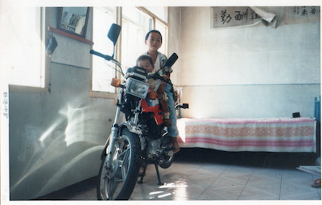
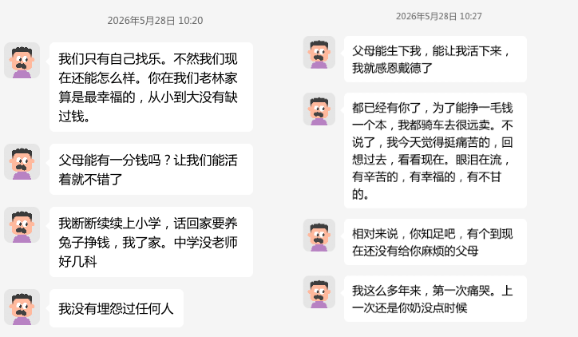
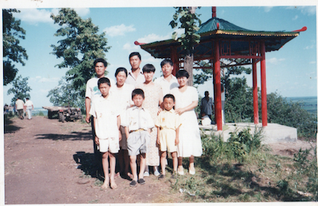
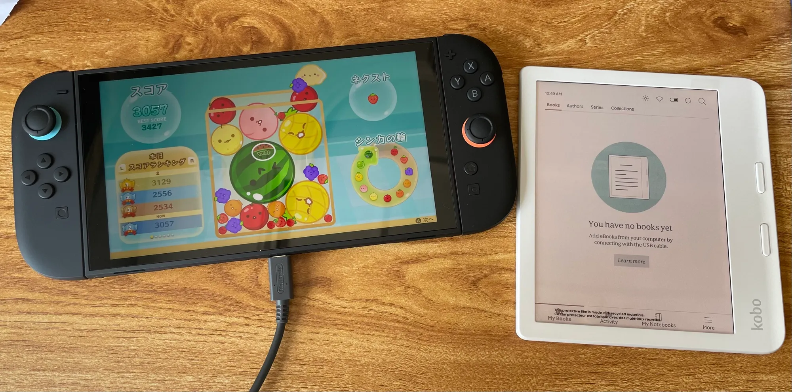

## 皇宫里的乞丐

我们家在1997年前后，就买了相当于2026年，至少10万以上的用来炫耀和享乐的物件。

用当下的眼光看，2005年左右，我爸用着2万5的大理石餐桌，3万多的手机，11万的豪华电视，开着80万的豪车。

而听话爱学的我，从来不用管我学习，从来不用补课，从来不需要额外关照，就把中高考全县前三的荣誉给了我的父母，把中国C9和美国常青藤的学历给了我父母，仅靠裸考，就能得到全国初中数学联赛一等奖。

我的懂事和会读书，换来的是十几年来，像乞丐一样，向同学借书看，借游戏机玩，借磁带听。学习上，我连四大名著都是自己攒钱买的盗版的、小字书、破旧书去看，我嗜书如命，却几乎没书可看。

当独生子女一代，“再苦不能苦孩子”的氛围之下，别人的父母，看不得孩子眼巴巴地羡慕别人，看不得孩子在同学面前抬不起头的时候，当我为这个家，为了他们的虚荣心，提供了在绥棱县花钱都买不来的炫耀资本，和遭他人嫉妒的、破天荒的荣誉的时候，得到的回馈，却远远不如普通的县城儿童。

所有的资源，都用在了把他们俩个塑造成绥棱县的顶尖权贵上面，而在这个金碧辉煌的皇宫里，我是一个不配得到关爱的奴才、乞丐。

## 虎毒不食子

我要的东西贵吗？高乐高25，四驱车20，四大名著每本30，我父亲如果不用三星A100，买一个诺基亚，瞬间就剩下3000块，当我看到我父母吵架，把仅用了两年的A100在我面前砸碎，就像是一个暴君，为了一时情绪，烧了四库全书，也不给我看一页。

<figure>
  
  <figcaption>1997年7月，克音家中，我和我父亲的金城铃木 AX100</figcaption>
</figure>

当我父亲33岁，骑着铃木AX100在农村捕获羡慕的眼光，40岁，开着现代伊兰特在县里弥补他自尊受挫的青春时，他的儿子却从来没有一辆自己的自行车，从来没有过一个自己的MP3，从来没有一个自己的电子词典，从没喝过高乐高，从没有过魔方，从没有一个贵一点的乐器，从没有过一次专门的旅游，我穷的买不起磁带，买不起漫画，整个童年，都在乞求别人的恩赐中度过。

我眼巴巴的羡慕别人家的孩子有四驱车，眼馋小自己四岁的侄子有三麻袋的玩具，有一面墙的书可以看，我像狗一样乞讨父母，换来的家里条件不好，别这么不懂事的指责。

在那个年代，像我父母这么大手大脚、奢侈的、缺乏投资意识的过度虚荣消费，绥棱县也找不出几个，同样，在我周围，我也找不到一个，像我这样物质和娱乐上如此匮乏的童年，是我不听话吗？是我对家里没有恭喜吗？全绥棱也找不出几个像我这么给父母涨脸、省心的孩子，却被情感虐待了整个童年。

## 心理上的弃婴

我个子矮小，总是全班最矮的那个，我自卑，招人嘲笑，被人轻视，遭人欺辱，我想长高，我看了电视广告，我特别想要高乐高，一个八岁的孩子，合情合理、如此卑微的渴望，想通过高乐高弥补一丝被踩碎的尊严，有错吗？过分吗？1997年去百货商店，我父母去柜台问了一嘴，嫌弃高乐高25块太贵没有买，但是当天，在同一个商场，我父亲就花了700块买了一件皮夹克。

我个子矮小，不仅仅是基因，七个月大的时候，还不能走就刚开始说话的我，一个能听懂电视节目的、聪颖可爱的、210天的宝宝，在我最需要建立安全感、最需要父母起夜照料，最需要营养关心的时候，我被送到我大姨家，一待就是两年整，我每四个月，就要回家待两个月，每过一段时间就要适应一次新妈妈，这种反复被抛弃，被世界随意坍塌的创伤，在我很小的时候就深深刻下。

时年36岁的大姨（1953年出生），不仅要照顾我，还要照顾我两个十四、五岁的表哥（1976年、1977年出生），因为生活条件差，经常吃极没营养的大碴粥对付，1992年初，在工资不到300人民币的年代，我父母在村里买了一个13000元，相当于当下50万的、130平米的大房子，令我疑惑半生的是，我整个小时候，都觉得家里穷的很，吃一分钱的皮豆我都要含很久才啃咬碎，两毛钱的冰棍都要被我妈劝说，“家里穷，咱不吃”。

或许是真的穷，但是那1万3的大房子不可以晚一点买吗？或者买个便宜的吗？为什么给自己送出去两年让人照顾的独生子弄得小时候，吃没营养的东西？没书可以看？

那个房子的零头，就可以满足所有我的健康，我的营养，我的儿童书籍，我的玩具的支出。我不知道是我在为这两个26岁左右的小年轻虚荣买单，还是在他们眼里我是一个连别人家宠物狗都不如，一个不值得心疼的累赘。

2007年，18周岁生日那天，我还兴致勃勃的回去看我儿时的这个砖房，而现在，我就像《阿甘正传》里的 Jenny 一样，厌恶自己的童年住宿，为什么要因为这个砖房毁掉我的童年？

## 施虐的快感

不仅仅这个阶段我住在别人家里，多数寒暑假，我记忆里都是要被送到农村去，三大爷家，四大爷家，三姨家，大姨家，姥爷家，在陌生的环境里，察言观色，寄人篱下，每个长辈的脾气性格不尽相同，但我能理解他们，在那个年代，作为农民，辛辛苦苦一年，手头也就1000元出头的的可支配结余，2008年冬，我奶病危，面对养育了他们一生，操劳了一辈子的母亲，50块钱的药费，都没人掏的出，只等着我父亲去支付。

当别的县里孩子在家补习，在家放松娱乐，看电视，甚至出去旅游玩的时候，我在没有电话、没有电视的农村里干耗，在瓜地里发呆守瓜，在河边放牛消磨时光，在生活极度困苦、充满怨气的家庭里混饭，在娱乐极度贫乏的环境里遭罪，在不断更换的寄宿家庭里小心翼翼。

<figure>
  
  <figcaption>2026年5月28日，我父亲和我诉说他苦难的童年</figcaption>
</figure>

我知道我父亲有施虐的心理，但仅仅让我比县里的孩子过得差，他是不满意的，他必须要让我体会到极端的贫困，才能让他回想起他那苦难的童年时，那股畸形的心理才会有所平衡。可是，我奶奶有七个孩子，我奶奶穷的只能让孩子们吃饱，而我父亲在县里，在2026年的眼光看，用着3万多的手机，看着11万的豪华电视，开着80万的豪车，还能在请别人吃饭、给别人办事的时候，大方无比，挥金如土。

他小时候苦，每次跟我说，我都心疼他，但是痛苦既不是我奶奶给他的，因为我奶奶也是没办法，更不是我造成的，我甚至还没有出生，但是为什么，为什么见不得自己儿子富足和轻松？又是怎么忍心见不得自己独生子好的？

<figure>
  
  <figcaption>1996年6月，我们一家三口和李飞鸿一家、田亮一家在阁山</figcaption>
</figure>

我父母给我买过游戏机，是因为游戏机让我父亲丢了很大面子，同样是从克音农村出来，我父亲同事家的孩子，我的同学李飞鸿家里有游戏机，田亮家里也有游戏机，1999年过年期间，我们在田亮家过夜，我玩到半夜，我1999年中秋节去李飞鸿家，他爸打电话告诉我父亲，要我留在他家吃饺子，我爸觉得丢了面子，立马骑车接我回家，然后当着一堆人的面，给我一顿暴揍，我父母从我一年级就知道我喜欢游戏，他们不是不知道别人家的孩子也有，而是我不配，只有在涉及到他的面子，他的虚荣的时候，我的需求才会被重视。

## 学业上的致残

而即使是因为虚荣而上心的学业，我也是被反复的、深深的被耽误，仅是致残的伤害，就有三次，小学一次，初中一次，高中一次。

小学五年级下，开学的前一天，我父亲去乡下吃饭，喝了很多的酒，晚上十点到家，在家庭中，一年里最忙的一天，他不仅没有帮上任何忙，却醉酒晚归后，权力欲上头的他强硬坚持要烧炕，导致三个人一氧化碳中毒，我和我母亲都险些丧命，在医院吸氧一个多月，我父亲总是反智的说，那次吸氧让我脑子变得更好用了，我心疼他，从来没有揭穿过，那次重度的一氧化碳中毒对我的脑神经造成了很大的、不可逆的损伤，我只能说，我的底子厚，扛得住我父亲的霍霍。

初中的时候，我那时候不学习，轻松数学满分，2003年10月，学校组织的数学竞赛，我可以考105分拿第一，而第二只有90分出头。这期间，我父亲总打击我，说我好高骛远，说我手高眼低，说我如果是个天才，这个年龄早就有成就了，说爱迪生的故事都是拿来骗人的。

2004年，虽然我那时候比较马虎，但依旧在没有任何辅导、任何准备的情况下，获得了全国初中数学联赛国家级一等奖，这个荣誉在贫困县里，至少五年才能预期出现一个，但是当时的五中校长、我父亲最要好的大学室友于景尧，厌恶我父亲的显摆和炫耀，出于嫉妒和报复，把我的证书隐瞒了下来（20年后才给我），同时也没有告诉我去参加物理知识竞赛的复赛，我仅仅靠着初赛的成绩，就拿了物理竞赛三等奖，如果让我参加，一等奖估计也是大概率，如果我有两个初中竞赛一等奖，我相信自己高中择校优势会更大。

高中的时候，我高考估分最低是665分，我自己很想报考上海交大，也最后能考得上，而且一志愿报考上海交大就算没考上，我二志愿也能去哈工大。

我父亲为了虚荣心，在完全没有足够咨询的情况下，鼓励我，让我冒险报清华，高考成绩出来后，不仅离清华分数很远，而且我如果再少考一分，就要去二表的首都师范，挑灯夜读的是我，承受自以为是报清华的是我，没办法去上海上大学的是我，但是，我父亲在做了如此不负责任的伤害后，还依此嫌弃我是一个考不上清华的残次品。

我18周岁生日那天，我去领了哈工大的录取通知书，我父母歇斯底里的吵架，让我委屈的嚎啕大哭，我当时甚至说后悔自己18年前被生出来，但没有换来一句安慰和关怀，我深深的感觉得自己被我父亲厌弃。在哈工大的前两周，我极度抑郁，总想着去复读，虽然我很努力，高考考的也不错，但是高考却成了我在我父亲面前一生的伤疤。

我曾天真的以为，我当年要是考上了清华，我就会得到父母的认可，但是我错了。研究生，我考上了宾大，这可能是我出生以来绥棱县第一个常青藤的录取，我以为我应该不再是个残次品了，但在2023年10月，我父亲拿着一个旧照片，说那个女同学追求过她，她儿子后来上清华了，我的痛苦又瞬间冲顶，高考的创伤再次闪回，或许是因为宾大的名气太小，不能让县里人熟知，但更可能是，就算我去了哈佛，也填不满这个自恋黑洞，也不会让我父亲停止打压我、贬低我、让我怀疑我自己。

18岁之后的事，就不算是儿时的创伤了，我也就不再继续多写了。

---

## 工具化的旅游 

我父母从来没有单独带我出门旅游过，我18岁前五次出游，都是做一个工具人

1. 1996年，阁山，是我爸同事游，大约有20人一起
1. 2002年，绥化，是老妈谈生意，我们两个人去的，回来的时候，我妈给我买了很多吃的
1. 2004年，哈尔滨，是中考择校，大约四五个家庭一起
1. 2006年，牡丹江，是我爸同学游，四个家庭，王立辉一家，邢广富一家，于景尧的妻儿
1. 2007年，辽宁，是我奶探亲，我父亲，我奶奶，我爷爷的弟弟，我爷爷的弟媳

## 1997年前后

1. 金城铃木 AX100，时价 8000元，相当于2026年的8万7，要比大众款的 嘉陵70 多花5000，也就是多花现在的 5万7
1. 长虹 21 寸彩电，时价 1500元，相当于2026年的1万5
1. TCL VCD，时价 2000元，相当于现在的2万2，完全可以不买这个娱乐产品

1997年之前，我有印象的大件有：1992年初，我父母花了13000，现在的50万，买了一个砖房

## 2005年前后

1. 现代伊兰特汽车， 时价 13万人民币，相当于2026年的80万，要比大众款的 奇瑞QQ 多花10万人民币，也就是多花现在的 56万
1. 大理石餐桌， 时价 4000，相当于2026年的2万4，要比大众款的 木质餐桌 多花3000人民币，也就是多花现在的 2万
1. 索尼40寸液晶电视 ， 时价 2万人民币，相当于2026年的11万，要比大众款的多花1万7，也就是多花现在的 8万
1. 液晶电脑，时价 6000人民币，相当于2026年的 3 万，完全可以暂时不买，因为我上外地高中，我父母也根本不碰

## 儿时的渴求

<figure>
  
  <figcaption>我小时候在东海租书店买的二手红楼梦</figcaption>
</figure>

1. 1997年，高乐高，时价25元，也就是现在的270元，我第一次喝是2026年6月10日，我爱人给我买的
1. 1998年，四驱车，时价20元，也就是现在200元，从来没有拥有过
1. 2000年，水浒传，时价30元，也就是现在的270块，我是自己攒钱，买的盗版小字
1. 2000年，三国演义，时价30元，也就是现在的270块，我是自己攒钱，买的盗版小字破书
1. 2000年，红楼梦，时价30元，也就是现在的270块，我是自己攒钱，买的1981年版的破二手书
1. 2000年，西游记，时价30元，也就是现在的270块，我是借的陈景龙的看的
1. 2000年，望远镜，时价19元，也就是现在90块钱，是我父母把放在房东家，因为错过《足球小将》大结局，房东夫妇看我可怜给我买的
1. 2001年，全套名著，时价1000块，100百本，也就是现在的8800块，我大舅家有一套，每次去我都借一本回来，我父亲单位发的 全国干部读本，我爸拿回家，我反复看
1. 2002年，魔方，时价5元，现在的40，我第一次拥有是2026年6月11日，我爱人给我买的
1. 2002年，龙珠漫画，时价4元一本，现在的30一本，我是借的马杭一的看的，高中时借张星看 柯南
1. 2002年，磁带，时价4元一本，现在的30块一本，我只有过两个音乐磁带，其他的都是向同学借
1. 2002年，不找住宿生后的三个月内，是我人生第一次有自己的房间，但搬去门市后，我母亲雇了一个18岁的姐姐，让她在我的房间里，跟我上下铺住，弄得我极度不爽
1. 2004年，电子词典，时价300元，相当于现在的1800元，从来没有拥有过
1. 2004年，MP3，时价200元，现在的1200元，我从来没有过 MP3，我高中的时候，为了学习英语，我父母给我买了一个400块的步步高随身听，我上大学，我父母给我买了一个 700块的 oppo 的MP4
1. 2004年，我父亲给我买的，科学美国人杂志，每期约40人民币，约现在的240一本，我父亲好几次和我说，他花了这么多钱给我买，跟我要人情好几次

## 爱人的治愈

<figure>
  
  <figcaption>2025年6月17日，我爱人同时给我买了一个新的 Switch 2 和 Kobo Libra Color</figcaption>
</figure>

1. 2017年7月，刚成为我女朋友才三个月的爱人，给我买了一个新款的 iPhone 7。
1. 2018年8月，我一直以来渴望有一个自己的 Keurig 胶囊咖啡机，我爱人给我海淘来一台作为礼物，用了8年多，我现在还每天在用。
1. 2018年双11，为了省下2000块钱，我给自己买了一个老款的 Apple Watch 3，后来，我爱人过生日，我给媳妇买了一个 Apple Watch 8，但是长期以来，媳妇都是让我带着。
1. 2018年，长期以来，出门买衣服是我一个巨大的创伤，不仅仅是我尺码小难找，我父亲虽然始终名牌全身，但始终都忽视我这方面的需求，我母亲强迫我，让我必须买她认为喜欢的衣服，有一次买了一个女款的运动鞋，还有个女同学也是同款，使得我总是对买衣服这件事特别的痛苦，直到我爱人的出现，我才发现买衣服本应给我带来快乐，而不是上刑。
1. 2019年8月，我特别喜欢 iPad Pro 12.9寸，我省不得给自己买，在苹果官网买了一个，体验了两周，就退回去了，我爱人花了一万人民币给我买的高配版
1. 2020年7月，在疫情期间，动物森友会爆火的时候，我爱人看我喜欢看别人玩，就给我买了一个日版的 Switch。
1. 2025年6月，我爱人给我买了一个新的 Switch 2，她说我从来没有买过新款游戏机，让我感受一下。
1. 2025年6月，我618买了又退的kobo libra color，我媳妇看我可怜，在给我买 Switch 2 的同时，又给我买了一个新的kobo libra color，2023年1月，我媳妇刚给我换了一个新的 Kindle Paperwhite。

## 本文背景

1. 写这篇文章的当天，我中午吃饭的时候看了 [《苦尽柑来遇见你》的第一集解说](https://www.bilibili.com/video/BV1dseEzmE5z/)，就直接破防了
1. 