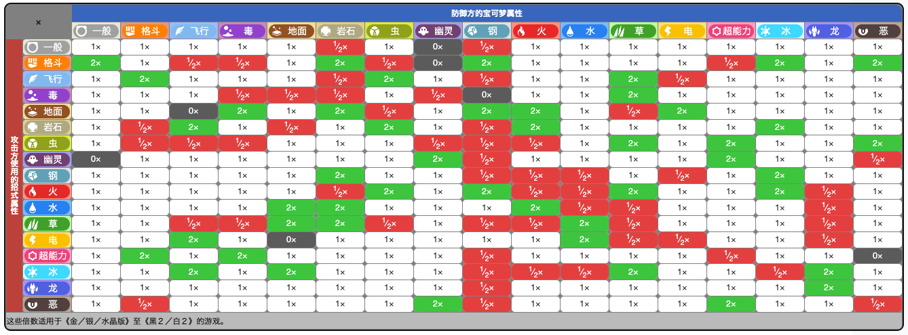

> The é is not silenced.

## 历届世代发售简史

| 世代 | 名称         | 时间 | 平台 |重置 | 个人 |
|:---:|:------------:|:---:|:----:|:-----:|:-----:|:--:|
| 一 |  ✅ 红绿        | 1996|   GB || 3ds |
| 二 | 金银           | 1999 | GBC || nds（重置） |
| 三 | 红宝石 蓝宝石   | 2002 | GBA | 红绿 | 3ds（重置） |
| 四 | 钻石 珍珠       | 2006 | NDS | 金银 | nds |
| 五 | 黑白            | 2010 | NDS | | nds |
| 六 | ✅ XY             | 2013 | 3DS | 红宝石 蓝宝石 | 3ds |
| 七 | 日月            | 2016 | 3DS | | 3ds |
| 八 | 剑盾           | 2019 | NS | 钻石 珍珠 | ns |
| 九 | 朱紫           | 2022 | NS || ns |

## 属性克制

出招的技能属性和挨揍的宝可梦属性

效果绝佳：是2x
效果不好：是0.5x
没有效果：是0x

### 容易理解的部分

1. 💧 水克制 🔥 火，水能灭火
1. 🌿 草克制 💧 水，草能吸收水份
1. 🔥 火克制 🌿 草，能把草烧了
1. ⚡️ 电克制 💧 水，因为水导电
1. 🌏 地克制 ⚡️ 电，因为地可以吸收电
1. 🔥 火克制 🧊 冰，火能让冰融化
1. 🌏 地克制 🔥 火，土能灭火
1. 🥊 武克制 🪨 硬属性（普通，岩石，刚，冰）
1. 🐦 鸟克制 🐛  虫 🌿 草，捕食关系
1. 🐛  虫克制 🌿 草，捕食关系
1. 🐦 鸟克制 🥊  武，因为格斗打不到
1. 🌿 草克制 🌏 地，能够吸收地面营养