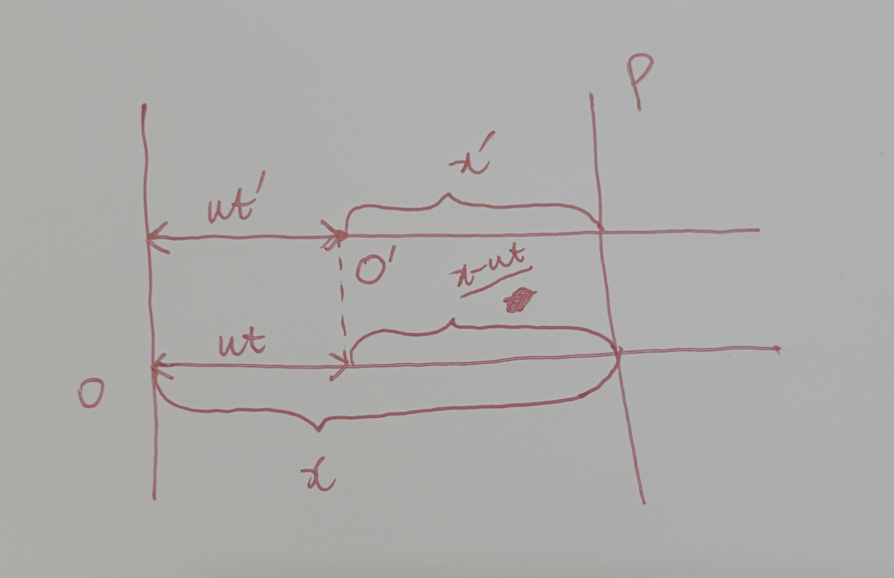

## 设定

$S$ 是静止的参考系，$S'$ 是相对于 $S$ 匀速 $u$ 在 $x$ 轴方向运动的参考系

$$
\beta = \dfrac{u}{c}
$$

$$
\gamma = \dfrac{1}{\sqrt{1 - u^2 / c^2}}
$$

## 洛伦兹变换

1. 一个事件 $P$ 发生了
1. $S'$ 测量一个事件 $P$ 发生在它的 $x'$ 处，也就是 $O'P = x'$。
1. 而在 $S$ 中，$O'P$ 的长度是收缩的，也就是 $O'P = x' / \gamma$。
1. 所以，$x = ut + x' / \gamma$
1. 也就是

$$x' = \gamma (x - ut)$$

1. 同理，在 $S'$ 中，$OP$ 的长度是收缩的，也就是 $OP = x / \gamma$。
1. 所以，$x' = x/\gamma - ut'$
1. 消去 $x'$，得到，$\gamma x - \gamma ut = x/ \gamma - ut' $
1. $t' = ( x/ \gamma - \gamma x + \gamma ut)/u$
1. $t' = \gamma (x /\gamma^2 - x + ut)/u$
1. $t' = \gamma (t - 1/u \cdot ( 1 - 1/\gamma^2) \cdot x)$
1. 也就是

$$t' = \gamma (t - \dfrac{u}{c^2}x)$$

