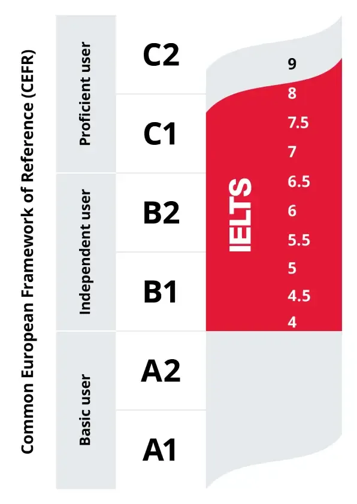
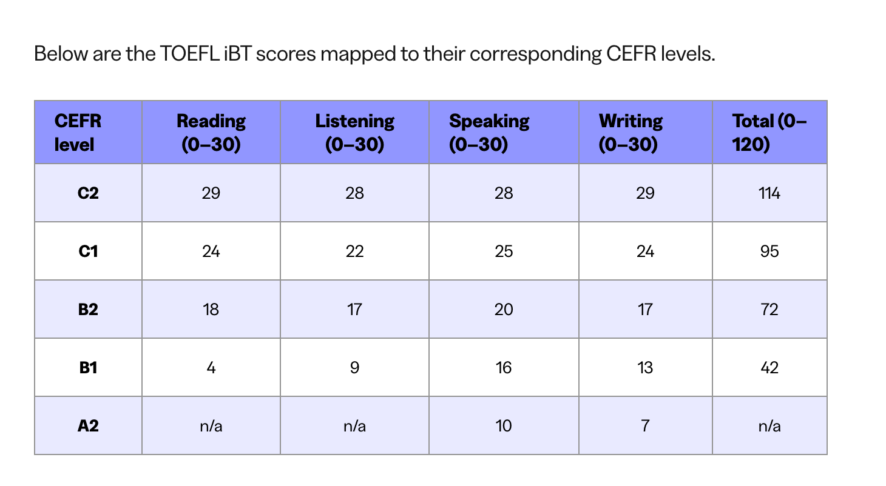
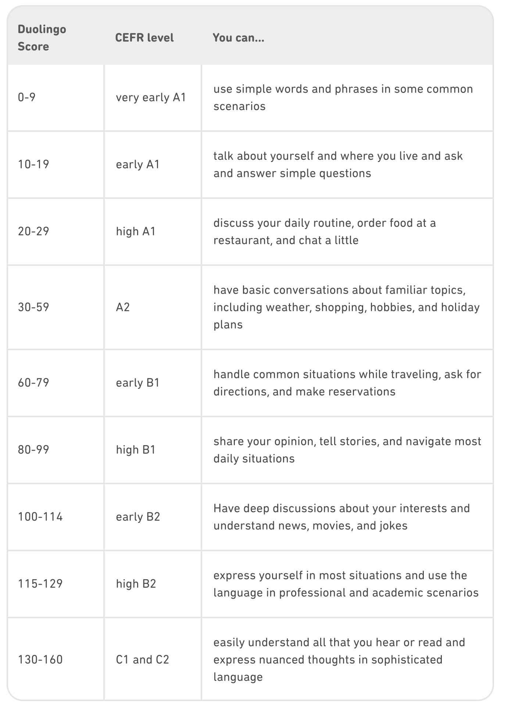
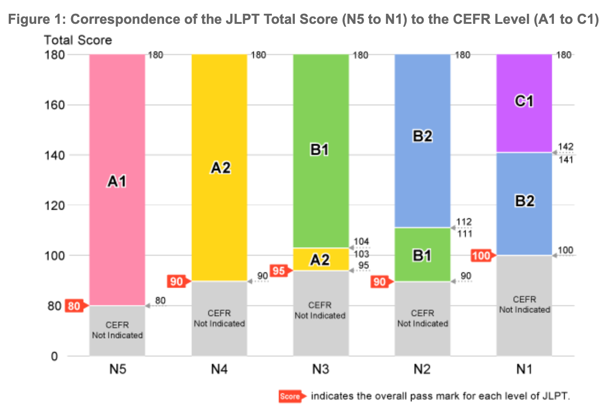
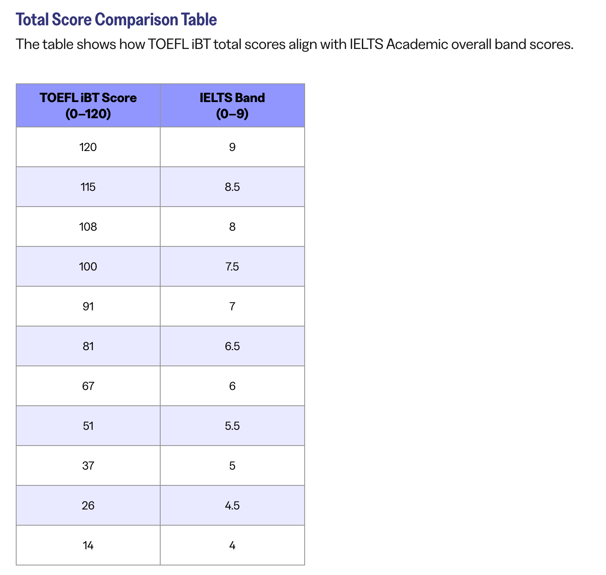

| CEFR        |   IELTS    |   TOEFL  |  duo (sections)       | JLPT         |CSE         | Vocab (15m/w) | Cost(total, 15m/d, 10h/w, 50h/w) | Percentile/Rarity |
|:------------|:-----------|:---------|:-----------|:-------------|:-----------|:-------|:---------|:---------|
| A1          |             |          |0-10 (1)   |                |            | 300    | 80h | <0.1%|
| A1          |             |          |10-20 (2)    |               |            | 600    | 150h | <0.1%|
| A1          |             |          |20-30 (3)    | N5 (初上)     |            | 900    | 200h, 7m, 1.5m, 1w | <0.1%|
| A2          |             |          |30-55 (4)   | N4（初下）     | 中考 高分   | 1600   | 400h, 14m, 2.5m, 2w | 0.1%	/ 740|
| B1          |   4.0        | 14-25    |55-65 (4)   | N3 (中上)     | 高考 120   | 3500   | 850h, 2.5y, 5m, 1m| 1% / 101 |
| B1+         |   4.5       | 26-26    |65-80 (5)     | N2 (中下)    | 过四级      | 4000   |  | 10% / 10 |
| B1+         |   5.0         | 37-41    |80-90 (6)      | N2 (中下)    | 四级 500 分    | 4500  | | 25% / 4 |
| B2          |   5.5       | 42-59    |95-100 (6)  | N2 (>112)    | 过五级      | 5000   | 1300h, 3y, 6m, 1.5m| 50% / 2 |
| B2+         |   6.0         | 60-78    |105-110 (7)      | N1 (高)    | 过六级      | 6000  | | 75%	/ 4 |
| B2+         |   6.5       | 79-93    |120-125 (8)    | N1 (<142)    | 雅思 IELTS        | 7000   |95% / 20 |
| C1          |   7.0         | 94-101   |130-135   | N1 (>142)    | 托福 TOEFL        | 8000  | 2000h, 5y, 1y, 3m| 98% / 43 |
| C1+         |   7.5       | 102-109  |140-145     |              | 过七级       | 10000 | | 99.9% / 740 |
| C2          |   8.0         | 110-117  |150-155     |              | GRE (过八级) | 12000 | 3000h, 8y, 1.5y, 6m | >99.9% |

* 15 mins per word learning rate, 3.5 leximes per word, each lexime cost about 4 minutes.
* Cost: total, 15 mins per day or 2 hours per week, 10 hours per week, 50 hours per week

-----

1. 新手 🔰 普通, top 90%
1. 业余 🥉 青铜, top 75%
1. 专业 🥈 白银, top 50%
1. 专家 🏆 黄金, top 25%
1. 大师 💎 钻石, top 10%
1. 宗师 👑 皇冠, top 1%
1. 传奇 🦄 传奇, top 0.1%

1. [JLPT](https://www.jlpt.jp/e/about/cefr_reference.html)
1. [TOEFL](https://www.ets.org/toefl/institutions/ibt/compare-scores.html)
1. [Duolingo](https://blog.duolingo.com/duolingo-score/)
1. [IELTS](https://www.ets.org/toefl/institutions/ibt/compare-scores.html)
1. [CSE](https://www.britishcouncil.cn/exams/cse/results)