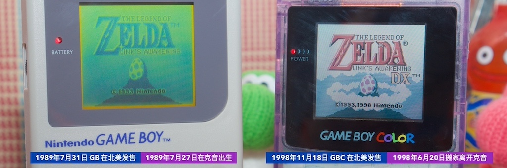

## 大事记

| 年龄                      | 居住地       | 特殊事件                 |
|---------------------------|------------|--------------------------|
|至1989年11月，一百天整      |  克音草房家  |  听懂指令，长时专注玩具  |
|至1990年03月，七个月整      |  克音草房家  |  会走前说话，通过电视声音，给父亲预报节目 |
|至1990年07月，一周岁整      |  九井大姨家  |            |
|至1990年09月，一周岁二      |  克音草房家  | 尹胖学习，认字    |
|至1992年02月，两周岁半      |  九井大姨家  |                            |
|至1992年07月，三周岁整      | 克音大舅家   | 看电视报，下象棋，暑期老妈送龙哥 |
|至1993年01月，三周岁半      | 克音大舅家   |  王天飞，幼儿画报             |
|至1993年07月，四周岁整      | 克音大舅家   |  一起学写字，《脑筋急转弯》10分钟背下来   |
|至1994年01月，四周岁半      | 津河奶奶家   |   村里老人去世，存在危机        |
|至1994年07月，五周岁整      | 克音托管班   |                            |
|至1995年07月，六周岁整      | 克音幼儿班   |                            |
|至1996年07月，七周岁整      | 克音一年级   | 自学，提前做题，650人全乡第一，三年 |

## 1989年，零周岁

#### 1988-11-20 爸妈结婚

爸妈结婚那天（在津河）下了小雪，当天是有拍照的，但是相片没有洗出来。婚后249天，我就出生了。

结婚后去的董志良（40几岁就去世了）家租的房子，过了年，就回到我出生的草房居住，那个草房的价格是2000块，借钱买的。

草房里，有一个青蓝色的家具，是我爷爷的弟弟自己做的家具，家具中间有一个洞，放进去了一个 飞跃牌黑白电视机（9寸），草房

#### 1989-07-27 出生

晚上十点左右（我父亲说我是下午五点左右）在草房出生，零周岁时在克音草房居住，没有印象。

我爸和我奶潜意识里，都对我的出生有所期待，我父亲在我出生前几天，梦到了草房里有一个小龙飞出去。而我奶梦见路上遇到两个受伤小蛇，本来要去救，突然两个蛇飞起来了，而后从远处水中出来一个大黄龙飞上了天。

#### 1989-11-05 百日照，三个月

我在这时候能够听懂我父母的指令，比如让我安心玩扑克，玩积木等，我母亲可以睡一觉，我就可以安静的在炕上自己玩。

我那时候有类似上图（Nano Banana 生成的）的写字的红色积木，也有一些识字的卡片，上面画了诸如西瓜和香蕉的图像，下面写着汉字，我就开始学字了。

> 1989年7月到1992年2月，两周岁半前在草房居住

我不会走的时候，就会说话了，

我爸说那时候，会说话了，就能够通过看电视听声音，播报节目，然后告诉我父亲今天有什么节目，我就可以告诉我爸，而不用我父亲看电视报。

## 1990年3月前，8个月，

可以清晰说话，而且说话就已经认识很多字了，就能够通过看电视听声音，播报节目，然后告诉我父亲今天有什么节目，我就可以告诉我爸，而不用我父亲看电视报

## 1990年7月中旬到9月初，整一周岁

我家邻居有一个叫做 尹胖的小孩，大概那时候上幼儿班或者一年级，他坐在一个长凳上，教我写字，我给他打了，说他是什么破老师，给他揍了。

## 1990年3月至1992年2月末，在大姨家约两年

1990年3月份，就去了九井大姨家（骑自行车半个多小时，我家那时候买了一辆飞鸽牌自行车），暑期又回家，1990年8月，一周岁生日过后，又去居住一年多，大姨和大姨夫照顾我，扛着扁担夹着我去井里打水，清晨在被窝里吃豆制品，吃两毛钱的冰棍，当时大姨家是土房，没有盖砖房，应该是在1995年左右盖的砖房。这期间的记忆，是我人生最早的记忆。

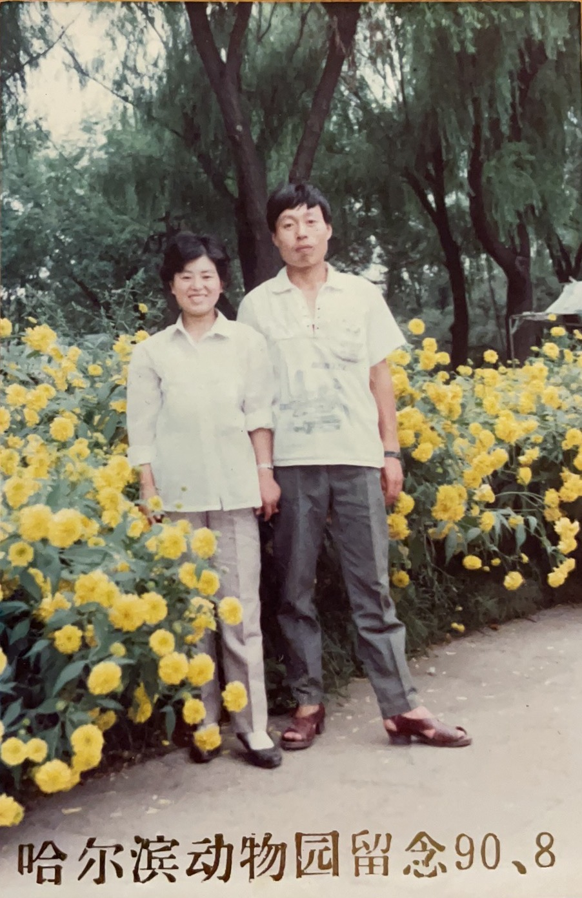

爸妈在1990年8月在哈尔滨的合影，二人去哈市买织布机。

## 1991年，两周岁

1992年寒假开始，从大姨家回来，在草房居住，对草房的印象比较多，草房是一个拉门，王天飞叔叔陪我看[《幼儿画报》](https://book.kongfz.com/234114/4347346021/)，至今仍能记得《幼儿画报》上的很多故事。邻居是李旭楠爷爷（约1938年出生，现居齐齐哈尔市）家，经常去李爷家里玩，李爷这个时候教我玩象棋，我那时候能走好几步，也对他家的池塘有印象。

 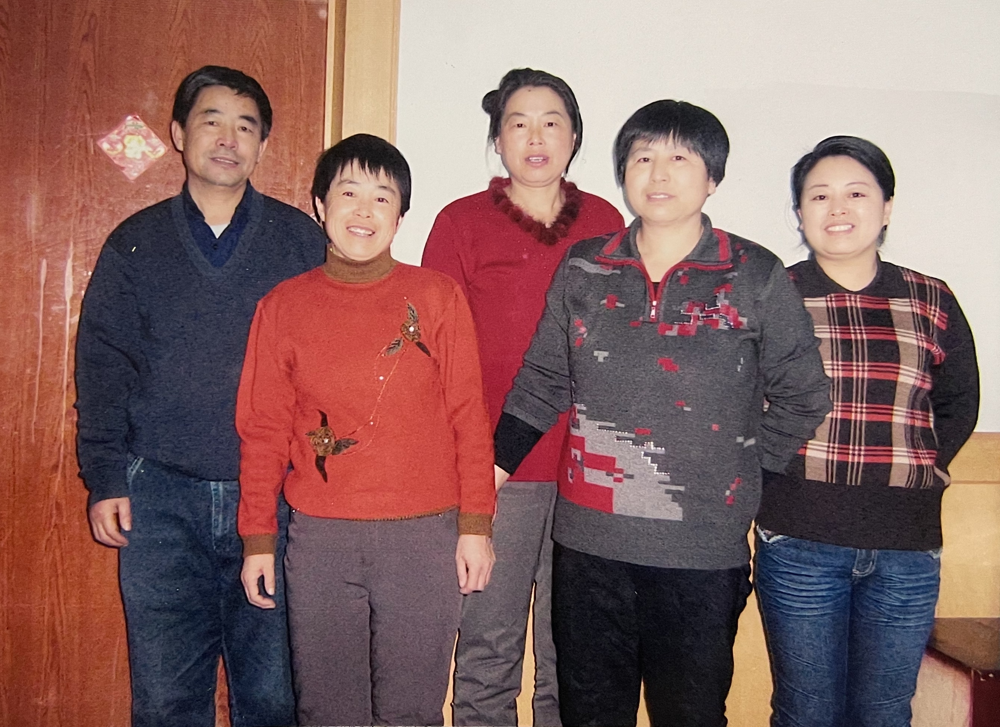

大舅（1948年）大姨（1953年）三姨（1962年）二姨（1958年）老妈

姥爷（1920年 - 2008年7月），共有子一人，女四人。姥姥（1928年-1968年）在四十岁时去世。

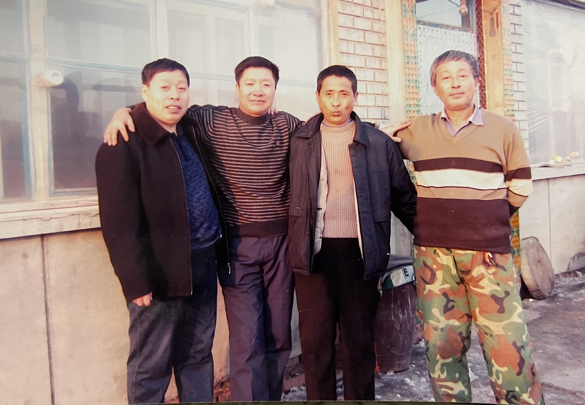

老爸，二姨夫（约1952年），大姨夫（1954年 - 2021年4月2日），三姨夫（约1962年）

## 1992年，三周岁

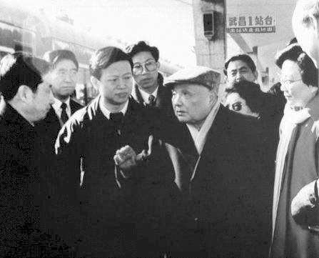

1992年2月29日，从草房搬家到砖房，第一次去砖房，是三姨夫赶毛驴车把我送回家的，现在的砖房仍有人居住，是当时的邻居张家。这一年有[奥运会](https://www.bilibili.com/video/BV1pk4y1k7XK/)，和老爸一起看电视，对爸爸讲越位的概念比较深刻。

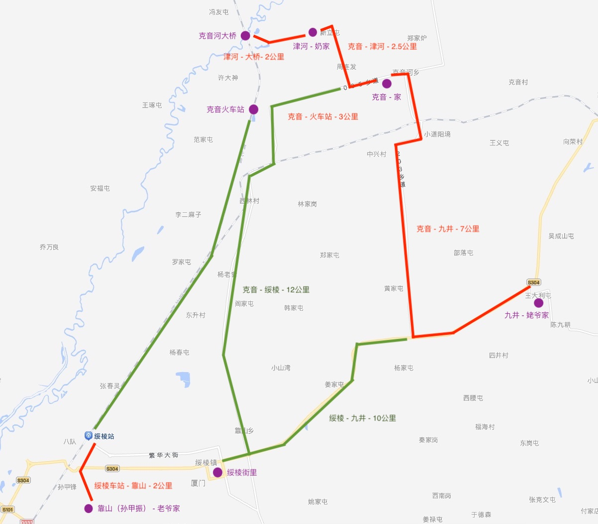

#### 1992-05-19 克音卫生院

大堂舅拍摄的，荣誉证书也是大舅的。

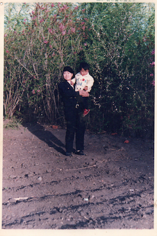

时年，母亲 27周岁。

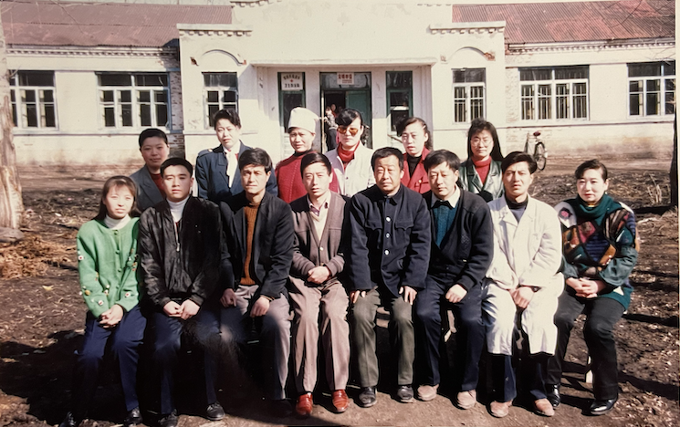

应该是当天（1992-05-19）的合影，合影原因应该是欢送老妈的某位同事。

老妈在自己的办公室内留影，桌面上是[1992年第7期《妇女之友》杂志](https://book.kongfz.com/12498/733399229/)。

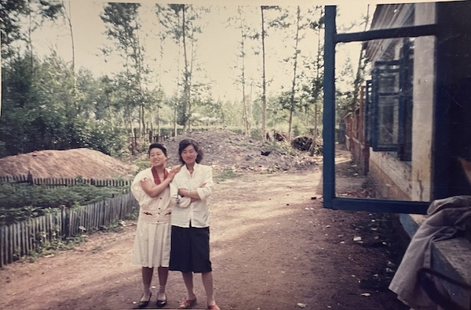
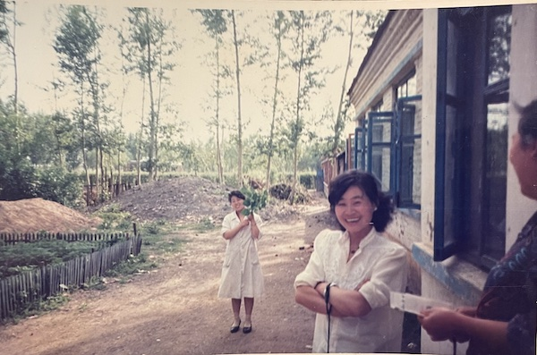

老妈在医院外留影，旁边是宁姨

二姨一家在1992年初移居大庆，但是二姨家表哥（1977年）半年后才去，1992年暑期，老妈送表哥去大庆，并在大庆留影。

1992年下半年，爸妈上班，我被送到大堂舅家。

老妈在大堂舅家门前，当日是大堂舅家表哥结婚，大嫂是老妈同事（小学同学的妈妈，上面合影的后排右二）的妹妹

## 1993年，四周岁

1993年秋季学期，在津河（步行约40分钟）待了半年，被奶奶（1932年2月23日-2009年1月1日）照顾了半年，这期间有两件印象特别深刻的事情，一是老叔 （1973年）买了一个新的拖拉机，我兴奋的没有吃饭去玩，二是村里有一个老人去世了，我问奶奶“你什么时候去世”，后来爸爸知道了，给我训了一顿。那时候，我爸爸给我买了很多小玩具，比如，上劲的青蛙和小车。老叔在自己的房间里唱[《九百九十九朵玫瑰》](https://www.bilibili.com/video/BV1XU4y1F7Dp/)，这时候电视播出《京城四少》，家人经常让我唱主题曲[《潇洒走一回》](https://www.bilibili.com/video/BV15x411v72d/)。

1993年寒假，因为老叔要结婚，奶奶的房子要给老叔结婚用，就从津河回来，开始在苗老师的幼儿班被托管。这期间，看了动画片[《战神金刚》](https://www.bilibili.com/video/BV1fW411876m/)，是第一部有印象的动画片，“我来组成头部”，以及[《蓝皮鼠和大脸猫》](https://www.bilibili.com/video/BV1Kx411M7ei/)，还有电视剧《新白娘子传奇》[《青青河边草》](https://www.bilibili.com/video/BV1sE41127AD/)。《辛德勒的名单》和《侏罗纪公园》是在这年上映的电影。

这个时候，我就经常去我父亲的中学（我父亲95年就不做老师了）去一边上课，我那时候会去和老爸去学校学习，一个很重要的

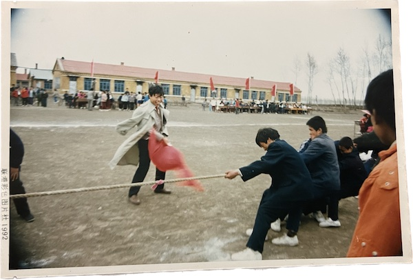

老爸在克音中学的运动会上

邢叔叔和老爸在克音中学门前

## 1994年，五周岁

#### 1994-04-10 老叔婚礼

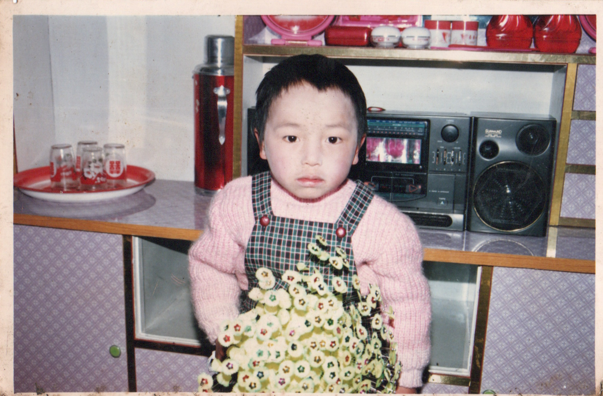

当天，和堂兄弟姐妹打闹，鞋踩进了泥滩，被妈妈训斥。

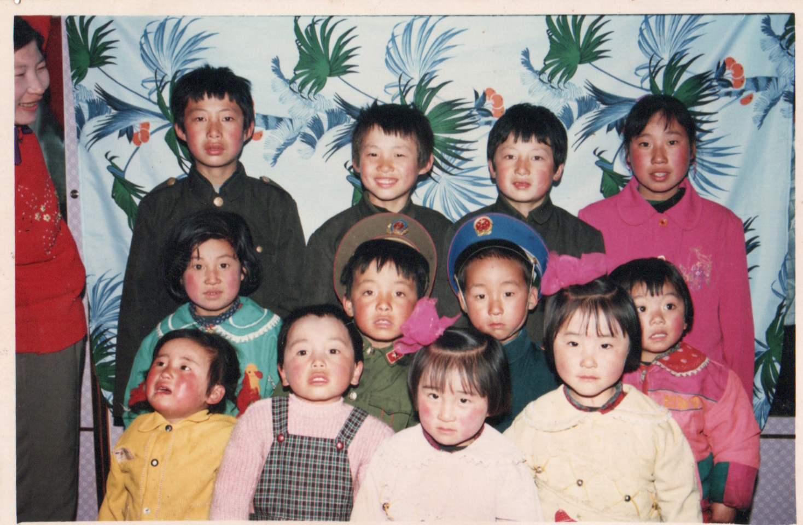

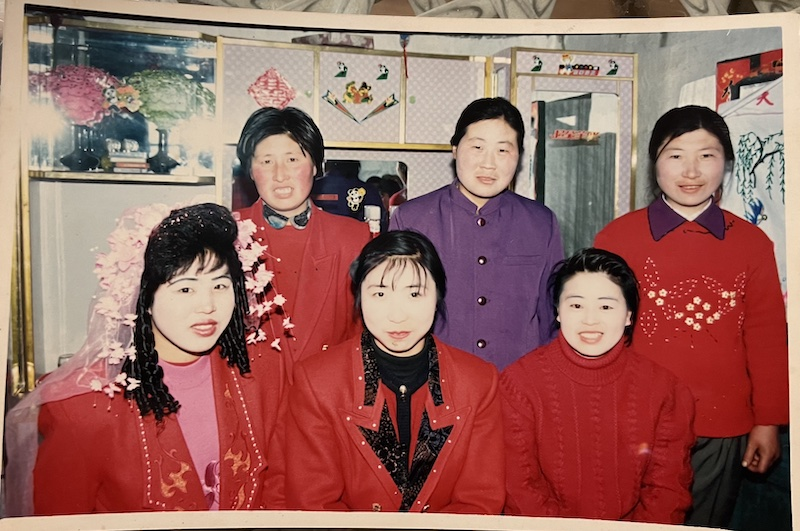

1994年秋，开始在克音小学上幼儿班，这时候对电视剧以及动画片有清晰的印象，这一年7月23日《动画城》开播，[《三国演义》](https://www.bilibili.com/video/BV1vy4y1a7da/)10月23日在央视开播，[《年轮》](https://www.bilibili.com/video/BV1aB4y1N7En/) 播出，[印象极为深刻](https://www.bilibili.com/video/BV1zB4y1n7U9/)。《包青天》应该也是这一年看的。[《东方小故事》](https://www.bilibili.com/video/BV1cw411k7K3/)《魔方大厦》是在这年看的动画片。

## 1995年，六周岁

1995年2月1日，去奶家（63岁）过年，路上和我爸抱怨《三国演义》可真长（1995年2月20日最后一集），当年春晚的《牛大叔“提干”》《今儿个高兴》《如此包装》印象深刻。

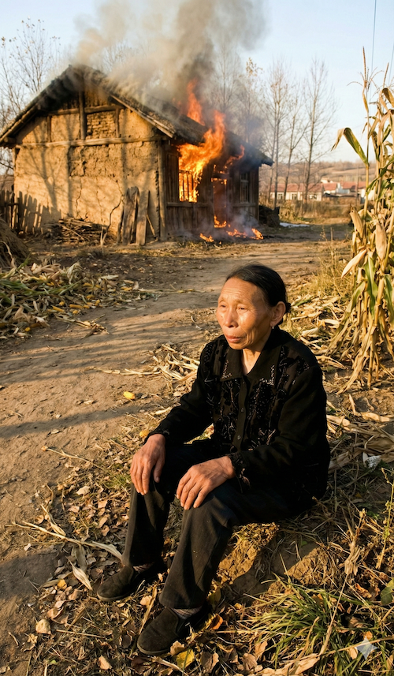

1995年上半年，老叔的房子因为电饭锅原因失火，当时正在幼儿园上课，被父母接走去津河。

1995年，爸爸给我买了两个地图，一个世界地图，一个中国地图，当做生日礼物，我经常站在桌子上看这两个地图。

1995年的动画片和影视剧记忆很多，《大风车》《海尔兄弟》《大头儿子小头爸爸》《旋风小子》《十二生肖》《太阳之子》，那时候，我爸妈总说动画片是给小孩子看的，他们大人要聊天才是正事，所以不让我看电视，我就说我长大了也会很爱看电视，一语成谶，仅今年（2023年）就看了《蜘蛛侠》《马力欧》《进击的巨人》等一系列动画片。

1995年9月，开始在克音小学上小学，苗老师说我年龄小，让我再读一年幼儿班，即使我两门课数学和语文都是满分，后来还是在6周岁的时候上了小学。

那年，克音卫生院有一个因吃了死牛肉而感染炭疽病去世的病人，当时医院的压抑气氛，至今印象深刻。

## 1996年，七周岁

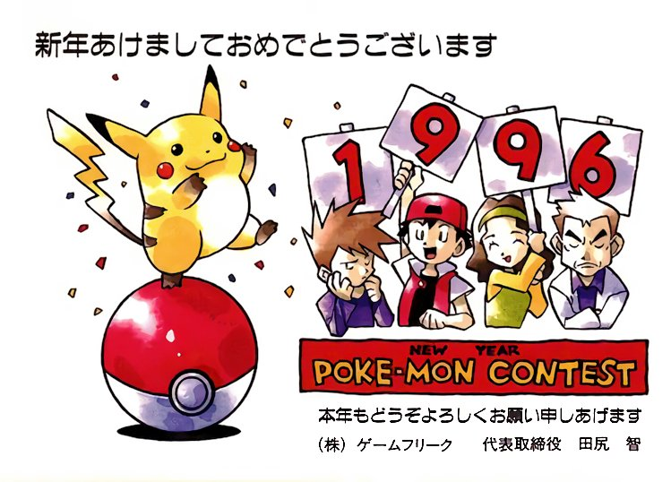

#### 1996-05-26 民哥结婚

1996年，大姨家大哥（1976年）结婚。

三姨家表哥（1984年），我自己，大姨家表哥

大嫂 和 大哥

#### 1996-08-09 农历生日

时年，父亲和母亲同为 31周岁。生日当天是和新班主任老师一家去的，爸爸送给我一本[《现代汉语词典》](https://book.kongfz.com/372534/1661760128/)作为生日礼物。身后的是克音河大桥，以及日本占领期间建造的炮楼（现已经被拆除），小时候经常走火车大桥，爬炮楼，去大桥就和《Stand by me》里探险的感觉很相似。

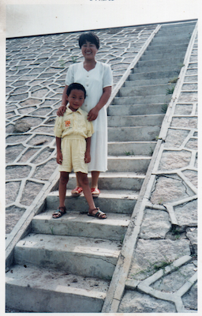

大桥的台阶，以前和堂兄们去放牛，经常坐在这个台阶上。

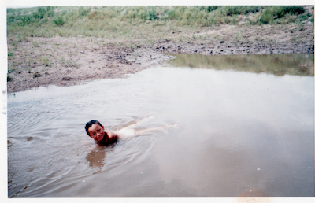

大桥附近的小水池，下面就是泥水，以前经常有小孩在大桥附近溺亡，和我同岁的堂兄有一次也险些溺亡。

家门口的小花坛，后面是砖房家。

在砖房家内部，1996年的照片很多，那年还买了一个相册，上面有1996年的日历，也就是上面照片右上角的那个大册子。

那年的记忆有《大草原上的小老鼠》《四驱兄弟》《白眉大侠》《黑猫警长》《宰相刘罗锅》《娃哈哈 AD 钙奶》《小虎队旋风卡》《摇太阳》《精武门》。

娃哈哈之前是一个玻璃瓶装的，那年变成了塑料瓶，我妈管之前叫做一代，这个叫做二代。

冬天的时候，去陈同学家里玩，把书包弄丢，被狗咬走了，后来只拿回来一本《现代汉语词典》的残缺本。

#### 1996年暑假，阁山水库

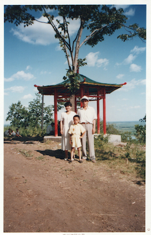

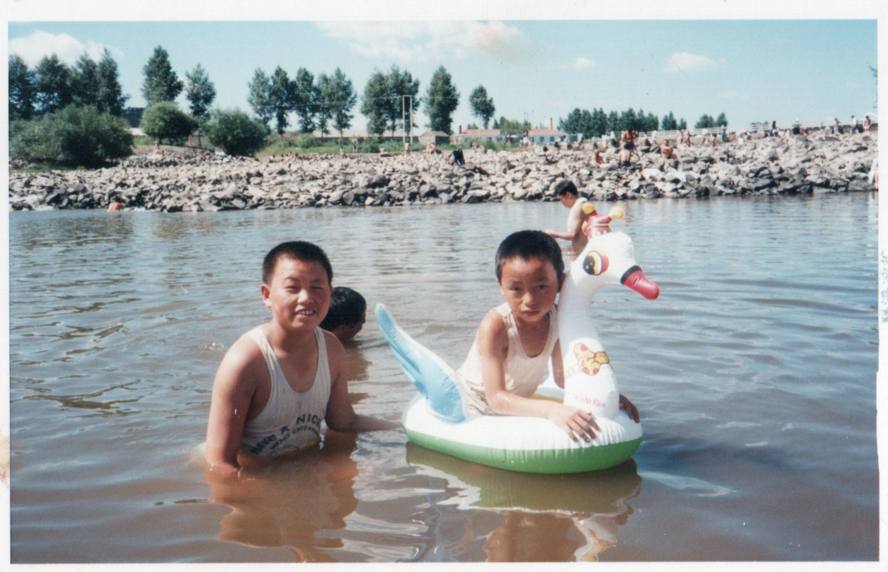

## 1997年，八周岁

#### 1997年，六一儿童节

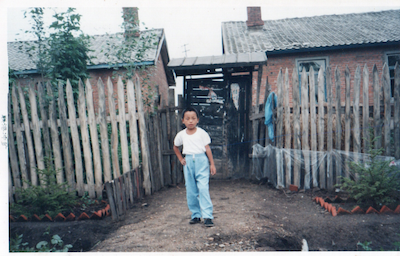

在砖房家门口，右侧即砖房家，左侧是邻居家

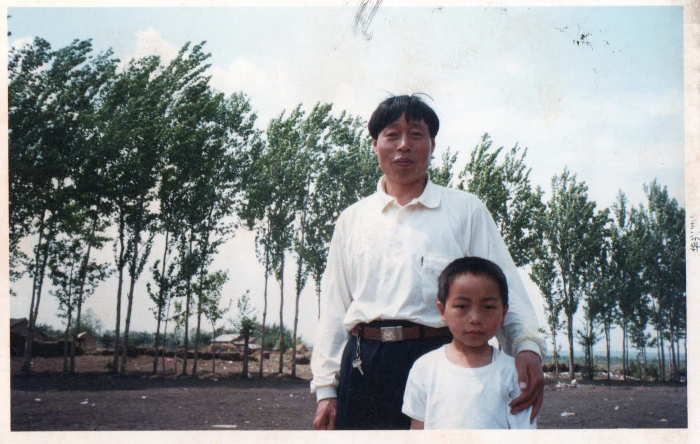

六一儿童节表演结束后，和老爸在小学校园内

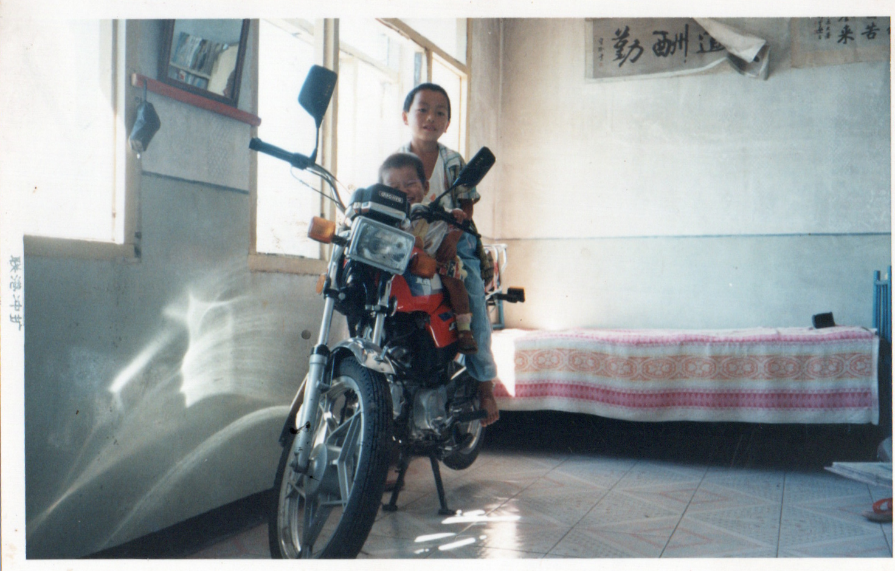

最后一张不确定是否是六一当天

#### 1997年秋，照相馆拍照

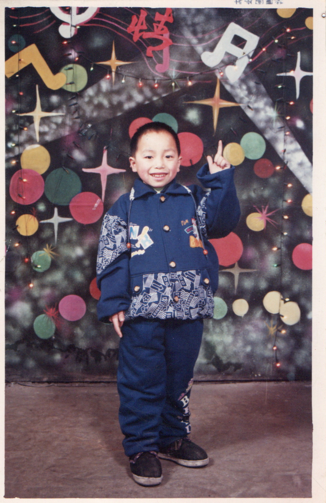

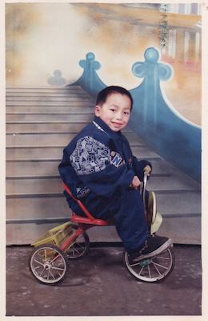

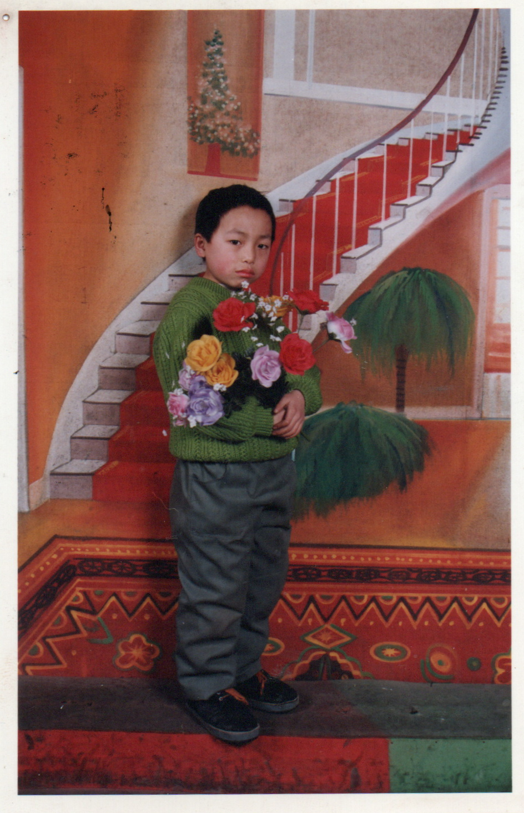

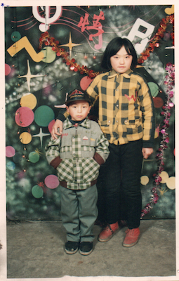

那年老妈要拍艺术照，应该是相馆赠送了几个拍照机会，就去拍了，其中有一张拍照时闭眼了，相馆让我去重新照一张，就和邻居家的姐姐（约1984年 - [2016年5月24日](https://archive.md/5ATlf)） 一起去的。

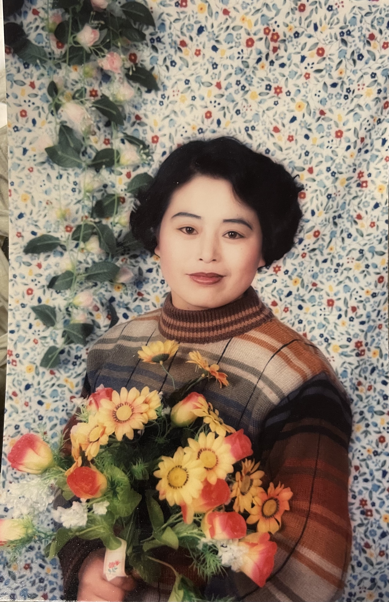

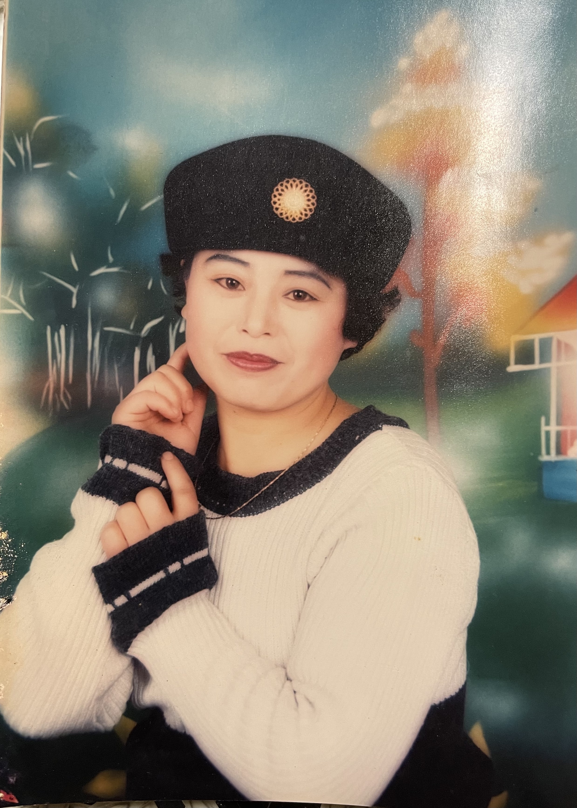

老妈当时（32周岁）的两张艺术照。

1997年，记得《快乐家家车》《红高粱模特队》，过年期间，和邻居家姐姐去唐姨家玩，看的《正大综艺》，玩的跳棋。那年奶奶过生日，和爸爸去的靠山，在火车站给我买了一本[《聪明的一休》](https://book.kongfz.com/21570/4796660593/) [Archived Link](https://archive.is/uEw4Z)（新疆青少年出版社，1996年12月第1版），爱不释手。

1997年，爸爸去县里买TCL电视，又超出预期的买了一个VCD，现在还记得那个碟子里的音乐有：《故事里的事》《梦驼铃》《健康歌》《大花轿》《走四方》《在那桃花盛开的地方》《霸王别姬》《冰糖葫芦》《潮湿的心》《十五的月亮》《无言的寻求》《我的眼里只有你》《三百六十五个祝福》

## 1998年，九周岁

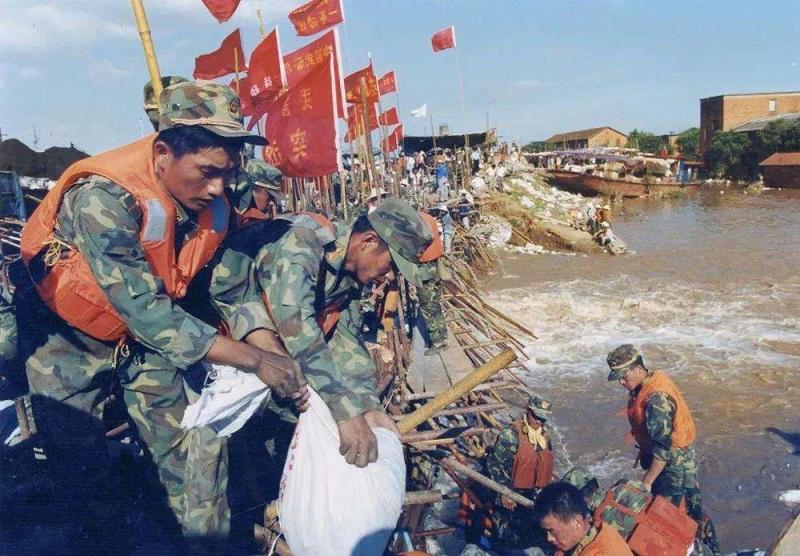

1998年1月8日，《水浒传》首播，现在还记得趴在小窗上看水浒的情景，同年还有《时间飞船》《玩具之家》《小糊涂神》。1998年，还是印象深刻的世界杯，第一次喝可乐，收集《小虎队球星卡》。

#### 1998年6月20日 搬家去绥棱

当天，绥棱县[卖彩票](https://youtu.be/2zJtqBvvE4o?t=129)，老爷家的老叔抽到电饭锅，那天是雨天。