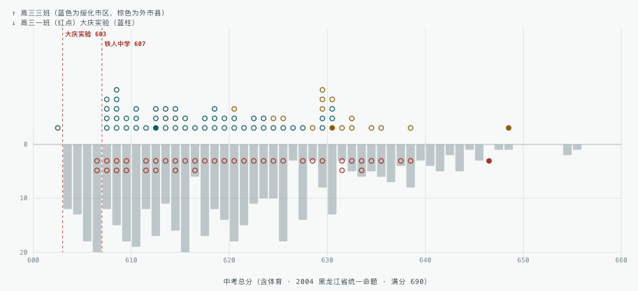
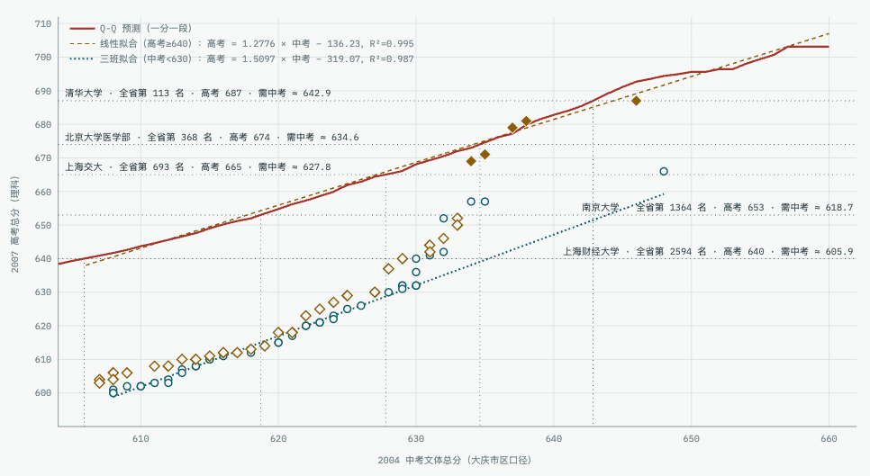
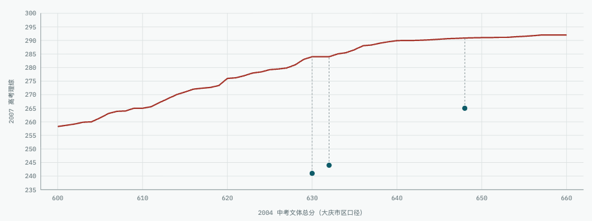

今天是绥化一中建校 $80$ 周年的日子，而在 $60$ 周年校庆时，我正好是高三。

在2007年高考，我在绥化一中的同班同学考得特别不理想，平时成绩靠前的同学比预期低了 $20$ 多分，我一直困惑至今，经过大量的数据收集和分析，我觉得自己破解了这个谜题，简而言之：

1. 2007年高考，发生了破天荒的重大高考命题事故，作为新课标命题的元年，命题组把大纲版教材拿错而出现了大量超纲题，整体难度负偏严重、过分简单，且在关键压轴题有错题，这是最直接原因
1. 虽然高考发生命题灾难，但高考前夕，哈尔滨、大庆、佳木斯、齐齐哈尔和鹤岗等城市的老师，甚至同在绥化一中的高一一班以及我的家乡绥棱的老师都通过某种途径提前得到了风向，高三三班是稀有的、没有得到这个考前信息的高分段（全省前 $2\%$）受灾群体
1. 三班的中考生源并不逊色于绥化一中的一班，之所以不能像一班一样有高考考前情报，是因为在2004年高一分班时，学校为了金钱利益，增设外语加强班，导致三班的物理、数学老师水平有限

接下来，我将展开分析。

## 各地中考成绩

2004年中考，那时候除了哈尔滨，全省共用一张考卷，[满分是 $690$ 分，其中体育 $30$ 分](https://web.archive.org/web/20040830183238/http://202.97.254.98/sub1/newshow.php?id=2261)。

绥化一中在2004年的录取分数线是 $571$ 分。大庆铁人中学的录取分数线 $607$ 分，哈三中宏志班 $605$ 分，大庆实验中学 $603$ 分，大庆一中 $583$ 分。

绥化市区第二是 $646$ 分，被绥化一中一班录取。肇东市最高分是 $651$ 分。绥棱县最高分是 $660$ 多分，我是绥棱县第三，$648$ 分，绥棱第十三 $630$ 分，均被绥化一中三班录取。

大庆市前十名为 $663$分（一中）、$657$分（铁人）、$656$分（一中）、$655$分（实验）、$654$分（实验）、$654$分（实验）、$652$分（一中）、$650$分（铁人）、$649$分（铁人）和 $648$分（一中、实验）。

[佳木斯市](https://web.archive.org/web/20041204204625/http://www.sanzhong.net:80/liujun/shownews.asp?newsid=20) 中考最高分是佳木斯三中的 $659.5$ 分，佳木斯三中全校前十为 $655$ 分、未知、$647.5$ 分、$640.5$ 分、$632$ 分、$631$ 分、$631$ 分、$630.5$ 分和 $630$ 分。

更为具体的分布，对应2007年高考成绩是按照大庆市区口径：

1. $600$ 分以上大庆市区约 $1607$ 人，绥化市区 $165$ 人
1. $610$ 分以上大庆市区 $856$ 人，绥化市区约 $86$ 人
1. $620$ 分以上大庆市区 $479$ 人，绥化市区约 $42$ 人，约对应高考 $655$ 分以上
1. $625$ 分以上大庆市区 $328$ 人，绥化市区约 $30$ 人，约对应高考 $660$ 分以上
1. $630$ 分以上大庆市区 $219$ 人，绥化市区约 $19$ 人，约对应高考 $665$ 分以上
1. $635$ 分以上大庆市区 $129$ 人，绥化市区约 $8$ 人，约对应高考 $675$ 分以上
1. $640$ 分以上大庆市区 $60$ 人，绥化市区约 $4$ 人，约对应高考 $680$ 分以上
1. $645$ 分以上大庆市区 $26$ 人，绥化市区约 $2$ 人，约对应高考 $690$ 分以上

## 三班的中考成绩

2004年，绥化一中计划招收外市县 $50$ 人，外市县中考前 $30$ 名可以报名参加考试，这些外市县最后来绥化一中报道的有约 $20$ 人，望奎县 $8$ 人，绥棱县 $4$ 人，安达、海伦、青冈各 $1$ 人，来自黑河、大兴安岭的有 $5$ 人。

一班、三班的具体中考分数，我上学的时候从没问过同学们，现在去问，多数也都记不清了，但可以通过已知的大庆市区中考分数大致推测分布。

[根据对大庆中考数据的拟合](https://web.archive.org/web/20040714041728/http://202.97.254.98:80/)，我推测绥化市区 $4923$ 名的考生中，在 $571$ 分至 $628$ 分之间的考生人数分布大致符合 $N(533.5, 36.3^2)$，$629$ 分及以上的分数大致符合 $N(579, 19^2) $，推测外市县的分数分布差不多也符合这个分布，但是参加中考的总人数大约在 $3000$ 人到 $3500$ 人之间。

如果假设绥化市区仅第一名 $650$ 分、第三名 $642$ 分、第四名 $640$ 分、第七名 $636$ 分、第十名 $634$ 分和第十三名 $632$ 分生源流失，高一时，按被录取的绥化市区中考排名，前 $10$ 名分配给一班，外市县的分给二班、三班各 $10$ 人，接下来按中考排名接下来的 $100$ 名，在一班、二班、三班交叉分配，其中，一班 $30$ 人，二班 $30$ 人，三班 $40$ 人。

高二时，因文理分班，高一二班中有 $25$ 人（其中外市县 $7$ 人）因为学理并给了三班，二班和三班合并后有 $65$ 人（其中外市县 $16$ 人）。这里假设高二时，原一班的学生没有变动。

<figure>
  
  <figcaption>绥化一中高三三班2004年中考分数分布并与同届大庆实验中学中考分数分布对比（推测）</figcaption>
</figure>

据上述假设，我推测三年三班 $66$ 名同学的中考分布大致符合上图（蓝色为市区，棕色为外市县）所示，在和大庆实验全校（浅蓝色柱状）的对比中，可以看到在中考时，和一班相比（红色），因为外市县的学生中考成绩偏高，三班的生源和一班在高分段是旗鼓相当的。具体的：

1. $645$ 分以上一班约 $1$ 人，三班约 $1$ 人，约对应高考 $690$ 分以上
1. $630$ 分以上一班约 $10$ 人，三班约 $11$ 人，约对应高考 $665$ 分以上
1. $620$ 分以上一班约 $19$ 人，三班约 $30$ 人，约对应高考 $655$ 分以上
1. $610$ 分以上一班约 $32$ 人，三班约 $55$ 人，我在大学时的专业，其录取分数线是 $647$ 分，其中两位黑龙江同学，其中一位中考 $607$ 分，高考时 $650$ 分，另一位中考 $610$ 分，高考 $649$ 分

## 三班高考成绩

因为我只能推测三班的中考分数分布，而不知道具体每个人的中考分数，我大致知道每个同学的高考成绩，所以接下来我们将对其进行分位数对应法分析，画出分位数-分位数图 (以下简称 Q-Q 图)。因为大庆的数据最为丰富，这里我们把中考成绩在大庆市区的排名和高考成绩在黑龙江省的排名进行对应，从而用中考成绩来预测高考成绩。但因为大庆的教育水平显著高于全省除了哈尔滨的其他区域，大庆考生约占全省考生的 $10\%$，但在高分段却占了约 $30\%$ ，所以这里用中考预测的高考成绩要比实际低一些。

<figure>
  
  <figcaption>绥化一中高三三班（蓝色）和高一一班（棕色）2004年中考和2007年高考分位数-分位数图</figcaption>
</figure>

根据上图可以发现，对于棕色的高一一班，我只确定前五名的高考成绩，但从录取的院校来推测，一班的前五名要比班里其他的同学表现的更好，基本达到了在大庆同分层的预测。具体的：

- 一班中考第一为 $646$ 分，基于大庆预测 $693$ 分，高考第一为 $687$ 分，差了 $6$ 分
- 一班中考第二约 $638$ 分，基于大庆预测 $680$ 分，高考第二为 $681$ 分，多了 $1$ 分
- 一班中考第三约 $637$ 分，基于大庆预测 $677$ 分，高考第三为 $679$ 分，多了 $2$ 分
- 一班中考第四约 $635$ 分，基于大庆预测 $675$ 分，高考第四约 $671$ 分，差了 $4$ 分
- 一班中考第五约 $634$ 分，基于大庆预测 $673$ 分，高考第五约 $669$ 分，差了 $4$ 分

而三班的前五名虽然要比班里其他的同学表现的更好，他们与预测的成绩相差甚远：

- 三班中考第一为 $648$ 分，基于大庆预测 $694$ 分，高考第一为 $666$ 分，差了 $28$ 分
- 三班中考第二约 $635$ 分，基于大庆预测 $675$ 分，高考第二为 $657$ 分，差了 $18$ 分
- 三班中考第三约 $634$ 分，基于大庆预测 $673$ 分，高考第三为 $657$ 分，差了 $16$ 分
- 三班中考第四约 $632$ 分，基于大庆预测 $671$ 分，高考第四约 $652$ 分，差了 $20$ 分
- 三班中考第五约 $632$ 分，基于大庆预测 $670$ 分，高考第五约 $642$ 分，差了 $32$ 分

第五名到第十名，一班与预测大约差距 $20$ 分，而三班要比预测低了约 $30$ 分，十名之后的三班要比预测低约 $40$，一班的表现略好但是也差距很大。

可以看出在绥化，虽然整体的教育水平要跟大庆差距很大，但当教育资源集中倾斜，在绥化一中也可以得到 “大鱼小池塘” 的收益，但为什么三班前十名在高考被超过这么多，那是因为一班和三班有完全不同的两套任课老师，以至于三班在高考考前无法知晓普遍传播的高考命题变故，从而无法即时避险。

## 两套任课老师

一班都是市区的，且有很多学校教师的子女以及校领导的亲属，最好的教学资源都给了一班。但如果时任校长考虑到三班有着很多优质生源，为了出成绩，需要倾斜资源照顾，他一定会给数学、物理这两个关键学科都配置高水平的老师，但因为有收费的外语加强班的出现，导致了令人匪夷所思的教师配置的出现。

<figure>
  
  <figcaption>2004年绥化一中理科奥赛班教师名单</figcaption>
</figure>

因为这个英语加强班的出现，导致同样有着高分中考生的理科奥赛班三班，在数学和物理这两个关键学科上，安排了两个教学水平并不突出的老师，就好像给外语加强班的人看，奥赛班三班也是这个老师。

和其他的一班、三班平均教龄十五年不同，我们的物理老师比较年轻，约 $25$ 岁上下，说话声音较小，对我们缺乏足够题型训练，对学生的提问也缺乏耐心细致的解答。而数学老师常在课上做不上正在讲的难题，我几乎很少向他求助解难题，还在课上常说那些题目是留给清华北大的，就不讲了。高考时，和一班相比，出现大问题就是在物理学科，还有部分的数学问题。

但高考失利是一个复杂因素导致的事件，2007年高考离奇简单又漏洞百出才是致命因素，如果高考不出的那么离谱，三班同学本也可以发挥更好。

## 荒诞无比的高考题

2007年，作为新课标改革参加高考的第一年是极为混乱的一年，我有足够多的证据可以论证，2007年的高考命题组错误的把新课标地区使用教材当成了大纲卷地区正在使用的教材，以致考试卷子中有大量令人迷惑的考题。我按问题的严重程度，逐个说明。

【事实性错误】理科综合物理部分的压轴大题，也就是25题，[是一个明确、反向区分的错题](https://kns.cnki.net/kcms2/article/abstract?v=tBI8TAhqnxQMYOjxwwUTeUwz1TxDKDRlSYx7DCzB2vu5uoYdZk-fdznQgCpPbMht2PIPBphCv2w6VreiKiKtPnLmMsJIBui8_LZR70u6rzOK-N-_kr34ocKxInpEdxtPQdk3urOuU4pa6He2W5ckXfzSteJtRMRZ5fKXOfKumI-sxOuS2-t3kw==&uniplatform=NZKPT&language=CHS)。

【超纲考察】理科综合物理部分的第二道大题，也就是24题，是明显的超纲考察。

这个题目是产生高分差距的关键题目，不仅是 $11$ 分的分数，也有对心态的严重打击，而且这个题目意味着在考生中间出现巨大的不公平，对于有竞赛基础或者练习过这个题型的学生可以用两分钟就做答，而对于没有得到训练的学生，看到 “弹性正碰” 四个字都是极为陌生和发慌的，我们物理老师考前明确告诉我们这个知识点不考，而且在高三所接触到的模拟题、练习册中，因为这是超纲知识，考生就算自学也很难接触到这个知识点。不过，全省大面积的高分班级，包括我们绥化一中的一班专门练习这个超纲题型。

【事实性错误】理科综合第27题，题干中说C物质是离子化合物，而答案中C物质却是氯化铝，但氯化铝是共价化合物。

【超纲考察】理科综合第17题的D选项，这是一个超纲题，根据大纲版教材里的描述，考生无法判断偏振是否可以分解，且在过去所有的高考和模拟题中只有对垂直角度的考察，之所以有D选项是因为新课标教材里有我们教材里没有的偏振观察实验。

【超纲考察】数学第18题概率统计的第二问，这个题目其实很简单，但问题出现在 $100$ 个产品这个大数，在过去 $30$ 年高考里以及所有模拟题中，从来没有一次在抽取产品类型题中，产品数量超过 $20$，且大多数是 $10$ 个，之所以出现 $100$ 这个奇怪的大数，是因为新课标里有超几何这个新概念，为了区分二项分布和超几何分布，教材第二个例题就是 $100$ 个产品，就和物理24题是新课标教材习题原题一样，命题人还以为自己出了一道很简单的题。

【低质量题目】理科综合第30题，这道生物题单独命题没有问题，但是在一个题目内，用I和II来弱弱的区分两个完全不同的题目，且在II题中，没有提示考生题中的学生在作另外一个实验，并两问中都在用A和B代指，这样的题目，毫不给做了两个小时物理化学题目学生温馨提醒，是命题者命题水平不高的体现，因为我刚在物理两个出错题的大题泥潭里陷了半个小时，我看到这个题目的时候想加快速度，就下意识以为第二问也是光合作用，考试的时候就感觉奇怪，这道题我在 (1) 和 (2) 两个小题上失去 $8$ 分。

在我们高三三班平时经常考第一的同学，2006年高二时参加高考，在有很多知识尚未学习时，就取得了 $608$ 分的高分，相当于2007年 $614$ 分，而在2007年，高考分数仅为 $640$ 分，作为时常考取年组第一的状元种子，比一班第一低了足足 $47$ 分，这就是一张质量极差考卷带来的破坏。

## 高考失利，全在理综

我的[高考分数是 $666$ 分](https:/blog.sina.com.cn/s/blog_4c3896b201000b1p.html)，其中，语文 $125$ 分，数学 $135$ 分，英语 $141$ 分，理综 $265$ 分。

这个分数距离我理想的学校清华大学要求的 $687$ 分低了 $21$ 分， 距我理想的专业数理基科班要求的 $691$ 分低了 $25$ 分。接下来我将结合[鹤岗市理科前100名成绩单](https://web.archive.org/web/20070713202753/http://www.hgyz.net:80/gkzs/gkzl/index.htm)，来解释我自己成绩不及预期的关键因素。

语文学科，在为达到 $687$ 分和 $691$ 分两个目标的贡献上，这个 $125$ 分的语文成绩并没有给我带来劣势，也没有给我带来优势。

英语学科，这个分数作为单科是极高的，在鹤岗全市只有两个 $142$ 分和两个 $141$分，而总分达到 $718$ 分的两位黑龙江省状元，英语成绩分别为 $140$ 分 和 $141$ 分。如果我想打到 $691$ 分，我只需要自己的英语是 $136$ 分左右即可，也就是说，我的英语给我带来了 $5$ 分的盈余，但大概是我运气好，作文扣得少。

数学学科，是我最擅长的学科，我错了上面说的超纲题目 $6$ 分，我承认自己有储备不足的责任，但如果命题组不拿错教材，大概率我是不会错的。另外的 $9$ 分，是倒数第二道，也就是数列压轴题，我的做法和标准答案不一样，本有不少可以给分的步骤，却一分没给。

如果我想打到 $691$ 分，我数学需要得到 $142$ 分，但是因为我的英语分数极高，也就是说数语外这三科，即使数学出现了命题和判卷的外界因素，我的成绩也并不逊色于全省前 $100$ 的考生。

理综科目，除了上面提到的因为严重命题事故造成的 $22$ 分以及命题质量不高、匆忙做错的 $8$ 分生物体外，其他所有题目，我只失去 $5$ 分，而这基本上就是全省理综成绩的上限，全鹤岗市，理综 $290$ 分仅五人，分别为 $294$ 分、$294$ 分、$292$ 分、$290$ 分和 $290$ 分。两位总分达到 $718$ 分的黑龙江省状元，分别为 $293$ 分和 $295$ 分。

而为了达到我 $687$ 分和 $691$ 分的目标，我理综需要达到 $286$ 分和 $288$ 分，即使不算生物考题因时间紧张失去的 $8$ 分，我依旧可以达到 $288$ 分，只要不无辜失去物理的超纲和错题 $22$ 分。

下面是我仅所知道的三班另外两个同学的高考各科成绩：

总分 $642$ 分，语文 $118$ 分，英语 $139$ 分，数学 $141$ 分，而理综仅 $244$ 分。而在高二参加高考时，同样有很多知识没有学过的时候，这位同学打了 $256$ 分，是真的学了一年还能力相对下降很多吗？

总分 $632$ 分，语文 $123$ 分，英语 $139$ 分，数学 $129$ 分，而理综仅 $241$ 分。

根据我对我自己高考成绩的分析，可以看到这两位同学也完全是理综造成的高考失利。

<figure>
  
  <figcaption>2007年高考鹤岗市理科总分 $650$ 分以上（前 $40$ 名）理综单科分数变化曲线</figcaption>
</figure>

<figure>
  
  <figcaption>2004年中考和2007年高考理综分位数-分位数图</figcaption>
</figure>

如果我们对鹤岗应届考生的高考成绩排名和理综分数排名进行分位数对应法分析，可以得到上面的 Q-Q 图，可以看到，我的理综要比预测的低了 $26$ 分，而另两位同学要低了超过 $40$ 分。甚至可以说，我们班级前十的同学，其理综成绩理应在 $280$ 分以上。

能画出这样的 Q-Q 图，也意味着三班的理综受灾并不是大面积发生的。

## 三班是受灾的少数

整张理综卷子极不易得分的算 $5$ 分，超纲 $19$ 分，压轴错题 $7$ 分，生物质量低题目 $8$ 分，那么，理综总分不低于 $277$ 分的考生基本可以确信并没有受到考卷质量低下影响。

鹤岗全市高考 $500$ 分及以上前 $40$ 名中，有 $24$ 人理综在 $277$ 分及以上，$500$ 分及以上 $666$ 分以下的 $22$ 人中竟也有一半理综在 $277$ 分及以上。

鹤岗在教育水平上和绥化差不多，鹤岗全市仅有 $7$ 人 $679$ 分及以上，其中 $3$ 人还是 $700$ 分以上、全省前 $10$ 的极端值，而哈尔滨有[超过 $100$ 人](https://web.archive.org/web/20081015190609/http://www.hrb3z.net/eoknews/xykx/20070706125915.htm)在 $679$ 分及以上，就算我们假设哈尔滨前 $100$ 人，都能达到 $691$ 分，数语外都能达到 $302$ 分的期望成绩，那么这些人的理综都在 $277$ 分及以上，也就是说，哈尔滨市的最前部的学生，几乎全部没有受到理综考卷质量低下的影响。

基本可以确信，对于哈尔滨、大庆、佳木斯和鹤岗的考生，新课标超纲的知识他们应该在考前得到过很好的指导训练，整个命题组的失职并没有大面积的影响到全省的高分群体。

即使在绥化一中，本应水平相当的高三一班也有五人分数约 $670$ 分以上，在2004年中考高分生源大部分流失的绥棱，推测中考最高分约 $630$ 分出头，而在高考中，绥棱一中超过 $660$ 分的也有约 $4$ 人（可能包括往届考生），以致于我猜测，在我们绥棱小镇，考前也得到了风向信息。

显然，从结果来看，我们高三三班的学生并不在知情范围之内，隔壁的一班却避开了冲击，考出了超出大庆同分层考生预期的出色成绩，只可怜我那些同班同学们，无端被剥夺 $30$ 多分，在高考报考中硬生生降了一个高校档次。

至此，对于高三三班高考分数比预期低很多的论述就结束了，可以说，最大的不公平来自于高考命题组的失职，以及各个层面上的教育不公平，甚至在绥化一中内部的两个班级，都有着致命的信息特权。

作为附加的补充，接下来顺便讨论一下，高三三班同学们在其他方面的竞争劣势。

## 与竞赛和自主招生无缘

我们班级美其名曰奥赛班，也有着具备冲击省级一等奖的种子选手，我自己在毫无准备的状态下，就能获得全绥化市仅约有 $4$ 人的初中数学竞赛国家级一等奖，2007年黑龙江全省有 $155$ 人有保送资格，绥化一中一个学生也没有。

人数更为庞大的自主招生资格中，一共收集到 $413$ 人的名单，依旧找不到任何一个绥化一中的学生。而在黑龙江省的其他高中，哈三中 $99$ 人，哈师大附中 $59$ 人，大庆实验 $34$ 人，铁人中学 $34$ 人，佳木斯一中 $22$ 人，哈九中 $19$ 人，大庆一中 $18$ 人。

我们再次除去哈尔滨、大庆、佳木斯不谈，同在绥化市的肇东一中就有 $7$ 人入选，而作为绥化市资源倾斜最多的龙头学校，绥化一中一个没有。

## 灰暗的魏志波时代

前面说到，高一时教师配置不合理，不过若是时任校长张玉臣没在高一时就离任，或许他会在高二分文理的时候，让一班中有更多的全校高分学生，甚至给三班换数理老师，也便不会这么难看，但高一下学期，绥化一中换来了校史上表现最差的校长。

绥化市教学水平有限，远不及哈尔滨和大庆，但学生基数大，极高分学生按比例也能涌现出一些，但2005年2月，魏志波的到来，在本就生源流失的背景下，让绥化一中雪上加霜，带其进入了冰河世纪，2006年到他离开的2014年，绥化一中，一个超过清华大学录取分数线的都没有，在他任校长的十年，绥化一中被同在绥化市的肇东一中全面压制。

魏志波2005年上任伊始就大兴土木，重修大门，装修食堂，2006年秋到2007年高考，魏校长对我们这一届做了许多误人子弟的事，2006年秋季一开始，学校就开始搞校庆，揭幕新雕塑，修缮楼体，去听校友报告，直到十一才消停。高三本来休息就少，很多人学习到晚上十一点半才睡，还让我们大冬天早晨五点半就起来跑早操，尤其是多为外市县的住宿生，我记得自己高三时上午第一节多数都在趴桌子补觉。高三备考关键时期，美其名曰请北京专家上课，其实就是收我们钱坑我们，利用一周唯一的半天休息，低电量状态下去听没有太多裨益的相阳班。