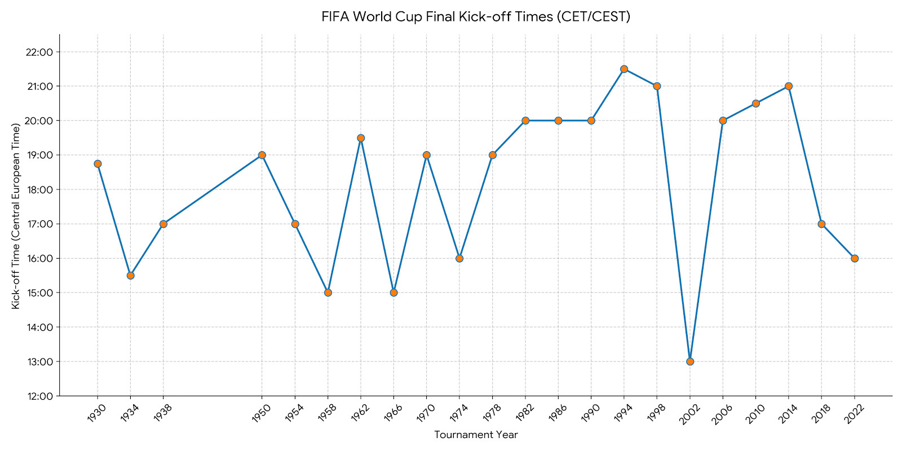

## World Cup

## 看过的比赛

1. 2002，中国和巴西，中国和哥斯达黎加
1. 2002，巴西和英格兰，巴西和德国，巴西和土耳其（半决赛）
1. 2002，韩国和意大利，韩国和德国，韩国和土耳其
1. 2006，我看过一场巴西的比赛，但是我不记得了
1. 2010，荷兰和巴西，阿根廷和德国，荷兰和西班牙
1. 

## 照顾欧洲观众

1. 基本都是为了照顾欧洲，晚上八点或者晚上九点
1. 之前可能是夜场照明技术不成熟，所以都下午踢球
1. 最大例外是韩日世界杯，放在了午饭后
1. 卡塔尔和俄罗斯世界杯，放在了晚饭前

| 年份 | 主办国 | 决赛日期 | 欧洲中部时间 (CET/CEST) | 当地时间开球 |
| :--- | :--- | :--- | :--- | :--- |
| **2026** | 美加墨 | 7月19日 | 21:00 (CET) | 15:00 (EDT) |
| **2022** | 卡塔尔 | 12月18日 | 16:00 (CET) | 18:00 (AST) |
| **2018** | 俄罗斯 | 7月15日 | 17:00 (CEST) | 18:00 (MSK) |
| **2014** | 巴西 | 7月13日 | 21:00 (CEST) | 16:00 (BRT) |
| **2010** | 南非 | 7月11日 | 20:30 (CEST) | 20:30 (SAST) |
| **2006** | 德国 | 7月9日 | 20:00 (CEST) | 20:00 (CEST) |
| **2002** | 韩日 | 6月30日 | 13:00 (CEST) | 20:00 (JST) |
| **1998** | 法国 | 7月12日 | 21:00 (CEST) | 21:00 (CEST) |
| **1994** | 美国 | 7月17日 | 21:30 (CEST) | 12:30 (PDT) |
| **1990** | 意大利 | 7月8日 | 20:00 (CEST) | 20:00 (CEST) |
| **1986** | 墨西哥 | 6月29日 | 20:00 (CEST) | 12:00 (CST) |
| **1982** | 西班牙 | 7月11日 | 20:00 (CEST) | 20:00 (CEST) |
| **1978** | 阿根廷 | 6月25日 | 19:00 (CET) | 15:00 (ART, UTC-3) |
| **1974** | 西德 | 7月7日 | 16:00 (CET) | 16:00 (CET, UTC+1) |
| **1970** | 墨西哥 | 6月21日 | 19:00 (CET) | 12:00 (CST, UTC-6) |
| **1966** | 英格兰 | 7月30日 | 15:00 (CET) | 15:00 (BST, UTC+1)* |
| **1962** | 智利 | 6月17日 | 19:30 (CET) | 14:30 (CLT, UTC-4) |
| **1958** | 瑞典 | 6月29日 | 15:00 (CET) | 15:00 (CET, UTC+1) |
| **1954** | 瑞士 | 7月4日 | 17:00 (CET) | 17:00 (CET, UTC+1) |
| **1950** | 巴西 | 7月16日 | 19:00 (CET) | 15:00 (BRT, UTC-3) |
| **1938** | 法国 | 6月19日 | 17:00 (CET) | 17:00 (WEST, UTC+1) |
| **1934** | 意大利 | 6月10日 | 15:30 (CET) | 15:30 (CET, UTC+1) |
| **1930** | 乌拉圭 | 7月30日 | 18:45 (CET) | 14:15 (UYT, UTC-3:30)** |

## Big Five

1. 法国过去七届世界杯，四次进入决赛。过去52年的14届世界杯，有28个决赛选手，除了三次荷兰，一次西班牙，一次克罗地亚之外，剩下的23个（82%）都来自五大世界杯强队，巴西，德国，意大利，阿根廷，法国
1. 22届世界杯的决赛，只有2010年决赛没有五大强队。五大强队有十种组合：法阿（2022）法巴（1998）法意（2006）德阿（1986，1990，2014）德巴（2002）德意（1982）意巴（1970，1994）。阿根廷和巴西没在决赛相遇过，还有阿根廷和意大利，法国和德国
1. 其他强队，西班牙，英格兰，荷兰
1. 2026年，意大利又没有进世界杯，德国32强被淘汰，巴西16强被挪威淘汰，法国阿根廷是四强
1. 2022年，意大利没进世界杯，巴西八强输给了克罗地亚，德国小组赛输给了日本
1. 2018年，16强的时候，法国就淘汰了阿根廷，巴西输给比利时，意大利没进世界杯，德国小组没出现
1. 2014年，德国四强血洗巴西，意大利小组没出现，德国八强赢了法国，德国连赢三个强队，并连续三界赢阿根廷
1. 2010年，法国和意大利小组没出线，巴西八强输给荷兰，阿根廷八强被德国血洗，西班牙一路灭强队，唯一一次没有五大强队的决赛
1. 2006年，德国八强赢了阿根廷，巴西输给了法国，半决赛德国输给意大利
1. 2002年，韩国淘汰意大利，法国和阿根廷小组没出现
1. 1998年，荷兰八强淘汰阿根廷，意大利八强被法国淘汰，德国被克罗地亚淘汰
1. 1994年，阿根廷16强被淘汰，德国八强被淘汰，法国没有进入世界杯，日本英格兰那届也没有进入
1. 1990年，阿根廷16强淘汰巴西，德国真是阿根廷噩梦（两次八强，三次决赛相遇，输掉两次），意大利四强输给阿根廷，法国没进世界杯
1. 1986年，巴西八强输给法国，四强法国输给德国，16强意大利输给法国