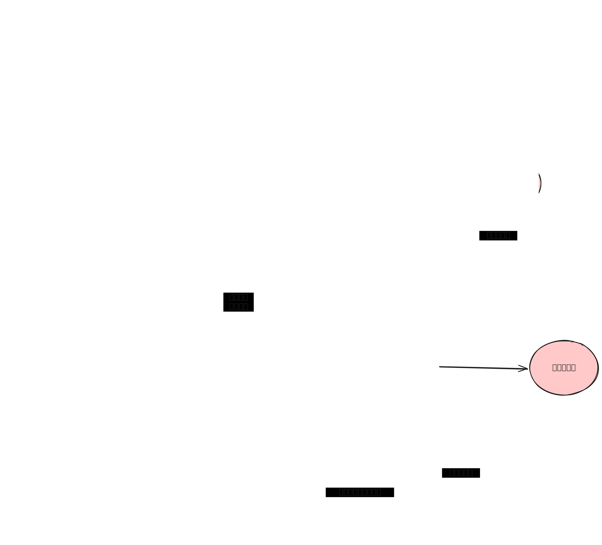

## HCG 和 B超日期

| 日期          | 事件          | HCG       | 孕酮    | 其他   |
|---------------|--------------|------------|-------|-------|
| 3月25日       |  最后月经     |            |     |     |
| 4月14日       |  试纸显示阳性   |   9.09     | 22.84    |     |
| 4月16日       |  HCG超过25   |   28.27    | 15.49    |  29.3h翻倍    |
| 4月17日       |  开始打肝素   |      |     |   |
| 4月19日       |  加大孕酮   |   105.87   | 23.85    | 37.8h翻倍    |
| 4月21日       |  第四次测量   |   206.08   | 57.24    | 50h翻倍    |
| 4月24日       |  停用优思弗、肝素   |   562.67   | 无       |  49.7h翻倍，停止优思弗    |
| 4月28日       |  第六次测量   |   2208.73  | 56.87    |  48.7h翻倍   |
| 5月2日        |  第一次B超   |          | 35.62    |   平均42.4h翻倍  |
| 5月3日        |  恢复肝素，因HCG放缓   |   🚨 3024.76       |     |     |
| 5月4日        |  当日注射绒促   |        |     |     |
| 5月6日        |  当日注射绒促   | 🚨 2161.75       |  24.36   |     |
| 5月7日        |  第二次B超   |       |    |     |

注：HCG：< 5 mIU/mL；孕酮：nmol/L；1ng/ml = 3.18 nmol/L

## 当前用药

| 药品          | 计量          | 频率      | 方式    |
|---------------|--------------|------------|-------|
| 赛能       |  200mg     |     bid 一日两次      |     | 
| 美卓乐       |  8mg     |     qd 每日一次       |     | 
| 地屈孕酮       |  20mg     |     bid 一日两次      |     | 
| 比维酮栓       |       |    bid 一日两次      |     | 
| 肝素（速碧林）       |  4000单位     |     qd 每日一次       |  皮下   | 
| 绒促       |  2000单位     |     隔日一次       |  肌注   | 

## 免疫

| 日期          | 抗核抗体低度          | 抗SSA       | 抗SSB      |抗Ro-52 |抗着丝点 |
|---------------|--------------|------------|------------|-------------|-------------|
| 2025年5月22日     |  🚨  1:1000          | 🚨 弱阳性         |   阴性 | 🚨弱阳性      | 🚨阳性 |
| 7月22日       |   🚨 1:1000          |          |    | 🚨弱阳性      | 🚨阳性 |
| 5月2日       |  🚨 1:1000   |  🚨 弱阳性      | 阴性      | 🚨 弱阳性      | 🚨阳性  |

## 凝血

**重点：用肝素后 FIB 有所回升**

| 日期          | 事件          |  FIB | TEG-R | TEG-MA | D-二聚体   | 血浆蛋白S |
|---------------|--------------|------------|------------|-------------|-----|-----|
| 4月16日       |   HCG超过25  |  🚨  1.38        | 🚨 4.3       |  52.20  | 0.09 | |
| 4月24日       |   停用优思弗、肝素  |  1.77    |        |   |  0.10    ||
| 5月4日       | HCG翻倍放缓    |          |     ||  | 🚨 49.7  | 

注：D-二聚体 < 0.55 mg/L；血栓弹力图R 5-10；血浆蛋白S 59-118

| 日期          | 事件          | 狼疮抗凝物 | 抗心磷脂抗体 | 抗β2糖蛋白I抗体 |
|---------------|--------------|------------|------------|-------------|
| 5月2日       |   第一次B超  |  阴性        | 阴性      |  阴性  | 

**注：狼疮抗凝物质(DRVVT法)确认试验LA2，为28.90，低于参考值30-38，疑似为高凝状态导致**

## B超

### 超声诊断意见

- 宫腔上段偏右小无回声（可疑宫内早早孕）
- 宫腔左侧无回声（积血可能）
- 宫颈回声欠均
- 子宫直肠窝少量积液

### 关键检查数据

- 子宫内膜厚度： 约 12.3 mm
- 疑似孕囊大小： 宫腔上段偏右可见 4.7mm × 4.3mm 小无回声（周边可见高回声晕）
- 宫腔疑似积血范围： 宫腔左侧可见 18.9mm × 11.2mm 透声欠佳无回声区
- 盆腔积液深度： 子宫直肠窝积液最大深径约 12.3 mm
- 血流情况： CDFI未探及明显异常血流信号

## 肝功

| 日期          | 事件          | ALT       | AST    | GGT   | TBA       |
|---------------|---------------------------|------------|-------|-------|-------|
| 2025年1月7日       |             |    37.00       | 🚨 41.90   | 🚨 142.20       | 4.5 |
| 2025年7月1日       |             |    17.00       | 29.20   | 🚨 52.60       | 4.5 |
| 2025年7月22日       |             |    25.50       | 33.70   | 🚨 52.40       | 4.5 |
| 2025年10月05日      |             |    40.90       | 🚨 41.50   | 🚨 69.00      | 5.85 |
| 2月15日       |  吃优思弗   |     38.80       |  33.90   | 🚨 93.20       | 6.4 |
| 3月04日       |                |     29.50       |  26.80   |  🚨 84.50       | 无 |
| 3月26日       |  前一天月经     |     27.10       |  25.60   |  🚨 87.40       | 6.76 |
| 4月17日       |  开始打肝素  |     |        |    |  |
| 4月24日       |  停肝素、优思弗  |  🚨 62.30   |🚨 39.80       | 🚨 115.40   | 3.9 |
| 5月2日       |  停肝素一周  |  40.05   | 27.20       | 🚨 118.80   | 1.6 |

注：ALT: 7-40 U/L；AST: 13-35 U/L；GGT: 7-45 U/L；TBA: 0-10 umol/L