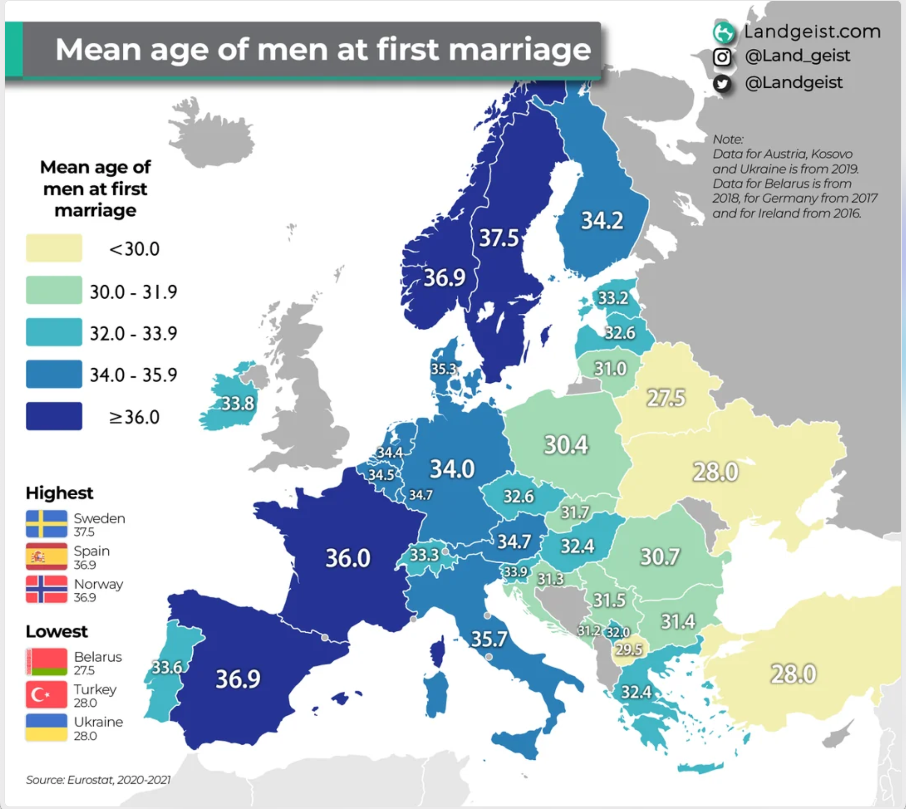

## 生产力如此发达，实在不必如此

是贪婪人性、过分溢价制造惨案

是虚荣攀比、认知吝啬苦了自己

## 一些数字

如果购买房产 600 万，贷款300万，30年利息5%

那么，每个月还款1.6万，总花费880万，其中利息280万

如果购买房产 600 万，贷款420万，30年利息5%

那么，每个月还款2.25万，总花费990万，其中利息390万

## 如果900万花在别处

不考虑货币贬值，600万的概念：

- 工资：600万，一个月收入1万，50年不吃不喝，正好600万
- 每日：600万，每天消费328块，需要50年消费完
- 房屋租金：180万，一个月3000的房租，可以租50年
- 吃住家务：100万，在养老院，自理老人每个月1500，可以懒55年
- 点外卖：18万，一天花100块订外卖，可以订50年
- 读书：20万，可以买5000本纸质书，足够读50年
- 电影票：10万，每周一部电影，可以看50年
- 影视音乐：3万，腾讯视频，网易云音乐，50年的会员费
- 苹果手机：20万，未来50年，每两年换一部苹果手机
- 游戏主机：5万，未来50年，每6年换一次任天堂主机，换一次 PlayStation 主机
- 电子游戏：15万，未来50年，每天两个小时游戏，每年20款，每款促销价150元
- 游轮旅行：50万，每年做一次游轮去日本旅行，可以去50年

如果购房有贷款，那么大约还要加上一半的利息

也就是房子大约，要有900万总支出，30年，每天还款约650元

## 数字

- 2017年到2021年购房，是重灾区
- 1987年到1994年出生，是重灾区
- 在一线城市，一套房子大约要600万
- 在一线城市，每个月月供可能1.5万到2万，每天500到600多块
- 到还完房贷，可能整体要损失400万

## 变相的奴役

大家都以为拥有一套房子，就能拥有一个温暖的家，但为此放弃了太多。

## 信仰与盲从

### 高强度的努力就能有高额的回报

> 你是动物庄园里的老马 Boxer，房子就是祥子的黄包车

- “买房稳赚”，“早买早升值”
- 婚恋市场
- 户口、学位、医疗、养老等与房产挂钩
- 不买房 = 不负责任，“没有长大”， 买房 = 稳定 = 成熟
- FOMO，抢占稀缺资源，从众，压迫性叙事，集体幻觉
- 金融投机教育不足

### 财富既可以通过价值创造，也可以通过欺骗夺走

### 没选过路，只是走了“默认的那条”

## 房产

对于一个追求基本生活标准人来说，钱是一个中心性的话题，涉及到生活品质的方方面面

因为钱可以被支配到很多人生的享乐当中，一大笔钱放在房子上，意味着几乎和生命等价的机会成本。

房价过高是压倒一代人激情的压倒性力量。

还贷太久是

### 房地产是周期性资产，容易生成泡沫

1. 日本房地产泡沫
1. 美国次贷危机

### 房地产不是好的投资项目

1. 流动性差：卖房流程长，变现速度慢，不能灵活调整资产结构；
1. 维护成本高：装修、维修、税费、折旧、空置；
1. 价格波动大：受政策、人口、周期影响极强；
1. 机会成本高：锁死资金数十年，错失其他投资机会。

### 房地产让本来就社达的体系更加畸形

年轻时领先靠“脑力”，中年后发现“资产”才是致命的。

### 逻辑

1. 中产容易：生产力发达，不需要那么拼，就够享受人生
1. 破局困难：溢价的生活质量，特别稀有，没那么好拿
1. 六百万是很多钱

用 30 年的现金流

买下了一个在价格高点的

不能带来收益的重资产

信息失衡、叙事统一、文化基因里的“体面焦虑”

创造了大量价值，大部分却被别人拿走了

只能撂下一句，反正是自住，我也没有办法

## 资产与负债

加入杠杆的原因，也就是负债的理由，是为了能够产生更多的价值

例如，购买房产，为了出租

## 认知吝啬的高级人质

## 任人宰割的情绪操控

由于整个社会进步缓慢，对于年龄的普遍延后没有适应，导致了许多糟蹋生命的荒唐观点。

## 子女上高中才算进入中年

中年并不指代生命一半的意味，而是和这个数字接近时，所带来的心理特征变化。生育子女是一个重要的人生节点，意味着责任的增加，而子女从儿童进入青春期，并到了高中生的年龄，是进入中年的关键信号

Tony Soprano 作为黑帮小混混，19岁早婚，《The Sopranos》第一季的时候，他40岁，他的女儿17岁，所以能很早体现出中年危机的感觉。我自己的祖父17岁就生子，42岁的时候，便有了第一个孙子，所以在这种情况下，40岁因此被认为是到达了中年起点。

无论是和 Tony 还是我自己的祖父相比，时代变迁导致的观念变化，都不能简单用年龄来界定中年，社会上生育年龄相差巨大，我自己儿时要好的同年出生的伙伴，他的孩子在2025年都已经高中二年级了，他进入了中年，而我离中年还很遥远。

<figure>
  
  <figcaption>欧洲国家男性初婚平均年龄（2020-2021）</figcaption>
</figure>

西欧很多发达国家初婚年龄超过了35岁，那么意味着，孩子上高中要起码要推到 50 岁，整个一代人受教育的时长在延长，享受青春带来的幸福感在增加，婚后的幸福指数在提高，教育下一代也更加成熟，这些都是社会进步的体现。

国内有很多人，研究生毕业就已经25岁左右，如果读博要逼近30岁，很多人对于人生想要什么都不知道，稀里糊涂的就上了车，结婚生子买房加班，随着 AI 的进步，这一代人大概率会赶上预期寿命的进一步增加，巴菲特90岁就开始脑力不支，我们这代人或许普遍要比这位大萧条时代出生的人，更加先进一步。

产生中年的顿感是伤锐气的自我设限，没等别人来压迫，自己就开始歧视起来自己了，在心理上主动缴械投降，仿佛未来不再值得期待，还没等别人来情感操控，自己就把枷锁戴上了。

## 35岁工作危机是社会畸形

中国社会上，35岁就开始不容易找到工作，那是社会的问题，文革期间想上大学上不去，难道说这些人没有资格读书吗？义和团说女人来月经导致其法力失效，难道作为女性还真的要愧疚自责吗？

同样回到刚才的话题，随着社会的进步，受教育程度的提高，人们对生活的体验也在改善，就体现在不用着急恐慌年龄的增长，让一切延后进行，对仅有的一生更加负责。

不仅仅是整体年龄的后移，一个人性格的成熟，技能的完善，都是需要时间培养的，35岁经验丰富，性格成熟，技能深入，正是可以为社会提供高效率价值的时期，身体状态好（不要和顶尖体育运动员比，不需要会日语才能学好数学），脑子速度快（如果有人觉得自己脑子不好用了，就如同平时不怎么锻炼，一跑就气喘吁吁差不多），对需求社会运转人际交往，都处于有利于为社会提供价值的黄金时期。

这么好的资源不能被利用，那是社会的损失，不是个人不够积极努力。

## 正视自己父辈那一代人

> 恐慌，从众，逃避消极情绪，认知匮乏吝啬

我自己父母那一辈人，很多小学读完就不接受教育了，不仅仅是知识储备的匮乏，还有思维能力，认知能力的有限，思考问题时处处都是认知偏见

由于认知有限，情绪支配的判断就更多，恐慌，从众，逃避，通过他人对比来衡量自己，担心社会地位滑落等等，以“善意提醒”包装焦虑，因为他们的认知多数来自于群体的粗鄙共识，也就愿意用集体认同来给予压力，通过讨好他人换取虚荣和安心，而缺乏对人生复杂的认识，对多元化的包容，对新情境下的更新思维模式。

他们并不在乎人生的珍贵，更多的是对基本生存的担忧，导致对快乐，对成长，对体验因为恐慌而导致的深度自我阉割。这种恐惧和缺乏安全感是根植在很多复杂背景之下的，是社会缺乏保障和存在太多不可预测的本能收缩。

对于现实的复杂，并不会使用统计学，信息学，贝叶斯式的思考，而是采取原始的，宗教式的，一种羞辱性的本能动员，使用高情感浓度，低信息处理的糊涂瞎说，倾向于使用最少的认知资源，只用简单直观、习惯性的思维捷径来处理复杂问题，强加因果，是其内心压抑、无力、焦虑的外溢，而不是智力加工的低熵

更为直白的说，这一代人很容易上当，缺乏批判性思维，缺乏独立思考的习惯，没有概率统计训练，面对事情，情绪化严重，偏见满满。处处都容易陷入容易识破的陷阱

该省的壹分钱都要省，该花的多少钱也要花，的简单粗暴思维，缺乏基本的细致思考和计算的习惯

而下一代人更为有幸，能够接受更好的教育，认知能力提高，见过更多先进和文明的样子，就更应该独立思考，知道父母的好，但是也要知道父母的局限。