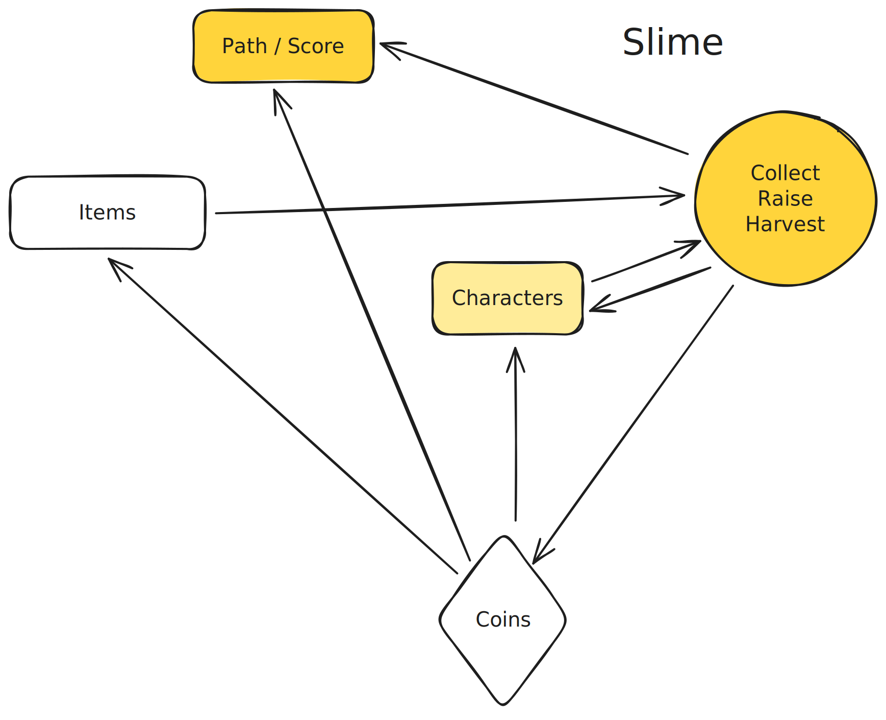

## Game Design

> Game design is basically motivation design.

There are two main ways to make something highly motivating:

1.	Accumulative, linked motivations
2.	Exceeding expected returnss.

In this article, we are focusing on structure of the motiviation design in games, not details. As in a well polished game, you can have minimal structure as in many indie roguelike games.

The common core drivers are:

1. Completions – Single-Playthrough Focus. In games designed to be experienced once, the primary drive is progressing through the main storyline. Every system—combat, exploration, puzzles—serves the overarching narrative arc and helps maintain a sense of forward momentum.

2. Loops – Replayable / Roguelike Mechanics. In games built for multiple playthroughs, the focus shifts to repeatable loops such as procedural generation, randomized encounters, or roguelike systems. These mechanics keep each run fresh and rewarding. Even in non-roguelike titles, certain elements can function as self-contained loops to encourage replayability.

3. Problem Sets – Layered Challenge Structures. Well-designed games feature multi-tiered challenges—maps, rooms, enemies, skills—creating a natural progression of difficulty and complexity. Bosses, while appearing as singular encounters, often act as milestone levels or mastery gatekeepers. In particularly challenging titles like Elden Ring, bosses effectively create miniature roguelike experiences within the broader game.

4. Currencies – Experience and Resource Rewards. Clearing each challenge tier grants rewards such as XP or coins. These rewards serve as tangible markers of progress, encourage continued engagement, and provide players with resource-management freedom.

5. Items – Expanding the Player’s Toolkit. Beyond XP and coins, stages and exploration yield items and abilities. These rewards introduce strategic choice and expand the player’s toolkit. XP or currency can then be spent to upgrade items, enhance skills, or unlock new abilities—creating a satisfying feedback loop between effort and growth.

6. Skills – Player Mastery and Frustration. Skills represent what players must master personally, much like real-life exams. The process of honing skills brings a sense of accomplishment, but it can also lead to frustration if the challenge curve is steep or unclear.

7. Characters – Living Items and Skill Containers. In some games—Pokémon, for example—characters themselves function as a special category of item or skill container. They blend the mechanics of inventory and progression, acting simultaneously as tools, companions, and progression markers.

## Pokémon

In the image above and the following images:

* **Arrow:** Indicates that one element benefits from another — either by producing more or by operating more efficiently.
* **Rectangle:** Represents collectable or completable items. Completing these tasks is generally desirable. Rare items encountered unexpectedly can act as “surprises,” triggering dopamine. Most items help reduce the difficulty of solving problems and are often obtained after completing a task.
* **Circle:** Denotes repeatable problem sets. These sets may exist at different levels, such as map-level, room-level, enemy-level, or skill-level (图、室、敌、技).
* **Diamond:** Signifies accumulable currency. This currency can be exchanged for useful items, improve efficiency, satisfy curiosity, or purchase rare/high-value goods.
* **Colored shapes:** These represent items or activities that are inherently desirable on their own. When linked to colored shapes, the transparent shapes become desirable as proxies, gaining value through association. The darker the color, more motivated the mechanic, but not add up.

Using Pokémon Red and Green as an example:

The main walkthrough path is largely linear, and unlike roguelike games, relatively few players replay it multiple times. This path represents the core progression that players focus on, since “beating the game” is widely seen as an achievement. Along the way, completing gym challenges and collecting badges provides additional milestones and a sense of accomplishment.

Defeating enemies rewards players with coins and experience points. On their own, these forms of “virtual currency” are not intrinsically desirable — they act as proxies for something more valuable. Coins can be exchanged for items that make problem-solving easier, similar to using a cheat sheet to look up answers or cheating to get a certificate.

If the items themselves are visually appealing, like Pokémon, they become inherently desirable. However, in most cases items are functional, like medicine pills — useful but not directly enticing, unlike a beautifully presented meal at a restaurant.

Pokémon characters stand out because they’re cute and engaging. The act of catching them is rewarding in itself, and once players realize that these creatures also help them solve the challenges they care about, their desirability increases further — much like the way an Apple MacBook Air is both aesthetically appealing and functionally powerful.

## Super Mario Bros.

Pokémon is a classic RPG, whereas **Mario** is an action game.

1. In **Mario**, you can’t use coins or experience points to buy upgrades or improve your abilities for future challenges. The only RPG-like element is starting a new level as Super Mario with an extra life — but even that feels more like part of the challenge than an upgrade or “cheat.”
2. Coins are not useless, though. Collecting 100 coins grants an extra life, which gives you more chances to progress along the path.
3. Another appeal of coins is the competitive aspect — players like to compare who can achieve the highest score in a single run.
4. Unlike **Pokémon**, the original *Super Mario Bros.* is often replayed many times because it’s difficult to progress far in a single attempt and you usually have to start over. In this sense, it’s somewhat “roguelike,” although the levels themselves don’t change much between runs.
5. Also unlike **Pokémon**, your skills in **Mario** improve rapidly through practice. In **Pokémon**, improvement comes mainly from leveling up your creatures and acquiring better abilities, with relatively few mechanics for players to master. This makes **Mario** feel more like a pure action (ACG) game.

## Duolingo

Duolingo incorporates game elements that seem inspired by **Candy Crush**, which was a huge success around the time Duolingo launched. Many of the mechanics found in tile-matching mobile games are echoed in Duolingo’s design.

1. In most games, the “lexemes” or tasks players master are not directly useful in the real world. In a gamified education app, however, mastering these elements is the core motivation — learning itself is the reward.
2. Duolingo lets users buy hearts to continue, similar to purchasing extra chances in a mobile game. In a testing context this would feel like cheating on an exam, but because Duolingo is a learning app rather than a testing app, mistakes shouldn’t be overly punishing. By using hearts or energy, Duolingo creates a monetization pathway for serious users, but this isn’t “designed cheating” in the RPG sense — it’s a way to balance learning with engagement.
3. Duolingo’s main motivational force is people’s desire to master a new skill. Its XP system, leaderboards, and daily quests provide some external motivation, but these features aren’t as strong or as compelling as the intrinsic goal of learning itself. As seen in many console games, leaderboards and streak systems alone rarely drive long-term engagement unless paired with strong core gameplay or meaningful progress.

## Slime Rancher

1. In **Slime Rancher**, collecting and raising slimes, harvesting the “plorts” (or other resources) they produce, and selling those resources form the core gameplay loop — much like defeating enemies or using skills in a traditional RPG to gain rewards.
2. The plorts or resources produced by slimes act as the equivalent of **gold coins or rewards**, which players can then use to purchase upgrades or expand their ranch.
3. Upgrading and expanding the ranch is structured as a series of small, discrete stages — similar to clearing levels or unlocking new areas in a game. Each new section offers new types of slimes, resources, and challenges, creating a sense of steady progression.
4. Completing major upgrades and unlocking all areas typically signals that you’ve reached the main content of the game, much like beating the “main quest” in an RPG or clearing the gyms in Pokémon.

In other words, **Slime Rancher** uses the *collect–raise–harvest–upgrade* loop as its core experience. The resources act as renewable currency, the ranch serves as a customizable hub, and progression comes from unlocking new areas and slimes. This design combines the satisfaction of farming and resource management (like *Stardew Valley*) with the collectible creature aspect of Pokémon, all wrapped in a first-person exploration and action format.