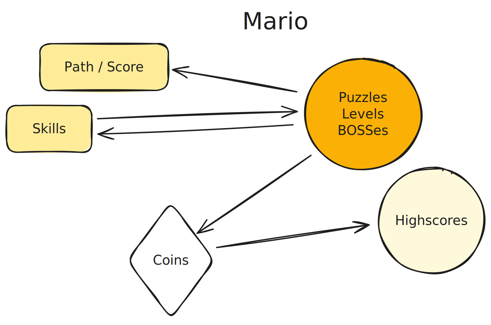

> Game design is basically motivation design.

There are two kinds of ways to make it hugely motivative:

1. Accumulative linked motivations.
1. Beyond expected returns.

## Pokémon

In the image above and the following images:

* **Arrow:** Indicates that one element benefits from another — either by producing more or by operating more efficiently.
* **Rectangle:** Represents collectable or completable items. Completing these tasks is generally desirable. Rare items encountered unexpectedly can act as “surprises,” triggering dopamine. Most items help reduce the difficulty of solving problems and are often obtained after completing a task.
* **Circle:** Denotes repeatable problem sets. These sets may exist at different levels, such as map-level, room-level, enemy-level, or skill-level (图、室、敌、技).
* **Diamond:** Signifies accumulable currency. This currency can be exchanged for useful items, improve efficiency, satisfy curiosity, or purchase rare/high-value goods.
* **Colored shapes:** These represent items or activities that are inherently desirable on their own. When linked to colored shapes, the transparent shapes become desirable as proxies, gaining value through association.

Using Pokémon Red and Green as an example:

The main walkthrough path is largely linear, and unlike roguelike games, relatively few players replay it multiple times. This path represents the core progression that players focus on, since “beating the game” is widely seen as an achievement. Along the way, completing gym challenges and collecting badges provides additional milestones and a sense of accomplishment.

Defeating enemies rewards players with coins and experience points. On their own, these forms of “virtual currency” are not intrinsically desirable — they act as proxies for something more valuable. Coins can be exchanged for items that make problem-solving easier, similar to using a cheat sheet to look up answers or cheating to get a certificate.

If the items themselves are visually appealing, like Pokémon, they become inherently desirable. However, in most cases items are functional, like medicine pills — useful but not directly enticing, unlike a beautifully presented meal at a restaurant.

Pokémon characters stand out because they’re cute and engaging. The act of catching them is rewarding in itself, and once players realize that these creatures also help them solve the challenges they care about, their desirability increases further — much like the way an Apple MacBook Air is both aesthetically appealing and functionally powerful.

## Super Mario Bros.

The pokemon is a typical RPG game where Mario is an action game.

1. The first thing is that in Mario you can't use coins or XPs to buy things to improve your ability in your future challegens. Only RPG-like stuff is that you can enter a new level with a super mario with an extra life, but it still like part of challenge instead of cheating.
1. But the coins is not useless, it can give you extra life if you gather every 100 coins. That extra life give you more chance to progress more in path.
1. Another benefit is that people want to compete with who has a higher score in one run.
1. Unlike pokemon, the original super mario bros. often is played multiple times for most users as it is hard to progress too much and you have to start it over. So this game can be consider a Rogue-like game, only the levels is not changing much.
1. Also unlike pokemon, your skills can be improve quickly by playing more mario, as in pokemon the improvement is more from levelup and better skill, there are less thing to master for normal players. This feature make mario more ACG.

## Duolingo

Duolingo has game elements that seemingly borrowed from Candy Crush which was a phenomenal game at the launch of duolingo. And those tile-matching mobile games have similar features shared with Duolingo.

1. Unlike in other games, the lexemes or tasks for the user to remember and master is often useless in real world. But in an education gamified app, this is a key motivation.
1. Even though you can buy hearts to benefit your problem solving, which is like cheating in an exam, but this is a learning app not a testing app, mistakes should not be too punishing. But using hearts or energy, Duolingo can make this is a way to let serious users pay for a full game. So this feature is not a designed cheating as in an RPG.
1. Duolingo's main motivational forces are people's desire to master a new skill. Its XP system is not so strong as it leads to highscores in leaderboard and unappealing quests daily. As we see in most console games, those are not major drives to motivate users and well game designed.

## 怪物史莱姆

1. 收集史莱姆，饲养史莱姆，收集果实，卖掉果实，都相当于使用技能是击打敌人
1. 史莱姆产生的果实，相当于是金币奖励
1. 升级牧场本省，是一些零散的关卡阶段
1. 如果通关，一般意味着主要关卡都解锁

## 最常见动力系统

1. 如果整个游戏一遍过，那么推进主线就是核心目标
1. 如果整个游戏反复玩，那么肉鸽反复体现就是目标
1. 一般来说，都会有，图，室，敌，技，四个层级的题目系统
1. 打击每个层级的题目后，会有xp或者coin的奖励
1. 打击每个层级或者扫图中，会有道具或者技能的奖励
1. 使用xp或者coin，一般可以增加做题的流利，可以提升道具或者技能的等级
1. Boss虽然看起来像是一个敌人，但更像是 Level，像法环这种难度的，可以算是一个小型肉鸽游戏
1. 有些游戏，有角色，例如，宝可梦，是特殊的一种道具，是技能的容器

### 进一步展开

1. 【进展】【Path】主线路径推进，消耗内容
1. 【肉鸽】【Kill / Puzzle】反复遇到的短基本单元（15秒，短视频）
1. 【肉鸽】【Battle / Level】反复遇到的长基本单元（3分钟，短的视频），会有精心的内容设计
1. 【进展】【肉鸽】【Boss】特殊【Battle】，一般会反复挑战的强力敌人
1. 【增滑】【收集】【Item】道具，使用后会产生有限或者持续效果
1. 【增滑】【收集】【Weapon / Skill / Ability】特殊【Item】，持续生效，核心词汇
1. 【收集】特殊【道具】【Character】词汇的载体和容器，一个文件夹
1. 【进展】【增滑】【Level Up】
1. 【进展】【收集】特殊【Puzzle】【Teleport】
1. 【货币】【积累】【Coin】
1. 【货币】【积累】【XP】特殊Coin，努力了就给的苦劳奖励
1. 【肉鸽】【高分】【Highscore】这个就不讨论了，什么都有喜欢挑战的人
1. 【肉鸽】【Daily Task】每日任务，打卡
1. 【肉鸽】【高分】【Leaderboard】周期性的社交属性进展