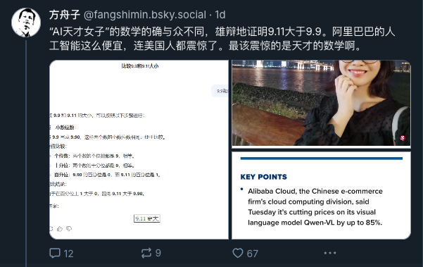
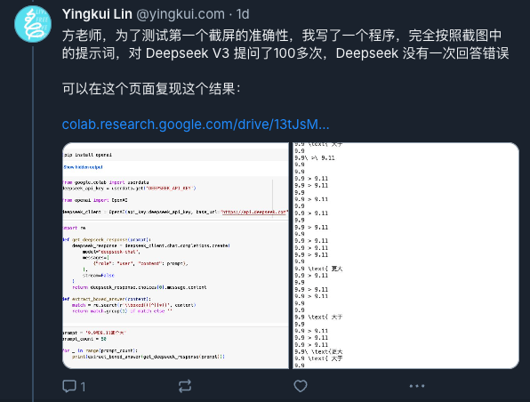
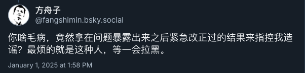
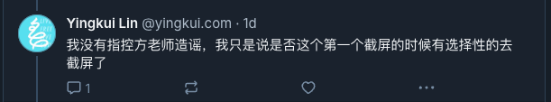
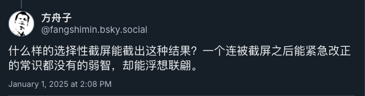
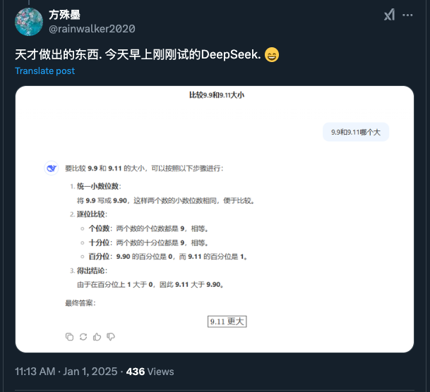
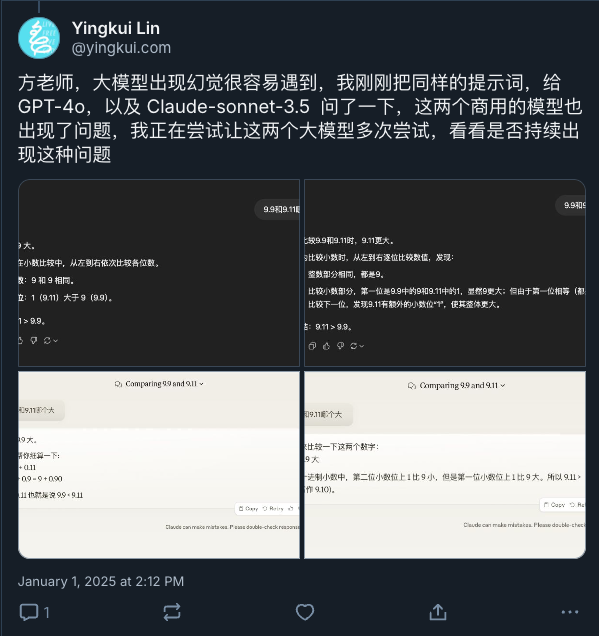
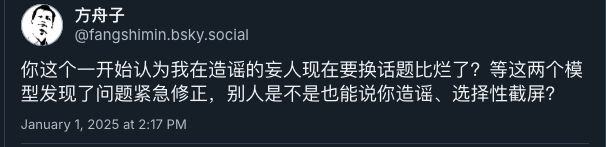

> 方舟子在这个互动里所表现的，“很无知，又一脑子浆糊很糊涂”，“不知藏拙，偏爱跨领域乱说”，“没有严谨的思维”，也就是他总爱说的，**“无知无畏的妄人”**。

## 起因

2025年新年正午，方舟子在 Bluesky 发表了一条[帖子](https://archive.ph/voOst)，通过 Deepseek 对 **9.9和9.11哪个大** 这个提示词的错误反馈，来佐证 Deepseek 是一个性能相对很差的人工智能聊天机器人。

> “AI天才女子”的数学的确与众不同，雄辩地证明9.11大于9.9。阿里巴巴的人工智能这么便宜，连美国人都震惊了。最该震惊的是天才的数学啊

大约十分钟之后，我正要吃午饭，看到这条帖子时有些吃惊，因为在过去的几天内，我频繁尝试使用 Deepseek V3，其对数学问题的处理效果一直很出色，觉得不该在这个小数比大小上出问题，我拿出手机通过 [chat.deepseek.com ](https://chat.deepseek.com/) 测试了几次，发现并没有出现截屏中的幻觉（Hallucination）问题。

但为了排除样本小带来的偏见，我自己在 Google Colab 上写了[一段程序](https://colab.research.google.com/drive/13tJsMwOZfKJl2Lcvxjc_dj3Dv7_PUQZQ)，并测试了上百次，在这超过一百次的测试中，Deepseek 并没有出现任何一次幻觉现象。

这时，我觉得自己有信心认为，方舟子所发的第一个截屏并没有真实的表现 Deepseek 的性能，就给方舟子回复，分享给方舟子这个事实。

这之后，我开始用相同的循环写程序测试 GPT-4o 和 Claude-3.5-sonnet 的反馈，毕竟这是一个要比较不同模型之间性能的话题。

## 方舟子的第一条回复

在我回复十分钟后，方舟子回复我说：

> 你啥毛病，竟然拿在问题暴露出来之后紧急改正过的结果来指控我造谣？最烦的就是这种人，等一会拉黑。

第一，方舟子认为我对事实的描述，是在指控他造谣，我毫无此意，造成误解可能是我表达上考虑不周

第二，方舟子以较为确信的口吻，说性能变化是 Deepseek 的紧急修改所致

且先不说紧急修改的可能性，我们是可以验证 Deepseek 是否紧急修改的。因为 Deepseek 的这几个模型都是开源的，放在了 [GitHub](https://github.com/deepseek-ai/DeepSeek-V3) 和 [Hugging Face](https://huggingface.co/deepseek-ai/DeepSeek-V3)上，参数是公开的，他们或许可以紧急修改网页服务器端的反馈，这些已经发布的模型，是无法作弊的。

有许多在线服务可以帮我们在线跑这些大模型，后来，我在 [GLHF.chat](https://glhf.chat/chat/create) 对 DeepSeek-V2.5-1210 提问了十次，没有一次发生幻觉，在 [Fireworks AI](https://fireworks.ai/models/fireworks/deepseek-v3) 对 DeepSeek-V3 提问了十次，发生了两次幻觉，因为官方商用 API 或者 官方在线的聊天服务 对模型或许有所优化，性能更好是可以接受的假设。

**方舟子以较为确信的口吻，说性能变化是 Deepseek 的紧急修改所致，是一个错误的臆断。**

因为方舟子误解了我回复的本意，他认为我是在指控他造谣，为了消除这个误解，我给方舟子回复说，“我没有指控方老师造谣”。

与此同时，因为 Deepseek 对这个提示词反馈整体上是很出色的，便提出了，是否第一个截屏有选择性截屏的可能，也就是在大量的测试中，找出一个低概率发生幻觉的截屏。

## 方舟子的第二条回复

在我发出第二个回复的七分钟后，方舟子发了第二条回复

> 什么样的选择性截屏能截出这种结果？一个连被截屏之后能紧急改正的常识都没有的弱智，却能浮想联翩。

紧急修改的时间是什么呢？方舟子的图是直接从 [网友的评论](https://archive.ph/yYF6h) 里拿来的，网友是当日11点13的评论，且说是她早晨测试的，方舟子是12点36/40发的贴，我看到并测试在12点50左右，两张图片就是一张图片，方舟子大概都懒得去独立验证，便随手发了出来。这个截屏基本可以确定就是 v3 的，而且方舟子是第一个独立帖子发这张图的人。

### 方舟子在这里犯了三个错误

第一，“被截屏之后能紧急改正” 不是常识。如果说可以称之为常识，或许管理员通过修改数据库中某一个数据能算是，但大模型每次提问都有不同的回答，五花八门的反馈很难像是对数据库直接更新所致。那如果程序员短时间内更改，会采取什么策略呢？如上面所说的，大元旦中午的，Deepseek 团队必须十分钟内公关看到发给程序员然后修改，这么短的时间内，RAG 或者 Finetune 是不切实际的，我能想到的就是增加一句系统上下文的提示词（System Prompt），例如，给聊天增加一个角色，就会降低幻觉出现的概率，这种 [Prompt Engineering](https://github.com/anthropics/courses/blob/master/prompt_engineering_interactive_tutorial/Anthropic%201P/03_Assigning_Roles_Role_Prompting.ipynb) 对于普通人来说，不能算作常识了。更何况，Deepseek 如此迅速反应的概率是非常低的。

第二，大模型并不是稳定地给出一致的答案，也就是存在选择性的截屏，允许人以偏概全来评价性能。

评价一个大模型的好坏，不应该用一个题目，更不应该使用一个题目的一次回答，而是要有更多的样本，提供统计数字，方舟子觉得大模型有一次说错就就能作为嘲讽的依据，其实体现的就是他对这个领域的陌生和不了解，现在最先进的 OpenAI o1，做高中数学题也能出离谱的错，我们能依此嘲讽说 OpenAI 的数学 “的确与众不同” 吗？AlphaFold 也有幻觉，我们也要拿出一个选择性的截屏来嘲讽 Demis Hassabis （24年诺贝尔奖化学奖得主）吗？

**方舟子以较为确信的口吻，认为在大模型聊天上，无法出现选择性截屏，是另一个错误的臆断。**

第三，方舟子认为我是一个弱智。方舟子的评价，基于错误的臆断，本身已经没有说服力。既然说我是弱智，应该有更令人信服的事实，来说明我的IQ低于80，缺乏学习和解决问题的能力，但仅仅在第一个回复里所体现的，我在一个小时内用编程工具做实验来验证自己的假设，使用更多样本来谨慎求证，并以在线互动笔记本的方式，让其他人更容易复现实验结果，难道说这是可以用来证明一个人IQ低于80的强烈信号？

**如果没有足够的证据，对人使用轻蔑的语言侮辱贬损，即是缺乏逻辑的体现，也是缺乏同理心的体现。**

## 方舟子的第三条回复

前面说，我也在测试其他大模型对这个提示词的效果，因为这个话题本身就是在讨论不同模型之间性能。

因为对另外的两个模型100个API请求还没结束，我就随手去网页版给方舟子截屏了 GPT-4o 以及 Claude-sonnet-3.5 的反馈，仅仅在这个提示词上，GPT-4o 以及 Claude-sonnet-3.5 并没有表现的更好，也就不能说 Deepseek 的数学能力”与众不同“的差，反而在这个提示词上 Deepseek 表现的更好。

**这些事实证明了方舟子在这个问题上的说法是错的，甚至有 ”捉鸡不成反被啄“ 的戏剧性反转。**

五分钟后，方舟子发出了第三个也是最后一个回复

> 你这个一开始认为我在造谣的妄人现在要换话题比烂了？等这两个模型发现了问题紧急修正，别人是不是也能说你造谣、选择性截屏？

"你这个一开始认为我在造谣的妄人"，即使在我明确坦诚的解释了，我没有指控方舟子造谣的恶意， 他忽视了我反复体现的真诚和礼貌，执意要说我对事实的描述为 ”恶意分享“ 。

**“现在要换话题比烂了” 是一句非常糊涂的话，Deepseek 的性能是否相比之下更差就是话题本身**，似乎方舟子是想说我在指责转移，Whataboutism，AlphaFold 也有幻觉，我们去找这些大模型的缺陷难道是这个帖子的主题？一个 “智商高于180” 的天才，为什么会在讨论过程中连论点是什么都能搞糊涂？因为他认知能力没他吹嘘的那么高。

方舟子说我是 “妄人”，仅从交互的过程中来看，我并没有脱离事实，胡乱瞎说，反而方舟子多次妄下结论，错误连连。机器学习上，我有着系统的训练，有着大量的阅读量，以及实践操作的积累，我知道自己需要提高改善的地方很多，但 [“我说出来、写下来的这点东西，比我看过的、知道的少多了”](https://fangshimin.medium.com/%E6%80%8E%E6%A0%B7%E6%88%90%E4%B8%BA%E4%B8%80%E4%B8%AA%E5%8D%9A%E5%AD%A6%E7%9A%84%E4%BA%BA-ecd3cf5ff8d2)，被方舟子说成“邓宁-克鲁格效应”里 [无知无畏的妄人](https://fangshimin.substack.com/p/224)，那是方舟子的错误臆断。

对论据，方舟子自己懒得求证，觉得没啥大问题，就拿来嘲讽 ”天才“ ，那为什么方舟子这么确信骂我没常识、确信紧急修改、无法选择性截屏呢？

因为他对大模型很不了解，在这个领域，他这个互动里所表现的，“很无知，又一脑子浆糊很糊涂”，“不知藏拙，偏爱跨领域乱说”，“没有严谨的思维”，也就是他总爱说的，**无知无畏的 ”妄人“**。

## 傲慢自大的方舟子

而这次互动中，方舟子既没有谨慎求证的行为，也没有求知好奇的态度，即使不斟字酌句，也不至于如此屡屡犯错。

每个人精力注意力有限，兴趣也不尽相同，苛求他人处处表述无误，不是我的意图。但方舟子在这次互动中，体现出的过分自信，使用缺乏依据的侮辱词汇贬低他人，始终展现出一种居高临下的蔑视姿态，并且不坦诚自己在这件事上的错误和局限，令人怀疑这就是他习惯性的作风，而如果像方舟子那样，用一个词来形容这种作风，那就是：**Arrogant**。

方舟子在这次句句说错、句句傲慢的互动后选择拉黑了我，辱贬我是“弱智”，“妄人”，后续又说我作为“方黑”是 “人格卑贱的人渣”，这更加验证了他的傲慢自大，故步自封，他自己也只是茧中圈里他所鄙视的那些腐鼠之一罢了，自诩鹓雏实小人。

方舟子的表达欲大于求知欲，虚荣心大于进取心，他是一个傲慢粗鲁的自恋狂、一个在网上需求情绪价值的高知博主。平时的方舟子，与其说是为民除害的侠客，更像是一个有自恋型人格障碍的人。时常分享滋长虚荣的敬慕赞美，在对他人认知能力的贬辱中享受快感和优越感，分享强调过往成就，用种种方式，让他自己和关注者反复确认其高认知的形象。从这次互动中，可以窥探出方舟子对有批评色彩的讨论极为敏感，破坏他的高认知形象，会恼羞成怒，脑中的科学可以弃之不理，求胜于他人而不求实于真理。

方舟子一边反对言论限制，一边却容不得批评自己的声音；方舟子一边指出别人说话没有逻辑，一边却自己频频用词不当；方舟子一边厌恶剽窃，却一边破坏他人知识产权；方舟子一边说学术不能拉帮结派，一边却活在自己营造的众星捧月的泡沫之中；方舟子一边说别人说他眼红粉丝多，那叫做猜意鹓雏，一边却对他人的心理恶意揣度，温和的质疑声变成指控造谣。严以律人，宽以待己，说得好听，做得难看。

方舟子压制质疑声，惩罚质疑者，有如中世纪教会对科学的压制，有如独裁国家对反对声音的恐吓，却廉不知耻得说自己脑中有科学，心中有道义，若是鲁迅在世，他会耻于有这样一个名人崇拜者吧，甚至没准会写文章骂他。