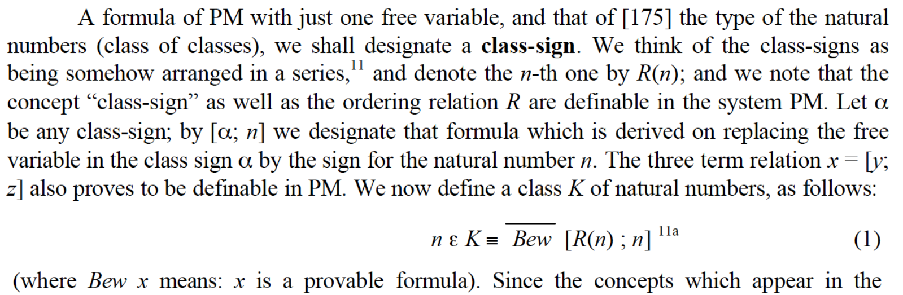
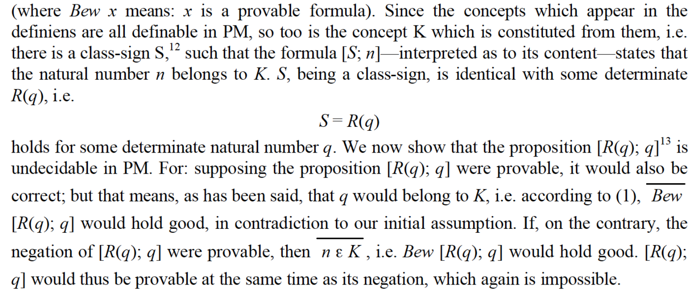

<style>
p code {
  font-family: 'Fira Code', 'Courier New', Courier, monospace;
  font-size: 0.95em;
  background-color: #f5f5f5;
  color: #c7254e;
  padding: 0.2em 0.4em;
  border-radius: 4px;
  border: 1px solid #e1e1e8;
  white-space: pre-wrap;
  word-break: break-word;
}
</style>

## Goal of the Task

The statement _7 is a prime number._ is true and we can prove it formally using axioms and inference rules. So is the statemtents like _2209 is a square number._ and _1597 is a Fibonacci number._.

Gödel showed us there a type of number $\theta$ with a  number $q$.

**$q$ is a $\theta$ number**, the same as 7 is a prime number, but we can't prove.

The whole idea is to define the $\theta$, and find the $q$.

## Encoding and Decoding

### Encoding Statements

The statement $1+1=2$ can be expressed using one unique number:

$$
2^{2}
\times3^{1}
\times5^{3}
\times7^{2}
\times11^{1}
\times13^{5}
\times17^{2}
\times19^{2}
\times23^{1}.
$$

The statement $\forall x(x + 0 = x)$ means for all natural number, if you add zero to it, it will give you the same number, e.g. $2 +0 = 2$, $32093+0=32093$. And this simple statement can be expressed using one unique number (extremely long number):

$$
2^{8}\times
3^{12}\times
5^{10}\times
7^{12}\times
11^{3}\times
13^{1}\times
17^{5}\times
19^{12}\times
23^{11}
$$

The statement `3 is a prime number` can be expressed a little big longer:

$$
\forall x (\forall y(x\times y = 3 \to
((x=1 \wedge y = 3)\vee(x = 3 \wedge y=1))))
$$

The encoded number will also be long:

$$
\begin{aligned}
2^{8}\times3^{12}\times5^{10}\times7^{8}\times11^{13}\times13^{10}\times17^{12}\times \newline 
19^{4} \times23^{13}\times29^{5}\times31^{2}\times37^{2}\times41^{2}\times43^{1}\times \newline
47^{15}\times53^{10}\times59^{10}\times61^{12}\times67^{5}\times71^{2}\times73^{1}\times \newline
79^{14}\times83^{13}\times89^{5}\times97^{2}\times101^{2}\times103^{2}\times107^{1} \times \newline  109^{11}\times
113^{7}\times127^{10}\times131^{12}\times137^{5}\times139^{2}\times \newline  149^{2}\times151^{2}\times 
157^{1}\times163^{14}\times167^{13}\times173^{5}\times \newline  179^{2}\times181^{1}\times191^{11}\times193^{11}\times197^{11}\times199^{11}
\end{aligned}
$$

Yet it is still a unique number for that statement. Statements are also called sentences.

### Encoding Formulas

The statement has to return true or false. We can define a class of statements, for example, instead of stating $3$ is a prime number, we can define:

$$
\mathrm{isPrime}(z) = \forall x (\forall y(x\times y = z \to
((x=1 \wedge y = z)\vee(x = z \wedge y=1))))
$$

Replacing $3$ with $z$, we define a formula with one free varible (not associating with $\forall$ or $\exists$ ) that if you plugin a number, it will turn into a normal statement.

Such a formula with $z$ can also be encoded to a unique number:

$$
\begin{aligned}
2^{8}
\times3^{12}
\times5^{10}
\times7^{8}
\times11^{13}
\times13^{10}\newline
\times17^{12}
\times19^{4}
\times23^{13}
\times29^{5}
\times31^{14}\newline
\times37^{16}
\times41^{10}
\times43^{10}
\times47^{12}
\times53^{5}\newline
\times59^{2}
\times61^{1}
\times67^{15}
\times71^{13}
\times73^{5}\newline
\times79^{14}
\times83^{11}
\times89^{7}
\times97^{10}
\times101^{12}\newline
\times103^{5}
\times107^{14}
\times109^{15}
\times113^{13}
\times127^{5}\newline
\times131^{2}
\times137^{1}
\times139^{11}
\times149^{11}
\times151^{11}
\times157^{11}
\end{aligned}
$$

Anothe example is the class of odd numbers:

$$
\mathrm{isOdd}(x)=\exists y(x = (y + y) + 1)
$$

The encoded number for this formula is:

$$
\begin{aligned}
2^{9}\times
3^{13}\times
5^{10}\times
7^{12}\times
11^{5}\times
13^{10}\newline\times
17^{13}\times
19^{3}\times
23^{13}\times
29^{11}\times
31^{3}\newline\times
37^{2}\times
41^{1}\times
43^{11}
\end{aligned}
$$


### Decoding

Not every number can be decoded as a valid statement or formula, for example, $118098 = 2^1\times 3^{10}$ means $0=$, which has no real value to us. So the number that can be decoded has to be a valid one.

Similar to argument type checking in programming, the decoded mathematical stuff may not be suitable for function parameters.

The following is valid, which asks whether the number that encodes $\mathrm{isOdd}$ is a prime number or not.

$$
\mathrm{decode}(\mathrm{encode}(\mathrm{isPrime}(x)))(\mathrm{encode}(\mathrm{isOdd}(x)))
$$

But this one is not valid, after decoding, the statement can't use as a function.

$$
\mathrm{decode}(\mathrm{encode}(\forall x(x + 0 = x))(\mathrm{encode}(\mathrm{isOdd}(x)))
$$

In the coming arguments, Gödel never used an invalid number when decoding presents. 

## The Unprovable Statement

### Statements

Godel only used seven constants:

$$
\begin{align*}
\text{1. } & \neg && \text{(logical negation)} \newline
\text{2. } & \vee && \text{(logical or)} \newline
\text{3. } & \forall && \text{(universal quantifier)} \newline
\text{4. } & 0 && \text{(zero)}\newline
\text{5. } &  S && \text{(successor function)}\newline
\text{6. } &  ( && \text{(opening parenthesis)}  \newline
\text{7. } &  ) && \text{(closing parenthesis)}
\end{align*}
$$

### Checking proofs is a definable formula

Gödel shows that checking a proof for a statement is an algorithm that can be run on a computer.

So if you give me a proof of Goldbach's conjecture, I can directly put it into a computer and wait for the computer to tell me whether this proof is valid or not. This can be decided in bounded time.

That is to say that $\mathrm{isProof}(y, x) $, where $x$ is a number that encodes a statement and $y$ is a number that encodes a proof, can be written as a formula in terms of the above seven constants. To give you a hint, the formula $\text{isPower}(a, b, c)$ which checks whether $c = a^b$ can be expressed as following:

$$
\exists x \exists y \Bigg[
  \exists n_0 \Big(
    x = S(y \cdot S(0)) \cdot n_0 + S0 \;\land\;
    \exists m_0 \big( S(S0) + m_0 = S(y \cdot S(0)) \big)
  \Big) \;\land
  \newline
  \exists n_1 \Big(
    x = S(y \cdot S(b)) \cdot n_1 + c \;\land\;
    \exists m_1 \big( S(c) + m_1 = S(y \cdot S(b)) \big)
  \Big) \;\land
  \newline
  \forall k \forall z \Bigg(
    \exists m_k \big( S(k) + m_k = b \big) \;\land\;
    \exists n_k \Big(
      x = S(y \cdot S(k)) \cdot n_k + z \;\land\;
      \exists m_z \big( S(z) + m_z = S(y \cdot S(k)) \big)
    \Big)
    \;\rightarrow\;
    \newline
    \exists n_s \Big(
      x = S(y \cdot S(S(k))) \cdot n_s + a \cdot z \;\land\;
      \exists m_s \big( S(a \cdot z) + m_s = S(y \cdot S(S(k))) \big)
    \Big)
  \Bigg)
\Bigg]
$$

All you need to know here is that $\mathrm{isProof}(y, x)$ is a long sequence of symbols that can be precisely written down, like a python function is a long sequence of symbols that can be precisely written down. And it can be encoded as a single integer number, like a python function can be represented by a binary number.

### A New Class of Numbers

Now we define a class of numbers as:

$$
\mathrm{isNotProvable}(x) = \neg ( \exists y\ (\mathrm{isProof}(y, x) )) \newline
$$

where $x$ is a number that encodes a statement and $y$ is a number that encodes a proof.

Just like prime numbers, there is a class of number called `isNotProvable` numbers. 

Now let's define another class of numbers:

$$\theta(x) = \mathrm{isNotProvable}(\text {encode} ( \text {decode} (x)(x)))$$

where $x$ is a number that encodes a formula with one free variable.

Let's call this new class of number as `theta` numbers. 

### The Unprovable True Statement

Since,

$$\mathrm{encode}(\theta(x))$$

is a number that encodes a formula with one free variable.

So,

$$\theta (\mathrm{encode}(\theta(x))) $$

is a valid statement which means 

> The number that encodes the formula of `theta` is a `theta` number.

This statement is true but not provable in the system.

That means given `encode`, `decode` and `isProof` are well-defined algorithms, the following programming will run forever without finding a proof.

You can argue `theta(encode(theta))` is true, but you can't find a proof to show its truth.

```python
def theta(x):
    formula = decode(x)
    statement = formula(x)
    encoded_proof = 2
    while true:
      proof = decode(encoded_proof)
      if isProof(proof, statement):
        return true
      encoded_proof += 1

theta(encode(theta))
```

### The Proof

$$\theta(\text{encode}(\theta(x)))$$ 

is the same as:

$$\mathrm{isNotProvable}(\text{encode}(\text{decode}(\text{encode}(\theta(x)))(\text{encode}(\theta(x)))))$$

Since $\text{decode}(\text{encode}(\theta(x)))$ means $\theta(x)$, so

$$
\theta(\text{encode}(\theta(x))) \leftrightarrow \mathrm{isNotProvable}(\text{encode}(\theta(\text{encode}(\theta(x)))))
$$

That is:

$$
\theta(\text{encode}(\theta(x))) \leftrightarrow  \mathrm{isNotProvable}(\text{encode}(\theta(\text{encode}(\theta(x)))))
$$

If $\theta(\text{encode}(\theta(x)))$ returns `false`, that implies $\mathrm{isNotProvable}(\text{encode}(\theta(\text{encode}(\theta(x)))))$ returns `false`, which says it is provable, but this is a false statement. That means we have a contradiction here.

So if the system can't contain contradiction, $\theta(\text{encode}(\theta(x)))$ has to return `true`, that implies $\mathrm{isNotProvable}(\text{encode}(\theta(\text{encode}(\theta(x)))))$, which says it is not provable. There is a true statement you can't prove.

## Reinvent the Wheel

Since we have been familiar with those functions, let us make some convinient shortcuts:

$$
\begin{aligned}
\phi &= \mathrm{isNotProvable} \newline
\epsilon &= \mathrm{encode} \newline
\delta &= \mathrm{decode}
\end{aligned}
$$

For example the statement $\theta(\text{encode}(\theta(x)))$ can be expanded as:

$$
\phi(\epsilon (\delta(x)(x)))(\epsilon(\phi(\epsilon (\delta(x)(x)))))
$$

### The Starting Point

The liar paradox which states "this statement is false" is easily to come to mind. If we borrow this idea, we can find out our goal is to find a statement that means:

> This statement is not provable.

$$ G \leftrightarrow \phi(\epsilon(G)) $$

And $G$ can be defined as a combination of our three well-defined functions $\phi$, $\epsilon$ and $\delta$.

### First Heuristic Trial

Apparently, $\phi$ is a great choice, signaling something like `Not provable is not provable`. At the same time, we should make one free variable formula becomes a statement. The goto choice for the parameter apparently should be self-referenced to make it possible to push the searching area by using more tools since we only have very limited definations here. That means:

$$ G = \phi(\epsilon(\phi)) $$

but $\phi$ is a formula with one free variable, and it only accepts numbers encodes statements. Since $\epsilon(\phi)$ is a number encodes a formula with one free variable not a statement, this choice is invalid. But it gives us a hint that maybe we should use a formula with one free variable and this variable requires a number encodes a formula with one free variable.

### Find the Right Relation

Let's say $\rho$, and it might in a form like $\rho(x) = f(\delta(x), x)$. And also:

$$ \rho(\epsilon(\rho(x))) \leftrightarrow \phi(\epsilon(\rho(\epsilon(\rho(x))))) $$

If we want to find $\rho(x)$, there are many hints to solve this:

1. we should make first $\rho$ in the right hand side disappear.

2. we should introduce $\epsilon(\rho(x))$, like in $f(\sin x) = \cos 2x$, we should introduce $\sin x$

3. we should introdue $\delta(x)$, that might indicate $\rho$ accepts a number encodes a formula with one free variable.

We now should replace the first $\rho$ as $\delta(\epsilon(\rho(x)))$, it becomes:

$$ \rho(\epsilon(\rho(x))) \leftrightarrow \phi(\epsilon(\delta(\epsilon(\rho(x)))(\epsilon(\rho(x))))) $$

Noticing $\epsilon(\rho(x))$ is a number we plug in, so we find a suitable $\rho$: 

$$ \rho(x) =  \phi(\epsilon(\delta(x)(x)))$$

with the statement $G$ as:

$$ G =  \rho(\epsilon(\rho(x))) $$

## Gödel's Paper

This article is an explanation for the following paragraphs in the Gödel's 1931 paper.



The $[\text{R}(x); y]$ is defined as:

$$
[\text{R}(x); y]:=\text{decode}(x)(y)
$$

And $[\text{R}(x); x]$ is  

$$
[\text{R}(x); x]= \text{decode}(x)(x)
$$

And $\overline {\text{Bew}}$ is $\text{isNotProvable}$, and $\text {S} (x)$ is same as above $\theta (x)$:

$$
\text{S}(x) := \text{isNotProvable}(\text{encode}([\text{R}(x); x])) \newline
$$

$$
\text{S}(x) = \text{isNotProvable}(\text{encode}(\text{decode}(x)(x)))
$$



And $\text K$ means when $n \in \text{K}$, $\text{S}(n)$ is true. The number $q$ is the Gödel number:

$$
q := \text{encode}(\text{S}(x))
$$

The unprovable statement is:

$$
\begin{aligned}
[\text{R}(q); q] &= \text{decode}(q)(q) \newline
& = \text{decode}(\text{encode}(\text{S}(x)))(\text{encode}(\text{S}(x))) \newline
& = \text{S}(\text{encode}(\text{S}(x)))
\end{aligned}
$$

It is easy to show:

$$
[\text{R}(q); q]  = \text{isNotProvable}(\text{encode}([\text{R}(q); q]))
$$