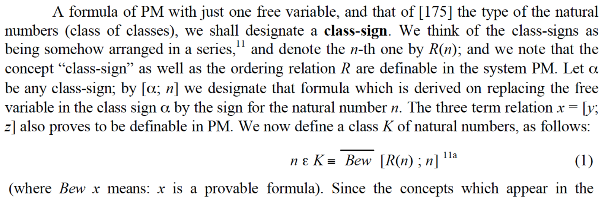
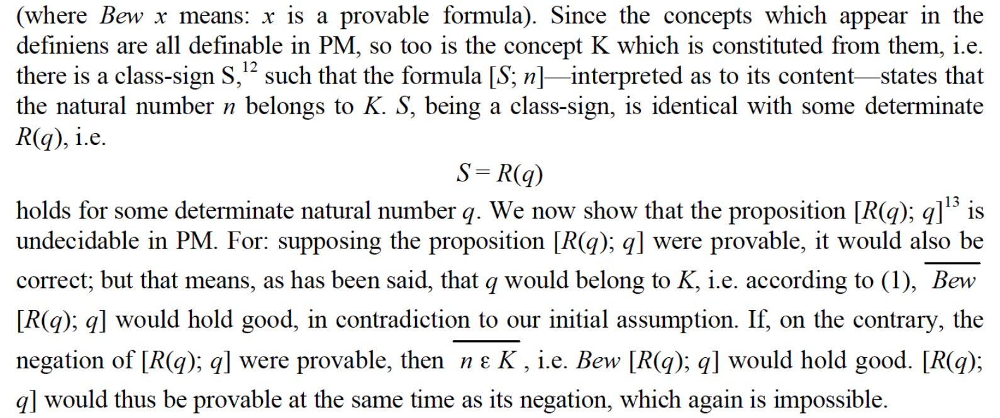

<style>
p code {
  font-family: 'Fira Code', 'Courier New', Courier, monospace;
  font-size: 0.95em;
  background-color: #f5f5f5;
  color: #c7254e;
  padding: 0.2em 0.4em;
  border-radius: 4px;
  border: 1px solid #e1e1e8;
  white-space: pre-wrap;
  word-break: break-word;
}
</style>

## 证明的目标

$2027$ 是一个质数，$2025$ 是一个平方数，$2584$ 是一个斐波那契数，这些都是在数学上可以严格证明的。

我们拿质数为例，如果从逻辑角度，可以定义质数为：

$$
\mathrm{isPrime}(z) = \forall x (\forall y(x\times y = z \to
((x=1 \wedge y = z)\vee(x = z \wedge y=1))))
$$

无论是通过逻辑，还是程序，严格定义的意思，就是没有任何的模糊歧义，你可以放心的交给一个计算机，或者交给任何一个听得懂基本指令的人，去机械的执行，都不会有差错，得到的答案都会是一致的。

比如说，我们通过公理严格的证明出来，$2027$ 是一个质数。

$$
\mathrm{isPrime}(2027) = \forall x (\forall y(x\times y = 2027 \to
((x=1 \wedge y = 2027)\vee(x = 2027 \wedge y=1))))
$$

而哥德尔想给大家展示的是，存在一类数，你可以像定义质数一样严格的定义它，但是，有一个数，比如 7，它一定是这类数的一员，但你永远无法机械地从公理出发去证明这个数属于这类数。

接下来，我们要做的就是找到这类数的定义，以及那个不能被证明是这类数一员的具体的数字。

我们接下来定义这个数字为 $q$，类似于 $2027$，这类数为 $\theta$，类似于 $\mathrm{isPrime}$。虽然 $\theta(q)$ 为真，但是我们却无法机械地从公理出发去证明。

## 编码和解码

为了找到这样一个数字 $q$，我们和哥德尔一样，需要把事情都转化成一个正整数，也就是任何一段信息，我们都可以把它转化为唯一的一对一的一个数字，这样的方式有很多，比如我们可以把信息转化成摩尔斯电码，或者像哥德尔一样用哥德尔数来表示。

这里我们用 `utf-8` 来示意编码和解码信息，下面的两个函数，就可以对一段程序或者一个逻辑表达式进行编码和解码：

```py
def encode(text):
    return int(text.encode('utf-8').hex(), 16)

def decode(number):
    byte_count = (number.bit_length() + 7) // 8
    return number.to_bytes(byte_count, 'big').decode('utf-8')
```

例如, `encode('1 + 1 = 2')` 可以得到一个具体的数字 `211178044722`.

而 `decode(211178044722)` 可以得到一个字符串 `'1 + 1 = 2'`

复杂一点的，我们上面定义的质数：

$$
\mathrm{isPrime}(z) = \forall x (\forall y(x\times y = z \to
((x=1 \wedge y = z)\vee(x = z \wedge y=1))))
$$

通过  `encode('∀x(∀y(x×y=z→((x=1∧y=z)∨(x=z∧y=1))))')` 可以得到一个特别大的数字：

`2407446714671960661684017502465934769344525857188784286837374252857560807533789189320063964694640296626875411133665922890255481032586519234707017191823576884826025179701560314258408468859228381387370826090594053365359696218701174888257366313`

这也使得，我们可以问 $\mathrm{encode}(\mathrm{isPrime})$ 这个数字是不是质数，也就是：

$$
\mathrm{isPrime}(\mathrm{encode}(\mathrm{isPrime}))
$$

## 验证证明

上面的那个特别长的数字是不是一个质数，我们可以通过电脑程序来验证，如果有人从公理出发破解了哥德巴赫猜想，我们也可以通过计算机一步一步地机械验证，而这个验证的算法并不难想象出来，例如：

```py
def isProof(y, x):
    proof_steps = decode(y)
    target_statement = decode(x) 

    known_facts = []
    for step in proof_steps:
        if isAxiom(step):
            known_facts.append(step)
        elif isModusPonens(step, known_facts):
            known_facts.append(step)
        elif isGeneralization(step, known_facts):
            known_facts.append(step)
        elif isSubstitution(step, known_facts):
            known_facts.append(step)
        else:
            return False

    return proof_steps[-1] == target_statement
```

这里的 $y$ 就是对证明过程的一个编码，而 $x$ 是对证明结论的编码。对于经常编程的人其实很好理解，也就是类似于对一大段字符串进行每一步的语法验证，很容易就接受一个证明过程是可以被机械验证的。

哥德尔在自己的论文中，使用了大篇幅的内容来介绍如何写出来 $\mathrm{isProof}$的具体逻辑表达式，也就是类似于对 $\mathrm{isPrime}$ 那样的定义：

$$
\mathrm{isProof}(y, x) \neq \forall x (\forall y(x\times y = z \to
((x=1 \wedge y = z)\vee(x = z \wedge y=1))))
$$

对于如何得到上述的表达式过于复杂，这里就不展开解释了。

## 不可证明

接下来，我们继续回到寻找 $\theta$ 和 $q$ 的主题上，我们的目标是找到一句话，而这句话无法机械地从公理出发去证明。也就是类似于 “这句话是错的” 这种悖论。我们的目标是找到这样一句话，这句话如果是对的，意味着这句话不能被证明的对的。如果这句话是 $G$，也就是说：

$$
G \leftrightarrow \mathrm{isNotProvable}(\mathrm{encode} (G))
$$

这就要求我们定义 $\mathrm{isNotProvable}$，而它可以根据 $\mathrm{isProof}(y, x)$ 很轻易的得到：

$$
\mathrm{isNotProvable}(x) = \neg ( \exists y\ (\mathrm{isProof}(y, x) )) 
$$

如果用程序来理解（如果真的不能被证明，会一直循环下去，而无法返回真）：

```py
def isNotProvable(x):
    encoded_proof = 0
    while True:
        if isProof(encoded_proof, x):
            return False
        encoded_proof += 1
    return True
```

这里的 $\mathrm{isNotProvable}$ 和 $\mathrm{isPrime}$ 一样，也是一个逻辑表达式，可以假想为：

$$
\mathrm{isNotProvable}(x) \neq \neg ( \exists y\ ( \forall x (\forall y(x\times y = z \to
((x=1 \wedge y = z)\vee(x = z \wedge y=1))))))
$$


## 构造 $\theta$

结合上面两步，我们的目标就是找到 $G$，也就是找到一对 $\theta$ 和 $q$，使得：

$$
\theta(q) \leftrightarrow \mathrm{isNotProvable}(\mathrm{encode}(\theta(q)))
$$

具体的一个选项可以是：

$$
\mathrm{isPrime}(2027) \leftrightarrow \mathrm{isNotProvable}(\mathrm{encode}(\mathrm{isPrime}(2027) ))
$$


接下来用 $\phi$ 表示 $\mathrm{isNotProvable}$，用 $\ulcorner$ 和 $\urcorner$ 表示编码，则有：

$$
\theta(q) \leftrightarrow \phi(\ulcorner\theta(q)\urcorner)
$$

为了能够解出来 $\theta$ 我们通过转化，消去右侧的 $\theta$，只让一侧有 $\theta$，关键的，有：

$$
\theta = \mathrm{decode}(\mathrm{encode}(\theta)) =  \mathrm{decode}(\ulcorner\theta\urcorner) 
$$

接下来用 $\delta$ 表示  $\mathrm{decode}$，则有，$\theta = \delta(\ulcorner\theta\urcorner) $，我们的目标也就转化为了

$$
\theta(q) \leftrightarrow \phi(\ulcorner \delta(\ulcorner\theta\urcorner) (q)\urcorner)
$$

因为 $q$ 可以是任何的一个数字，明显上式中，为了提高对称性，以及解出来 $\theta(x)$，我们可以令

$$
q :=  \ulcorner\theta\urcorner
$$

这样，我们的目标就变成了：

$$
\theta(\ulcorner\theta\urcorner) \leftrightarrow \phi(\ulcorner \delta(\ulcorner\theta\urcorner) (\ulcorner\theta\urcorner)\urcorner)
$$

这时，我们就可以得到一个满足上面式子关系的 $\theta$ 函数的表达式：

$$
\theta(x) :=  \phi(\ulcorner \delta(x) (x)\urcorner)
$$

## 不可被证明的正确结论

这样，我们就找到了 $\theta$ 和 $q$，具体的：

$$
\theta(x) :=  \phi(\ulcorner \delta(x) (x)\urcorner) ,\,\, q :=  \ulcorner \theta \urcorner
$$

根据上式，我们可以验证一下

$$
\begin{aligned}
\theta(\ulcorner \theta \urcorner) & \leftrightarrow \phi(\ulcorner \delta(\ulcorner \theta \urcorner) (\ulcorner \theta \urcorner)\urcorner) \\
& \leftrightarrow \phi(\ulcorner \theta(\ulcorner \theta \urcorner)\urcorner) 
\end{aligned}
$$

也就是说，如果令 $G$ 表示 $\ulcorner \theta \urcorner$ 这个具体的数字 是不是一个 $\theta$数，比如说，$2027$ 是不是 质数？又或者 $6114333535587$ 是不是 超级赛亚数？那么有：

$$
G \leftrightarrow \mathrm{isNotProvable}(\mathrm{encode} (G))
$$

如果 $G$ 是错误的，那么根据上式，说明 $G$ 是可以被证明出来的，这就矛盾了，所以 $G$ 是正确的 (这里系统有着一致性的前提)，但如果 $G$ 是正确的，就说明 $G$ 是不可以被系统证明出来是正确的，这样我们就得到了哥德尔不完备定理。

## 附：和哥德尔原文的对应

This article is an explanation for the following paragraphs in the Gödel's 1931 paper.



The $[\text{R}(x); y]$ is defined as:

$$
[\text{R}(x); y]:=\text{decode}(x)(y)
$$

And $[\text{R}(x); x]$ is  

$$
[\text{R}(x); x]= \text{decode}(x)(x)
$$

And $\overline {\text{Bew}}$ is $\text{isNotProvable}$, and $\text {S} (x)$ is same as above $\theta (x)$:

$$
\text{S}(x) := \text{isNotProvable}(\text{encode}([\text{R}(x); x]))
$$

$$
\text{S}(x) = \text{isNotProvable}(\text{encode}(\text{decode}(x)(x)))
$$



And $\text K$ means when $n \in \text{K}$, $\text{S}(n)$ is true. The number $q$ is the Gödel number:

$$
q := \text{encode}(\text{S}(x))
$$

The unprovable statement is:

$$
\begin{aligned}
[\text{R}(q); q] &= \text{decode}(q)(q) \\
& = \text{decode}(\text{encode}(\text{S}(x)))(\text{encode}(\text{S}(x))) \\
& = \text{S}(\text{encode}(\text{S}(x)))
\end{aligned}
$$

It is easy to show:

$$
[\text{R}(q); q]  = \text{isNotProvable}(\text{encode}([\text{R}(q); q]))
$$