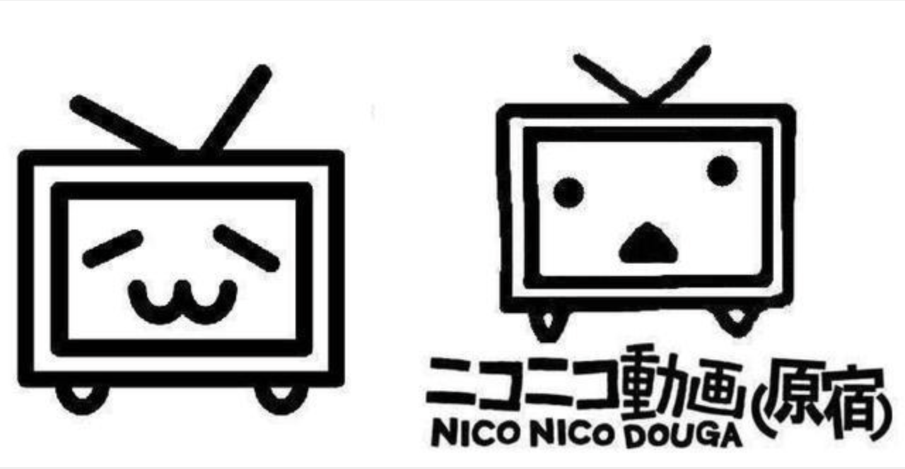
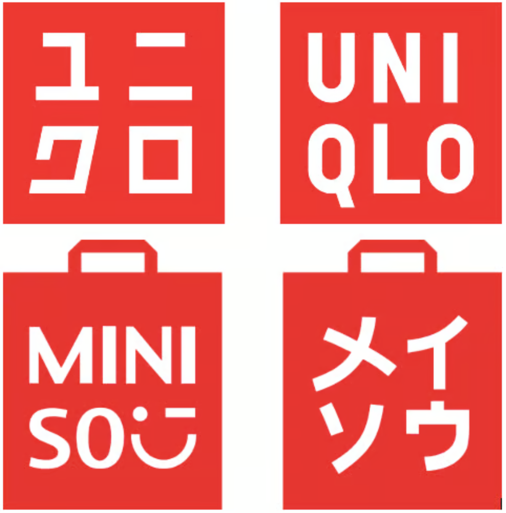
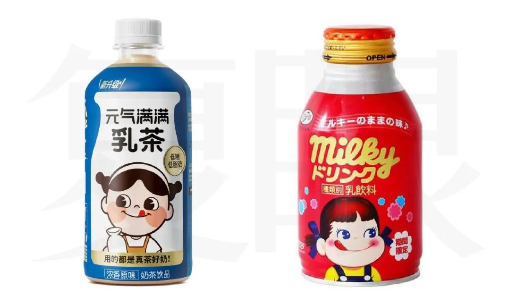
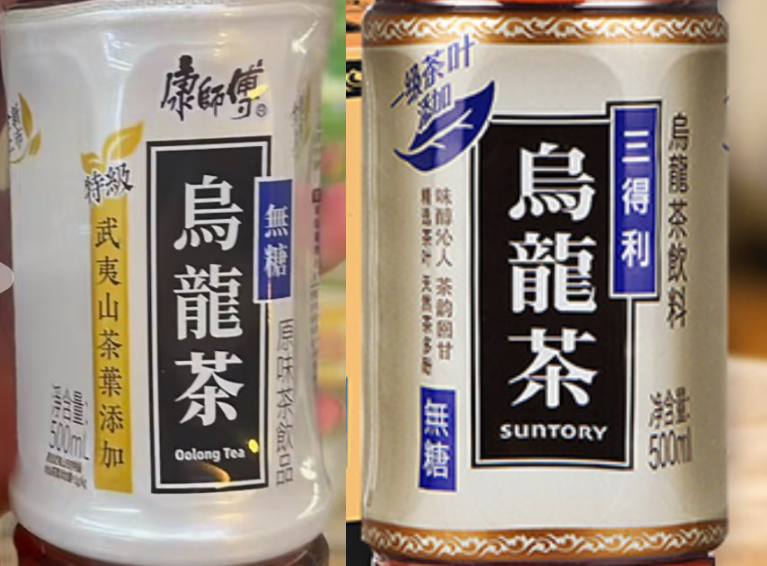

## 流行音乐

<iframe src="//player.bilibili.com/player.html?bvid=BV1E84y1j75M" 
        border="0"
        autoplay="0"
        scrolling="no" 
        frameborder="no" 
        framespacing="0" 
        allowfullscreen="true" 
        width="100%" 
        height="480"
        danmuke="0">
</iframe>

翻唱或抄袭：《最初的梦想》《千千阙歌》《红日》《青苹果乐园》《流星雨》《盛夏的果实》《水手》《老男孩》《嘻唰唰》《我们能不能不分手》《青春纪念册》《原来你也在这里》《天涯》《后来》《伤心太平洋》《人间》《很爱很爱你》《爱你一万年》《容易受伤的女人》《红蜻蜓》《漫步人生路》《花心》

熟知的纯音乐：《故乡的原风景》《故宫的深思》《遥远的旅程》《Rain》（电影《末代皇帝》插曲）《太阳照常升起》（电影《让子弹飞》插曲）

## 电子游戏
《超级玛丽》《魂斗罗》《街头霸王》《口袋妖怪》《冒险岛》《影子传说》《马戏团》《越野摩托车》《拳皇》《赤色要塞》《1942》《三目童子》《打鸭子》《坦克大战》《跑跑卡丁车》（韩国游戏，抄袭《马力欧赛车》）《实况足球》

## 动漫

《铁臂阿童木》《聪明的一休》《足球小将》《美少女战士》《灌篮高手》《龙珠》《战神金刚》（美版）《宠物小精灵》《名侦探柯南》《哆啦A梦》《四驱兄弟》《千与千寻》《龙猫》《天空之城》《时间飞船》《樱桃小丸子》《海贼王》《火影忍者》《铁胆火车侠》《佐罗的传说》

## 仿日式品牌

<figure>
  
  <figcaption>Bilibili 和 Nico Nico 的 LOGO 对比</figcaption>
</figure>

**哔哩哔哩** 是日语拟声词 “びりびり” 的音译，形容电流流过身体时“刺痛、电击”的感觉，哔哩哔哩是日本二次元网站 ニコニコ動画 的中文翻版，ビリビリ取自日本动漫人物御坂美琴的昵称

**呷哺呷哺** 是日语拟声词 “しゃぶしゃぶ” 的音译，指日式火锅 “涮涮锅”（源自内蒙古火锅）

<figure>
  
  <figcaption>名創優品 和 优衣库 的 LOGO 对比</figcaption>
</figure>

**名创优品** 是一个伪装成日本设计品牌的中国公司，其名字是借鉴日本品牌“無印良品”，原LOGO是对日本品牌“优衣库”的高仿，其中，英文名 メイソウ 是对 ユニクロ 的高仿，其宣传的创立人之一 “三宅顺也”，也是对日本设计师三宅一生的擦边球，这些都是为了迷惑消费者，让人以为这是一家日本的品牌

<figure>
  
  <figcaption> 元气森林乳茶 和 不二家乳饮料 对比</figcaption>
</figure>

**元気森林** 同样是主打日式风格，使用日式简化汉字“気”，使用江户时代的髭文字广告字体，使用“无糖专门家”，包装上写的 "日本国 株式会社元気森林 监制” 同样是为了迷惑消费者，其出品的乳茶，抄袭不二家的乳饮料

**奈雪の茶** 其英文品牌NAYUKI，即日语なゆき（奈雪），同样营造日式品牌形象

**上好佳**（菲律宾品牌），虾条以 Oishi（日语：おいしい）命名，寓意“好吃”；虾片以 Kirei（日语：きれい）命名，寓意“好看”

<figure>
  
  <figcaption> 康师傅乌龙茶 和 三得利乌龙茶 对比</figcaption>
</figure>

**康师傅** 饮品系列，鲜の每日C，使用假名作为品牌名，康师傅乌龙茶包装抄袭三得利乌龙茶