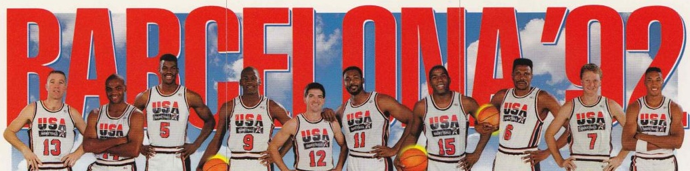
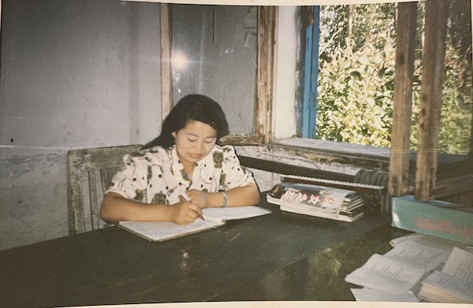
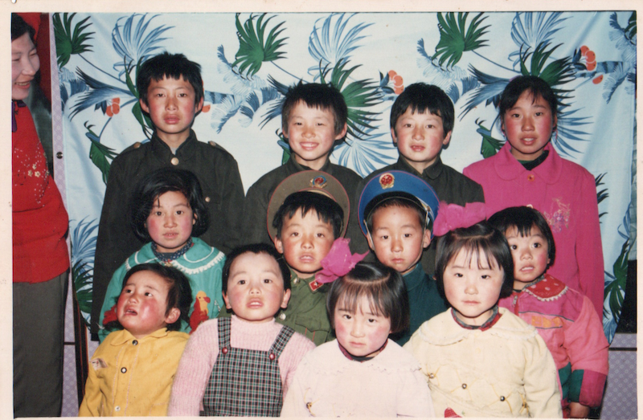
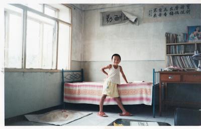

## 1989年以前

#### 1790年 - 1983年 [闯关东林家](/linjia)

#### 1983年 - 1988年 [老爸老妈的故事](/bama)

#### 1988-11-20 爸妈结婚

爸妈结婚那天下了小雪，当天是有拍照的，但是相片没有洗出来。婚后249天，我就出生了。

## 1989年，零周岁

#### 1989-07-27 出生

晚上十点左右在草房出生，我爸妈把我的生日记错了，记成了7月28日，但农历六月廿五是没有争议的。我的名字在初二以前，正式的场合要写成“林英奎”（录入户口信息的人随手写的），而不是“林英魁”，所以很长一段时间里，我的名字和生日都是人为弄错了的。零周岁时在克音草房居住，没有印象。

#### 1989-11-05 百日照

## 1990年，一周岁

1990年8月，一周岁生日过后，开始在九井大姨家（骑自行车半个多小时）居住一年多，大姨和大姨夫照顾我，扛着扁担夹着我去井里打水，清晨在被窝里吃豆制品，吃两毛钱的冰棍，当时大姨家是土房，没有盖砖房，应该是在1995年左右盖的砖房。这期间的记忆，是我人生最早的记忆。

爸妈在1990年8月在哈尔滨的合影，二人去哈市买织布机。

## 1991年，两周岁

1992年寒假开始，从大姨家回来，在草房居住，对草房的印象比较多，草房是一个拉门，王天夫陪我看[《幼儿画报》](https://book.kongfz.com/234114/4347346021/)，至今仍能记得《幼儿画报》上的很多故事。邻居是李旭楠爷爷（约1938年出生，现居齐齐哈尔市）家，经常去李爷家里玩，李爷这个时候教我玩象棋，也对他家的池塘有印象。

大舅 张洪山（1948年）大姨 张洪芬（1953年）三姨 张洪华（1962年）二姨 张洪兰（1958年）老妈

姥爷 张维春（1920年 - 2008年7月），共有子一人，女四人。姥姥（1928年-1968年）在四十岁时去世。

老爸，二姨夫 张福祥，大姨夫 孙江（1954年 - 2021年4月），三姨夫 杨靖忠

## 1992年，三周岁

1992年2月29日，从草房搬家到砖房，第一次去砖房，是三姨夫 杨靖忠（约1962年）赶毛驴车把我送回家的，现在的砖房仍有人居住，是当时的邻居张家。这一年是[巴塞罗那奥运会](https://www.bilibili.com/video/BV1pk4y1k7XK/)，也就是射箭点火和梦之队的那届奥运会，和老爸一起看电视，对爸爸讲越位的概念比较深刻。

#### 1992-05-19 克音卫生院

张洪才大舅拍摄的，荣誉证书也是大舅的。

时年，母亲 张洪芳 （1965年3月31日）27周岁。

应该是当天（1992-05-19）的合影，合影原因应该是欢送老妈的某位同事。

老妈在自己的办公室内留影，桌面上是[1992年第7期《妇女之友》杂志](https://book.kongfz.com/12498/733399229/)。

老妈在医院外留影，旁边是宁姨（唐琳琳的妈妈）

二姨一家在1992年移居大庆，但是二姨家表哥张龙（1977年）半年后才去，1992年暑期，老妈送龙哥去大庆，并在大庆留影。

1992年下半年，爸妈上班，我被送到张洪才大舅家。

老妈在张洪才大舅家门前，当日是张洪才家表哥张春雁（音）结婚，大嫂是老妈同事（小学同学于海龙的妈妈，上面合影的后排右二）的妹妹

## 1993年，四周岁

1993年秋季学期，在津河（步行约40分钟）待了半年，被奶奶王玉英（1932年2月23日-2010年1月1日）照顾了半年，这期间有两件印象特别深刻的事情，一是老叔 林宝君（1973年）买了一个新的拖拉机，我兴奋的没有吃饭去玩，二是村里有一个老人去世了，我问奶奶“你什么时候去世”，后来爸爸知道了，给我训了一顿。那时候，我爸爸给我买了很多小玩具，比如，上劲的青蛙和小车。老叔在自己的房间里唱[《九百九十九朵玫瑰》](https://www.bilibili.com/video/BV1XU4y1F7Dp/)，这时候电视播出《京城四少》，家人经常让我唱主题曲[《潇洒走一回》](https://www.bilibili.com/video/BV15x411v72d/)。

1993年寒假，因为老叔要结婚，奶奶的房子要给老叔结婚用，就从津河回来，开始在苗老师的幼儿班被托管。这期间，看了动画片[《战神金刚》](https://www.bilibili.com/video/BV1fW411876m/)，是第一部有印象的动画片，“我来组成头部”，以及[《蓝皮鼠和大脸猫》](https://www.bilibili.com/video/BV1Kx411M7ei/)，还有电视剧《新白娘子传奇》[《青青河边草》](https://www.bilibili.com/video/BV1sE41127AD/)。《辛德勒的名单》和《侏罗纪公园》是在这年上映的电影。

老爸在克音中学的运动会上

邢广富叔叔和老爸在克音中学门前

## 1994年，五周岁

#### 1994-02 老叔婚礼

当天，和堂兄弟姐妹打闹，鞋踩进了泥滩，被妈妈训斥。

林英东（1980）林英广（1984）林英明（1984）林英梅（1983）

林英萍（1984）林莹莹（1987）林英德（1989）林英艳（1990）

林英娜（1991）林英魁（1989）林英贺（1989）林英会（1990）

后排：四娘，三娘，二娘，前排：老婶（七），六婶，老妈（五）

1994年秋，开始在克音小学上幼儿班，这时候对电视剧以及动画片有清晰的印象，这一年7月23日《动画城》开播（6月15日《狮子王》上映，7月6日《阿甘正传》上映），[《三国演义》](https://www.bilibili.com/video/BV1vy4y1a7da/)10月23日在央视开播（9月23日《老友记》首播，10月14日《肖申克的救赎》和《低俗小说》同日上映，11月18日《这个杀手不太冷》北美上映），[《年轮》](https://www.bilibili.com/video/BV1aB4y1N7En/) 播出，[印象极为深刻](https://www.bilibili.com/video/BV1zB4y1n7U9/)。《包青天》应该也是这一年看的。[《东方小故事》](https://www.bilibili.com/video/BV1cw411k7K3/)《魔方大厦》是在这年看的动画片。

## 1995年，六周岁

1995年春节，去奶家（63岁）过年，路上和我爸抱怨《三国演义》可真长（1995年2月20日最后一集），当年春晚的《牛大叔“提干”》《今儿个高兴》《如此包装》印象深刻。

1995年上半年，老叔的房子因为电饭锅原因失火，当时正在幼儿园上课，被父母接走去津河。

1995年，爸爸给我买了两个地图，一个世界地图，一个中国地图，当做生日礼物，我经常站在桌子上看这两个地图。

1995年的动画片和影视剧记忆很多，《大风车》《海尔兄弟》《大头儿子小头爸爸》《旋风小子》《十二生肖》《太阳之子》，那时候，我爸妈总说动画片是给小孩子看的，他们大人要聊天才是正事，所以不让我看电视，我就说我长大了也会很爱看电视，一语成谶，仅今年（2023年）就看了《蜘蛛侠》《马力欧》《进击的巨人》等一系列动画片。

1995年9月，开始在克音小学上小学，苗老师说我年龄小，让我再读一年幼儿班，即使我两门课数学和语文都是满分，后来还是在6周岁的时候上了小学。班主任是李淑琴，王丽圆（当时的同学，后来又是高中同学）的妈妈，后来她家搬去了后头乡，我记得1996年他们走的时候在学校留影。

## 1996年，七周岁

#### 1996-05-26 民哥结婚

1996年，大哥孙立民（1976年）结婚。

三姨家表哥杨大伟（1984年），我自己，大姨家表哥孙立民

大嫂 郑丽芳，大哥 孙立民

#### 1996-08-09 农历生日

时年，父亲林宝超 （1964年10月23日）和母亲同为 31周岁。生日当天是和新班主任李淑梅老师一家去的，爸爸送给我一本[《现代汉语词典》](https://book.kongfz.com/372534/1661760128/)作为生日礼物。身后的是克音河大桥，以及日本占领期间建造的炮楼（现已经被拆除），小时候经常走火车大桥，爬炮楼，去大桥就和《Stand by me》里探险的感觉很相似。

大桥的台阶，以前和林英东，林英广，林英德去放牛，经常坐在这个台阶上。

大桥附近的小水池，下面就是泥水，以前经常有小孩在大桥附近溺亡，林英德有一次也险些溺亡。

家门口的小花坛，后面是砖房家。

在砖房家内部，1996年的照片很多，那年还买了一个相册，上面有1996年的日历，也就是上面照片右上角的那个大册子。

那年的记忆有《大草原上的小老鼠》《四驱兄弟》《白眉大侠》《黑猫警长》《宰相刘罗锅》《娃哈哈 AD 钙奶》《小虎队旋风卡》《摇太阳》《精武门》。

娃哈哈之前是一个玻璃瓶装的，那年变成了塑料瓶，我妈管之前叫做一代，这个叫做二代。

冬天的时候，去陈同学家里玩，把书包弄丢，被狗咬走了，后来只拿回来一本《现代汉语词典》的残缺本。

#### 1996年暑假，阁山水库

田凤山，李军，老爸

田亮妈妈，李飞鸿妈妈，老妈

田亮，李飞鸿，林英魁

## 1997年，八周岁

#### 1997年，六一儿童节

在砖房家门口，右侧即砖房家，左侧是邻居张立斌和张丽颖家

六一儿童节表演结束后，和老爸在小学校园内

最后一张不确定是否是六一当天

#### 1997年秋，照相馆拍照

那年老妈要拍艺术照，应该是相馆赠送了几个拍照机会，就去拍了，其中有一张拍照时闭眼了，相馆让我去重新照一张，就和邻居家的姐姐张丽颖（约1984年 - [2016年5月24日](https://mp.weixin.qq.com/s/9z_d8SyYr8y2NgnT3hKThA)，和林英广、林英明是同学，）一起去的。

老妈当时（32周岁）的两张艺术照。

1997年，记得《快乐家家车》《红高粱模特队》，过年期间，和张丽颖去唐琳琳家玩，看的《正大综艺》，玩的跳棋。那年奶奶过生日，和爸爸去的靠山，在火车站给我买了一本[《聪明的一休》](https://book.kongfz.com/21570/4796660593/)（新疆青少年出版社，1996年12月第1版），爱不释手。

1997年，爸爸去县里买TCL电视，又超出预期的买了一个VCD，现在还记得那个碟子里的音乐有：《故事里的事》《梦驼铃》《健康歌》《大花轿》《走四方》《在那桃花盛开的地方》《霸王别姬》《冰糖葫芦》《潮湿的心》《十五的月亮》

## 1998年，九周岁

1998年1月8日，《水浒传》首播，现在还记得趴在小窗上看水浒的情景，同年还有《时间飞船》《玩具之家》《小糊涂神》。1998年，还是印象深刻的世界杯，第一次喝可乐，收集《小虎队球星卡》。

#### 1998年6月20日 搬家去绥棱

当天，绥棱县卖彩票，老爷家的老叔林宝生抽到电饭锅，那天是雨天。