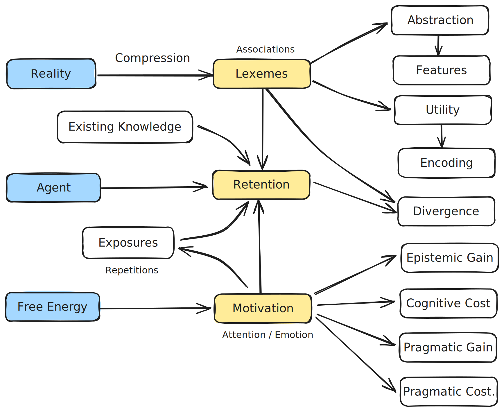

## Relations between Topics

The **reality** makes it possible to reduce complexity by **compression**, and can be expressed in terms of atomic **lexemes**.

The **lexemes** have different **abstraction levels**, **complexity levels** and **utility levels**. 

The **frequence of exposures** determines the compression quality and the utility levels of lexemes.

The human **cogitive learning** is the process of lexemes **retention**. 

The goal of education is to have high quality **retentions** in short period for high utility **lexemes**, and this goal relies on high **motivation**.

The quality of retention is measured by **KL divergence** and influenced by the quality of **training data** and agent **motivation**.

The motivation level of an agent of changing actions and internal models are described by **Free Energy Principle** (FEP).

FEP seperates the driven forces into four parts:  **Epistemic Gain**, **Cognitive Cost**, **Pragmatic Gain** and **Pragmatic Cost**. 

FEP and cognitive learning is related to physics topics like **thermodynamics** and the **principle of least action**.

The **intelligence of an agent** is measured by the summation of all its lexeme utility weights for a **skill domain**. 

**Spaced repetition** of lexeme exposures leads to a higher rate of retention. 

Some agents might have a higher **rate of retention** using lower exposure count and poorer exposure quality. 

## Atomic Lexemes

### Compressed Associations

1. **$P(t \mid p)$**, given a prompt $p$, the distribution of the generated tokens
1. $h^{(l)}_i$, means the $i$-th word (feature) in $l$-th layer of abstraction.

Markov Blanket as you can assign a symbol to a compression of some class of information.

redundancy-reduction

To generalize is to compress, stripped away part of the information you get.

Learning words is like to add axioms to our internal model of the external worlds, unlike Hilbert's efforts to reduce to a few simple axioms. That is to say that when we try to understand the universe the newton's view is a set of low entropy axioms if we compress the data we observe by ignore the contribution of small variations.

The reason to compress is:

1. it shows up frequently as part of solutions.
1. it saves energy, for example, a general rule for many instances and a result of such computation for future usage.

### Deep Features

1. If you can't see enough examples, it is hard to mine out a deeper level pattern. The reason is the shallow features also consume you to remember and to memorize.

### Causation. Features. Categorization.

Like numbers, we can categorize lexemes be a member of an another lexeme. 

### Lexemes Properties

1. abstraction level
1. utility level

## Free Energy Principle

The Free Energy Principle is a mathematical framework that explains how biological systems resist disorder and maintain their structure by minimizing free energy.

$$
\mathcal{F}[q(s)] = \mathrm{D}_{\mathrm{KL}}\left( q(s) \,\|\, p(s\mid o) \right) - \mathbb{E} _{q(s)} \left[ \log p(o \mid s) \right]
$$

The first term relates to complexity, is information-seeking and relates to epistemic value.

The second term relates to accuracy, is goal-directed behavior and relates to pragmatic value.

The brain tries to minimize this free energy, and if the system expects a sharp drop in free energy from action $a$, it will treat that action as highly desirable.

$$
\text{Motivation}(a) \propto -\mathbb{E}_ {q(s', o' \mid a)}\left[ \mathcal{F}(s', o') \right]
$$

We can analyze the motivation as four parts:

1. **Epistemic Gain**: How informational appealing the situation is. What the percieved epistemic gain (resolving uncertainty, updating its beliefs) is. How curious the agent under this situation. 
1. **Cognitive Cost**: The cognitive cost to reach desired level of resolution. How much efforts needed to obtain the desired information.
1. **Pragmatic Gain**: The non-intellectual benefits (staying alive, getting food). Get rewarded.
1. **Pragmatic Cost**: The non-intellectual efforts (workload, spending money).

Epistemic is much like how bad you want something, and pragmatic is like how much you are willing to sacrifice for this desire. 

The agent might additive to the situation with small investment with high return.

The beauty of free energy principle is that it allows learning from reality and also makes it possible to manipulate reality for desired states of the learner.

Most people don't like learning is easily be explained by lack of enough perceived pragmatic gains.

Minimize surprise (prediction errors) in a resource-constrained, noisy, uncertain world

Strong bias

cheap ways to reduce surprise, even if they’re incorrect

## Abstract Lexemes

The abstract lexeme is often presented to the agent by a concrete lower level lexeme instance, but without sufficient amount of concrete examples, the agent can't catch the desired lexeme because of ambiguity. By cross validations with several examples, the agent can pin down the feature and make this experience counting for one exposure event.

For abstract lexemes, the initial encouter is more fragile than a concrete lexeme.

## Models

1. $D_{\mathrm{KL}}(T\\|L)$, KL divergence of a learner's probability distribution from a testing set true probability distribution.

## Training Data

$\theta' = \theta - \eta \nabla_\theta \mathcal{L}(f_\theta(x), y)$

## Reading a Learning Material

while reading, people are processing the word one by one and try to make sense from each word, while reading the reader will compress the information by remove much details of the sentences. At the same time, it will also valuate the gains and costs to determine how many interest it will devote to the knowledge.

Fast searching instead of skill acquisition, illusion of fluency or mastery, epistemic foraging

### Zipping and Unzipping

## Retention

> Repeated exposure to a pattern leads to better retention

1. $$

> High emotional level can increase the retention efficiency in one exposure.

When an agent has a high combined perceived epistemic and pragmatic gain, the agent will open the gate for memorization wider for better retention.

It can be seen as an analogy for heat transmission, as high energy can permeate deeper. The brain may also revisited the association by replay or self-exposure the event, like a fond memory you active or subconsciously repeatly revisits.

A well explain video or lecture, only count for a reasonable perceived epistemic gain, not too much shock and not too much randomness or no new information available.

So that only account for a low level of exposure.

But by doing exercise, it will increase the agent perceived pragmatic value when the correct answer exposed especially they can see the benefits of solving the problem correctly and the discrepency of required level of resolution of the problem answer.

The neurals fire together wire together, 

boost synaptic plasticity in the hippocampus and amygdala, noradrenaline and dopamine provide the “tag” that something important happened, acetylcholine focuses encoding resources, and stress hormones fine‑tune consolidation, making surprise or trauma into long‑lasting memories.

### First Few Examples

### Spaced Repetition

The whole idea of efficiency learning is to increase the exposures of high utility associations.

Greater surprise or informational gain for the learner.

If the information is presented in a short time of period, that surprise or free energy can be reduced too much.

as the adjancent occurs will be compressed with little update urgency.

### Bad Learners

People tend to abstract ideas from several single instances.

## Epistemical Kinetic Energy

Human is attracted by situations that a low cognitive cost can lead to a boost in knowledge acquisition.

## Pragmatical Potential Energy

## Self-evaluation as a Pragmatical Gain

Since people tend to protect their ego and self-worth, 

## Presumptions

I believe:

1. all things can be explained by associations.
1. 

## Agent

I don't know the cause of these effects, but they are facts observed in reality.

> Some agents can achieve desired retention with less exposures.

Some agents can find high abstract associations in a few exposures which we normally call it **insightful**.

## Thermodynamics

$$
S = \int_{t_1}^{t_2} \underbrace{(T - V)}_{L} \, dt
$$

The free energy principle is closely related to the principle of lease action. The Lagrangian is defined as Kinetic energy minus Potential energy.

1. **Work** is an agent's action to change the environment.
1. **Entropy** is how confused you are.
1. **Energy** is how motivated you are.
1. **Kinetic Energy** is how an agent is epistemically motivated.
1. **Potential Energy** is how an agent is pragmatically motivated.
1. Both low and high entropy systems can be low in complexity. The most interesting, complex systems often lie between pure order and pure randomness.

## Learning as a High Return Exploration

There are only solving procedures, but learning is a special type of solving. Even learning with bad materials is like solving problems and by exposing yourself with more useful related contents, which generative ai is super helpful here. It expands the confused part with clear and easy content which might be familiar to the learner. 

Normally, if you do research, you try out new exploration or exploitation current situations. 

But learning in human sense is basically remembering the compressed, high confidence asscociations that is proved to be useful in real world challenges.

It doesn't matter the association is right or not, maybe the school teachs you the earth is flat, but you don't have the resources to really disproof this.

There is no system 1 and system 2, it only means fluent words and inarticulate fresh situations.

repeat at the high utility features, the more abstract feature, the more exposure it needs, and 

## Tradeoff of Active Recalls and Frequent Exposures