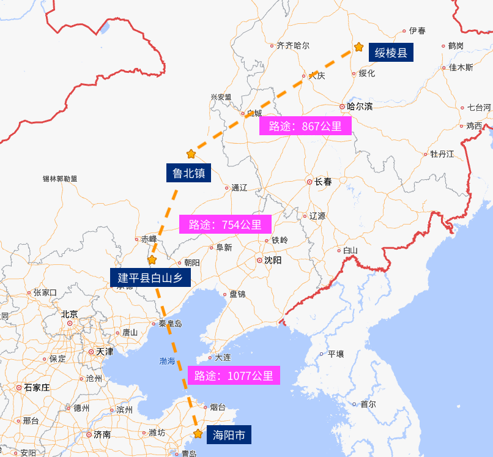

### 林氏起源

#### 始于公元前1029年，自黄帝至林坚

燧人氏，伏羲，少典，**黄帝**，玄嚣，蟜极，**帝喾**，契，昭明，相土，昌若，曹圉，冥，王亥，上甲微，报乙，报丙，报丁，主壬，主亥，主癸，**成汤**，太丁，太甲，太庚，太戊，河亶甲，祖乙，祖辛，祖丁，小乙，武丁，祖甲，庚丁，武乙，文丁，**比干**，**林坚**

林氏起源于商纣王时期的比干之子林坚，比干是黄帝第三十三世孙，帝喾第三十世孙，商汤王第十五世孙，商朝第二十八任君主文丁之子，第二十九任君主帝乙之弟，第三十任末代君主帝辛“商纣王”之叔，比干因谏而死，其子被周武王赐姓为“林”，出生于长林石室。

#### 西河林氏

林坚，林载，林蹉，林虎，林光，林相，林玄，林风，林翊，林苌，林材，林考，林问，林贞，林英，林乾，林保，林隽，林宏，林类，林既，林縣，林雍，林敏（24世孙），林楚，林放（公元前552年 - 公元前480年，曾向孔子问礼）

#### 登州刺史 林江

始迁祖烈祖父（爷爷的爷爷的爷爷）约1790年出生，⼭东省登州府海阳县人，育子四人，约1811年（20岁出头），逃荒至辽宁省建平县白山乡西三家。烈祖父是林家闯关东分支的创立者，相当于《百年孤独》里建立了马孔多的何塞·阿尔卡蒂奥·布恩迪亚，第一代逃荒一共两人，烈祖父的另一个兄弟后来返回山东。烈祖父一生处于清朝嘉庆道光年间，西方处于拿破仑时期。

天祖父约1830年出生于辽宁，有子一人，女一人。

高祖父（爷爷的爷爷）林成X，约1874年出生， 妻子李氏，有子二人，女三人。约1918年因嗜赌成性被逐出家门，逝世于阿鲁科尔沁旗。闯关东第三代，也就是烈祖父的孙辈一共有九人，高祖父在九人中排行老七，名字不详，在2018年立的墓碑上写的林成起，高祖父有妹妹林成喜。老祖宗嗜赌成性，有如《活着》中的徐福贵，以致全家极度贫寒。

曾祖父林有堂1898年农历三月二十某日出生，1974年1⽉31日逝世，享年75岁，妻子张氏，有子二人，女六人。曾祖父林有堂是高祖父的长子，约1918年，高祖父将曾祖父的三个妹妹（约十几岁）以置换几袋大米的条件，将其送至他人家中作童养媳，曾祖父立志要勤勉置家，劳苦一生的开始。曾祖父有弟弟林发堂，林发堂有妻子李氏，擅长赌博，林发堂有两个儿子，长子林国生（妻子王秀兰），次子林国斌（家谱拥有者），林国生长子林宝才（1966年出生），林宝才长子林森（1990年出生），曾祖父生于清朝末年（约15岁时清朝灭亡），壮年处于民国时期，50岁左右中华人民共和国成立，一生跨过第一次世界大战（16岁到20岁），大萧条（30岁出头），第二次世界大战（34岁到47岁期间，生活在被日本占领时期），以及建国初期的几次运动。

祖父林国荣（1934年 - 1986年），1974年40岁时，迫于生计，从[辽宁建平县](https://www.amap.com/regeo?lng=119.465461&lat=41.699193&name=%E6%9C%9D%E9%98%B3%E5%B8%82%E5%BB%BA%E5%B9%B3%E5%8E%BF&adcode=211300)迁至内蒙古扎鲁特旗鲁北镇，后1976年中秋节（毛泽东逝世于中秋节第二天）后几日，迁至绥棱，祖父林国荣迁至[克音津河屯](https://www.amap.com/regeo?lng=127.156244&lat=47.332062&name=%E7%BB%A5%E5%8C%96%E5%B8%82%E7%BB%A5%E6%A3%B1%E5%8E%BF&adcode=231200)，时年祖父42岁，父亲12岁。

祖母王玉英（1932年正月十八 - 2009年1月1日因肺癌去世）。祖母王玉英出生于地主之家，家庭富裕，祖母大舅家在1944年被土匪抢劫，父亲王金、母亲、兄长王玉生因此事生疾而相继去世。祖父和祖母成长于日占时期（十岁之前），建国左右1950年（约17岁）结婚，壮年处于建国初期至文化大革命时期，三年大饥荒时约25岁，祖父50出头就因为肺部疾病，经济拮据没有去医院检查医治而去世，终生为生计颠簸奋斗，祖母晚年时期处于改革开放时期，贫苦的一生在晚年得到了一些物质上的享受，祖父祖母若健在，也不过刚刚九十岁（2023年）。

祖父弟弟林国富1943年二月初八出生，妻子宗桂芝1947年正月二十七出生，二人1963年结婚，1975年迁至[靠山胜利屯](https://www.amap.com/regeo?lng=127.080078&lat=47.234937&name=%E7%BB%A5%E5%8C%96%E5%B8%82%E7%BB%A5%E6%A3%B1%E5%8E%BF&adcode=231200)。

到了我父亲这一代，也就是闯关东的第六代，来黑土地定居的第二代，祖父林国荣与祖母共育有七子，林宝山（1951年），林宝春（1953年），林宝青（1956年），林宝良（1960年），林宝超（1964年），林宝成（1968年），林宝军（1973年）。祖父弟弟林国富共有三子，林宝真（1967年），林宝生（1970年），林宝华（1972年）。父亲成长于文化大革命时期，壮年属于改革开放时期。