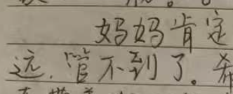
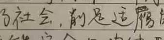
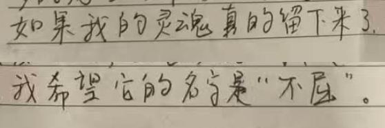
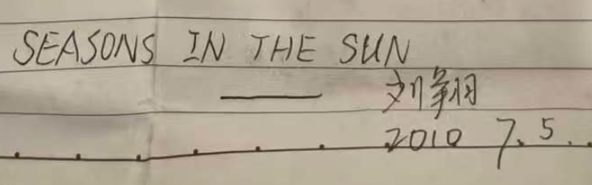

1. 他的死不是冲动，不是感情用事，不是自私，不是矫情，不是想不开，是一个天才的陨落
1. 死因，高天赋高敏感，以及原生家庭的伤害，全家族的价值观，全社会的价值观
1. 劝解，和对活着人说的话
1. 穿插着他的旧事
1. 定价权的丧失，

你说，你的死和任何人无关

但事实上，你的死和太多的人有关

不是你的错，是那个荒诞的时代，让你爷爷总是家暴你的奶奶

不是你的错，是你祖父母不能给你父亲足够的成长环境，从而给你带来情感漠视

不是你的错，是那个大下岗的时代，让东北人恐慌

不是你的错，是那个独生子女的时代，让你没有兄弟姐妹跟你分担痛苦

不是你的错，是那个人类历史上少有的经济大发展，让你看到了上海同学的势利、社达和缺乏人味

不是你的错，是这个吃人的外儒内法的强盗思维，让你削足适履

---

今年又是世界杯的年份，每到世界杯，我都会想起刘翔，想起那个2010年的盛夏，想起那个年仅22岁、满腹才华的好友不幸离世。而如今，我似乎感到，我终于有能力写一篇纪念刘翔的文章，并尝试解开那个疑惑了我十六年的谜题。

刘翔并不是一时冲动而自杀的，不是因为感情，也不是因为学业，更不是因为债务，不是因为某种失败的羞耻而无力支撑，相反，他在世俗上很是灿烂的节点，主动选择了死亡，从而停止现实对自我灵魂的摧残。

虽然刘翔的离世让爱他的人痛苦万分，但刘翔不是一个自私的人，他的心里充满了对这个世界的爱，他没有控诉这个世界曾给他带来的巨大痛苦，他满怀着对世界美好和热爱，离开了这个多彩又窒息的人间。

刘翔不是一个矫情的小心眼，人们不该责怪他没能有机会达到更高的心智，很少有人真正承受过他那常人无法想象的痛苦，他那极高的天赋与敏感，让他吸收了太多了父系带给他的毒素，而母系的窒息让毒性增强，以至于他在尚未破壳再生之前，便让那副世间稀有的鎏金羽翅，永久的丧失了自由翱翔的可能。

## “我的死亡与任何人无关”

刘翔是在2010年7月14日去世的，但在他轻生的九天前，他便写好了遗书，遗书的第一句话，刘翔写到：

> 我是一名同济大学的学生。我的死亡与任何人无关。

虽然刘翔的内心堆满了痛苦和折磨，但是认识他的人都知道，他总是面带微笑，即使他已然决定要结束自己的生命，他最先考虑到的，依然是不给别人添麻烦，不让父母亲友背负愧疚。纵使这个世界曾给他带来千疮百孔，他奉还给世界的依旧是极致的温柔。

但他的死真的和任何人都无关吗？刘翔不过是撒了一个善意的谎言，他的死和他身边的整个世界都有关。刘翔的死，不是一个偶然的意外，刘翔没有做错什么，但他不幸遇到了父系家庭的暴戾和恐吓，遇到了母系家庭的功利和冷漠，遇到了独生子女一代的重压和孤独，遇到了大下岗时代的恐慌，遇到了整个社会从匮乏童年走向偏执青春期的阵痛。

如果偏要说刘翔属于自己的过错，仍然是他太不幸，不幸生来是个温柔、敏感又纯粹的天才，如果早知他会成长在这个一个毒性环境，“惟愿孩儿愚且鲁，无灾无难到公卿。”

## 千疮百孔下的 “百毒不侵”

对于这个世界对他的伤害，刘翔太过心智肚明，但他并不直接想说，他在遗书的第三段话中写道：

> 我很早之前就已经百毒不侵了，今天要试一试最新练成的刀枪不入

刘翔哪里是百毒不侵，分明早已千疮百孔，这种毒素的积累是从他祖父那里就开始了。

刘翔1988年11月21日出生于黑龙江省绥棱县，刘翔的父系家族都很会读书，学习成绩都很好，他的父亲曾是中考的县里第一，平时也是经常考第一，高考去的佳木斯农校，而刘翔从小也表现的非常聪明，她母亲因此 “乐的不行”，刘翔小学原本就读于绥棱五小，二年级的时候，因为他母亲工作原因（盖新的国税楼），转入到绥棱一小的一班，初中的时候，也是离家近的绥棱五中，刘翔中考630分（满分690）是绥棱五中的全校第六，绥棱县第十三名，我和刘翔小学、初中、高中都是在同一所学校，而我第一次听说刘翔，是在初三，2003年5月，学校组织语数外理化生六科的竞赛，刘翔全部进入了前十，一下全校就都记住了，这个和短跑运动员重名的六班天才。

而刘翔的这样的成绩，并不完全是智力碾压带来的副产品，同时也是带着血的自我压抑。2011年2月9日，我去刘翔的家里，看望刘翔的父母，刘翔的父亲对我说了一件事，说刘翔小时候，刘翔父亲害怕刘翔要钱，刘翔父亲就问刘翔要不要大烀饼，刘翔说要，他就给了刘翔一个大嘴巴子。刘翔父亲挑出这样一件事跟我说，应当是他很愧疚的一件事。

刘翔的父亲给刘翔带来了这么多的伤害，但刘翔的父亲同样也是家庭创伤的受害者。他在童年，目睹了自己的父亲打了自己母亲一辈子，并不是刘翔的父亲不想有更好的共情能力，而是在这样一个充满戾气的家庭里，共情意味着打开了痛苦的水龙头。

刘翔的父亲觉得自己的童年太痛苦，现实也太多不满意，他对这个世界充满了怨恨，他需要这个世界偿还给他那些他原本可以拥有的快感，但他又没有太多的好办法，他仍然需要在朋友面前炫耀，通过出于讨好他人、出于虚荣的消费获得短暂的自我认可，他不敢把这种

他需要那些

小学二年级的时候，因为五小不重视作文，导致刘翔不会写作文，刘翔就急的大哭，看到自己儿子的脆弱，刘翔的父亲没有给他安慰和鼓励，反而撕掉了他的作文本，或许这个微小的不完美，让他想起了那个年近15岁就喝农药自杀的刘翔姑姑，而这位漂亮又老实的孩子做错的事，仅仅是考试考了第四，就要得到这个冷血家庭的精神虐待，刘翔的父亲正是生活在这样的生存恐惧之中，如何能不扭曲他对瑕疵的看法？

可是，刘翔的爷爷就是天生的恶毒吗？他一生经历战乱变革，在一个能呼吸都是奢望的匮乏年代，

面对上一代的伤害，刘翔的父亲选择了代际伤害的传递，选择了自私和切断了共情，而他的儿子却把所有的伤痛都抗在身上，就算刘翔高敏感的吸收着世界带来的绝望，他也不曾想给别人制造麻烦，总是要把温暖留给他人，而允许残忍在自己心里积累了二十余年。刘翔的父亲选择了向外的报复，并把自己最亲近的人当成了情绪沙袋，而刘翔选择了容忍，直到自己不堪重负，毒满器破。

## 窒息的爱终于 “管不到了”

<figure>
  
  <figcaption></figcaption>
</figure>

刘翔天赋高，高敏感性格，不愿与亲近的人沟通交流真心想法，刘翔天天带耳机，不爱听父母说话

母亲的控制

1998年，当刘翔可以通过电脑给他妈妈同事，解决那些电脑问题的时候，刘翔给他的母亲支付了大量的社交货币，在我们绥棱小县城，高考能达到接近660分，去985，是一个很大的社交满足，刘翔给了这个家这么多，但是有人真的关心，他自己想要什么吗？但是刘翔的父母不是冷血的奴隶主，他们把他们觉得对刘翔好的，未来对刘翔有利的世俗成功，强压给了他，包装成了刘翔真的渴望的未来，但实际上，刘翔父母更多的判断，来自于自我情绪的排解，怎么做让自己情绪上舒服了，那就是对的，唯独不想着，如果让刘翔自己选择，他会怎么做？我的儿子给了我那么多，是不是应该让他来做主，让他来决定

刘翔的父亲，得知刘翔考上了同济大学，他一定是非常开心的，也肯定有他的身边朋友，让他感受到这种社交收益，不过，刘翔父亲并没有什么公平交易的思考角度，大学时，不让刘翔回家，让刘翔打工，刘翔的爸爸说刘翔，能活活，不能活死，刘翔一辈子都在做一个乖儿子，而到他死，他也等不到一个合格的父亲出现。

刘翔总是在付出，总是被自己的家庭掠夺，在他要离开校园，自行与这个世界交易的时候，他的世界观是极度扭曲的，“鸟要挣脱出壳，蛋就是世界”，从刘翔的角度来看，这个世界充满了掠夺，充满了 削足适履

父母用着都是为你好，其实到头来是为了缓解他们那荒唐的焦虑，父母说着也就他们会跟你说实话，其实就是还想在自己的亲生骨肉面前，体验智力上虚无的优越感，即使给孩子带入深渊，也要显摆自己那可笑的明智，说到底，缺乏共情能力的父母，就只能是满满的自私。

## 出卖 “灵魂” 的 “削足适履”

<figure>
  
  <figcaption></figcaption>
</figure>

社会的绞杀

> 鸟要挣脱出壳，蛋就是世界。人要诞于世上，就得摧毁这个世界

> 山中何所有？岭上多白云。只可自怡悦，不堪持赠君

你的几个姨姨们，或许没有你那过人的天赋，或许过早向现实低头，她们没有看到世界美丽的眼睛，就意味这世上没有亲身体会的快乐。

刘翔，你就算可以变成世俗上历史级的优秀，你也不欠这个世界的，反而这个世界亏欠你太多，可惜你太善良，可惜你没有愤怒的去指责他人，有时候，我厌恶那些以自我为中心的人，但我有时又多么的希望你当年能自私一点，适当的自我防御是一个渡河的舟筏，过了河，你再丢掉就好了。

可惜你那壳里的毒素太重了，还没等你破壳，就被窒息而亡

会有人说，你如果再皮实点就好了，再多点挫折就好了，一个没有皮肤的人，就不应该出门，而不是适应暴晒。

可怜的是，这个世界的痛苦，还在传递，他们为了一些虚假的，错误的，所谓的 天下无不是的父母，或者有的家长觉得自己作为父母，就是一次当皇上的快感，而不会把子女作为独立个体的尊敬和公平。

，交友如探店，去一个学校读书，就是去一个牙所治牙

甚至可以认为，没有经历过父母的情感虐待的是少数，

刘翔说，社会上的削足适履很多，他说的很精准，但其实本质，还是充满掠夺的自私，连整个社会反复强调的家庭里，都可以因为缺乏共情而充满残忍，那些动不动就寻求更广义父权认可的人，实在是愚蠢的自虐。

我没有刘翔那么纯粹，当我面对自己的创伤的时候，我选择了通过显摆，通过获取他人的认可，来换取一件铠甲，来保护自己因创伤而带来的不安全感。

刘翔啊，刘翔啊，你是一个天才，你是一个道德感极强的人，可你身边都是些什么水平的人，分不清的，他们这些人，就是你家边上废品收货站的大老爷们，你自己是什么，你是跑得动最高帧率的顶级显卡，你是能够识别出人生更加美好的高端传感器，你为什么要把自己看的那么低？为什么要把身边的这些人看的这么高？难道谦逊的美德，不，难道说是你不会定价，让你误判了吗？

收破烂的大爷把顶级的显卡当成了破铜炼铁，是他们没见过世面，是他们不识货，不是你的判断是错的，你的追求是幼稚的，可惜，你身边都是这样的不识货的浅薄之辈，在你没有建立起足够的自信前，别他们忽悠的信以为真。

## 在乎才会 “不屈”，无感也便无争

<figure>
  
  <figcaption>刘翔遗书的最后一句话</figcaption>
</figure>

“木以不材得终其天年”，爱上笨拙和脆弱的自己，喜欢上别人的轻视和拒绝

在这个不健康的社会，平凡是尽兴的伪装，伟大是自害的代偿

那些真的削足适履，真的在系统里占个好坑的人们，用虚假的优越感麻痹自己，本质上，他们就是一辈子都还只是停留在高中生的浅薄心智之下

被人说，是个没用的废物，那是没被那更广义的父权掠夺的幸运

被人说，是个二傻子，那是敢做自我王国里逸仙人的光荣印记

我可能站着说话不腰疼，但是再大的痛苦看起来都是局域的，时间似乎可以让我们忘却彼时的极端，

在平地上行走，刘翔，你为什么还要那么奇怪的扛着一个梯子走路？你不是在家，不是在和你充满苛责的父亲交流了，不是在和对你有这各种要求的母亲对话了，不爽了，你就提出来，世界上的蠢人很多，自以为是的人很多，那些以为自己很无私其实特别自我的人很多，你需要跟他们讲价还价，而是不是看到他们无理取闹，就觉得世界没了出路，你可以讨价还价，你会看到他们张牙舞爪，他们耍流氓面具下的心智不成熟，强硬下的软弱和虐弱，你都敢为了纯粹而死，你比那些给你带来的痛苦的人，要勇敢的多，是你

## "SEASONS IN THE SUN"

<figure>
  
  <figcaption>刘翔遗书的结尾和他的签名</figcaption>
</figure>

第一次接触，2004年的圣诞节，你在三班的门口，我路过向你脸上喷了很多喷雪。

我做填词游戏，不知道达利。

我想用刘翔的萧，吹《沧海一声笑》，但是不知道调子，刘翔帮我写下五线谱。

刘翔想要的不是，一个学校的虚名，他想要的是人与人之间的真心对待，

> But the stars we could reach 
>
> 我们所能触碰的星星
> 
> Were just starfish on the beach 
>
> 不过是沙滩上的海星

刘翔有着很高的音乐天赋 二个月就会看电视，九个月就会跳摇摆舞，电视里唱歌，刘翔听一遍就会唱

