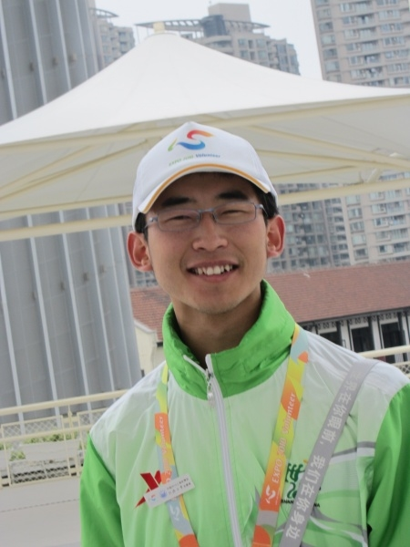
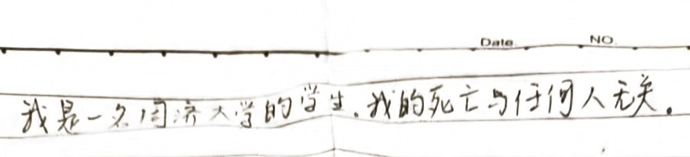
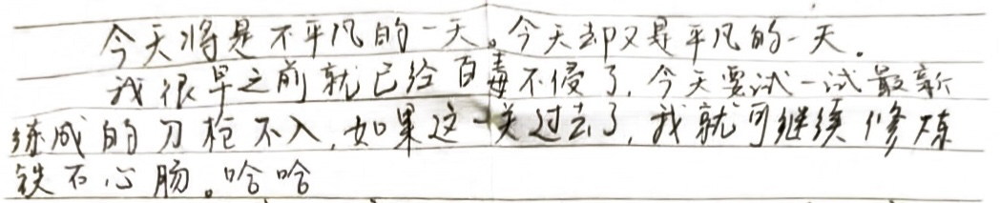
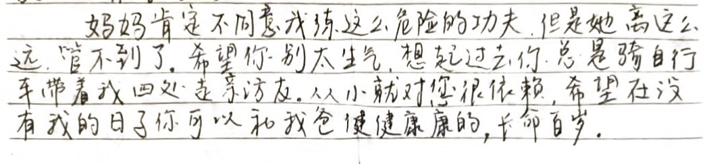
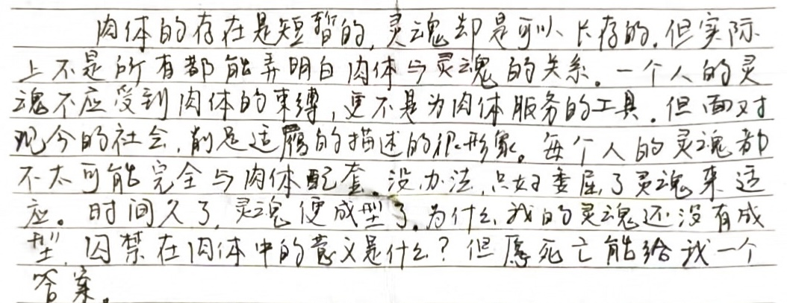
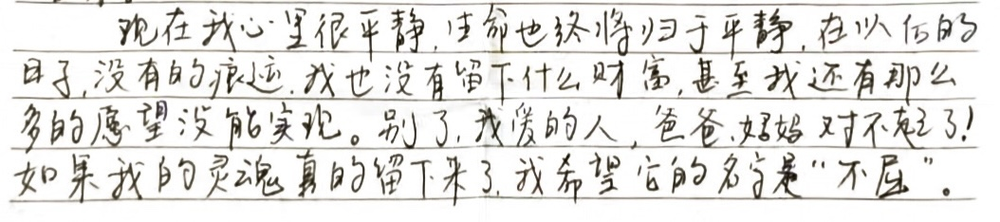
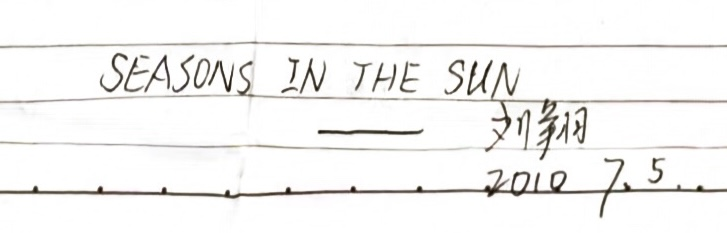
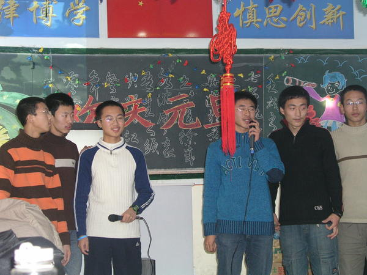

<!--  -->

<figure>
  
  <figcaption>刘翔</figcaption>
</figure>

今年又是世界杯的年份，每到世界杯，我都会想起刘翔，想起2010年的那个盛夏，想起那个年仅21岁、满腹才华的好友不幸离世。而今夏，我似乎终于有能力写一篇怀念刘翔的文章，并尝试解开那个疑惑了我十六年的谜题。

刘翔并不是一时冲动而自杀的，不是因为感情，也不是因为学业，更不是因为债务，不是因为某种失败的羞耻而无力支撑，相反，他在世俗上甚是灿烂的节点，选择了通过死亡来解脱痛苦。

虽然刘翔的离世让爱他的人痛苦万分，但刘翔不是一个自私的人，他的心里充满了对这个世界的爱，他没有控诉这个世界曾给他带来的巨大痛苦，他满怀着对世界美好和热爱，离开了这个多彩又窒息的人间。

刘翔不是矫情的小心眼，人们不该责怪他没能有机会达到更高的心智，很少有人真正承受过他那常人无法想象的痛苦，他那极高的天赋与敏感，让他吸收了太多了父亲带给他的毒素，而母爱让毒室更加窒息，以至于他在尚未破壳之前，便让他那双鎏金羽翅，永久的丧失了自由翱翔的可能。

## “我的死亡与任何人无关”

<figure>
  
  <figcaption>刘翔遗书的第一句话</figcaption>
</figure>

刘翔是在2010年7月14日去世的，但在他轻生的九天前，他便写好了遗书，在遗书的开头，刘翔写到：

> 我是一名同济大学的学生。我的死亡与任何人无关。

虽然刘翔的内心堆满了痛苦和折磨，但是认识他的人都知道，他总是面带微笑，即使他决然要结束自己的生命，他最先考虑的，依然是不给别人添麻烦，依然是不让父母亲友背负愧疚。纵使这个世界曾给他带来千疮百孔，他奉还给世界的依旧是极致的温柔。

但他的死真的和任何人都无关吗？刘翔不过是撒了一个善意的谎言，他的死和他身边的整个世界都有关。刘翔的死，不是一个偶然的意外，刘翔没有做错什么，但他不幸遇到了父系家庭的暴戾和恐吓，遇到了母系家庭的功利和冷漠，遇到了独生子女一代的重压和孤独，遇到了大下岗时代的恐慌，遇到了整个社会从匮乏童年走向偏执青春期的阵痛。

如果偏要找刘翔的过错，那也仍然是他太不幸，不幸生来是个温柔、敏感又纯粹的高天赋个体，如果早知他会成长在这个一个毒性环境，“惟愿孩儿愚且鲁，无灾无难到公卿。”

## 千疮百孔与 “百毒不侵”

<figure>
  
  <figcaption>刘翔遗书的第二、三段</figcaption>
</figure>

对于这个世界对他的伤害，刘翔太过心智肚明，但他并不直说，他在遗书的第三段话中写道：

> 我很早之前就已经百毒不侵了，今天要试一试最新练成的刀枪不入

刘翔哪里是百毒不侵，分明早已千疮百孔，这种毒素的积累是从他祖父那里就开始了。

刘翔1988年11月21日出生于黑龙江省绥棱县，刘翔从小就表现的非常聪明，他小学原本就读于绥棱五小，二年级的时候，因为他母亲工作原因，转入到绥棱一小的一班，初中的时候，在离家近的绥棱五中上学，刘翔中考630分（满分690）是绥棱五中的全校第六，绥棱县第十三名。

我和刘翔小学、初中、高中都是在同一所学校，而我第一次听说刘翔，是在初三，2003年5月，学校组织语数外理化生六科的竞赛，刘翔全部进入了全校前十，一下全校就都记住了六班有个叫刘翔的传奇。高中刘翔去了绥化一中，2007年高考，刘翔657分，是我们三班第二，被同济大学的给排水专业录取。

而刘翔的这样的学业成绩，并不完全是智力优势带来的副产品，也是带着血的自我压抑。2011年2月9日，刘翔去世后的半年，我去刘翔家看望他的父母，刘翔的父亲对我说了一件事：刘翔小时候，刘翔父亲害怕刘翔要钱，刘翔父亲就问刘翔要不要大烀饼，刘翔说要，他就给了刘翔一个大嘴巴子。

刘翔父亲挑这样一件事跟我说，应当是他对此很是愧疚。但类似的，给刘翔带来巨大心理创伤的事情还很多，小学二年级的时候，刘翔刚转学到一小，因为五小不重视作文，导致刘翔不会写作文，刘翔就急的大哭，看到自己儿子的脆弱，刘翔的父亲没有给他安慰和鼓励，反而撕掉了他的作文本。

其实刘翔父亲他们家都很会读书，学习成绩都很好，即使不那么勤奋，刘翔父亲也考了当年的绥棱县中考第一，高中喜欢看大书闲书，大学在佳木斯农校就读。

同样有着出色的学业成绩，刘翔的父亲也是家庭创伤的受害者。他在童年，目睹了刘翔爷爷家暴了刘翔奶奶一辈子，目睹了自己漂亮又老实的亲妹妹，在15岁那年，仅仅因为考了第四，而受到家中冷漠，便喝农药自杀身亡，并不是刘翔的父亲不想有更好的共情能力，而是在这样一个充满戾气的家庭里，共情意味着打开了痛苦的水龙头。

刘翔的父亲觉得自己的童年太痛苦，现实也太多不满意，他对这个世界充满了怨恨，他需要这个世界偿还他那些他原本可以拥有的快感，但他又没有太多的好办法，他仍然需要在朋友面前炫耀，通过讨好他人、通过虚荣消费获得短暂的自我认可。

刘翔的父亲深知自己有着很大的抱负和前途，但是他背着太多童年苦难带给他的负担，导致他觉得自己怀才不遇，闷闷不乐之下，只能在抽烟、喝酒、打麻将中醉生梦死，发了工资后请人吃饭，去弥补自己在这个世界上的空洞失落。

回到家里，对于刘翔父亲，就像是回到了安全的施虐场，来到了情绪价值补给站，刘翔父亲时常说好了给刘翔钱，然后食言。他在刘翔小时候就恐吓刘翔，吓唬刘翔不好好学习，长大了没有饭吃，喝酒喝多了就跑去刘翔的屋子里，没完没了的训斥和发泄。

但我想对刘翔父亲说，这些痛苦不是刘翔造成的？你为什么要从你无辜的儿子上要债？你小时候已经承受太多的精神虐待了，为什么还要让刘翔感到各种不安？让刘翔从小就浸泡在恐惧稀缺的状态之下？

刘翔难道总给你带来麻烦吗？在这个重视独生子女教育的时代，你作为父亲常常缺席离岗，但是又有多少次，你在同事圈子里，刘翔给你脸面上争光？我想，在刘翔父亲放情纵意的中年，他不会考虑和儿子是否公平交易，“老子就恶心你了，你能把我怎么样？你若没能力反抗，我就压榨你的情绪到死”。

而事实也确实如此，考上同济，刘翔父亲是很自豪和开心的，但又几乎从不在刘翔面前表达，在大学，刘翔父亲喝酒之后，说要把刘翔高中的照片都烧了，吓得刘翔把所有照片都藏到他母亲的房间，或许是长期喝酒受到酒精的伤害，大学的时候，刘翔已经放假了，他父亲不让他回家，让刘翔在外面打工赚钱，还曾说出 “能活活，不能活死” 这样的如刺刀般的恶语。刘翔一辈子都在做一个乖儿子，而到他死，他也等不到一个合格的父亲出现。

面对上一代的伤害，刘翔的父亲选择了代际伤害的传递，选择了自私和切断共情，而他儿子却把所有的伤痛都抗在身上，就算高敏感的刘翔吸收着世界带来的绝望，他也不曾想给别人制造麻烦，总是要把温暖留给他人。刘翔的父亲选择了向外的报复，并把自己最亲近的人当成了情绪沙袋，而刘翔选择了容忍，直到自己不堪重负，毒满器破。

刘翔去世后，刘翔父亲也幡然悔悟，总是整夜整夜的睡不着，喝完酒后拍胸脯，说是他把这个家毁了，刘翔去世后的两年，刘翔的父母离婚，2020年7月14日，刘翔逝世十周年的时候，刘翔父亲写到：

> 儿子，今天是你走后的第十个年头了！做父母的我们心里仍然非常的怀念你、思念你！
> 
> 由于我们做父母的对你缺少关爱和理解，导致你不辞而去，给家庭造成了毁灭性的打击。
>
> 但愿你能常常走进我们的梦里，让我们在梦里相见。
>
> 终有一天，我们都会在天堂里相见的，想念你，我的儿子！

我并不是要在这里做一个傲慢的审判，毕竟我没经历过刘翔父亲那无比窒息的童年，刘翔父亲前半生有着原生家庭的苦难，虽然中年有所享乐，但也都是充满逃避和报复的原始快感，刘翔的去世又给他带来了太多的痛处和自责，在这贯穿两代的悲剧里，刘翔的父亲既是受害人，又是施害者，作为晚辈，希望刘翔父亲能走出这悲惨重重的人生剧本，珍惜余生的美好。

## 窒息的爱终于 “管不到了”

<figure>
  
  <figcaption>刘翔遗书的第四段</figcaption>
</figure>

> 妈妈肯定不同意我练这么危险的功夫，但是她离这么远，管不到了。

从小到大，刘翔的妈妈就一直在管着刘翔，替他做很多决定，刘翔说，“从小就对您很依赖”，而事实正好相反，刘翔的母亲一直对刘翔很依赖，无端地给刘翔带来了太多，完全不属于他的重担。

刘翔的父亲，不仅给刘翔带来了伤害，也摧毁着刘翔母亲的幸福婚姻，他父亲在家里张口就骂，举手就打。刘翔很心疼自己的母亲，可刘翔母亲却对刘翔说，她是为了刘翔挨打，还说如果没有刘翔，她活着有啥意义。

刘翔母亲或许没想太多，但这些话的背后有着隐秘的、不亚于他父亲显性暴力的伤害，甚至可以说对幼小的刘翔是极为残忍的，刘翔母亲自己的心理创伤应该作为成年人自己去抚平，为什么要把人生的重量压在一个孩子身上？刘翔妈妈，你生活的意义，是你作为成年人自己去寻找的，你生活的不幸福不是刘翔造成的，为什么要把账算在刘翔身上？

母爱本应是无条件的，可突然，今后的每一份爱意，都让刘翔觉得自己背负着一个沉重的十字架。幼小的刘翔，很早就成了母亲生活支撑的心理奴役。刘翔从很小，既要做父亲破碎童年的债主，又要为母亲的不幸婚姻赎罪。就算换成一个成年人，也不容易识破这种情感操纵，更何况这是刘翔赖以生存的无解牢笼。

刘翔被他父亲无情摧残的时候，刘翔母亲劝他，“要学出个样来，给你爸看”，这句话同样是充满毒素的。作为母亲，刘翔妈妈本应保护刘翔，把刘翔从伤害的环境里隔离出来，怎么还要去讨好施暴者？难道说，刘翔今后的成功和出色，是他爸爸打的对了？骂的再狠一点，就会变得更好？更何况，刘翔父亲的童年创伤是一个自恋无底洞，刘翔再出色也不会填满，刘翔在压抑自我中取得成绩，到头来必然发现还是一场空，如此缘木求鱼，他不崩溃谁崩溃？

刘翔的母亲还说，早年不和刘翔父亲离婚，是因为她自己管不了刘翔。这其实也是很残忍的，难道说是刘翔太不乖了，才给刘翔母亲造成的婚姻不幸福吗？在这种描述下，刘翔母亲也默许了刘翔父亲的施暴，觉得只有这种暴力手段才能达到对刘翔的控制。但这种控制是真的对刘翔好吗？在这层以爱为名的控制里，有多少是为了刘翔母亲自己的愿望达成，而不是刘翔的真实渴望，况且，刘翔母亲是否有足够多的学识和智慧，替刘翔做出对他好的重大决策？

刘翔不应该为了他父母的虚荣、焦虑又或掌控欲，去摧毁他自己的未来。成年人的婚姻不幸、在社会上怀才不遇或是和亲戚攀比落了下风，这些是你们自己的事，你自己想办法、找其他渠道解决，又不是刘翔造成的，凭什么非要让他负责拯救，刘翔为什么要为此感到内疚和背负重担？

> 你的孩子不是你的孩子
>
> 他们通过你来到这个世界，但并非因你而来
>
> 他们总在你身边，但不是你的附属
>
> 你可以给他么你的爱，而不是你的想法
>
>            纪伯伦《孩子》

1998年，不到十岁的刘翔给他母亲同事解决电脑难题，刘翔便给他的母亲支付了大量的社交货币，在我们绥棱小县城，高考能达到接近660分，去985，是一个很大的社交满足，刘翔给了这个家这么多，但是有人真的关心，他自己想要什么吗？

刘翔的父母不是冷血的奴隶主，他们把他们眼里正确的世俗成功强压给了刘翔，包装成了刘翔未来会真心渴望的期权，但实际上，刘翔父母更多的判断，来自于自我情绪的排解，怎么做让自己情绪上舒服了，那就是对的，唯独不想着，如果让刘翔自己选择，他会怎么做？

既然你们的儿子这么聪明，又知道自己懂得又不多，为什么不多自我反省一下，是不是自己想的太少、想的太简单了呢？类似的这种反思实在太难了，控制欲强的父母，还想从自己子女身上显摆自己的高明和睿智，哪有足够的能量来正视自己的认知匮乏和胡乱指挥。那些未经审视的本能，往往带着自私的基因，那些缺乏共情的爱，就会变成以爱为名的窒息绞杀，甚至是管窥效应下生成的入坑指北。

在这样的家庭环境里，孩子得不到一个互惠的公平，而是谁当了强盗反而更受尊敬的荒谬。如果说你做这些都是出于爱意，那请各位父母扪心自问，是不是这么做有利于自己的虚荣心满足？这么做是不是让自己少了很多焦虑、有了更多安全感？这么做是不是考虑到了孩子潜意识里或者智力加工过的更优解？

刘翔高中的时候想学文科，但是刘翔的母亲没有同意，如果刘翔去学了文科，读了陀翁的《卡拉马佐夫兄弟》是否会早一点醒悟而精神弑父？是否看了萨特的“他人即地狱”，就不再为他人的期许而牺牲自我？是否他在文学和诗歌的情感寄托中，找到了情绪的释放口，就不至于积压太多的负面毒素？

我们那时候，为什么要学习理科呢？而不去学习康德的哲学呢？因为可以混口更好的饭吃，因为可以有更好的名声，可惜，就算刘翔在同济吊线是最准的，又怎比得了那片刻的、自由却无用的时光呢？而造成这种管窥效应的源头，也在于刘翔母系家族里普遍功利的心态，以及缺乏人味的冷漠。

刘翔的母亲和姨母们，都是社会达尔文主义的拥趸，强调学历标签、多金的工作以及门当户对的配偶，刘翔三姨家的姐姐在上海工作，刘翔去世当天曾给他母亲打电话说自己活不下去了，刘翔母亲给这位姐姐打电话，刘翔的姐姐因为有客户要陪，没能及时赶到。这位姐姐曾和刘翔母亲说，处对象要到大学之后才到一个起跑线上的，刘翔初中的时候有心仪的女生，但是他母亲制止他恋爱，理由是“初中就不在同一起跑线上，没考高中，这孩子不行”。刘翔后来的女友要考浙江大学的研究生，刘翔母亲觉得同济的本科生工作上更吃香，没有同意刘翔考研，弄得刘翔很后悔。

刘翔去世前不久，刘翔女友给刘翔妈妈打电话，说刘翔的情况很不好，刘翔的四姨家里条件不好，她劝刘翔母亲，说刘翔上名校，有对象，有工作，啥都有了，不用浪费去上海的机票钱，没什么事。刘翔四姨不是恶意，但却因为狭隘浅薄，让刘翔丧失了获得情感缓冲的最后一线生机。

相比于刘翔父亲的烈性，刘翔母亲的多数做法，不过是一种社会共识或者至少是她圈子内共识的执行，类似的悲剧，类似的童年创伤，在我们这代人的身上或多或少都有所体现，甚至类似的养育错误仍在伤害着下一代孩子，让创伤代际相传。刘翔的母亲不是什么罪人，都是第一次做人，她只是恰巧生活在这样的氛围之下，对刘翔母亲来说，她有幸有一个她甚是喜欢的聪明孩子，但又不幸的，刘翔是一个有着纯粹洁癖的高敏感，也就是一个“聪明过了头”的高天赋个体。

## 削灵魂的足，适肉体的履

<figure>
  
  <figcaption>刘翔遗书的第五段</figcaption>
</figure>

刘翔在自己遗书中，用最大的篇幅写了一段哲学思考，这其实是他有着极高认知带宽的一个体现，也是他作为高敏感人士在面对死亡时的一种纯粹。

我将尝试对刘翔这一段哲思进行解析，也是对刘翔用死亡反抗压迫的深入解释。

> 实际上不是所有 (人) 都能弄明白肉体与灵魂的关系。
>
> 一个人的灵魂不应受到肉体的束缚，更不是为肉体服务的工具

刘翔这里所指的 “肉体”，其实就是 呼吸的代价 和 社会期许的重压，具体的，既有那些满足基本生存的低阶欲望，也包括了这个充满焦虑和恐慌的社会，所普遍渴望的学历、工作、房产或名望，也就是那些为了生存而不是为了生活的种种防御。“肉体” 就是那个充满了皮质醇驱动的 “虚假” 自我。

而 “灵魂” 二字，指的是那些超越物质和社会角色的高阶渴望，是可以去做一个自由探索、去追求自认价值的 “无用” 之人，是体会到人与人之间的真挚情感，是享受静逸中狂喜，是可以靠着好奇心、创造力和兴奋探索而自发驱动的 “真实” 自我。

而为什么要有 “肉体” 和 “灵魂” 的二元分割？是因为人脑作为进化而来的原始器具，在神经系统出厂的时候，被预先写入的为适应古早时代危险的底层代码，尤其是对物质资源匮乏的恐慌，以及对社交互动中的对比和评价，这样的高情绪反馈对当时恶劣的生存环境有着托底般的关键优势。

但作为已知宇宙最具适应能力的物种，人类的大脑不会始终紧绷着，不会活着仅为了防止自己被环境淘汰，人类也会随着环境的放松，去积累那些有利于高维度模型建立的认知小食。

而那些有着认知冗余的个体，敢于使用更高能耗却更为强健的损失函数，在更为安全的环境，可以将之前奉为圭臬的条条框框作为客体，观察反思，用更高维的模型将其囊括，从而更从容的面对多变环境。

之所以存在 “肉体” 和 “灵魂” 这样鲜明的分水岭，是因为在个体心智提高的过程中，能突破生存和社交的本能束缚，是难度极大的一次升维跃迁。如果从自我发展理论来讲，就是从社会化心智，进阶到自我主导心智，也就是产生了一个不只为肉体服务的灵魂视角。

> 每个人的灵魂都不太可能完全与肉体配套，
> 
> 没办法，只好委屈了灵魂来适应。
>
> 时间久了，灵魂便成了型。

刘翔想说的，就是社会上的多数人，都停留在了社会化心智的层面上，他说，“委屈灵魂” 其实就是大家觉得 “人活着就这样” 或者 出于缺乏安全感的恐慌，去批评高阶追求的“不接地气”。但刘翔用 “委屈” 这两个字并不是恰当的，在很多人的视角里，社会化心智其实是很自洽和舒适的，虽然也有摩擦，但因为冲突不那么剧烈，也不必敏锐的面对虚无。使用社会化的思维，就像是终生佩戴红色的滤镜，强行摘下来才是令人不适的。

刘翔说，“灵魂便成了型”，很像是福柯所说的，“灵魂是肉体的监狱”，也就是之前说的好奇心、创造力和兴奋探索，并没有为个体的自我发展服务，而是成了提高社交收益的一种手段，而不是目的。

刘翔想的很清楚，人活着不应该只是为了满足那些离生存很近的、仅仅激发边缘系统的浅薄欲望，但多数人觉得大家都是这么活的，又或者没遇到低维的脆弱和模型失效所带来的痛苦，就放弃了独立思考和叛逆反抗，不自觉地吃下了蓝色药丸，活在母体的宜人梦境。

> 为什么我的灵魂还没有成型？

在刘翔灵魂塑造的过程中，有两个人体现着他所渴望的灵魂模样，一个是他的姥姥，一个是他的女友。

刘翔姥姥生活在资源匮乏的时代，信仰的同样是为了肉体而舍弃灵魂的生存哲学，刘翔的姥爷会口琴，会钢琴，还会吹箫，曾在宣传队待过，刘翔的姨姨们也有音乐上的天赋，但是刘翔奶奶很务实的不让自己的几个女儿从事文艺，而让灵魂臣服于肉体，她曾劝告刘翔的母亲“男孩6岁前必须管住”，我猜测，刘翔母亲的很多教育方式和理念，也是从刘翔姥姥那里习得或是模仿来的。

或许是因为世俗规训的重担交给了女儿，隔辈亲的姥姥对刘翔非常的娇惯，刘翔小时候，他把姥姥家的床单剪出好多口子，但是他姥姥却不去管他。刘翔姥姥对刘翔的包容和溺爱，可以让刘翔卸下窒息家庭中的沉重伪装，尽情释放自己的天性，而不用担心惩罚。

刘翔姥姥在世的时候，家里是儒道冰火两重天，但在2003年2月25日刘翔姥姥去世之后，刘翔失去了那个温暖的避风港，刘翔在日记里写到：“姥姥去世了，再也没有懂我的人了”。或者说，是没有人再让他随意做他真实的自己了。

刘翔在遗书的最后一句写到，“如果我的灵魂真的留下来了，我希望它的名字是 ‘不屈’ ”，而 “不屈” 是他女友的网名。刘翔的女友是我们的高中同班同学，现在来看，他的女友就是刘翔那个“未曾实现的自我”，一个至少在高中时代活出了“自由”的人，他的女友开朗活泼，喜欢吐露心扉，能够通过与外界的倾诉来消化自己的情绪，最重要的，他的女友有着强烈的自我意识和主张，有着清晰的边界感，这对刘翔来说是致命的吸引，刘翔在大学的时候为了常去南京看他的女友，曾一天就吃一个菜，但也大概正是这些优点，成了他们最终感情破裂的诱因，刘翔在自杀前的两个月，和女友分手。

刘翔，面对你的原生家庭，我多希望你能自私一点，而面对这些人生难题，我又多希望你能像维特根斯坦一样，大胆地自恋一点，你疑惑自己的灵魂为什么没有成型，原因就是因为你太聪明了，因为你有着溢出的认知带宽，和维特根斯坦一样，你那纯粹的灵魂对世俗的修剪是本能排异的，你的高敏感让你对道德与审美有着超出常人的洁癖，让你对世俗的荒诞有着生理性的厌恶，就像维特根斯坦所说的那样，“一个人懂得太多就会发现，要想不撒谎很难。”

> 面对现今的社会，削足适履的描述的很形象

刘翔或许在那个年龄，想不明白，为什么这个社会要削足适履？但他描述的是对的，过去十六年了，即便社会变得更加健全和更有保障，但“削足适履”的情况仍然普遍存在。

之所以 "削足适履" 广泛流行，源自于物质的匮乏和人味的稀缺，源自对丧失基本生存保障的广泛恐惧。在各层次意义上的广义父权看来，制造稀缺、产生恐惧可以更轻易地控制，可以降低群体作为抽象概念的生存恐惧，可以满足集体幻觉下的边缘冲动。

“削足适履” 的本质，就是提高模型预测的局部精准性，但要牺牲适应多变环境的灵活性，也就是统计学上的过拟合，为了提高认知模型的拟合效率，就会让大家对高确定性的、简单粗暴的代理指标过度依赖，催生人为稀缺，制造管窥效应下的焦虑恐慌，虽然这种心态有着对全局欠拟合带来的低维偏见和预测脆弱，但又极为少见的在21世纪初的中国，“削足适履” 的人们得到了极高的超预期收益，直到最近几年，那些有着反脆弱思维、未被稀缺心态困扰的人，才逐渐显示出高维模型所带来的理性优势。

> (我的灵魂) 囚禁在肉体中的意义是什么?

刘翔说，他的灵魂囚禁在肉体中的意义是什么？其实言外之意就是，他意识到即使从黑龙江来到了上海，即使他进入了更广阔的新天地，也仍翻不出世俗这个如来的掌心，甚至可以说，步入社会，他将面临的是更为严厉冷血的父权，更加控制却少有温情的母体。他的灵魂不仅不会被解放，而且肉体所要承受的痛苦还要翻倍。

庞大僵化的人造系统，会把公平的雇佣关系、价值交易，美化成组织对你的恩赐福报，让你觉得有还不清的恩情债，通过各种毫无边界感的侵犯和人格打压，借助稀缺心态迫使个体卑微臣服，产生难以逃离的广义依赖。如果个体感到不悦想要反抗，还会被身边人责备成“身在福中不知福”，就只能继续在精神阉割的体面下、在金手铐的稳定中牺牲自我和聊过此生。

高考后的报志愿，选城市，选学校，选专业，都是刘翔母亲帮决定的，刘翔上了大学之后，说这个世界充满戾气，刘翔说他有同学在同济大学的工厂打工，让老板给打死了，即使是在2010年，刘翔也因上海房价高而感到恐惧。大三的时候，刘翔在全国最大的上海设计院实习，同济大学有100多人想去那里实习，就要两个人，其中之一就有他，在实习期间，刘翔就通过他大姨家表哥的同学找好了工作，是李嘉诚名下的一个公司，在那个年代就可以月薪过万，不过，同样是在大三暑期实习，刘翔在实习处的12楼纵身跃下，轻生离世。

> 肉体的存在是短暂的，灵魂却是可长存的
>
> 希望死亡能给我一个答案

因长期的精神受虐，刘翔的抑郁特质由来已久，在大一的时候就有轻生的念头，他曾说这个世界没有懂他的人，2010年5月23日，刘翔更改签名，写到 “到时候我跟谁道别呢”，这时的刘翔已经决定要用死亡作为结束痛苦的最佳方案，6月5日，他又写到：“我为什么没有死呢？我到底再留恋什么”，就在这段时间，刘翔把自己剃成光头，早晨五点多就起来，在操场上一圈一圈跑，来释放心中的躁动。6月25日，刘翔说 “刘翔啊，你就作吧，我看你还能喳呼多久！”，他用第三人称来自我指责，看起来又也像是一次自救，到6月28日的时候，刘翔的痛苦占据了上风，因重度抑郁而造成的精神凌迟，让他彻底坚持不下去了，他写到 “我希望我的生命可以短一些，再短一些”。7月5日，刘翔写下遗书，大概他曾选择在那天给一切画上句话，九天后的7月14日，在那个攻占巴士底狱、象征自由的日子，他终究还是没有接受生的挽留，而选择了死的召唤。

刘翔说灵魂可以长存，但这不过是一种自我安慰的美化，无论肉体还是灵魂，都是观察者借以存在确认的信息压缩，没有什么会在观察终结之后还能独立存在。刘翔希望死亡给他一个答案，但死亡只能给他解脱，却永远不会给他答案，只有活着才有机会知道答案，死亡是砸碎电脑，而不是运行一个解谜程序。但我想刘翔也知道，他自己并不是真的在乎答案，他最想要的就是从这个深不见底的炼狱里彻底的逃脱。

## 在乎才会 “不屈”，无争才会无敌

<figure>
  
  <figcaption>刘翔遗书的最后一段</figcaption>
</figure>

> 现在我心里很平静，生命也终将归于平静。
>
> 我也没有留下什么财富，甚至我还有那么多的愿望没能实现。

刘翔的一生饱受皮质醇浸泡的折磨，在多巴胺的枯竭中离世，而刘翔渴望的内啡肽宁静，只肯在他决定离开前，才舍得倾泻。刘翔去世前两个月，也就是2010年5月，第一代的美版 iPad 刚刚到货上海，刘翔还特别好奇的去邻寝看热闹。刘翔对这个世界还有太多的不甘和遗憾，奈何千疮百孔的内心已让世间的美好不足以支撑他，支撑他继续忍受这积年累月的痛苦，长期的抑郁情绪也让他腾不出更多的算力来参透人生的本质。但如果我可以穿越到十六年前，我又应该怎么劝服认知窄化下一心想死的刘翔呢？

> 鸟要挣脱出壳，蛋就是世界。人要诞于世上，就得摧毁这个世界
> 
>          《德米安》

首要的，我定会要让刘翔意识到，“天下无不是的父母” 这句话是多么的荒谬，我会把我上面写的那些有关他父母的文字讲给他听，让他意识到，父母对他的爱虽不虚假，但他们远没有刘翔那么有共情心，那么有宜人性，他们的爱里掺杂着自私施暴和无能自恋，他们通过心理操纵榨取着刘翔的善意，粉碎着刘翔的自尊，而刘翔只有通过 “精神弑亲”，才能从长期的心理投毒中解脱，才能停止自我攻击。

> 如果我的灵魂真的留下来了，我希望它的名是“不屈”

就像图灵那样，刘翔希望自己可以作为一个纯粹的灵魂和玉石俱焚的傲骨而被人铭记。

但是，一群只收废铜烂铁的大爷们，你为什么要逼他们看得懂英伟达显卡的价值？

虽然你过去在海里航行，可你在陆地行走的时候，为什么还要继续背着一个筏子前行？

【不要不屈，收破烂的类比】

【不要纯粹，梯子的类比】

【交易的类比】

你的几个姨姨们，或许没有你那过人的天赋，或许过早向现实低头，她们没有看到世界美丽的眼睛，就意味这世上没有亲身体会的快乐。

刘翔，你就算可以变成世俗上历史级的优秀，你也不欠这个世界的，反而这个世界亏欠你太多，可惜你太善良，可惜你没有愤怒的去指责他人，有时候，我厌恶那些以自我为中心的人，但我有时又多么的希望你当年能自私一点，适当的自我防御是一个渡河的舟筏，过了河，你再丢掉就好了。

会有人说，你如果再皮实点就好了，再多点挫折就好了，一个没有皮肤的人，就不应该出门，而不是适应暴晒。

可怜的是，这个世界的痛苦，还在传递，他们为了一些虚假的，错误的，所谓的 天下无不是的父母，或者有的家长觉得自己作为父母，就是一次当皇上的快感，而不会把子女作为独立个体的尊敬和公平。

，交友如探店，去一个学校读书，就是去一个牙所治牙

甚至可以认为，没有经历过父母的情感虐待的是少数，

刘翔说，社会上的削足适履很多，他说的很精准，但其实本质，还是充满掠夺的自私，连整个社会反复强调的家庭里，都可以因为缺乏共情而充满残忍，那些动不动就寻求更广义父权认可的人，实在是愚蠢的自虐。

我没有刘翔那么纯粹，当我面对自己的创伤的时候，我选择了通过显摆，通过获取他人的认可，来换取一件铠甲，来保护自己因创伤而带来的不安全感。

刘翔啊，刘翔啊，你是一个天才，你是一个道德感极强的人，可你身边都是些什么水平的人，分不清的，他们这些人，就是你家边上废品收货站的大老爷们，你自己是什么，你是跑得动最高帧率的顶级显卡，你是能够识别出人生更加美好的高端传感器，你为什么要把自己看的那么低？为什么要把身边的这些人看的这么高？难道谦逊的美德，不，难道说是你不会定价，让你误判了吗？

收破烂的大爷把顶级的显卡当成了破铜炼铁，是他们没见过世面，是他们不识货，不是你的判断是错的，你的追求是幼稚的，可惜，你身边都是这样的不识货的浅薄之辈，在你没有建立起足够的自信前，别他们忽悠的信以为真。

这些控制欲强的父母，我们不怪他们不知道一个显卡的价值，毕竟不是他们的强项，但是你们知道的少，是否可以谦虚谨慎一些呢？是否不要装懂不懂，跑来指挥，有几分是对子女好，又有几分是满足你的自恋情绪和掌控欲呢？

世俗的道理，是因为他们短视且无能，无知又自大，他们弄不清楚很多事，就把世界当成养猪场来看待，当成动物园来管理，因为人性的光辉太耀眼，过多的人味会照出他们的匮乏和黑暗。

刘翔不知道的是，他一出生就是天崩开局，他的父亲一侧，爷爷一辈子家暴奶奶、15岁的姑姑自杀、成家的堂兄跳江自杀，他母亲这侧，是唯结果论的社达、是缺乏共情的冷漠，更致命的是，刘翔自己天性上又是一个精美却易碎的工艺品，如果他没这么有才华，这么高敏感，似乎他可以少吸一些毒气，就算被父母口头嫌弃也不必做一辈子工具人，也就可以逃过一劫。

2007年，高考结束之后，我和刘翔都发现了物理的最后一道大题出错，也意识到另外一道大题是有问题的，在整个高考很有区分度的29分，接连出现重大命题失误，其实让我们很早就意识到了大人世界的荒诞。

刘翔有着维特根斯坦一般的洁癖，天才对土壤的要求是苛刻的。

那是一群情绪不能自理的巨婴，你为什么要过不去呢？

你生活在一个共情能力全面缺失的亲属环境之内

“木以不材得终其天年”，爱上笨拙和脆弱的自己，喜欢上别人的轻视和拒绝

在这个不健康的社会，平凡是尽兴的伪装，伟大是自害的代偿

那些真的削足适履，真的在系统里占个好坑的人们，用虚假的优越感麻痹自己，本质上，他们就是一辈子都还只是停留在高中生的浅薄心智之下

被人说，是个没用的废物，那是没被那更广义的父权掠夺的幸运

被人说，是个二傻子，那是敢做自我王国里逸仙人的光荣印记

我可能站着说话不腰疼，但是再大的痛苦看起来都是局域的，时间似乎可以让我们忘却彼时的极端，

在平地上行走，刘翔，你为什么还要那么奇怪的扛着一个梯子走路？你不是在家，不是在和你充满苛责的父亲交流了，不是在和对你有这各种要求的母亲对话了，不爽了，你就提出来，世界上的蠢人很多，自以为是的人很多，那些以为自己很无私其实特别自我的人很多，你需要跟他们讲价还价，而是不是看到他们无理取闹，就觉得世界没了出路，你可以讨价还价，你会看到他们张牙舞爪，他们耍流氓面具下的心智不成熟，强硬下的软弱和虐弱，你都敢为了纯粹而死，你比那些给你带来的痛苦的人，要勇敢的多，是你

那些用恐慌逼着大家削足适履的人本质上是采取了过拟合的低维粗糙，调入到局部最优解的泥潭，

## "SEASONS IN THE SUN"

<figure>
  
  <figcaption>刘翔遗书的结尾和他的签名</figcaption>
</figure>

<!-- <figure>
  
  <figcaption>2006年12月30日，刘翔与高中室友合唱《挪威的森林》</figcaption>
</figure> -->

虽然我初中的时候就听说过刘翔，且我们同去绥化一中上学，但我在二班，他在三班，没有过什么交流的机会。我第一次和刘翔接触，是在2004年高一的冬天，那一阵是圣诞节，同学们之间买圣诞果，写卡片，相互之间喷泡沫，也就是喷雪，我在走廊里跑闹，在三班的门口看到了刘翔，就向刘翔脸上喷了很多飞雪，而这个时候，我们还没有说过话。

在那之后，我每次走路遇到刘翔都会跟他打招呼，高二之后，我转到了三班，和刘翔寝室是对门，我常常去他们寝室玩，刘翔会吹箫，我便让他教我，我说我想吹《沧海一声笑》，刘翔就哼着歌，写下了简谱，让我学者吹。

也是在刘翔那里，我第一次玩了魔方，看到刘翔可以很快的恢复，让我觉得他好厉害，但是刘翔每每又是那么谦逊，赞赏别人却不夸耀自己。刘翔喜欢仰望星空，喜欢了解艺术家，我有一次做英语的 Crossword 遇到难题，就去问刘翔，便第一次从他那里知道，原来有个大画家叫做达利。

> We had joys. We had fun.
> 
> We had seasons in the sun.

我并不记得，高中时谁哪次考了第一，得到了那个海豚奖杯，却记得我躲在讲桌下面拿着斧头跟外教搞恶作剧，我不记得班主任在自习课上给我们都讲了什么衡中式的动员，却记得我接老杨的话，说那个仙人掌长得比我还要高，老师们讲了那么多题也都不记得了，但我还记得我讲了一个“一天一妻制”的笑话，把语文老师逗得蹲在讲桌下面笑了很久。

高考结束，我被自私的老杨忽悠胡乱报考，没去上心仪的上海，我还曾因你能去上海而羡慕你有个上心负责的好妈妈，但后来才知道你曾来到工大门口，独自流泪想复读考工大，我猜你和我一样，时常会想起那些美好欢愉的高中时光。如果你高考考的差一点，会不会就能和我一样，没事就找开哥、小哥去网吧打刀塔？如果你初二的时候不去上海看表姐，会不会你就能和我一起去看纵贯线的演唱会？一起去影院二刷杰克逊的《就是这样》?

你是你，我是我，如果是如果。但我真心希望，如果，如果有来世，刘翔，希望你能不再经历今生的痛苦折磨，希望你能在那虚幻的来世里，随性挥霍那只听命于灵魂的一生。

> Remember, remember
>
> All we fight for
> 
> Remember, remember
> 
> All we fight for 
> 
>            The Walkmen - Heaven