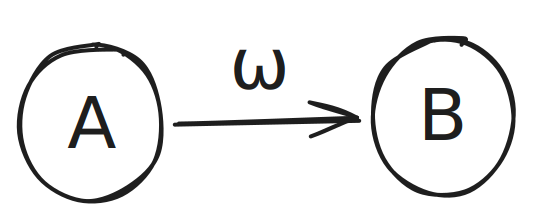

## $P(B\mid A)$

The equation $E=mc^2$ may be the most celebrated in science, but its practical impact on our everyday lives is limited it dazzles more than it delivers. Even Feynman’s championing of atomic theory, though fundamentally important, doesn’t always translate into direct, universal benefits. In contrast, the principle of Bayesian inference expressed as

$$
P(B\mid A) =\frac{\text{count}(A\cap B)}{\text{count}(A)}
$$

the probability of $B$ given that $A$ has occurred provides a versatile, widely applicable tool for updating beliefs and guiding decisions in countless real‑world situations.

The deductive world of logic and computation only means all $P(B\mid A)$ is always near 1 or near 0.

## Naive Frequency Updates

The position order is important in this senario, given "Name: Jordan", you may think about "Michael", but given "Name: Michael", your response will not as high as the previous one. 

## Bayes' Theorem

[Bayes’ Theorem](./notes/bayes) provides a framework for encoding information in a normalized form, which reduces the effort required for updating and managing data. For example, we might categorize and update records by gender—an easily identifiable feature—while handling other attributes through more systematic bookkeeping. This is analogous to choosing a convenient basis (for instance, projecting onto easy‑to‑compute eigenvectors) in linear algebra or adopting a common “lingua franca” for data‑management tasks.

In both our brains and pattern‑recognition models, incoming information is compressed by an internal model that keeps track of what we have observed, extracts regularities, and filters out redundant details. By centralizing data management in this way, Bayes’ Theorem becomes the natural mechanism for updating our beliefs or models, reflecting a fundamental aspect of how we interact with reality.

$$
P(H \mid D) = \frac{P(D \mid H) \cdot P(H)}{P(D)}
$$

## Class Level Observations

> All men are mortal. Socrates is a man, therefore, Socrates is mortal.

"All men are mortal" is a class property. "Socrates" is a class instance. "Socrates is mortal" means a class instance has to follow class properties.

Whenever a class A almost surely has property B in context H, any instance R of that class will also almost surely have property B in the same context.

$$
\bigl(R\subseteq A\\;\wedge\\;P(B\mid A,H)\ge1-\varepsilon\bigr)\\;\Longrightarrow\\;P(B\mid R,H)\ge1-\varepsilon.
$$

This is based on the assumption that additional information provided by R gives you no extra information about whether property B holds. 

$$
P\bigl(B \mid A,\\,H,\\,R\bigr)
\\;=\\;
P\bigl(B \mid A,\\,H\bigr)
$$

When we observe the reality, for each instance data we collect, we also gather the class level connections. When we think about instant-level priors, its class-level priors, which might be observed by a lot of times, should also be considered so that we are not losing too much the information gain by previous observations.

### Physics provides strong priors

That is why a more knowledgable person can have generally better conclusions with high class-level priors.

### The Triumph of Idiots

Class‑level observations can give us strong priors and thus high confidence but intuitively lumping data into broad categories doesn’t always lead to correct conclusions. Racism is a prime example: people reinforce the false belief that someone’s birthplace is the decisive cause of negative traits or outcomes.

### Russell’s turkey is doing its best

When the turkey’s world has only two outcomes “fed” or “not fed” each morning—and it starts with a uniform Beta (1, 1) prior, the Bayesian predictive probability of breakfast tomorrow after $k$ feedings in $n$ days is

$$
P(\text{fed tomorrow}\mid k,n)=\frac{k+1}{n+2}.
$$

This Beta–binomial formula is the optimal forecast under those assumptions.
For instance, after 100 straight days of being fed ($k=n=100$) the turkey believes

$$
P(\text{fed tomorrow})=\frac{101}{102}\approx 0.99,
$$

i.e., a 99 % chance of one more meal.
Absent any other evidence no knowledge of Thanksgiving, butcher‑shop trucks, or class‑level information this $(k+1)/(n+2)$ rule is the best the turkey can do.

### Connection to the *p‑value* and the weight of reality

A frequentist *p‑value* answers one narrowly defined question:

$$
p = P\bigl(\text{data at least this surprising}\mid H_0\bigr),
$$

the probability of seeing evidence as extreme as ours **if** the null hypothesis $H_0$ holds exactly.

When our current sample is tiny and virtually every prior observation in everyday life has agreed with $H_0$, this number can **look** like a Bayesian update in which $H_0$ carries an enormous prior weight: it merely flags that the new result would be rare under the long‑standing pattern.

But the practical question is different: Given all we already know about the world, is the alternative $H_1$ now more credible than $H_0$?

To answer that, a Bayesian compares **posterior odds**

$$
\frac{P(H_1 \mid \text{data})}{P(H_0 \mid \text{data})}
=\\;
\overset{\text{likelihood ratio}}
       {\frac{P(\text{data}\mid H_1)}{P(\text{data}\mid H_0)}}
\\;\times\\;
\overset{\text{prior odds}}
       {\frac{P(H_1)}{P(H_0)}}.
$$

* **Likelihood ratio**: How well each hypothesis explains the *limited* data we have just collected.
* **Prior odds**: The vast “reality archive” of earlier observations, most of which have already favored $H_0$.

A low p‑value signals that the new data are surprising under $H_0$; it says nothing about how plausible $H_1$ is once those towering prior odds are taken into account. Only by multiplying surprise (the likelihood ratio) by these priors do we learn whether our handful of fresh observations truly dents or merely ripples the immense body of evidence built up from everyday reality.

In short, **p‑values measure surprise, not believability**. Deciding whether $H_1$ “really works” demands folding that surprise into the giant pool of experience that has, so far, mostly vindicated $H_0$.

### Rooster's Crow and Sunrise

$$
P\bigl(\text{sunrise}\mid \text{rooster crow},\\,\text{dawn}\bigr) = 1
$$

$$
\forall t.\\, P\bigl(\text{sunrise}\mid \text{rooster crow},\\,t \bigr) = 1
$$

## Lexemes

> Lexemes are the currency of intelligence.

In statistics, we may focus on continuously digit flow, but in daily life, a discrete view using lexemes as atomic buidling blocks are very rewarding.

The creation of a new lexeme is just the brain expanding its generative model to explain a cluster of sensory regularities that no existing latent cause can account for. The reason it works is precisely that, once you introduce the right new cause, the myriad features you’ve been observing become conditionally independent of each other and of the rest of the world conditional only on that cause.

Once $z_{\rm new}$ is in place, all those features become independent of one another conditional on $z_{\rm new}$. In graphical‑model terms, the Markov blanket of $z_{\rm new}$ “insulates” its children (the sensory feature nodes) from external states. That factorization is precisely what makes the world more compressible and predictions more accurate.

Forming new concepts is essentially the brain’s way of compressing rich sensory data into compact, useful summaries. In probabilistic and information‐theoretic terms, each concept acts as a latent variable that explains away many degrees of freedom in the raw inputs, thereby reducing entropy and making inference tractable.

Limited exposures let you pick up the “low‑hanging fruit.” As you accumulate more data, rarer co‑occurrences (second‑order correlations) get sampled enough times so their prediction errors can drive synaptic updates. Thus the generative map $g$ grows richer, encoding subtler patterns that only emerge over many exposures.More exposures leads to better understaning, better retentions and better emotions.

As in learning, we may find knowledge that is less dependent to existing knowledge, makes us hard to attach to a scheme easily, which give you a sense of conceptual leap, like in quantum mechanics.

### Benefits of Lexemes Perspective

1. Productivity gains depend primarily on the lexemes we master.
2. Educational success hinges on both the quantity and the quality of one’s lexemes.
3. Individuals are limited by the size of their vocabulary.
4. Poor judgments generate low‑resolution lexemes, which undermine shared understanding.
5. We can predict how long it takes students to internalize a lexeme fluently.
6. Altering core lexemes within a culture can bring about profound social change.
7. Academia’s role is to discover and refine lexemes.
8. The time required to “mine” a lexeme correlates with its level of abstraction.
9. Consciously improving key lexemes in everyday life leads to better decision making.
10. Adult vocabulary size doesn’t grow much with age.
11. Adults often cling to erroneous beliefs and become less flexible in assimilating new ideas
12. Rapidly reducing the entropy of a subject’s core concepts can dramatically boost learners’ competence and ease.

### Benefits of Ample Exposures

1. Fluency and Skill Mastery
1. Comfort and Confidence
1. Increased Interest and Motivation
1. Deep Features Extractions and Understanding
1. Closing Learning Gaps

Each time students retrieve or review the material, it strengthens the neural pathways associated with that knowledge, making future recall faster and more automatic. When we repeat an action or recall, our brain’s neural network becomes more efficient (often by strengthening connections and even adding myelin around neurons), which makes the skill faster and easier to perform

Repetition builds fluency and automaticity: With enough practice, skills that once took effort can become second nature. Think of how a new driver has to concentrate on every move, but an experienced driver operates the car almost on autopilot. In learning, the same happens – repetition can turn slow, halting efforts into smooth, fluent performance. For example, practicing mental math or vocabulary frequently will eventually let students perform calculations or recall words without having to think through each step.

Importantly, seeing material repeatedly also makes it feel easier. New topics can be intimidating, but each subsequent exposure tends to increase a student’s comfort level. The exposure effect, which is the tendency for people to develop a preference for things simply because they’ve become familiar with them. This familiarity can lower anxiety, making students more willing to engage with the material instead of avoiding it.

High utility lexemes are hard to mine, it is used everday but can't be recognized as a universal tool these are the exact reason why such lexemes are hard to notice.

2. Fluent Computation
3. Fluent Abstract Computation 

Especially Active Exposures

1. increase pragmatic gain
2. attention allocation

## Features

Less precise

### shared features