我一直以来不理解为什么在2007年高考，我在绥化一中高三三班的同学考的特别不理想，比预期低了 $30$ 分 到 $50$ 分，经过大量的数据收集和分析，我觉得自己破解了这个困扰我近 $20$ 年的谜题，简而言之：

1. 2007年高考，发生了破天荒的、使用错教材、出现大量超纲题错题、整体试卷过于简单严重负偏的重大的高考命题事故，这是最直接的原因
1. 虽然高考出错，但是高考前夕，哈尔滨、大庆、佳木斯、鹤岗甚至绥化一中一班的学生得到了风向，高三三班是稀有的、没有得到这个风向信息的受灾群体
1. 三班的中考生源是显著优于一班的，之所以不能像一班一样有足够的考前情报，是因为在2004年高一分班时，学校为了金钱利益，增设外语加强班，导致三班的物理、数学老师水平有限

接下来，我将展开分析。

## 中考分数的概念

2004年中考，那时候除了哈尔滨，全省共用一张考卷，[满分是 $690$ 分，其中体育 $30$ 分](https://web.archive.org/web/20040830183238/http://202.97.254.98/sub1/newshow.php?id=2261)。

大庆市前十名为 $664$分、$657$分、$656$分、$654$分、$654$分、$652$分、$650$分、$649$分、$648$分和 $648$分。

[佳木斯市](https://web.archive.org/web/20041204204625/http://www.sanzhong.net:80/liujun/shownews.asp?newsid=20) 中考最高分是佳木斯三中的 $659.5$ 分，而佳木斯三中全校前十为 $655$ 分、未知、$647.5$ 分、$640.5$ 分、$632$ 分、$631$ 分、$631$ 分、$630.5$ 分和 $630$ 分。

绥化市区最高分未知，第二是 $646$ 分，被绥化一中一班录取。肇东市最高分是 $651$ 分。绥棱县最高分是 $660$ 多分，我是绥棱县第三，$648$ 分，同为绥化一中三班的刘翔 $630$ 分，绥棱第十三。

绥化一中在2004年的录取分数线是 $571$ 分。大庆铁人中学的录取分数线 $607$ 分，哈三中宏志班 $605$ 分，实验中学 $603$ 分，大庆一中 $583$ 分。

## 三班的中考成绩

2004年，绥化一中计划招收外市县 $50$ 人，外市县中考前 $30$ 名可以报名参加考试，这些外市县最后来绥化一中报道的有约 $20$ 人，望奎县 $8$ 人，绥棱县 $4$ 人，来自黑河、大兴安岭的有 $5$ 人。

具体一班、三班的中考分数，我上学的时候没有问过同学们中考成绩，现在去问，大家多数都不记得了，但可以通过已知的大庆市区中考分数大致推测。

[根据对当年录取数据的拟合](https://web.archive.org/web/20040714041728/http://202.97.254.98:80/)，大庆市 $21500$ 名考生中 $610$ 分到 $635$ 分考生分数分布大致符合 $N(551, 34^2)$，而绥化市区 $4923$ 名的考生的中考分数在非高分段分布大致符合 $N(533.5, 36.3^2)$，推测外市县的分数分布差不多也符合这个分布，但是参加中考的总人数大约在 $3000$ 人到 $3500$ 人之间。

但对于大庆市区 $635$ 分以上的极高分区间的人数衰减加速，这和试卷尾部难度过高有关，即使在平均分涨了 $30$ 分的2005年，[肇东市超过 $640$ 分也才约 $3$ 人](https://web.archive.org/web/20060813093411/http://zddqzx.com:80/2/news2.htm)，对于大庆市的 $635$ 分以上的考生分数分布大致符合 $N(587, 19^2)$，而这里假设对于绥化市区， $629$ 分及以上的分数大致符合 $N(579, 19^2) $。

如果假设绥化市区仅 $640$ 分以上的学生流失，录取到绥化一中的 $640$ 分以上的学生有 $3$ 人，高一时，一班、二班、三班交叉分配绥化市区按中考排名的前 $110$ 名，其中，一班 $40$ 人，二班 $30$ 人，三班 $40$ 人，外市县的分给二班、三班各 $10$ 人，绥化市区学生中，一班中考最高分 $646$ 分，二班最高分 $640$，三班最高分 $642$ 分，后二人是秦家中学的前两名。

高二时，因分文理，高一二班中有 $25$ 人（其中外市县 $7$ 人）因为学理并去了三班，有两位望奎同学去了一班，二班和三班合并后有 $65$ 人（其中外市县 $16$ 人），后又转入一名同学，高考时 $66$ 人。我们假设高二时，原一班的学生没有变动。

<figure>
  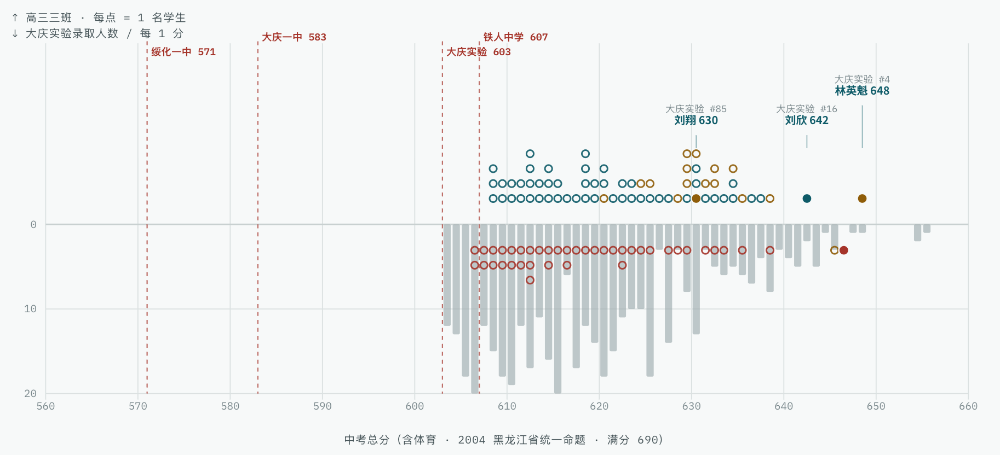
  <figcaption>绥化一中高三三班2004年中考分数分布并与同届大庆实验中学中考分数分布对比（推测）</figcaption>
</figure>

据上述假设，我推测三年三班 $66$ 名同学的中考分布大致符合上图（蓝色为市区，棕色为外市县）所示，在和大庆实验全校（浅蓝色柱状）的对比中，可以看到在中考时，我们班级的同学即使在大庆最好的几所高中也是很有竞争力的。和一班相比（红圈、红点为市区，棕色为外市县），因为外市县的学生中考成绩偏高，三班的生源明显优于一班。

## 三班的高考成绩

<figure>
  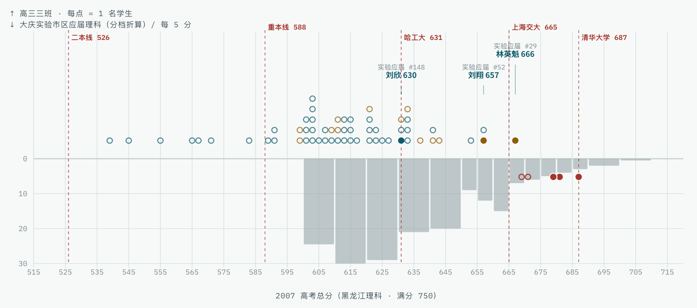
  <figcaption>绥化一中高三三班2007年高考分数分布并与同届大庆实验市区应届高考分数分布对比（推测）</figcaption>
</figure>

而三年后高考的分数情况（多数分数为基于院校结合专业的推测），根据上下两个图像的对比可以直观得看到，在大庆市区应届高考生理科排名对比中，我们三班出现了明显的整体向左滑移退步。而一班的成绩（横轴下方红色的五个点）与大庆市区的学生相当，更为具体的可见下图：

<figure>
  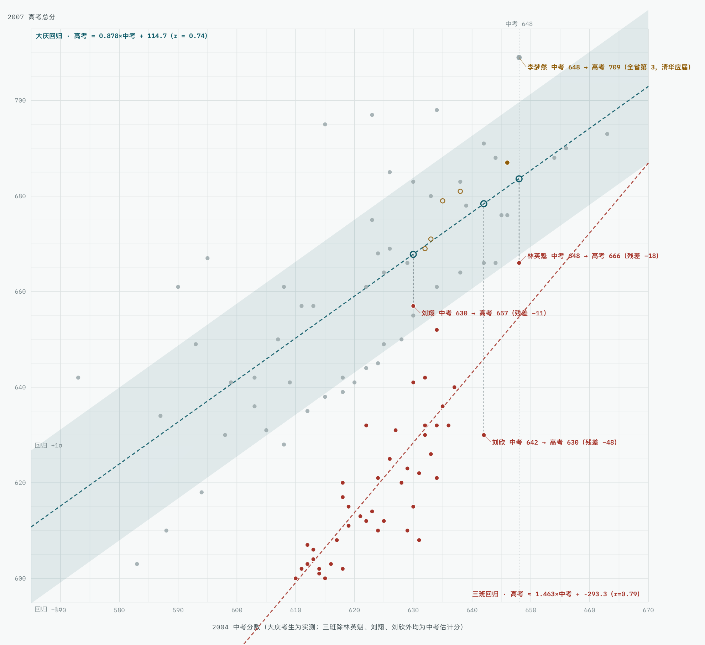
  <figcaption>绥化一中高三三班2007年高考成绩与大庆市应届考生的对比图（推测）</figcaption>
</figure>

蓝色线性回归虚线是根据大庆市真实的中考和高考成绩得到的，可以看到班级的前 $47$ 名、高考分数高于 $600$ 分的同学，普遍要比在大庆读书的中考分数相近的考生低了 $30$ 分到 $50$ 分，对于全班中考第二的刘欣，实际考出的高考分数，要比基于大庆预测的分数低了足足 $48$ 分之多。

- 三班中考第一为 $648$ 分，基于大庆预测 $684$ 分，高考第一为 $666$ 分
- 三班中考第二为 $642$ 分，基于大庆预测 $678$ 分，高考第二为 $657$ 分
- 三班中考第三约 $638$ 分，基于大庆预测 $675$ 分，高考第三为 $657$ 分
- 三班中考第四约 $637$ 分，基于大庆预测 $674$ 分，高考第四约 $652$ 分
- 三班中考第五约 $636$ 分，基于大庆预测 $673$ 分，高考第五约 $642$ 分

但是一班的成绩不仅高于三班，甚至优于大庆的考生，在我知道具体成绩的前五名，即使我们假设一班高考排名和中考一致，也就是我们高估了前五名的中考成绩的情况下，一班这五位同学也都超出了在大庆读书的预期（上图中的棕色点），具体的：

- 一班中考第一为 $646$ 分，基于大庆预测 $682$ 分，高考第一为 $687$ 分
- 一班中考第二约 $638$ 分，基于大庆预测 $675$ 分，高考第二为 $681$ 分
- 一班中考第三约 $635$ 分，基于大庆预测 $672$ 分，高考第三为 $679$ 分
- 一班中考第四约 $631$ 分，基于大庆预测 $670$ 分，高考第四约 $671$ 分
- 一班中考第五约 $630$ 分，基于大庆预测 $669$ 分，高考第五约 $669$ 分

可以看出在绥化，如果教育资源集中倾斜，在一中也可以得到 “大鱼小池塘” 的效果，但为什么三班在高考被超过这么多，是因为一班和三班有完全不同的两套任课老师造成的，以至于三班在高考考前无法知晓普遍传播的高考命题事故避险。

## 两套任课老师

一班都是市区的，且人数较少，而且有很多学校教师的子女以及校领导的亲属，仅与我相关的就有高一英语老师之女、化学老师之子和校长张玉臣的侄子（我高一时的室友），也就是因此，最好的教学资源都给了一班。但如果张玉臣校长考虑到三班有着很多在大庆实验中考成绩能进前百的高分生，为了出成绩，需要倾斜资源照顾，他一定会给数学、物理这两个关键学科都配置高水平的老师，但因为有收费的外语加强班的出现，导致了令人匪夷所思的教师配置的出现，按照招生简章：

> 英语加强班学制三年，班科任由一中最优秀教师担任，外教担任口语听力课，小班额，住校食宿。英语加强班到一中教务处报名，待学校对学生英语及其他文化课程度进行测试后，择优录取。

<figure>
  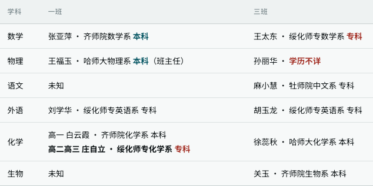
  <figcaption>2004年绥化一中理科奥赛班教师名单</figcaption>
</figure>

因为这个英语加强班的出现，导致同样有着高分中考生的理科奥赛班三班，在数学和物理这两个关键学科上，安排了两个教学水平并不突出的老师，就好像给外语加强班的人看，奥赛班三班也是这个老师。

和其他的一班、三班平均教龄十五年不同，我们的物理老师比较年轻，约 $25$ 岁上下，说话声音较少，对我们缺乏足够题型训练，而数学老师常在课上做不上正在讲的难题，我几乎很少向他求助解难题，还在课上常说那些题目是留给清华北大的，就不讲了。高考时，和一班相比，出现大问题就是在物理学科，还有部分的数学问题。相比之下，化学是我们班表现最好的学科，徐蕊秋老师的耐心和对高频词汇的反复训练，即使像我这样对化学不太擅长的学生，高考也比只满分少了 $2$ 分。但高考失利是一个复杂因素导致的事件，除了任课老师的原因外，2007年高考离奇简单又漏洞百出才是致命因素。

## 荒诞无比的高考题

2007年是高考恢复 $30$ 周年，各类报纸都在铺天盖地的追忆高考带来的改变，无论是社会、考生家长还是考生本人都对高考极为重视，生怕有一丝差错而留下遗憾，但是作为最具有决定性因素的高考命题组却犯下了大量极其低级且危险的错误，迄今也鲜有人提及当年的悲剧惨案，十九年过去，忙碌的我们早就在把这段记忆淡忘。

2007年，作为新课标改革参加高考的第一年是极为混乱的一年，我有足够多的证据可以论证，2007年的高考命题组错误的把新课标地区（山东、广东、海南、宁夏）使用的普通高中课程标准实验教科书教材当成了大纲卷地区正在使用的教材，而当年我们使用全国I卷和全国II卷的地区，三年间使用的教材是全日制普通高级中学教科书2002年过审版，以致于在考试卷子中有大量令人迷惑的考题，究其原因就是命题组拿错了教材，或许是命题仓促，或许是命题人水平有限，除了使用错教材，还有好几道明确的错题，自然还有不少质量低下的考题。

最有代表性的是全国I卷（河北、河南、山西、广西）理科综合的第24题，明显命题人错误的认为弹性碰撞公式是考生应该熟知的知识点，除此之外，[在全国I卷中](https://kns.cnki.net/kcms2/article/abstract?v=tBI8TAhqnxRFaLLKaQwg6EZDEUuyvnmbNLr3fOfhcM64WYjgfoRZ6BypsIthNRVdU59oWI8Yr-1pJt7Rgh9DdEV7FmH8ST90jiwRo-bPh6YbGWVQkrYb7htOtubKj51shejPZhTzpaXJzwzyZZFkl47GEBiSduwSTEQz9ufJPlg=&uniplatform=NZKPT)，第18题明显忘记写平面光滑的条件，而22题的标准答案是明确的错误。

在黑龙江省使用的全国II卷（贵州、黑龙江、吉林、云南、甘肃、新疆、内蒙古、青海、西藏）中，我按问题的严重程度，逐个说明。对于前两个题目，我在[另外一个文章](/irresponsible)中有详细的分析，这里就不赘述了。

【事实性错误】理科综合物理部分的压轴最后一道大题，也就是25题，[是一个明确的错题](https://kns.cnki.net/kcms2/article/abstract?v=tBI8TAhqnxQMYOjxwwUTeUwz1TxDKDRlSYx7DCzB2vu5uoYdZk-fdznQgCpPbMht2PIPBphCv2w6VreiKiKtPnLmMsJIBui8_LZR70u6rzOK-N-_kr34ocKxInpEdxtPQdk3urOuU4pa6He2W5ckXfzSteJtRMRZ5fKXOfKumI-sxOuS2-t3kw==&uniplatform=NZKPT&language=CHS)，在当年的物理教学相关的杂志中可以看到几篇相关的文章。这道题目对高分考生的伤害是极大的，我自己推出悖论后耽误了 $20$ 分钟的时间，且最后因此失去了 $8$ 分。

【超纲考察】理科综合物理部分的第二道大题，也就是24题，是明显的超纲考察，事后大家反思，说是自己的[知识准备有问题](https://kns.cnki.net/kcms2/article/abstract?v=tBI8TAhqnxRcy6zgjK_l--Vqsa1Dx6q_sQQ8nVvsQVYEySXzChVp1cWNJ6RnoM6u2gQ-g6gGiPwSgiTK0jTdo2b0gXsOIcr3Kak5UN8reRzhCC8USbGCrUTcwKpB2dyO64A9J-Nicn75bOeDLRU0JxHDF7vUqzIRIE1UfMYXEuZQS6jkdB5pYA==&uniplatform=NZKPT&language=CHS)，但最该反思的是高考命题组，为什么会把至关重要的教材拿错？就没有一线教师指出这种低级错误吗？大量考生因为这个原本必拿满分的第二题而陷入紧张，我因为这个题目至少耽误了 $10$ 分钟，且最后失去了 $11$ 分。

这个题目是产生高分差距的关键题目，不仅是 $11$ 分的分数，也有对心态的严重打击，而且这个题目意味着在考生中间出现巨大的不公平，一来对于有竞赛基础或者练习过这个题型的学生可以用两分钟就做答，二来据我当时高考后和在大庆实验就读的魏征交流，他说他们学校考前专门练习过这个题型，甚至绥化一中的一班都在考前练习过这个题型，我们三班的物理老师说这个是超纲知识不会考，老师说的没错，但我不知道为什么全省其他的名校以及高三一班会专门练习这个超纲题型。

【事实性错误】理科综合第27题，化学部分的推断题，题干中说C物质是离子化合物，而答案中C物质却是 氯化铝，但氯化铝是共价化合物，这是一个很低级的错误，而且在2006年高考中就出现过这个错误，就因为之前高考出错过，我个人没有在这个题目失分。

【超纲考察】理科综合第17题的D选项，这是一个超纲题，根据大纲版教材里的描述，考生无法判断偏振是否可以分解，且在过去所有的考题中只对垂直角度的考察，之所以有D选项是因为新课标教材里有我们教材里没有的偏振观察实验，通过那个实验能知道偏振可以分解。我因为这个题目失去 $3$ 分。

【超纲考察】数学第18题概率统计的第二问，这个题目其实很简单，但问题出现在 $100$ 个产品这个大数，在过去 $30$ 年高考里以及所有模拟题中，从来没有一次在抽取产品类型题中，产品数量超过 $20$，且大多数是 $10$ 个，之所以出现 $100$ 这个奇怪的大数，是因为新课标里有超几何这个新概念，为了区分二项分布和超几何分布，教材第二个例题就是 $100$ 个产品，就和物理考卷中弹性碰撞考题是新课标教材习题原题一样，命题人还以为自己出了一道很简单的题。

我们可以认为这个题目是在考察超几何分布，属于我们从没学过的概念，就算在讲了超几何之后 $18$ 年的高考里，仅2010年的广东卷和2023全国甲卷出现过超过 $10$ 个样本数量的超几何分布，且产品数仅仅为 $40$ 个，而不是这个奇怪的 $100$ 个产品。我个人因为这个题目失去 $6$ 分。

【低质量题目】理科综合第30题，这道生物题单独命题没有问题，但是在一个题目内，用I和II来弱弱的区分两个完全不同的题目，且在II题中，没有提示考生题中的学生在作另外一个实验，并两问中都有A和B符号代指，这样的题目，毫不给做了两个小时物理化学题目学生温馨提醒，是命题者命题水平不高的体现，因为我刚在物理两个出错题的大题泥潭里陷了半个小时，我看到这个题目的时候想加快速度，就下意识以为第二问也是光合作用，考试的时候就感觉特别奇怪，这道题我在 (1) 和 (2) 两个小题上失去 $8$ 分。

## 负偏最严重的一年

上述的这些只是针对部分高分学生的第一步绞杀，如果说题目难度分布合理，有很多的中档题，会让这个悲剧淡一些，但偏偏2007年高考在后面已知一分一段表的2013年到2026年，这十五年里难度上最简单的。自1994年高考总分 $750$ 分满分以来至今的 $23$ 年中，2007年 $588$ 分的重本线（约前 $10\%$）是最高的一年，全省 $600$ 分以上的人数也是最多的一年。

<figure>
  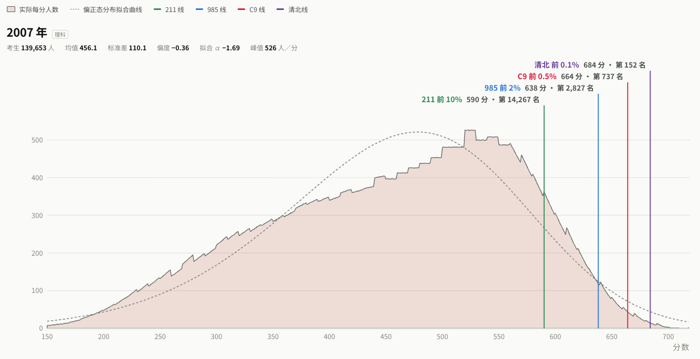
  <figcaption>2007年高考黑龙江省分数频数分布直方图（推测）</figcaption>
</figure>

<figure>
  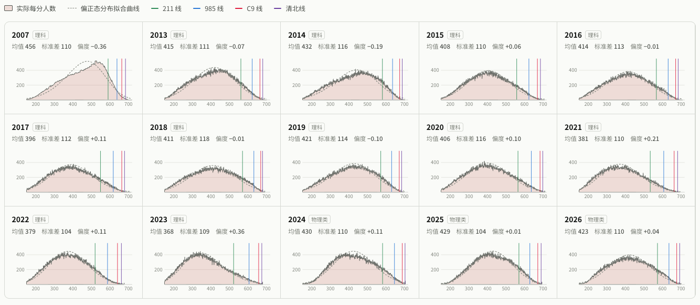
  <figcaption>2007年高考与2013年至2026年分数分布直方图的对比</figcaption>
</figure>

从上图中可以看到，高考分数分布很不和谐的负偏，这样的后果就是对高分的学生缺乏分辨能力，简单的题太简单，缺乏足够的中档题目，而需要高难度的题目又出现了上述的命题事故。这种偏度可以在上图中看出来，在上面的十五年里，2007年是用偏正态分布拟合时负偏最严重的。

而这种非常不合理的难度分布，让某些题目变得特别关键，也就是说超过一定分数后，每下降一分，这种负偏会有更大幅度的名次下降，原本需要通过考生能力进行区分的考题，充满了随机下的大幅波动的噪音，这些都在反复说明整套高考试卷命题信度是非常低的。

在我们高三三班经常考第一的刘雪威同学，2006年高二时参加高考，在有很多知识尚未学习时，就取得了 $608$ 分的高分，相当于2007年 $614$ 分，而在2007年，高考分数仅为 $640$ 分，作为时常考取年组第一的状元种子，比平时差距不大的一班第一低了足足 $47$ 分，这就是一张质量极差考卷带来的破坏。

## 高考失利，全在理综

我的[高考分数是 $666$ 分](https:/blog.sina.com.cn/s/blog_4c3896b201000b1p.html)，其中，语文 $125$ 分，数学 $135$ 分，英语 $141$ 分，理综 $265$ 分。

<figure>
  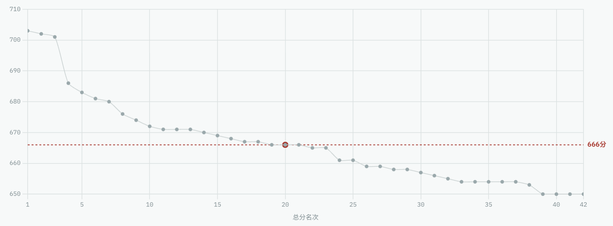
  <figcaption>2007年高考鹤岗市理科总分 $650$ 分以上（前 $40$ 名）总分变化曲线</figcaption>
</figure>

这个分数距离我理想的学校清华大学要求的 $687$ 分低了 $21$ 分， 距我理想的专业数理基科班要求的 $691$ 分低了 $25$ 分。接下来我将结合[鹤岗市理科前100名成绩单](https://web.archive.org/web/20070713202753/http://www.hgyz.net:80/gkzs/gkzl/index.htm)，尤其是 $650$ 分及以上的前 $40$ 名各科成绩拟合分析，来解释我自己成绩不及预期的关键因素。

<figure>
  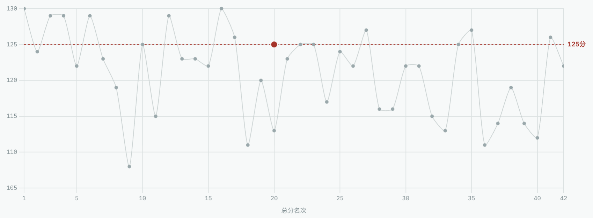
  <figcaption>2007年高考鹤岗市理科总分 $650$ 分以上（前 $40$ 名）语文单科分数变化曲线</figcaption>
</figure>

语文学科，在为达到 $687$ 分和 $691$ 分两个目标的贡献上，这个 $125$ 分的语文成绩并没有给我带来劣势，也没有给我带来优势。

<figure>
  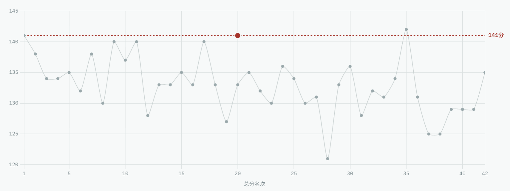
  <figcaption>2007年高考鹤岗市理科总分 $650$ 分以上（前 $40$ 名）英语单科分数变化曲线</figcaption>
</figure>

英语学科，这个分数作为单科是极高的，在鹤岗全市只有两个 $142$ 分和两个 $141$分，而总分达到 $718$ 分的两位黑龙江省状元，英语成绩分别为 $140$ 分 和 $141$ 分。

如果我想打到 $691$ 分，我只需要自己的英语是 $136$ 分左右即可，也就是说，我的英语给我带来了 $5$ 分的盈余，如果目标是 $687$ 分，甚至可以盈余近 $6$ 分。

<figure>
  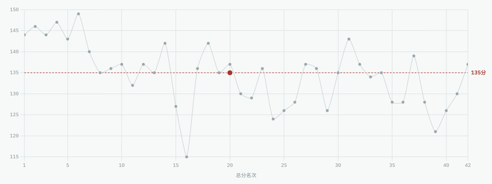
  <figcaption>2007年高考鹤岗市理科总分 $650$ 分以上（前 $40$ 名）数学单科分数变化曲线</figcaption>
</figure>

数学学科，我错了上面说的超几何分布的那个超纲题目，我承认自己有储备不足的责任，但如果命题组不拿错教材，大概率我是不会错的，我在所有的模拟和自测中，从来没有错过概率统计题。另外的 $9$ 分，是倒数第二道，也就是数列的压轴题，我的做法和标准答案不一样，但有很多该给分的步骤，却一分没给。

如果我想打到 $691$ 分，我数学需要得到 $142$ 分，但是因为我的英语分数极高，也就是说数语外这三科，即使数学出现了命题和判卷的外界因素，我的成绩也并不逊色于全省前 $50$ 的考生，真正出问题的在于命题事故更严重的理综。

<figure>
  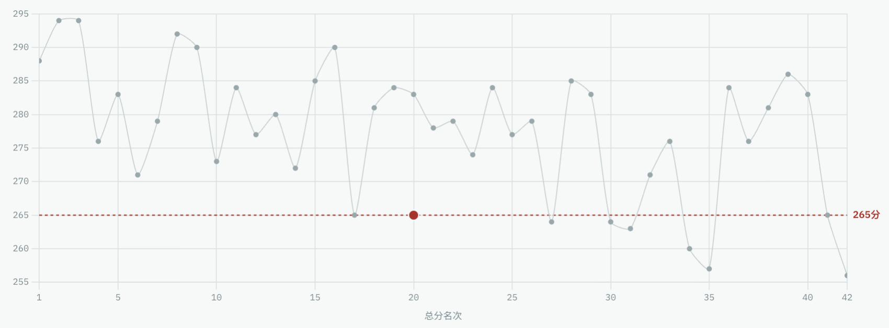
  <figcaption>2007年高考鹤岗市理科总分 $650$ 分以上（前 $40$ 名）理综单科分数变化曲线</figcaption>
</figure>

理综科目，除了上面提到的因为严重命题事故造成的 $22$ 分，以及命题质量不高、匆忙做错的 $8$ 分生物体外，其他所有题目，我只失去 $5$ 分，而这基本上就是全省理综成绩的上限，全鹤岗市，理综 $290$ 分仅五人，分别为 $294$ 分、$294$ 分、$292$ 分、$290$ 分和 $290$ 分。两位总分达到 $718$ 分的黑龙江省状元，分别为 $293$ 分和 $295$ 分。

而为了达到我 $687$ 分和 $691$ 分的目标，我理综需要达到 $286$ 分和 $288$ 分，即使不算生物考题因时间紧张失去的 $8$ 分，我依旧可以达到 $287$ 分，只要不无辜失去 $22$ 分。

## 三班是受灾的少数

整张理综卷子易失分的算 $5$ 分，超纲有 $14$ 分，压轴错题算 $7$ 分，生物质量低题目 $8$ 分，即使我们假设考生仅是部分题目受损，那么，理综总分不低于 $277$ 分的考生也基本确信并没有受到考卷质量低下影响。

鹤岗全市高考 $500$ 分及以上前 $40$ 名中，有 $24$ 人理综在 $277$ 分及以上，因为我排在鹤岗市的 第 $20$ 名， 鹤岗 $500$ 分及以上 $666$ 分以下的 $22$ 人中竟有一半理综都在 $277$ 分及以上。

鹤岗在教育水平上和绥化差不多，鹤岗全市仅有 $7$ 人 $679$ 分及以上，其中 $3$ 人还是 $700$ 分以上、全省前 $10$ 的极端值，而哈尔滨有[超过 $100$ 人](https://web.archive.org/web/20081015190609/http://www.hrb3z.net/eoknews/xykx/20070706125915.htm)在 $679$ 分及以上，就算我们假设哈尔滨前 $100$ 人，都能达到我所说的 $691$ 分，数语外都能达到 $302$ 分的期望成绩，那么这些人的理综都在 $277$ 分及以上，也就是说，哈尔滨市的最前部的学生，几乎全部没有受到理综考卷质量低下的影响。

基本可以确信，对于哈尔滨、大庆、佳木斯和鹤岗的考生，新课标超纲的知识他们应该在考前得到过很好的指导训练，整个命题组的失职并没有大面积的影响到全省的高分群体。之前说过，即使在绥化一中，本应水平相当的高三一班竟有 $5$ 人在三班最高分之上，且这五人分数都是 $669$ 分以上，而三班仅有我一人在 $660$ 分以上，把我算内也才四人在 $650$ 分以上，之前我也提到过，高三一班的老师给他们班级着重练习过弹性碰撞通用公式的题型。

我通过学科网下载了所有我能找到的 2007 年的高考模拟题，在理综 $82$ 套模拟题近千道物理题中，没有任何一道题需要弹性碰撞通用公式，仅有一道题里提到了弹性碰撞的概念，还在前面有 “没有机械能损失” 这样的定语，同时是简单地带入数值求解，毫无难度，所以在当年模拟题命题者眼中，弹性碰撞这个概念本身就不会提，更别说要使用弹性碰撞的通用公式了，而在高考中使用了没有任何定语的 “弹性正碰”，并默认学生已经熟记弹性碰撞的通用公式，这种事情实属诡异，但为什么其他的城市和一班会练过？

我甚至怀疑，在高考命题结束之后，有工作人员意识到了这个漏洞，如果不采取动作加以干涉，就会导致大量的高分学生难看的聚集在 $665$ 分上下，而因为过分缺乏对高分学生选拔的区分，有人会因此遭到问责和处罚，我不知道他们通过什么方式透露了这个拿错教材的消息，但很可能是通过类似考前风向预测的方式，向可能受到冲击的知名城市和高中传递这个信号，可以隐晦地说今年高考是新课标过渡年份，让考生多练习新课标课本里的相关知识点，而本就有着竞赛基础的知名高中很容易就对学生的知识扩展覆盖，但从结果上看，显然我们高三三班的学生并不在知情范围之内，隔壁的一班却完美的避开了冲击，考出了超出大庆同分层考生预期的出色成绩，只可怜我那些原本善于读书的同班同学们，无端被剥夺 $30$ 分到 $50$ 分的考分。

至此，对于高三三班高考分数比预期低很多的论述就结束了。作为附加的补充，接下来顺便讨论一下，高三三班同学们在竞赛和自主招生上的路径堵塞。

## 与竞赛和自主招生无缘

<figure>
  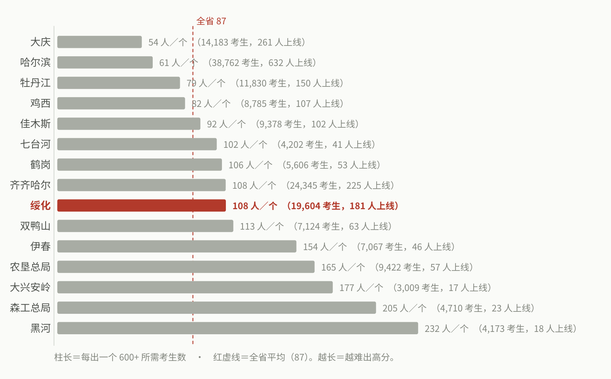
  <figcaption>2004年黑龙江省 $600$ 分人数各城市稀有程度对比</figcaption>
</figure>

<figure>
  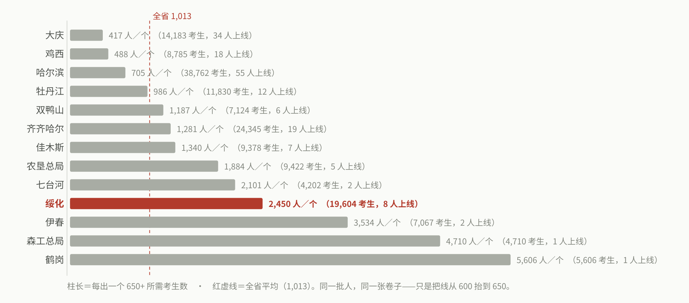
  <figcaption>2004年黑龙江省 $650$ 分人数各城市稀有程度对比</figcaption>
</figure>

[从上面两个图可以看出来](https://web.archive.org/web/20040729100940/http://lah.jxsedu.com:80/ReadNews.asp?NewsID=2661)，2004年时绥化全市高考成绩在黑龙江省算是偏差的，远不及大庆、哈尔滨，大约和齐齐哈尔以及鹤岗差不多的水平。

我们班级美其名曰奥赛班，也有着具备冲击省级一等奖的种子选手，例如我本人在初中，在毫无准备的状态下，就能获得全国初中数学竞赛国家级一等奖，竞赛路径对我会是一个很好的选择，但是绥化一中我们这一届没有任何一个竞赛的一等奖，2007年黑龙江全省保送生我收集到的共 $51$ 人，大庆 $24$ 人，哈尔滨 $22$ 人，绥化一中一个没有。而我知道分数的大庆学生中:

- 中考 $637$ 分的大庆一中任帅，信息学省一等奖，保送复旦大学
- 中考 $625$ 分的大庆一中种敏琪，信息学省一等奖，保送上海交大
- 中考 $618$ 分的大庆一中李城达，数学省一等奖，保送浙大
- 中考 $617$ 分的铁人中学的刘博，物理省一等奖，保送浙大

这些学生不用面对2007年离奇简单又漏洞百出的高考，直通名校。而像哈师大附中一所学校，仅2008年一年就有 [$98$ 人通过预赛](https://web.archive.org/web/20081206045223/http://www.hsdfz.com.cn:80/doc/2008/09/23/141155.html) 进入全国高中数学联赛决赛，除了高三 $40$ 人外，还有高一 $11$ 人和高二 $47$ 人，对于在绥化一中就读，类似我这样高三零准备裸考参加的，和初中不同，在高中几无胜率。

<figure>
  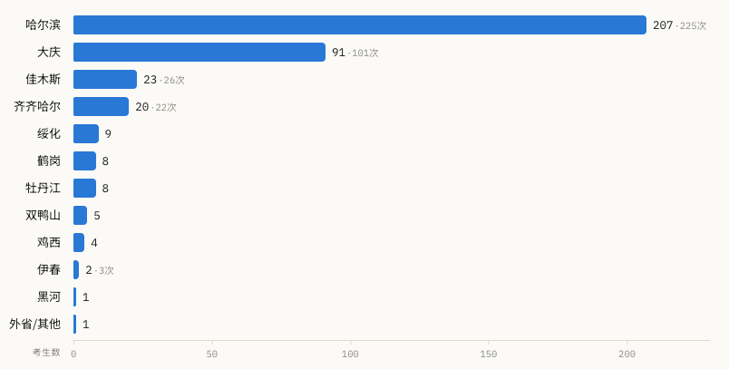
  <figcaption>2007年黑龙江省自主招生资格各城市学生人数分布</figcaption>
</figure>

<figure>
  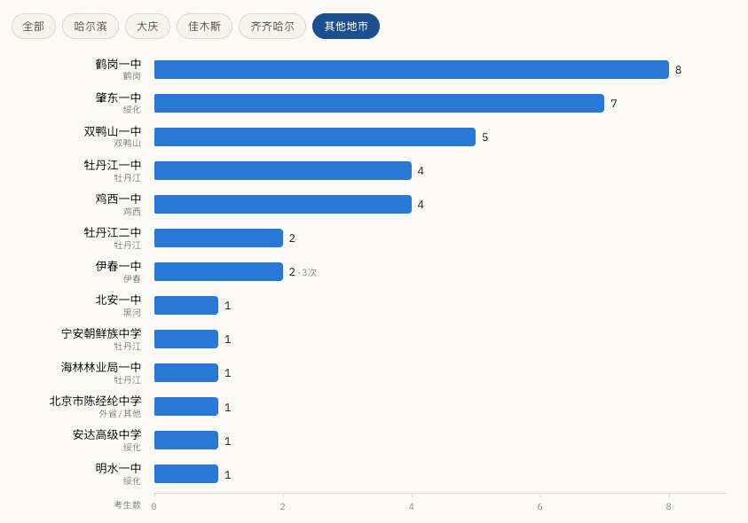
  <figcaption>2007年黑龙江省非哈齐佳大四市自主招生资格各高中学生人数分布</figcaption>
</figure>

在2007年，黑龙江一共有 $155$ 人有保送资格，我也没有找到绥化一中学生的身影。而人数更为庞大的自主招生资格中，一共收集到 $413$ 人的名单，依旧找不到任何一个绥化一中的学生。而在黑龙江省的其他高中，哈三中 $99$ 人，哈师大附中 $59$ 人，大庆实验 $34$ 人，铁人中学 $34$ 人，佳木斯一中 $22$ 人，哈九中 $19$ 人，大庆一中 $18$ 人。

我们再次除去哈尔滨、大庆、佳木斯不谈，同在绥化市的肇东一中就有 $7$ 人入选，而作为绥化市资源倾斜最多的龙头学校，绥化一中一个没有。肇东市2004年中考最高分是 $651$ 分，推测2004年时中考高分生分布并不及绥化一中，却有 $7$ 人得到自主招生资格。