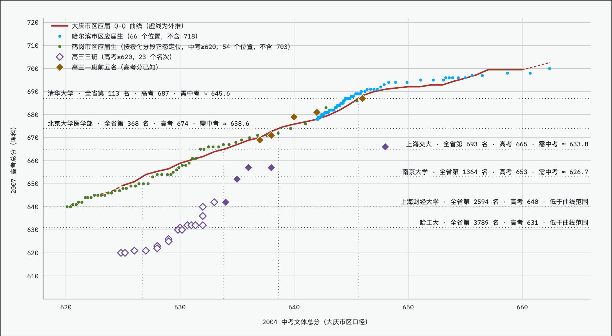
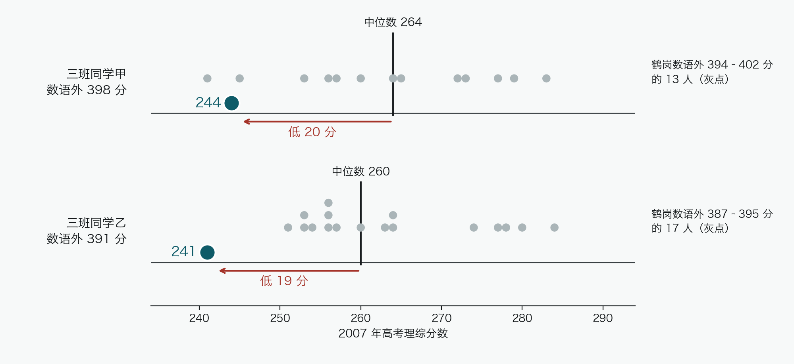
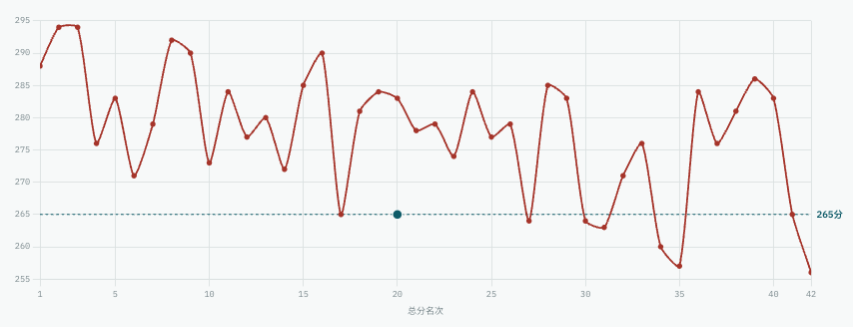
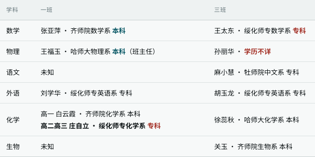

今天是绥化一中建校 $80$ 周年的日子，而在 $60$ 周年校庆时，我正好是高三。

在 $2007$ 年高考，我在绥化一中的同班同学考得很不理想，原本可以达到极高分段（全省前 $0.5\%$）甚至最高分段（全省前 $0.1\%$）的同学比预期低了 $20$ 分以上，我一直困惑至今，经过大量的数据收集和分析，我觉得自己破解了这个谜题，简而言之：

1. $2007$ 年高考，发生了破天荒的重大命题事故，作为新课标命题元年，命题组错把我们从未使用过的新课标教材当成大纲版教材，从而出现了大量超纲题，且在关键压轴题有错题，这是最直接的原因
1. 虽然高考出现了突发的、平时练习册无法覆盖的超纲题目，但哈尔滨、大庆、佳木斯、齐齐哈尔、鹤岗、绥棱甚至同在绥化一中的一班，都通过某种途径提前得到了风向，各地的高考成绩基本兑现了中考时录取生源的分布，而高三三班是稀有的高分段（全省前 $2\%$）信息孤岛
1. 三班的中考生源并不逊色于一班，之所以没有高考考前情报，是因为在 $2004$ 年高一分班时，学校增设外语加强班，导致三班的物理、数学老师并不善于指导高考能达到前 $0.5\%$ 的同学，而原本可在高二文理分科时的补救，因为新任校长魏志波的失策而未能实施

接下来，我将对极高分段同学高考失常一事，展开分析。

## 各地中考成绩

$2004$ 年中考，除了哈尔滨，全省共用一张考卷，满分是 $690$ 分，其中体育 $30$ 分。

绥化一中在 $2004$ 年的录取分数线是 $571$ 分。大庆铁人中学的录取分数线 $607$ 分，哈三中宏志班 $605$ 分，大庆实验中学 $603$ 分，大庆一中 $583$ 分。

绥化市区第二是 $646$ 分（最高分可能比第二高一分），被绥化一中一班录取，我是绥棱县第三，是 $648$ 分，绥棱第十三是 $630$ 分，我们俩人同被绥化一中三班录取。

肇东市最高分是 $651$ 分。绥棱县最高分是 $660$ 多分。佳木斯市最高分是佳木斯三中的 $659.5$ 分，佳木斯三中全校第二到第十为 $655$ 分、未知、$647.5$ 分、$640.5$ 分、$632$ 分、$631$ 分、$631$ 分、$630.5$ 分和 $630$ 分。

大庆市教育局在官网公布了全部的录取名册，其中，前十名和录取高中分别为 $663$分（一中）、$657$分（铁人）、$656$分（一中）、$655$分（实验）、$654$分（实验）、$654$分（实验）、$652$分（一中）、$650$分（铁人）、$649$分（铁人）和 $648$分（一中、实验）。

经对数据拟合，大庆市 $21500$ 名考生中 $610$ 分到 $635$ 分考生人数分布大致符合 $N(551, 34^2)$，$635$ 分以上的考生人数分布大致符合 $N(587, 19^2)$，而通过高考成绩反推，如果哈尔滨市区 $37811$ 名考生使用和我们一样的考卷，其高分段考分也大致符合这个分布。

经对数据拟合，绥化市区 $4923$ 名的考生中，在 $571$ 分至 $628$ 分之间的考生人数分布大致符合 $N(533.5, 36.3^2)$，$629$ 分及以上的分数大致符合 $N(579, 19^2) $，而绥化其他市县以及鹤岗市也差不多符合这个分布，但是参加中考的总人数或高或低。

绥化市区和哈尔滨市区、大庆市区在中考时就因教育资源差距而产生了分数上的差距，具体地说：

- $630$ 分以上，对应高考约 $660$ 分以上，大庆市区 $219$ 人，哈尔滨市区约 $344$ 人，绥化市区约 $19$ 人
- $635$ 分以上，对应高考约 $665$ 分以上，大庆市区 $129$ 人，哈尔滨市区约 $218$ 人，绥化市区约 $8$ 人
- $640$ 分以上，对应高考约 $675$ 分以上，大庆市区 $60$ 人，哈尔滨市区约 $100$ 人，绥化市区约 $4$ 人
- $645$ 分以上，对应高考约 $685$ 分以上，大庆市区 $26$ 人，哈尔滨市区约 $43$ 人，绥化市区约 $2$ 人

其中 $635$ 分为极高分段，对应高考上海交大浙大一档，$645$ 分为最高分段，对应高考清华北大一档。

## 三班的中考成绩

一班、三班的具体中考分数，我上学的时候从没问过同学们，现在去问，多数也都记不清了，甚至高考成绩一半以上我也是从每个同学录取的院校和专业反推，因此本文将采用分位数对应法进行分析，并画出分位数-分位数图（以下简称 Q-Q 图）。所谓分位数对应，就是把中考分数和高考分数各自从高到低排序，让中考第 $N$ 名的分数去对应高考第 $N$ 名的分数，而不去对应具体的某个人。

如果对绥化市区 $4923$ 名考生，在 $600$ 分至 $628$ 分之间按照 $N(533.5, 36.3^2)$，$629$ 分及以上按照 $N(579, 19^2)$ 进行模拟得到前 $165$ 名，并假设只有第一名 $650$ 分 （据回忆可能是 $647$ 分）生源流失。

$2004$ 年，绥化一中计划招收外市县 $50$ 人，外市县中考前 $30$ 名（应均在 $625$ 分以上）可以报名参加考试，这些外市县最后来绥化一中报道的有约 $20$ 人，望奎县 $8$ 人，绥棱县 $4$ 人，安达、海伦、青冈各 $1$ 人，来自黑河、大兴安岭的有 $5$ 人。

高一时，外市县的分给二班、三班各 $10$ 人。高二时，因文理分班，高一二班中有 $25$ 人（其中外市县 $7$ 人）因为学理并给了三班，二班和三班合并后有 $65$ 人（其中外市县 $16$ 人）。虽然分文理时，有两位望奎县的极高分生去了一班，但因为前面假设绥化市区生源流失较少，所以这里就假设高二时原一班的学生没有变动。

那么，绥化一中高三一班入学时中考前十名分数为：$646$ 分、$642$ 分、$640$ 分、$638$ 分、$637$ 分、$636$ 分、$635$ 分、$635$ 分、$634$ 分和 $633$ 分。

而对于三班，可以进入班级前十的中考分数的有绥棱县的 $648$ 分 和北安市的 $635$ 分，已知望奎县来的同学中考排名都比较靠前，这里假设望奎前十中，有三个来了三班，那么取，第五名 $638$ 分、第七名 $636$ 分以及第九名 $635$ 分，其他所有绥化市区考生和外市县的同学这里做保守估计而不考虑。

## 三班高考成绩

<figure>
  
  <figcaption>绥化一中高三三班（紫色菱形，实心为前五名）、高三一班前五名（棕色实心菱形，高考分已知）、哈尔滨市区应届生（蓝色小实点）和鹤岗市区应届生（绿色小实点）$2004$ 年中考和 $2007$ 年高考分位数-分位数图，红线为大庆市区应届的对应曲线（虚线为外推）</figcaption>
</figure>

根据上图可以发现，对于棕色的高三一班，我只确定前五名的高考成绩，他们基本达到了中考分数对应值。具体地说：

- 一班中考第一为 $646$ 分，对应 $688$ 分，高考第一为 $687$ 分，差了 $1$ 分
- 一班中考第二约 $642$ 分，对应 $678$ 分，高考第二为 $681$ 分，多了 $3$ 分
- 一班中考第三约 $640$ 分，对应 $676$ 分，高考第三为 $679$ 分，多了 $3$ 分
- 一班中考第四约 $638$ 分，对应 $673$ 分，高考第四约 $671$ 分，差了 $2$ 分
- 一班中考第五约 $637$ 分，对应 $670$ 分，高考第五约 $669$ 分，差了 $1$ 分

而三班的前五名虽然要比班里其他同学表现得更好，但仍与中考对应成绩相差甚远：

- 三班中考第一为 $648$ 分，对应 $691$ 分，高考第一为 $666$ 分，差了 $25$ 分
- 三班中考第二约 $638$ 分，对应 $673$ 分，高考第二为 $657$ 分，差了 $16$ 分
- 三班中考第三约 $636$ 分，对应 $669$ 分，高考第三为 $657$ 分，差了 $12$ 分
- 三班中考第四约 $635$ 分，对应 $667$ 分，高考第四约 $652$ 分，差了 $15$ 分
- 三班中考第五约 $635$ 分，对应 $667$ 分，高考第五约 $642$ 分，差了 $25$ 分

作为对照，哈尔滨市区能核实身份的 $66$ 位应届生（上图中蓝色实小点），按人数比例对应到大庆的中考位次后，平均只比大庆曲线高 $1.6$ 分，也就是说，哈尔滨和大庆的极高分段学生，在同样的生源水平下考出了几乎同样的高考成绩。如果对和绥化教育水平相近的鹤岗市考生（上图中绿色小实点）进行分析，其中考成绩和高考成绩对应关系也都按预期落在 Q-Q 曲线之上，唯独三班成绩下滑显著。

虽然一班和三班是两套老师，但是三班的极高分段学生通过做练习册自学，即便有劣势，也不会有如此巨大波动，之所以三班在高考时有这么大的偏差，决定性的原因在于极为罕见的严重高考命题事故。

## 荒诞无比的高考题

$2007$ 年，作为新课标改革参加高考的第一年是极为混乱的一年，我有足够多的证据可以论证，$2007$ 年的高考命题组错误地把新课标地区使用教材当成了大纲卷地区正在使用的教材，以致考试卷子中有大量令人迷惑的考题。我按问题的严重程度，逐个说明。

【严重错题】理科综合物理部分的压轴大题，也就是 $25$ 题，是一个明确、反向区分的错题。我因为识别出错误，导致耽误二十分钟，且失去 $8$ 分。其他三班同学有可能没有识别出错误而得分，又或者原本就不太期望做上物理最后一题。

【严重超纲】理科综合物理部分的第二道大题，也就是 $24$ 题，是明显的超纲考察。一来，这道题基本上就是新课标教材的课后习题原题，二来，全国 $\mathrm{I}$ 卷的 $24$ 题同样错误地认为学生应该掌握这个超纲公式。我个人因为这个超纲题目失去 $11$ 分，但我的三班同学可能会失去全部的 $19$ 分。

这个题目是产生高分差距的关键题目，不仅是 $19$ 分的分数，也有对心态的严重打击，而且这个题目意味着在考生中间会出现巨大的不公平，对于有竞赛基础或者练习过这个题型的学生可以用两分钟就做答，而对于没有得到训练的学生，看到 “弹性正碰” 四个字都是极为陌生和发慌的。

我们物理老师考前明确告诉我们这个知识点不考，而且在高三所接触到的模拟题、练习册中，因为这是超纲知识，非竞赛考生通过自学无法接触到这个知识点。诡异的是，全省大多数的高分段班级，包括我们绥化一中的一班都在考前训练过这个超纲题型。

【严重超纲】理科综合第 $17$ 题的D选项，这是一个超纲题，根据大纲版教材里的描述，考生无法判断偏振是否可以分解，且在过去所有的高考和模拟题中只有对垂直角度的考察，之所以有D选项是因为新课标教材里有我们教材里没有的偏振观察实验。

【错题】理科综合第 $27$ 题，题干中所说的离子化合物在答案中居然是氯化铝，但氯化铝是共价化合物。

【超纲】数学第 $18$ 题概率统计的第二问，这个题目其实很简单，超纲考察体现在 $100$ 个产品这个大数，在过去 $30$ 年高考里以及所有模拟题中，从来没有一次在抽取产品类型题中，产品数量超过 $20$，且大多数是 $10$ 个。

之所以出现 $100$ 这个奇怪的大数，是因为新课标里有超几何这个新概念，为了区分二项分布和超几何分布，教材第二个例题就是 $100$ 个产品，就和物理 $24$ 题是新课标教材习题原题一样，命题人之所以不提是否放回抽取，是因为新课标教材原题也默认是不放回，但超几何这个概念在我们高中是没有完全学过的。

我个人在这个题目失去 $6$ 分，三班同学或许一半得分，而一半不幸失分。

【低质量】理科综合第 $30$ 题，这道生物题单独命题没有问题，但是在一个题目内，用 $\mathrm{I}$ 和 $\mathrm{II}$ 来弱弱地区分两个完全不同的题目，且在 $\mathrm{II}$ 题中，没有提示考生题中的学生在作另外一个实验，并且两问中都在用 $\mathrm{A}$ 和 $\mathrm{B}$ 代指，这样的题目，毫不给答了两小时题的学生温馨提醒，是命题者命题水平不高的体现，

因为我刚在物理两道大题的泥潭里陷了半个小时，我看到这个题目的时候想加快速度，就下意识以为第二问也是光合作用，考试的时候就感觉奇怪，我在这题失去 $8$ 分，三班同学应也有部分同学失分。

在我们高三三班平时经常考第一的同学，$2006$ 年高二时参加高考，在有很多知识尚未学习时，就取得了 $608$ 分的高分，相当于 $2007$ 年 $614$ 分，而在 $2007$ 年，高考分数仅为 $640$ 分，作为曾考取年组第一的状元种子，比一班第一低了足足 $47$ 分，这就是一张质量极差考卷带来的破坏。

## 高考失利，全在理综

虽然我在初中时不甚努力，但我在绥棱县考出的中考 $648$ 分，可以在大庆市区排在第 $10$，在哈尔滨市区排在第 $17$，全省约 $53$ 名，对应的高考成绩是 $691$ 分，全省约 $71$ 名（含往届生）。

但我实际的高考分数是 $666$ 分，其中，语文 $125$ 分，数学 $135$ 分，英语 $141$ 分，理综 $265$ 分。

这个分数距离我理想的学校清华大学要求的 $687$ 分低了 $21$ 分， 距我理想的专业数理基础科学要求的 $691$ 分低了 $25$ 分。接下来我将结合鹤岗市理科前 $100$ 名成绩单，来解释成绩不及预期的关键因素。

语文学科，在为达到 $687$ 分和 $691$ 分两个目标的贡献上，这个 $125$ 分的语文成绩并没有给我带来劣势，也没有给我带来优势。

英语学科，这个分数作为单科是极高的，在鹤岗全市只有两个 $142$ 分和两个 $141$分，而总分达到 $718$ 分的两位黑龙江省状元，英语成绩分别为 $140$ 分 和 $141$ 分。如果我想达到 $691$ 分，我只需要自己的英语是 $136$ 分左右即可，也就是说，我的英语给我带来了 $5$ 分的盈余，但大概是我运气好，作文扣得少。

数学学科，我错了上面说的超纲题目 $6$ 分，我承认自己有储备不足的责任，但如果命题组不拿错教材，大概率我是不会错的。另外的 $9$ 分，是倒数第二道，也就是数列压轴题，这道题目的区分度显著低于最后一题，但我的做法和标准答案不一样，本有不少可以给分的步骤，却一分没给。

数学是我最擅长的学科，平时模拟基本可以提前 $20$ 分钟答完，高考时提前 $40$ 分钟答完，这个成绩并不是我真实数学水平的体现。但如果我想达到 $691$ 分，我数学需要得到 $142$ 分，但因为英语分数极高，也就是说数语外这三科，即使数学出现了命题和判卷的不幸，我的成绩也并不逊色于全省前 $100$ 的考生。

理综科目，除了上面提到的因为严重命题事故造成的 $22$ 分以及命题质量不高、匆忙做错的 $8$ 分生物体外，其他所有题目，我只失去 $5$ 分，而这基本上就是全省理综成绩的上限，全鹤岗市，理综 $290$ 分仅五人，分别为 $294$ 分、$294$ 分、$292$ 分、$290$ 分和 $290$ 分。两位总分达到 $718$ 分的黑龙江省状元，分别为 $293$ 分和 $295$ 分。

而为了达到我 $687$ 分和 $691$ 分的目标，我理综需要达到 $286$ 分和 $288$ 分，即使不算生物考题因时间紧张失去的 $8$ 分，我依旧可以达到 $288$ 分，只要不无辜失去物理的超纲和错题 $22$ 分。

除了我的成绩外，下面是我仅所知道的三班另外两个同学的高考各科成绩：

一位同学总分 $642$ 分，语文 $118$ 分，英语 $139$ 分，数学 $141$ 分，而理综仅 $244$ 分。在高二参加高考时，同样有很多知识没有学过的时候，这位同学打了 $256$ 分，是真的学了一年还能力相对下降很多吗？

另一位同学总分 $632$ 分，语文 $123$ 分，英语 $139$ 分，数学 $129$ 分，而理综仅 $241$ 分。

以这两位同学自己的语文、数学、英语三科总分为标尺，在鹤岗理科前 $100$ 名中，找出数语外总分和他们相差不超过 $4$ 分的考生进行分析。

<figure>
  
  <figcaption>$2007$ 年高考高三三班两位同学的理综与鹤岗数语外相近考生的对照</figcaption>
</figure>

数语外 $398$ 分的同学，鹤岗同段的 $13$ 人理综中位数为 $264$ 分，中间一半在 $256$ 到 $273$ 分之间，只有 $1$ 人低于他的 $244$ 分；数语外 $391$ 分的同学，同段的 $17$ 人理综中位数为 $260$ 分，中间一半在 $256$ 到 $274$ 分之间，没有人低于他的 $241$ 分。

也就是说，在同一张理综卷子上，数语外和他们一样好的鹤岗考生，理综通常要高出 $15$ 到 $20$ 分，而他们两人都落在了同类考生的最底部。

## 三班是受灾的少数

整张理综卷子极不易得分的算 $5$ 分，超纲 $19$ 分，压轴错题 $7$ 分，生物质量低题目 $8$ 分，那么，理综总分不低于 $277$ 分的考生基本可以确信并没有受到考卷质量低下影响。

<figure>
  
  <figcaption>$2007$ 年高考鹤岗市理科总分 $650$ 分以上（前 $40$ 名）理综单科分数变化曲线</figcaption>
</figure>

鹤岗全市高考 $650$ 分及以上前 $40$ 名中，有 $24$ 人理综在 $277$ 分及以上，$500$ 分及以上 $666$ 分以下的 $22$ 人中竟也有一半理综在 $277$ 分及以上。

鹤岗全市仅有 $7$ 人 $679$ 分及以上，其中 $3$ 人还是 $700$ 分以上、全省前 $10$ 的极端值，而哈尔滨有超过 $100$ 人在 $679$ 分及以上，就算我们假设哈尔滨前 $100$ 人，都能达到 $691$ 分，数语外都能达到 $302$ 分的期望成绩，那么这些人的理综都在 $277$ 分及以上，也就是说，哈尔滨市的极高分段的学生，几乎全部没有受到理综考卷质量低下的影响。

基本可以确信，对于哈尔滨、大庆、佳木斯和鹤岗的考生，新课标超纲的知识他们应该在考前得到过指导训练，整个命题组的失职并没有大面积地影响到全省的高分段群体。

即使在绥化一中，本应水平相当的高三一班也有五人分数约 $670$ 分边缘及以上，在 $2004$ 年中考高分生源大部分流失的绥棱，推测中考最高分约 $630$ 分出头，而在高考中，绥棱一中超过 $660$ 分的也有约 $4$ 人（可能包括往届考生），以至于我猜测，在我们绥棱小镇，考前也得到了风向信息。

显然，从结果来看，我们高三三班的学生并不在知情范围之内，隔壁的一班却避开了冲击，前五名基本考出了大庆同分层考生的预期成绩，只可怜我那些排在班级前十的同学们，无端被剥夺 $15$ 到 $30$ 分，在高考报考中硬生生降了一个高校档次。

如果没有这么大的命题事故，三班原本应有一人考入清华北大一档，应有三人考入上海交大浙大一档。我不知道同学们的失分情况，但结合上面对我失分的统计，如果不发生这么严重的不对称劣势，我可以很稳健地达到自己的高考目标。

但为什么一班练过而三班没有？是因为在 $2004$ 年高一分班的时候，学校为了经济利益，增设了两个外语加强班，从而让一班和三班有两套老师，在至关重要的数学和物理老师的安排上，出现了严重的不适配。

## 两套任课老师

<figure>
  
  <figcaption>$2004$ 年绥化一中理科奥赛班教师名单</figcaption>
</figure>

一班都是市区的，且有很多学校教师的子女以及校领导的亲属，最好的教学资源都给了一班。但如果时任校长张玉臣考虑到三班有着很多优质生源，为了出成绩，需要倾斜资源照顾，他一定会给数学、物理这两个关键学科都配置适宜的老师，但根据绥化一中校志，和其他的一班、三班平均教龄十五年不同，我们的物理老师比较年轻，约 $25$ 岁上下，而数学老师常在课上做不上正在讲的难题，还在课上常说那些题目是留给清华北大的，就不讲了。这两位老师在指导高考前 $0.5\%$ 的同学上是缺乏经验甚至不太想主抓的，以至于在高考考前针对高分段学生的命题风向，没有得到重视和妥善的指导训练。

不过我觉得，这样的教师安排一直延续到高考，并不是校长张玉臣的本意，张校长为了提高出现最高分段考生的概率，应该原打算在高二文理分科时把二班三班的高分生并入一班，这样就能集中极高分段的学生，并由擅长指导极高分段的老师来任课。不料，高一下学期，绥化一中迎来了校史上表现最差的校长魏志波。

## 灰暗的魏志波时代

绥化市教学水平有限，远不及哈尔滨和大庆，但学生基数大，极高分学生按比例也能涌现出一些，但 $2005$ 年 $2$ 月，魏志波的到来，在本就生源流失的背景下，让绥化一中雪上加霜，带其进入了冰河世纪，$2006$ 年到他离开的 $2014$ 年，绥化一中一个超过清华大学录取分数线的都没有，在他任校长的十年，绥化一中被同在绥化市的肇东一中全面压制。

魏志波 $2005$ 年上任伊始就大兴土木，重修大门，装修食堂，改造图书馆、体育馆。$2006$ 年秋，也就是学校 $60$ 周年校庆，学校揭幕新雕塑，修缮楼体，让我们去听校友报告，让住宿生去市区学生家里住，折腾到过了十一才消停。

文理分班时，在报告厅举办考试，还有模有样地对着每个人录像取证，但后来连成绩都没有公布，也只有两名外市县象征性地并去一班。

高三本来休息就少，很多人学习到晚上十一点半才睡，学校还让我们大冬天早晨五点半就起来跑早操，尤其是多为外市县的住宿生，我记得自己高三时上午第一节多数都在趴桌子补觉。高三备考关键时期，学校收钱举办相阳班，美其名曰请北京专家上课，但利用的却是一周仅有的半天、周日下午的休息，让高三生在低电量状态下去听大班课，从效果上看，就是收我们钱坑我们。

我们班级美其名曰奥赛班，也有着具备冲击省级一等奖的种子选手，我自己在毫无准备的裸考下，就能获得全绥化市仅约有 $4$ 人 (约前 $0.0045\%$) 得奖的初中数学竞赛国家级一等奖，但 $2007$ 年全省有 $155$ 人因各种竞赛而有保送资格，绥化一中一个学生也没有。

人数更为庞大的自主招生资格中，$413$ 人的名单，依旧找不到任何一个绥化一中的学生。而在黑龙江省的其他高中，哈三中 $99$ 人，哈师大附中 $59$ 人，大庆实验 $34$ 人，铁人中学 $34$ 人，佳木斯一中 $22$ 人，哈九中 $19$ 人，大庆一中 $18$ 人。我们再次除去哈尔滨、大庆、佳木斯不谈，同在绥化市的肇东一中就有 $7$ 人入选，而作为绥化市资源倾斜最多的龙头学校，绥化一中一个没有。

除此之外，高考之后估分时，老师们说从哈尔滨得到消息，数学 $18$ 题放回或者不放回的做法都给分，理综 $24$ 题只扣 $3$ 分，不扣除过程分 $8$ 分，$25$ 题因为题目有错，这 $10$ 分大家都给，甚至说 $30$ 题的生物题呼吸和光合作用都给分，如此一来，我就可以估分达到 $695$ 到 $705$，但实际上，所有的信息都是错的，最后的评分标准基本就是按照《学子》月刊上面的标准答案给的分。说来也实在讽刺，要考察新课标超纲知识点这么关键的信息从没被我听闻，而错误的估分谣言却让我知道了。

报考时，因为那时没有平行志愿，想去外省读大学的我，原本打算报考上海交大，而班主任却怂恿我报考清华，反复跟我说 $2004$ 年他的学生没敢报考清华而去了浙大是多么后悔，不知道他是否曾跟后来的学生说过 $2007$ 年的我，因为没有报考上海交大而险些没被哈工大录取时的心情。

可以说，如果当年高考命题组不那么敷衍草率，如果高考命题流程专业一些、负责一些，高三三班也就不会出现这么大的失常，如果绥化没有举办外语加强班，或许一班和三班就是一套数理老师，如果校长不换成魏志波，可能三班的极高分段学生就去了一班，也不会这么难看。

往者不可谏，来着犹可追，希望走过了 $80$ 年的绥化一中，能让后来的学子们在学校的体验越来越好吧。

注：本文中的全量数据、互动网页、源代码和参考文献都放在 GitHub 的 @lin/kao 仓库下，并会持续更新，文中一些分析是建立在对零散信息交叉处理之后推测而得，而我个人记忆也有模糊之处，若有更准确的数据，可以通过源代码重新生成，但本文的核心观点属于确信范围。